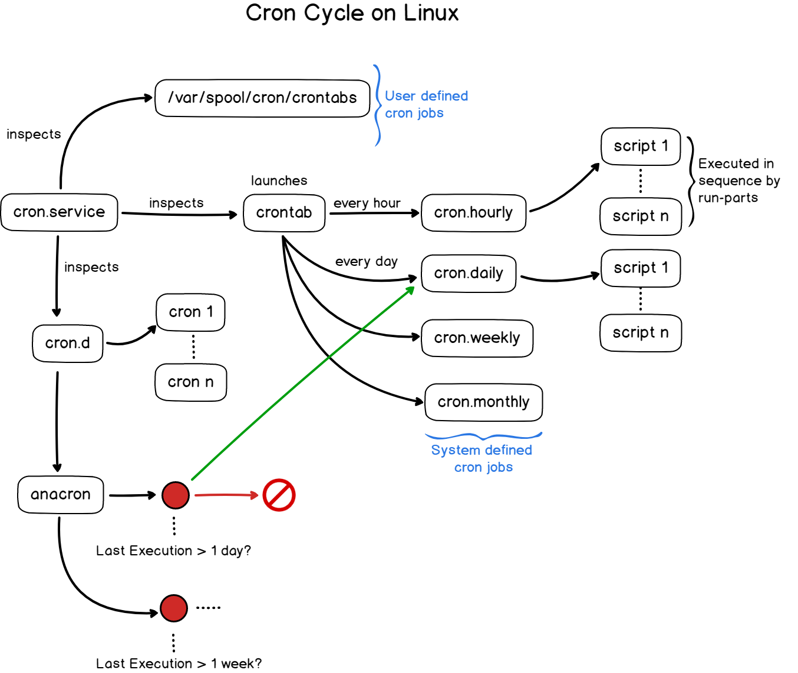

# `anacron` - Регулярне виконання команд

## Передумови

* Комп’ютер під керуванням Rocky Linux.
* Розуміння того, як використовувати ваш улюблений редактор для зміни файлу конфігурації (наприклад, *vim*) у середовищі командного рядка.
* Мати базове розуміння керування пакетами RPM.

## Припущення

* Ви володієте базовими знаннями про bash, python або інші інструменти створення сценаріїв або програмування та бажаєте запустити сценарій автоматично.
* Ви підключилися як користувач root або перейшли на root за допомогою `su - root`.

## Вступ до `anacron`

**`anacron` виконує команди на регулярній основі, а робоча частота визначається в днях. Він підходить для комп’ютерів, які не працюють у режимі 24/7, наприклад ноутбуків і настільних ПК. Припустимо, у вас є заплановане завдання (наприклад, сценарій резервного копіювання), яке потрібно запускати рано вранці кожного дня за допомогою crontab. Коли ви засинаєте, ваш робочий стіл або ноутбук вимкнено. Ваш сценарій резервного копіювання не запускається. Однак, якщо ви використовуєте `anacron`, ви можете бути впевнені, що наступного разу, коли ви ввімкнете робочий стіл або ноутбук, сценарій резервного копіювання запуститься.**

Поява `anacron` не замінює `crontab`, а доповнює `crontab`. Їхні стосунки такі:



## Файл конфігурації `anacron`

```bash
shell > rpm -ql cronie-anacron
/etc/anacrontab
/etc/cron.hourly/0anacron
/usr/lib/.build-id
/usr/lib/.build-id/0e
/usr/lib/.build-id/0e/6b094fa55505597cb69dc5a6b7f5f30b04d40f
/usr/sbin/anacron
/usr/share/man/man5/anacrontab.5.gz
/usr/share/man/man8/anacron.8.gz
/var/spool/anacron
/var/spool/anacron/cron.daily
/var/spool/anacron/cron.monthly
/var/spool/anacron/cron.weekly
```

Спочатку перевірте файл конфігурації за замовчуванням:
```bash
shell > cat /etc/anacrontab
# /etc/anacrontab: configuration file for anacron
# See anacron(8) and anacrontab(5) for details.
SHELL=/bin/sh
PATH=/sbin:/bin:/usr/sbin:/usr/bin
MAILTO=root
# Default 45 minutes delay for each specified job anacron random increase 0-45 minutes.
RANDOM_DELAY=45
# Specify the scope of work time, represented here 3:00 ~ 22:00
START_HOURS_RANGE=3-22
# period in days delay in minutes job-identifier command
# Boot every day to check whether the files in the directory /etc/cron.daily be executed in 5 minutes, if not executed today, then to the next
1 5 cron.daily nice run-parts /etc/cron.daily
# Every 7 days within 25 minutes if the file check /etc/cron.weekly directory is executed after boot, if not executed within a week, it will be executed next
7 25 cron.weekly nice run-parts /etc/cron.weekly
# Whether the files in the directory /etc/cron.monthly 45 minutes checking is performed after every start for a month
@monthly 45 cron.monthly nice run-parts /etc/cron.monthly
```

**/etc/cron.hourly/** - За допомогою `journalctl -u crond.service` ви можете знати, що файли, розміщені всередині, насправді викликаються crond.server, що означає, що команда виконуватиметься після першої хвилини кожної години. Таким чином:

```bash
shell > cat /etc/cron.d/0hourly
# Run the hourly jobs
SHELL=/bin/bash
PATH=/sbin:/bin:/usr/sbin:/usr/bin
MAILTO=root
01 *  *  *  * root run-parts /etc/cron.hourly
```
```
shell > journalctl -u crond.service
- Logs begin at Wed 2021-10-20 19:27:39 CST, end at Wed 2021-10-20 23:32:42 CST. -
October 20 19:27:42 li systemd[1]: Started Command Scheduler.
October 20 19:27:42 li crond[733]: (CRON) STARTUP (1.5.2)
October 20 19:27:42 li crond[733]: (CRON) INFO (RANDOM_DELAY will be scaled with factor 76% if used.)
October 20 19:27:42 li crond[733]: (CRON) INFO (running with inotify support)
October 20 20:01:01 li CROND[1897]: (root) CMD (run-parts /etc/cron.hourly)
October 20 21:01:01 li CROND[1922]: (root) CMD (run-parts /etc/cron.hourly)
October 20 22:01:01 li CROND[1947]: (root) CMD (run-parts /etc/cron.hourly)
October 20 23:01:01 li CROND[2037]: (root) CMD (run-parts /etc/cron.hourly)

```

Для отримання додаткової інформації про конфігураційний файл [перегляньте сторінку посібника](https://man7.org/linux/man-pages/man5/anacrontab.5.html)

## Використання користувачем

Щоб певні файли запускалися протягом автоматично визначеного часу, все, що вам потрібно зробити, це скопіювати файл сценарію у відповідний каталог і переконатися, що він має **дозвіл на виконання (chmod +x)**. Тому вам потрібно лише дозволити системі автоматично запускати сценарій в один із запланованих часів, що спрощує завдання автоматизації.


Скористаємося cron.daily, щоб проілюструвати процес запуску /etc/anacrontab:

1. `anacron` читає файл **/var/spool/anacron/cron.daily**, а вміст файлу показує час останнього запуску.
2. Порівняно з поточним часом, якщо різниця між двома часами перевищує 1 день, завдання cron.daili буде виконано.
3. Ця робота може тривати лише з 03:00 до 22:00.
4. Перевірте, чи запускається файл через 5 хвилин після завантаження. Коли перший запускається, його буде випадково відкладено на 0～45 хвилин для запуску наступного.
5. Використовуйте параметр nice, щоб вказати пріоритет за замовчуванням, і використовуйте параметр run-parts, щоб запускати всі виконувані файли в каталозі /etc/cron.daily/.

## Пов'язані команди

Використовуйте команду `anacron`, типові параметри:

| Опції | Опис                                                          |
| ----- | ------------------------------------------------------------- |
| -f    | Виконує всі завдання, ігноруючи мітки часу                    |
| -u    | Оновлює мітку часу до поточного часу, не виконуючи жодних дій |
| -T    | Перевіряє дійсність файлу конфігурації /etc/anacrontab        |

Щоб отримати додаткову інформацію, [перегляньте сторінку посібника](https://man7.org/linux/man-pages/man8/anacron.8.html)
