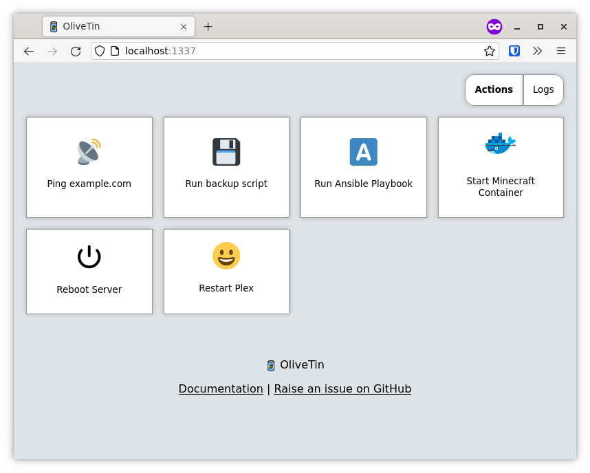
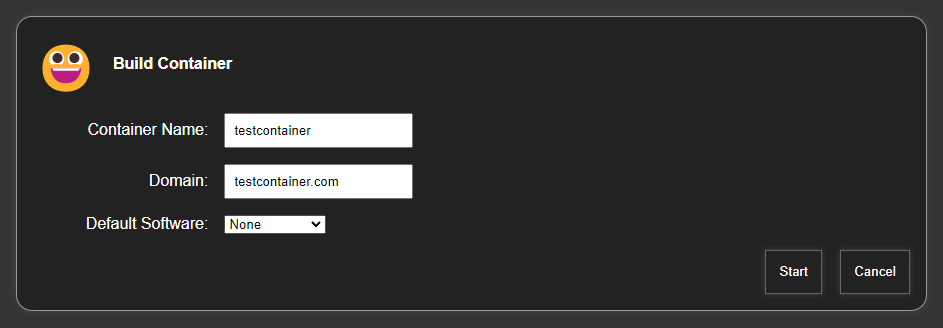

# How to install & use OliveTin on Rocky Linux

## Introduction

Have you ever gotten tired of typing in the same CLI commands over and over again? Have you ever wanted everyone else in your house to be able to restart the Plex server without your intervention? Do you want to just type in a name in a web panel, push a button, and watch a customized Docker, `incus`, or LXD container magically appear?

Then you might want to check out OliveTin. OliveTin is just an app that allows for the generation of a web page from a configuration file, and that web page has buttons. Push the buttons, and OliveTin will run preset bash commands that you set up yourself.

Sure, you could technically create something like this yourself, from scratch, with enough programming experience... but this is *way* easier. It looks a little something like this when set up (image courtesy of the [OliveTin repository](https://github.com/OliveTin/OliveTin)):



!!! Warning "NEVER run this app on a public server"

    This app is, by design and the creator's own admission, meant to be used on local networks, *maybe* on dev setups. However, it has no user authentication system at present, and (until the developer fixes this) *runs as root by default*.

    So yeah, use this all you want on a secured and firewalled network. *Do not* put it on anything meant to be used by the public. For now.

## Prerequisites and assumptions

To follow this guide you will need:

* A computer running Rocky Linux
* A minimal amount of comfort or experience with the command line.
* Root access, or the ability to use `sudo`.
* To learn the basics of YAML.

## Installing OliveTin

OliveTin is an active project with continuous bug-fixes and improvements, so it is a good idea to install the latest version for your architecture. Pre-built RPMs are available for most architectures.

1. Go to the [OliveTin GitHub releases page here](https://github.com/OliveTin/OliveTin/releases/).
2. Click the "Assets" arrow for the most recent version, and then at the bottom of the shown list, click "Show all 36 assets."
3. From the list, select the RPM version for your architecture (amd64, arm64, risc64).
4. Right-click that version and copy the link.
5. Type `wget` and then paste the content of the URL you copied into your `wget` command. Replace `[release_version]` with the release and `[arch]` with your architecture:

    ```bash
    wget https://github.com/OliveTin/OliveTin/releases/download/[release_version]/OliveTin_linux_[arch].rpm
    ```

6. Then install the app with this, remembering to replace the URL with your actual URL:

    ```bash
    sudo rpm -i OliveTin_linux_[arch].rpm
    ```

OliveTin can run as a normal `systemd` service. Do not enable the service yet. You need to set up your configuration file first.

!!! Note

    After some testing, I have determined that these same install instructions will work just fine in a Rocky Linux `incus` or LXD container. For anyone who likes Docker, pre-built images are available.

## Configuring OliveTin actions

OliveTin can do anything bash can do, and more. You can use it to run apps with CLI options, run bash scripts, restart services, and so on. To get started, open up the configuration file with the text editor of your choice with elevated privileges `sudo`:

```bash
sudo nano /etc/OliveTin/config.yaml
```

The most basic kind of action is a button. You click the button, and OliveTin runs the command on the host computer. You can define it in the YAML file with:

```yaml
actions:
  - title: Restart Nginx
    shell: systemctl restart nginx
```

You can also add custom icons to every action, such as a unicode emoji:

```yaml
actions:
  - title: Restart Nginx
    icon: "&#1F504"
    shell: systemctl restart nginx
```

There are many configuration options. Do some research on the ones that you might need for your actions. You can also use text inputs and drop-down menus to add variables and options to the commands you want to run. If you do, OliveTin will prompt you for input before running the command.

By doing this, you can run any program, control remote machines with SSH, trigger webhooks, and more. Check out [the official documentation](https://docs.olivetin.app/action_examples/intro.html) for more ideas.

Here is an example from the author that runs a script to generate an LXD container with a web server pre-installed. With OliveTin, the author was able to create a GUI for running that script:

```yaml
actions:
- title: Build Container
  shell: sh /home/ezequiel/server-scripts/rocky-host/buildcontainer -c {{ containerName }} -d {{ domainName }} {{ softwarePackage }}
  timeout: 60
  arguments:
    - name: containerName
      title: Container Name
      type: ascii_identifier

    - name: domainName
      title: Domain
      type: ascii_identifier

    - name: softwarePackage
      title: Default Software
      choices:
        - title: None
          value:

        - title: Nginx
          value: -s nginx

        - title: Nginx & PHP
          value: -s nginx-php

        - title: mariadb
          value: -s mariadb
```

On the front-end, it looks like this. (OliveTin does have a dark mode as well.):



## Enabling OliveTin

Once you have your configuration file built the way you want it, enable and start OliveTin with:

```bash
sudo systemctl enable --now OliveTin
```

Every time you edit the configuration file, you will need to restart the service in the usual way:

```bash
sudo systemctl restart OliveTin
```

## Conclusion

OliveTin is a great way to run everything from bash commands to some fairly complex operations with scripts. Remember that everything runs as root by default, unless you use `su` or `sudo` in your shell commands to change the user for that particular command.

You should be careful how you set this up, because of the elevated privileges default settings, especially if you plan to give access to (for example) your family, to control home servers and appliances, and so on.

Again, do not put this on a public server unless you are ready to secure the page yourself.

Otherwise, have fun with it. It is a neat little tool.
