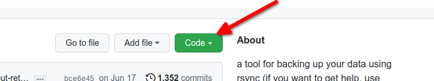
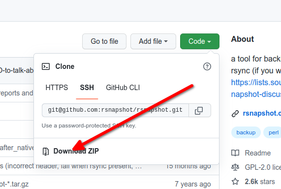

# Soluzione per il backup - _rsnapshot_

## Prerequisiti

  * Saper installare repository e snapshot aggiuntivi dalla riga di comando
  * Conoscere il montaggio di filesystem esterni al computer (unità esterna, filesystem remoto e così via)
  * Saper usare un editor (qui si usa `vi`, ma si può usare il proprio editor preferito)
  * Conoscere un po' di scripting BASH
  * Saper modificare il crontab per l'utente root
  * Conoscenza delle chiavi pubbliche e private SSH (solo se si intende eseguire backup remoti da un altro server)

## Introduzione

_rsnapshot_ è una potente utility di backup con opzioni di installazione per qualsiasi macchina basata su Linux. È possibile eseguire il backup di una macchina in locale o di più macchine, ad esempio i server, da un'unica macchina.

_rsnapshot_ utilizza `rsync` ed è scritto interamente in Perl senza dipendenze da librerie. Non esistono requisiti particolari per l'installazione. Nel caso di Rocky Linux, è possibile installare _rnapshot_ utilizzando il repository EPEL. Dopo il rilascio iniziale di Rocky Linux 9.0, c'è stato un periodo in cui EPEL non conteneva il pacchetto _rsnapshot_. Non è più così, ma queste istruzioni includono un metodo di installazione dai sorgenti, nel caso in cui ciò si verifichi di nuovo.

Questa documentazione riguarda l'installazione di _rsnapshot_ solo su Rocky Linux.

=== "Installazione EPEL"

    ## Installazione di _rsnapshot_
    
    Tutti i comandi qui mostrati sono eseguiti dalla riga di comando del server o della workstation, a meno che non sia indicato diversamente.
    
    ### Installazione del repository EPEL
    
    Per installare _rsnapshot_ abbiamo bisogno del repository EPEL di Fedora. Per installare il repository, basta usare questo comando:

    ```
    sudo dnf install epel-release
    ```


    Il repository dovrebbe ora essere attivo.
    
    ### Installare il pacchetto _rsnapshot
    
    Successivamente, installate _rsnapshot_ e alcuni altri strumenti necessari, che probabilmente sono già installati:

    ``` 
    sudo dnf install rsnapshot openssh-server rsync
    ```


    Se mancano delle dipendenze, queste verranno visualizzate e sarà sufficiente rispondere alla richiesta per continuare. Per esempio:

    ```
    dnf install rsnapshot
    Last metadata expiration check: 0:00:16 ago on Mon Feb 22 00:12:45 2021.
    Dependencies resolved.
    ========================================================================================================================================
    Package                           Architecture                 Version                              Repository                    Size
    ========================================================================================================================================
    Installing:
    rsnapshot                         noarch                       1.4.3-1.el8                          epel                         121 k
    Installing dependencies:
    perl-Lchown                       x86_64                       1.01-14.el8                          epel                          18 k
    rsync                             x86_64                       3.1.3-9.el8                          baseos                       404 k

    Transaction Summary
    ========================================================================================================================================
    Install  3 Packages

    Total download size: 543 k
    Installed size: 1.2 M
    Is this ok [y/N]: y
    ```

=== "Installazione da sorgente"

    ## Installazione di _rsnapshot_ da sorgente
    
    Installare _rsnapshot_ dai sorgenti non è difficile. Questo metodo ha però un lato negativo: se viene rilasciata una nuova versione, è necessaria una nuova installazione dai sorgenti per aggiornare la versione, mentre il metodo di installazione di EPEL permette di rimanere aggiornati con un semplice `dnf upgrade`. 
    
    ### Installazione degli strumenti di sviluppo e download del sorgente
    
    Come detto, il primo passo da fare è installare il gruppo 'Development Tools':

    ```
    dnf groupinstall 'Development Tools'
    ```


    Sono necessari anche alcuni altri pacchetti:

    ```
    dnf install wget unzip rsync openssh-server
    ```


    Successivamente è necessario scaricare i file sorgente dal repository GitHub. È possibile farlo in diversi modi, ma il più semplice in questo caso è probabilmente quello di scaricare il file ZIP dal repository.

    1. Vai a https://github.com/rsnapshot/rsnapshot
    2. Fare clic sul pulsante verde "Code" sulla destra 
    3. Fare clic con il tasto destro del mouse su "Download ZIP" e copiare il percorso del link 
    4. Utilizzare `wget` o `curl` per scaricare il link copiato. Esempio:
    ```
    wget https://github.com/rsnapshot/rsnapshot/archive/refs/heads/master.zip
    ```
    5. Decomprimere il file `master.zip`
    ```
    unzip master.zip
    ```


    ### Costruire la Risorsa

    Ora che abbiamo tutto sulla nostra macchina, il passo successivo è la compilazione. Quando si decomprime il file `master.zip`, si ottiene una directory `rsnapshot-master`. Dovremo entrare in questa per la nostra procedura di costruzione. Si noti che la nostra compilazione utilizza tutte le impostazioni predefinite del pacchetto, quindi se si desidera qualcosa di diverso, è necessario fare un po' di indagini. Inoltre, questi passaggi sono tratti direttamente dalla pagina di [installazione di GitHub](https://github.com/rsnapshot/rsnapshot/blob/master/INSTALL.md):

    ```
    cd rsnapshot-master
    ```

    Eseguire lo script `autogen.sh` per generare lo script di configurazione:

    ```
    ./autogen.sh
    ```

    !!! tip "Suggerimento"

        Si possono ottenere diverse righe di questo tipo:

        ```
        fatal: not a git repository (or any of the parent directories): .git
        ```

        Non sono fatali.

    Successivamente, è necessario eseguire `configure` con la directory di configurazione impostata:

    ```
    ./configure --sysconfdir=/etc
    ```

    Infine, eseguire `make install`:

    ```
    sudo make install
    ```

    Durante tutto questo, il file `rsnapshot.conf` verrà creato come `rsnapshot.conf.default`. È necessario copiare questo file in `rsnapshot.conf` e modificarlo per adattarlo alle esigenze del nostro sistema.

    ```
    sudo cp /etc/rsnapshot.conf.default /etc/rsnapshot.conf
    ```

    Si tratta di copiare il file di configurazione. La sezione "Configurazione di rsnapshot" illustrerà le modifiche necessarie a questo file di configurazione.

## Montaggio di un'unità o di un filesystem per il backup

In questo passaggio viene mostrato come montare un'unità, ad esempio un'unità USB esterna, utilizzata per il backup del sistema. Questo passaggio è necessario solo se si esegue il backup di un singolo computer o server, come nel primo esempio.

1. Inserire l'unità USB.
2. Digitare `dmesg | grep sd` che mostrerà l'unità che si desidera utilizzare. In questo caso, è _sda1_.  
   Esempio: `EXT4-fs (sda1): mounting ext2 file system using the ext4 subsystem`.
3. Sfortunatamente (o fortunatamente, a seconda delle opinioni) la maggior parte dei moderni sistemi operativi Linux per desktop esegue il montaggio automatico dell'unità, se possibile. Ciò significa che, a seconda di vari fattori, _rsnapshot_ potrebbe perdere la posizione dell'unità. Si desidera che l'unità venga "montata" o che i suoi file siano sempre disponibili nella stessa posizione.  
   Per farlo, prendete le informazioni sull'unità visualizzate nel comando `dmesg` e digitate `mount | grep sda1`, che dovrebbe mostrare qualcosa di simile a questo: `/dev/sda1 on /media/username/8ea89e5e-9291-45c1-961d-99c346a2628a`
4. Digitate `sudo umount /dev/sda1` per smontare l'unità esterna.
5. Quindi, creare un punto di montaggio per il backup: `sudo mkdir /mnt/backup`
6. Montare l'unità nella posizione della cartella di backup: `sudo mount /dev/sda1 /mnt/backup`
7. Digitate di nuovo `mount | grep sda1` e vedrete questo: `/dev/sda1 on /mnt/backup type ext2 (rw,relatime)`
8. Quindi creare una directory che deve esistere affinché il backup continui sull'unità montata. In questo esempio viene utilizzata una cartella denominata "storage": `sudo mkdir /mnt/backup/storage`

Si noti che per una singola macchina, sarà necessario ripetere i passaggi `umount` e `mount` ogni volta che l'unità viene collegata o ogni volta che il sistema si riavvia, oppure automatizzare questi comandi con uno script.

Raccomandiamo l'automazione. L'automazione è la via del sysadmin.

## Configurazione di `rsnapshot`

Questo è il passo più importante. È possibile commettere un errore quando si apportano modifiche al file di configurazione. La configurazione di _rsnapshot_ richiede l'uso di tabulazioni per la separazione degli elementi e un'avvertenza in tal senso si trova all'inizio del file di configurazione.

Un carattere di spazio farà fallire l'intera configurazione e il vostro backup. Per esempio, all'inizio del file di configurazione c'è una sezione per la `# SNAPSHOT ROOT DIRECTORY #`. Se si sta aggiungendo questo da zero, si dovrebbe digitare `snapshot_root`, poi TAB e quindi digitare `/qualunque_percorso_per_la_root_di_snapshot/`

La cosa migliore è che la configurazione predefinita inclusa in _rsnapshot_ necessita solo di piccole modifiche per funzionare per un backup di una macchina locale. È sempre una buona idea, però, fare una copia di backup del file di configurazione prima di iniziare a modificarlo:

`cp /etc/rsnapshot.conf /etc/rsnapshot.conf.bak`

## Backup di base della macchina o di un singolo server

In questo caso, _rsnapshot_ verrà eseguito localmente per eseguire il backup di un particolare computer. In questo esempio, si analizzerà il file di configurazione e si mostrerà esattamente cosa si deve modificare.

Per aprire il file _/etc/rsnapshot.conf_ è necessario utilizzare `vi` (o modificare con il proprio editor preferito).

La prima cosa da modificare è l'impostazione _snapshot_root_. Il valore predefinito è questo:

`snapshot_root   /.snapshots/`

È necessario modificare questo punto con il punto di montaggio creato in precedenza e con l'aggiunta di "storage".

`snapshot_root   /mnt/backup/storage/`

È inoltre necessario indicare al backup di non essere eseguito se l'unità non è montata. Per farlo, si deve rimuovere il segno "#" (chiamato anche commento, segno numerico, simbolo hash e così via) accanto a `no_create_root`, che si presenta in questo modo:

`no_create_root 1`

Quindi scendete alla sezione intitolata `# EXTERNAL PROGRAM DEPENDENCIES #` e rimuovete il commento (di nuovo, il segno "#") da questa riga:

`#cmd_cp         /usr/bin/cp`

Ora si legge:

`cmd_cp         /usr/bin/cp`

Sebbene non sia necessario `cmd_ssh` per questa particolare configurazione, sarà necessario per l'altra opzione e non fa male averlo abilitato. Trovate quindi la riga che dice:

`#cmd_ssh        /usr/bin/ssh`

Rimuovere il simbolo "#":

`cmd_ssh        /usr/bin/ssh`

Successivamente è necessario passare alla sezione intitolata `#     BACKUP LEVELS / INTERVALS         #`

Le versioni precedenti di _rsnapshot_ avevano `hourly, daily, monthly, yearly` ma ora sono `alfa, beta, gamma, delta`. Il che è un po' confuso. È necessario aggiungere un'annotazione a tutti gli intervalli che non verranno utilizzati. Nella configurazione, il delta è già stato commentato.

In questo esempio, non si eseguiranno altri incrementi oltre al backup notturno. Basta aggiungere un commento ad alfa e gamma. Una volta completato, il file di configurazione sarà:

```
#retain  alpha   6
retain  beta    7
#retain  gamma   4
#retain delta   3
```

Passare alla riga `logfile`, che per impostazione predefinita è:

`#logfile        /var/log/rsnapshot`

Rimuovere il commento:

`logfile        /var/log/rsnapshot`

Infine, passate alla sezione `### BACKUP POINTS / SCRIPTS ###` e aggiungere le directory che si desidera aggiungere nella sezione `# LOCALHOST`, ricordando di usare <kbd>TAB</kbd> anziché <kbd>SPAZIO</kbd> tra gli elementi!

Per ora scrivete le vostre modifiche (`SHIFT :wq!` per `vi`) e uscite dal file di configurazione.

### Verifica della configurazione

Si vuole verificare che non siano stati aggiunti spazi o altri errori evidenti al nostro file di configurazione mentre lo si modificava. Per fare ciò, si esegue _rsnapshot_ con la nostra configurazione con l'opzione `configtest`:

`rsnapshot configtest` mostrerà `Syntax OK` se non ci sono errori.

Si dovrebbe prendere l'abitudine di eseguire `configtest` con una particolare configurazione. Il motivo sarà più evidente quando si entrerà nella sezione **Backup di più macchine o più server**.

Per eseguire `configtest` con un particolare file di configurazione, è necessario eseguirlo con l'opzione -c per specificare la configurazione:

`rsnapshot -c /etc/rsnapshot.conf configtest`

## Esecuzione del backup la prima volta

Dopo che `configtest` ha verificato che tutto è a posto, è ora il momento di eseguire il backup per la prima volta. Se si vuole, si può eseguire prima in modalità di prova, in modo da vedere cosa farà lo script di backup.

Anche in questo caso non è necessario specificare la configurazione, ma è una buona idea prendere l'abitudine di farlo:

`rsnapshot -c /etc/rsnapshot.conf -t beta`

Il risultato sarà simile a questo, mostrando cosa accadrà quando il backup verrà effettivamente eseguito:

```
echo 1441 > /var/run/rsnapshot.pid
mkdir -m 0755 -p /mnt/backup/storage/beta.0/
/usr/bin/rsync -a --delete --numeric-ids --relative --delete-excluded \
    /home/ /mnt/backup/storage/beta.0/localhost/
mkdir -m 0755 -p /mnt/backup/storage/beta.0/
/usr/bin/rsync -a --delete --numeric-ids --relative --delete-excluded /etc/ \
    /mnt/backup/storage/beta.0/localhost/
mkdir -m 0755 -p /mnt/backup/storage/beta.0/
/usr/bin/rsync -a --delete --numeric-ids --relative --delete-excluded \
    /usr/local/ /mnt/backup/storage/beta.0/localhost/
touch /mnt/backup/storage/beta.0/
```

Quando il test soddisfa le vostre aspettative, eseguitelo manualmente la prima volta senza il test:

`rsnapshot -c /etc/rsnapshot.conf beta`

Al termine del backup, navigare in /mnt/backup ed esaminare la struttura di directory creata. Ci sarà una directory `storage/beta.0/localhost`, seguita dalle directory specificate per il backup.

### Ulteriori spiegazioni

Ogni volta che il backup viene eseguito, viene creato un altro incremento beta, 0-6 o 7 giorni di backup. Il backup più recente sarà sempre beta.0, mentre il backup di ieri sarà sempre beta.1.

Le dimensioni di ciascuno di questi backup sembreranno occupare la stessa quantità (o più) di spazio su disco, ma ciò è dovuto all'uso di hard link _da parte di rsnapshot_. Per ripristinare i file dal backup di ieri, è sufficiente copiarli di nuovo dalla struttura di directory della beta.1.

Ogni backup è solo un backup incrementale rispetto all'esecuzione precedente, MA, grazie all'uso dei collegamenti diretti, ogni directory di backup contiene il file o il collegamento diretto al file nella directory in cui è stato effettivamente eseguito il backup.

Per ripristinare i file, non è necessario decidere la directory o l'incremento da cui ripristinarli, ma solo la data e l'ora del backup che si sta ripristinando. È un ottimo sistema e utilizza molto meno spazio su disco rispetto a molte altre soluzioni di backup.

## Impostazione dell'esecuzione automatica del backup

Una volta completati i test e sicuri che le cose funzioneranno senza problemi, il passo successivo è impostare crontab per l'utente root per automatizzare il processo ogni giorno:

`sudo crontab -e`

Se non avete mai eseguito questa operazione, scegliete vim.basic come editor o il vostro editor preferito quando appare la riga `Select an editor`.

Si intende impostare il backup in modo che venga eseguito automaticamente alle 23: 00, quindi si aggiungerà questo codice al crontab:

```
## Running the backup at 11 PM
00 23 *  *  *  /usr/bin/rsnapshot -c /etc/rsnapshot.conf beta`
```

## Backup di più macchine o più server

L'esecuzione di backup di più macchine da una macchina con un array RAID o una grande capacità di archiviazione, in sede o da una connessione Internet altrove, funziona bene.

Se i backup vengono eseguiti via Internet, è necessario assicurarsi che ogni sede disponga di una larghezza di banda adeguata per l'esecuzione dei backup. È possibile utilizzare _rsnapshot_ per sincronizzare un server in sede con un array di backup o un server di backup fuori sede per migliorare la ridondanza dei dati.

## Presupposto

Esecuzione di _rsnapshot_ da una macchina in remoto, in sede. L'esecuzione di questa esatta configurazione è possibile anche in remoto, fuori sede.

In questo caso, è necessario installare _rsnapshot_ sul computer che esegue tutti i backup. Altre ipotesi sono:

* Che i server su cui si eseguirà il backup abbiano una regola del firewall che consenta alla macchina remota di accedere al server SSH
* Che ogni server di cui si intende eseguire il backup abbia installato una versione recente di `rsync`. Per i server Rocky Linux, eseguire `dnf install rsync` per aggiornare la versione di `rsync` del sistema.
* Che ci si sia connessi alla macchina come utente root, o che si sia eseguito `sudo -s` per passare all'utente root

## Chiavi Pubbliche e Private SSH

Per il server che eseguirà i backup, è necessario generare una coppia di chiavi SSH da utilizzare durante i backup. Per il nostro esempio, creeremo chiavi RSA.

Se si è già generato un set di chiavi, si può saltare questo passaggio. È possibile scoprirlo eseguendo `ls -al .ssh` e cercando una coppia di chiavi `id_rsa` e `id_rsa.pub.`  Se non esistono, utilizzate il seguente link per impostare le chiavi per il vostro computer e per i server a cui volete accedere:

[Coppie di Chiavi Private Pubbliche SSH](../security/ssh_public_private_keys.md)

## Configurazione di _rsnapshot_

Il file di configurazione deve essere quasi identico a quello creato per il **Backup di base della macchina o di un singolo server**, tranne che per la modifica di alcune opzioni.

La snapshot root è l'impostazione predefinita:

`snapshot_root   /.snapshots/`

Commentare questa riga:

`no_create_root 1`

`#no_create_root 1`

L'altra differenza è che ogni macchina avrà la propria configurazione. Quando ci si abitua, è sufficiente copiare uno dei file di configurazione esistenti con un nome diverso e modificarlo per adattarlo alle macchine aggiuntive di cui si desidera eseguire il backup.

Per ora, si vuole modificare solo il file di configurazione (come mostrato sopra) e salvarlo. Copiate questo file come modello per il nostro primo server:

`cp /etc/rsnapshot.conf /etc/rsnapshot_web.conf`

Si desidera modificare il file di configurazione e creare il log e il lockfile con il nome della macchina:

`logfile /var/log/rsnapshot_web.log`

`lockfile        /var/run/rsnapshot_web.pid`

Successivamente, si deve modificare il file rsnapshot_web.conf in modo che includa le directory di cui si vuole eseguire il backup. Successivamente, si deve modificare il file rsnapshot_web. conf in modo che includa le directory di cui si vuole eseguire il backup.

Ecco un esempio di configurazione di web.ourdomain.com:

```
### BACKUP POINTS / SCRIPTS ###
backup  root@web.ourourdomain.com:/etc/     web.ourourdomain.com/
backup  root@web.ourourdomain.com:/var/www/     web.ourourdomain.com/
backup  root@web.ourdomain.com:/usr/local/     web.ourdomain.com/
backup  root@web.ourdomain.com:/home/     web.ourdomain.com/
backup  root@web.ourdomain.com:/root/     web.ourdomain.com/
```

### Verifica della configurazione ed esecuzione del backup iniziale

Ora è possibile verificare la configurazione per assicurarsi che sia sintatticamente corretta:

`rsnapshot -c /etc/rsnapshot_web.conf configtest`

Si sta cercando il messaggio `Syntax OK`. Se tutto è a posto, è possibile eseguire il backup manualmente:

`/usr/bin/rsnapshot -c /etc/rsnapshot_web.conf beta`

Supponendo che tutto funzioni, è possibile creare i file di configurazione per il server di posta (rsnapshot_mail.conf) e per il server del portale (rsnapshot_portal.conf), testarli ed eseguire un backup di prova.

## Automatizzare il backup

L'automazione dei backup per la versione per più macchine o server è leggermente diversa. Si vuole creare uno script bash per richiamare i backup in ordine. Quando uno finisce, inizia il successivo. Lo script avrà un aspetto simile a:

`vi /usr/local/sbin/backup_all`

Con il contenuto:

```
#!/bin/bash/
# script to run rsnapshot backups in succession
/usr/bin/rsnapshot -c /etc/rsnapshot_web.conf beta
/usr/bin/rsnapshot -c /etc/rsnapshot_mail.conf beta
/usr/bin/rsnapshot -c /etc/rsnapshot_portal.conf beta
```

Salvare lo script in /usr/local/sbin e renderlo eseguibile:

`chmod +x /usr/local/sbin/backup_all`

Creare il crontab per root per eseguire lo script di backup:

`crontab -e`

Aggiungere questa riga:

```
## Running the backup at 11 PM
00 23 *  *  *  /usr/local/sbin/backup_all
```

## Segnalazione dello stato del backup

Per assicurarsi che il backup avvenga secondo i piani, si consiglia di inviare i file di registro del backup all'indirizzo e-mail. Se si eseguono backup di più macchine utilizzando _rsnapshot_, ogni file di log avrà un proprio nome, che potrà essere inviato all'indirizzo e-mail per la revisione da parte della procedura [Utilizzo di postfix per la segnalazione dei processi del server](../email/postfix_reporting.md).

## Ripristino di un backup

Il ripristino di alcuni file o di un intero backup comporta la copia dei file desiderati dalla directory con la data di ripristino al computer.

## Conclusioni e altre risorse

La configurazione corretta di _rsnapshot_ è un po' scoraggiante all'inizio, ma può far risparmiare molto tempo per il backup di macchine o server.

_rsnapshot_ è potente, veloce ed economico nell'utilizzo dello spazio su disco. Per saperne di più su _rsnapshot_, visitate il sito [rsnapshot.org](https://rsnapshot.org/download.html).
