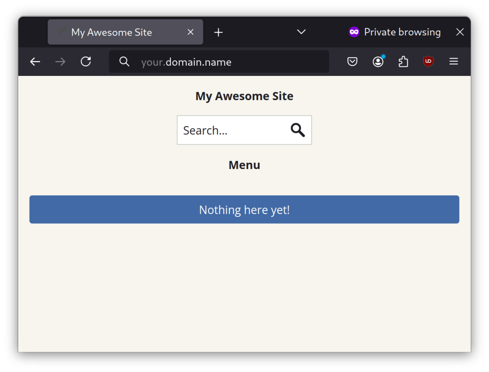

## Introduction

[Chyrp Lite](https://chyrplite.net/) est un moteur de blog ultra-léger écrit en PHP.

## Prérequis

Les conditions suivantes sont indispensables pour utiliser cette procédure :

- La possibilité d'exécuter des commandes en tant qu'utilisateur root ou d'utiliser `sudo` pour élever les privilèges
- Maîtrise d'un éditeur de ligne de commande. L'auteur utilise `vi` ou `vim` ici, mais vous pouvez le remplacer par votre éditeur préféré

## Installation de Caddy

L'article montre comment utiliser `Caddy` comme serveur Web. Pour installer `Caddy`, vous devez d'abord installer `EPEL` (Extra Packages for Enterprise Linux) et exécuter les mises à jour :

```bash
dnf -y install epel-release && dnf -y update
```

Ensuite, installez `Caddy` :

```bash
dnf -y install Caddy
```

Ensuite, ouvrez le fichier `Caddyfile` :

```bash
vi /etc/caddy/Caddyfile
```

Ajoutez ce qui suit au fichier `Caddyfile` :

```bash
your.domain.name {
        root * /var/www/chyrp-lite
        file_server
        php_fastcgi 127.0.0.1:9000
}
```

Sauvegardez le fichier avec `:wq!` puis ouvrez les ports de pare-feu correspondants :

```bash
sudo firewall-cmd --permanent --zone=public --add-service=http
sudo firewall-cmd --permanent --zone=public --add-service=https
sudo firewall-cmd --reload
```

Enfin, lancez `Caddy` :

```bash
systemctl enable --now caddy
```

## Installation de PHP

!!! note "Remarque"

```
Si vous utilisez Rocky Linux 8.x ou 10.x, remplacez « 8 » ou « 10 » à côté de la version dans la ligne d'installation du paquet Remi. 
```

Pour mettre en place PHP, vous aurez besoin du dépôt `Remi`. Pour l'installer, exécutez la commande suivante :

```bash
dnf install https://rpms.remirepo.net/enterprise/remi-release-9.rpm
```

Installez ensuite PHP et les modules requis :

```bash
dnf install -y php83-php php83-php-session php83-php-json php83-php-ctype php83-php-filter php83-php-libxml php83-php-simplexml php83-php-mbstring php83-php-pdo php83-php-curl
```

Ensuite, ouvrez le fichier de configuration PHP :

```bash
vi /etc/opt/remi/php83/php-fpm.d/www.conf
```

Allez à la ligne `listen =` et définissez-la comme suit :

```bash
listen = 127.0.0.1:9000
```

Quittez `vi` avec `:wq!` et activez PHP :

```bash
systemctl enable --now php83-php-fpm.service
```

## Installation de `Chyrp`

Maintenant, vous allez installer Chyrp Lite. Téléchargez la dernière version :

```bash
cd /var/www
wget https://github.com/xenocrat/chyrp-lite/archive/refs/tags/v2024.03.zip
```

Ensuite, décompressez le fichier et déplacez le dossier extrait :

```bash
unzip v2024.03.zip
mv chyrp-lite-2024.03/ chyrp-lite
```

Définissez les autorisations correctes sur le dossier `chyrp-lite` :

```bash
chown -R apache:apache chyrp-lite/
```

Configurer un répertoire de données pour stocker la base de données SQLite :

```bash
mkdir chyrp-lite-data
chown -R apache:apache chyrp-lite-data/
```

Ensuite, configurez les contextes de fichiers SELinux :

```bash
semanage fcontext -a -t httpd_sys_rw_content_t "/var/www/chyrp-lite(/.*)?"
semanage fcontext -a -t httpd_sys_rw_content_t "/var/www/chyrp-lite-data(/.*)?"
restorecon -Rv /var/www/chyrp-lite
restorecon -Rv /var/www/chyrp-lite-data
```

Sur une machine cliente, ouvrez un navigateur Web sur `https://example.com/install.php` et exécutez le programme d'installation (remplacez `example.com` par votre nom de domaine ou nom d'hôte réel) :


Dans la section **Database**, sélectionnez un nom de chemin dans le répertoire `chyrp-lite-data` créé précédemment, tel que `/var/www/chyrp-lite-data/sqlite.db`.

Ensuite, remplissez les autres champs, qui devraient être explicites.

Ensuite, cliquez sur **Install me** puis sur **Take me to my site**. Vous devriez maintenant pouvoir visiter l'installation terminée de votre site `Chyrp` :



## Conclusion

Étant donné que WordPress est devenu un couteau suisse du développement Web, il n’est pas surprenant que certains webmasters (l’auteur inclus) préfèrent un moteur de blogue léger. `Chyrp Lite` est parfait pour ces utilisateurs.
