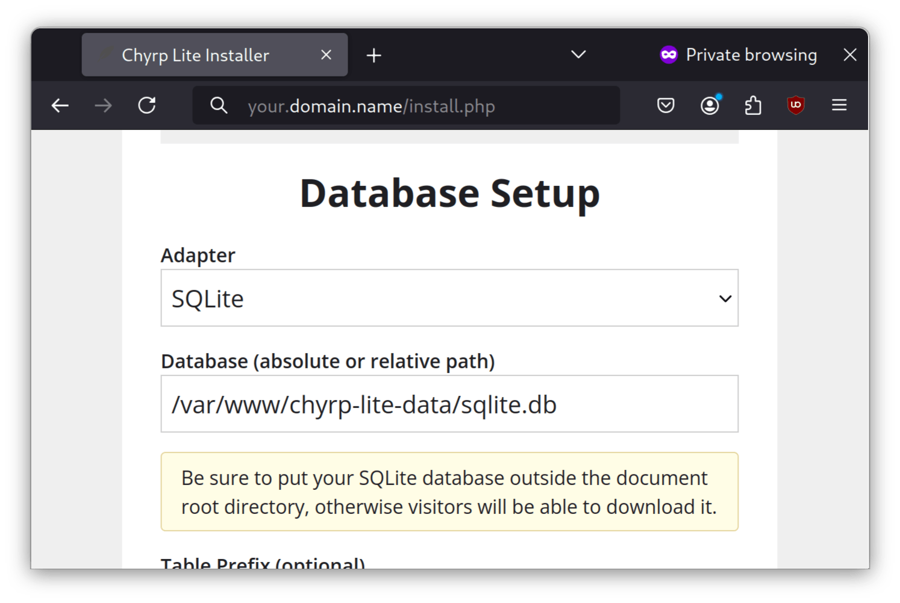
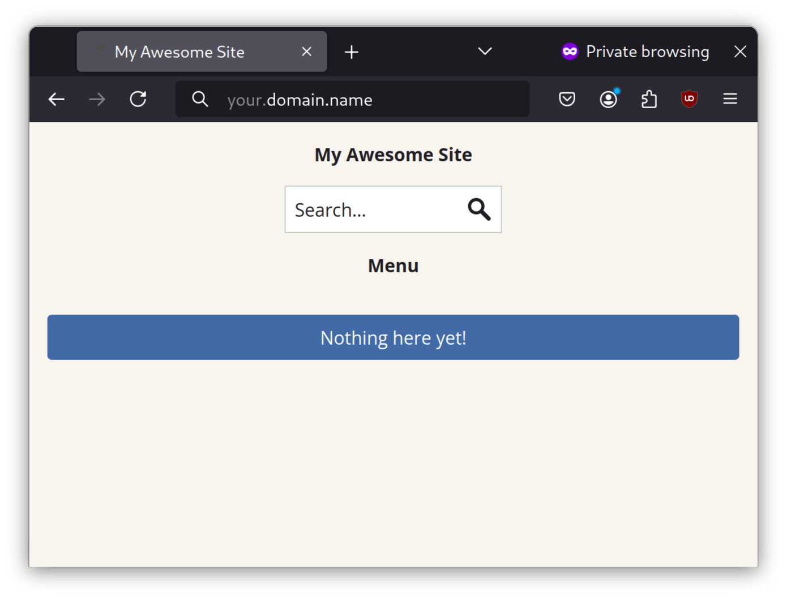

## Introduction

[Chyrp Lite](https://chyrplite.net/) is an ultra-lightweight blogging engine written in PHP.

## Prerequisites and assumptions

The following are the minimum requirements for using this procedure:

* The ability to run commands as the root user or use `sudo` to elevate privileges
* Familiarity with a command-line editor. The author is using `vi` or `vim` here, but substitute in your favorite editor

## Installing Caddy

We will use Caddy as the web server. To install Caddy, you need first to install the EPEL (Extra Packages for Enterprise Linux) and run updates:

```bash
dnf -y install epel-release && dnf -y update
```

Then install Caddy:

```bash
dnf -y install Caddy
```

Subsequently, open the `Caddyfile`:

```bash
vi /etc/caddy/Caddyfile
```

Add the following to your `Caddyfile`:

```bash
your.domain.name {
        root * /var/www/chyrp-lite
        file_server
        php_fastcgi 127.0.0.1:9000
}
```

Save the file with `:wq!` and then open the corresponding firewall ports:

```bash
sudo firewall-cmd --permanent --zone=public --add-service=http
sudo firewall-cmd --permanent --zone=public --add-service=https
sudo firewall-cmd --reload
```

Finally, start Caddy:

```bash
systemctl enable --now caddy
```

## Installing PHP

!!! note

    If you are running Rocky Linux 8.x, substitute eight next to the release in the Remi package install line. 

To install PHP, you will need the Remi repository. To install the Remi repository, run the following:

```bash
dnf install https://rpms.remirepo.net/enterprise/remi-release-9.rpm
```

Then install PHP and the required modules:

```bash
dnf install -y php83-php php83-php-session php83-php-json php83-php-ctype php83-php-filter php83-php-libxml php83-php-simplexml php83-php-mbstring php83-php-pdo php83-php-curl
```

Next, open the PHP configuration file:

```bash
vi /etc/opt/remi/php83/php-fpm.d/www.conf
```

Go down to the `listen =` line and set it to the following:

```bash
listen = 127.0.0.1:9000
```

Exit `vi` with `:wq!` and enable PHP:

```bash
systemctl enable --now php83-php-fpm.service
```

## Installing Chyrp

Now, we are going to install Chyrp Lite. Download the latest release:

```bash
cd /var/www
wget https://github.com/xenocrat/chyrp-lite/archive/refs/tags/v2024.03.zip
```

Next, decompress and move the extracted folder:

```bash
unzip v2024.03.zip
mv chyrp-lite-2024.03/ chyrp-lite
```

Set the correct permissions on the `chyrp-lite` folder:

```bash
chown -R apache:apache chyrp-lite/
```

Set up a data directory for storing the SQLite database:

```bash
mkdir chyrp-lite-data
chown -R apache:apache chyrp-lite-data/
```

Next, set up the SELinux file contexts:

```bash
semanage fcontext -a -t httpd_sys_rw_content_t "/var/www/chyrp-lite(/.*)?"
semanage fcontext -a -t httpd_sys_rw_content_t "/var/www/chyrp-lite-data(/.*)?"
restorecon -Rv /var/www/chyrp-lite
restorecon -Rv /var/www/chyrp-lite-data
```

On a client machine, open up a web browser to `https://your.domain.name/install.php` and run the installation program (replace `your.domain.name` with your actual domain name or hostname):



In the **Database** section, select a pathname in the `chyrp-lite-data` directory made earlier, such as `/var/www/chyrp-lite-data/sqlite.db`.

Then, complete the other fields, which should be self-explanatory.

Next, click **Install me** and then **Take me to my site**. You should now be able to visit a completed installation of your Chyrp site:



## Conclusion

Considering that WordPress has evolved into a Swiss army knife of web development, it is not surprising some webmasters (the author included) would prefer a lightweight blogging engine. Chyrp Lite is perfect for those users.
