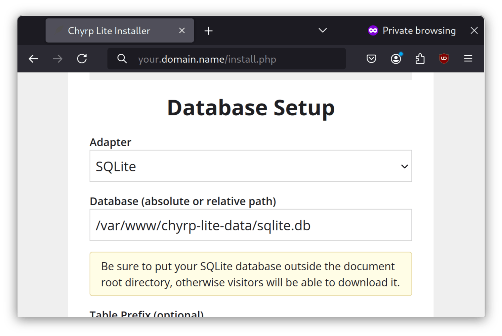
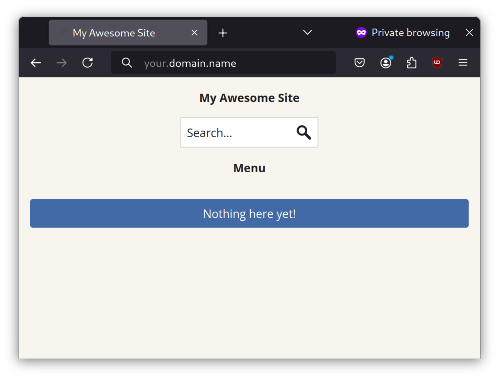

## Вступ

[Chyrp Lite](https://chyrplite.net/) — це надлегка система для ведення блогів, написана мовою PHP.

## Передумови та припущення

Нижче наведено мінімальні вимоги для використання цієї процедури:

- Можливість запускати команди від імені користувача root або використовувати `sudo` для підвищення привілеїв
- Знайомство з редактором командного рядка. Автор використовує `vi` або `vim` тут, але замініть у вашому улюбленому редакторі

## Встановлення Caddy

Ми будемо використовувати Caddy як веб-сервер. Щоб інсталювати Caddy, спочатку потрібно інсталювати EPEL (додаткові пакети для Enterprise Linux) і запустити оновлення:

```bash
sudo dnf -y install epel-release
```

Потім встановіть Caddy:

```bash
sudo dnf copr enable @caddy/caddy
```

Виконайте оновлення, щоб переконатися, що у вашій системі є найновіші пакети:

```text
sudo dnf upgrade
```

Згодом відкрийте `Caddyfile`:

```bash
vi /etc/caddy/Caddyfile
```

Додайте наступне до свого `Caddyfile`:

```bash
your.domain.name {
        root * /var/www/chyrp-lite
        file_server
        php_fastcgi 127.0.0.1:9000
}
```

!!! примітка «Для контейнерів `incus`»

````
Хоча ця процедура чудово працює в контейнері `incus`, `incus` не постачається з увімкненим брандмауером. Ви можете встановити та використовувати `firewalld` у контейнері, але він не встановлений за замовчуванням. Якщо ви хочете застосувати правила брандмауера до свого контейнера, що може бути дуже важливим, якщо ви використовуєте публічний домен, тоді майте на увазі, що вам доведеться встановити:

```
sudo dnf install firewalld
``` 

and enable:

```
sudo systemctl enable --now firewalld
```

Перш ніж продовжувати цю процедуру.
````

Збережіть файл за допомогою `:wq!`, а потім відкрийте відповідні порти брандмауера:

```bash
sudo firewall-cmd --permanent --zone=public --add-service=http
sudo firewall-cmd --permanent --zone=public --add-service=https
sudo firewall-cmd --reload
```

Нарешті, запустіть Caddy:

```bash
systemctl enable --now caddy
```

## Встановлення PHP

!!! note "Примітка"

```
Якщо ви використовуєте Rocky Linux 8.x або 9.x, замініть "8" або "9" на відповідний номер випуску в рядку встановлення пакета Remi. 
```

Щоб встановити PHP, вам знадобиться репозиторій Remi. Щоб встановити репозиторій Remi, виконайте наступне:

```bash
dnf install https://rpms.remirepo.net/enterprise/remi-release-10.rpm
```

Потім встановіть PHP і необхідні модулі:

```bash
dnf install -y php83-php php83-php-session php83-php-json php83-php-ctype php83-php-filter php83-php-libxml php83-php-simplexml php83-php-mbstring php83-php-pdo php83-php-curl
```

Далі відкрийте файл конфігурації PHP:

```bash
vi /etc/opt/remi/php83/php-fpm.d/www.conf
```

Перейдіть до рядка `listen =` і встановіть для нього наступне:

```bash
listen = 127.0.0.1:9000
```

Вийдіть із `vi` за допомогою `:wq!` і ввімкніть PHP:

```bash
systemctl enable --now php83-php-fpm.service
```

## Встановлення Chyrp

Встановіть chyrp-lite, спочатку перейшовши на [сторінку релізу](https://github.com/xenocrat/chyrp-lite/releases).
Скопіюйте URL-адресу останнього випуску, клацнувши правою кнопкою миші файл `source.zip` та вибравши «Копіювати посилання».
Перейдіть до каталогу `/var/www`:

```bash
cd /var/www
```

Вставте скопійовану URL-адресу файлу `source.zip` останнього випуску в `wget`:

```bash
wget [URL you copied]
```

Далі розпакуйте та перемістіть видобуту папку:

```bash
unzip v2026.01.zip
mv chyrp-lite-2026.01/ chyrp-lite
```

Встановіть правильні дозволи для папки `chyrp-lite`:

```bash
chown -R apache:apache chyrp-lite/
```

Налаштуйте каталог даних для зберігання бази даних SQLite:

```bash
mkdir chyrp-lite-data
chown -R apache:apache chyrp-lite-data/
```

Для встановлення контейнерів `incus` кроки SELinux можна пропустити. SELinux не існує в контейнері `incus` і не підтримується.

Далі налаштуйте контекст файлу SELinux:

```bash
semanage fcontext -a -t httpd_sys_rw_content_t "/var/www/chyrp-lite(/.*)?"
semanage fcontext -a -t httpd_sys_rw_content_t "/var/www/chyrp-lite-data(/.*)?"
restorecon -Rv /var/www/chyrp-lite
restorecon -Rv /var/www/chyrp-lite-data
```

На клієнтській машині відкрийте веб-браузер за адресою `https://example.com/install.php` і запустіть програму інсталяції (замініть `example.com` фактичним іменем домену чи хосту):



У розділі **Database** виберіть шлях у створеному раніше каталозі `chyrp-lite-data`, наприклад `/var/www/chyrp-lite-data/sqlite.db`.

Потім заповніть інші поля, які мають бути зрозумілими.

Потім натисніть **Install me**, а потім **Take me to my site**. Тепер ви зможете відвідати завершену інсталяцію вашого сайту Chyrp:



## Висновок

Враховуючи, що WordPress перетворився на швейцарський армійський ніж веб-розробки, не дивно, що деякі веб-майстри (включно з автором) віддадуть перевагу легкому механізму ведення блогів. Chyrp Lite ідеально підходить для таких користувачів.
