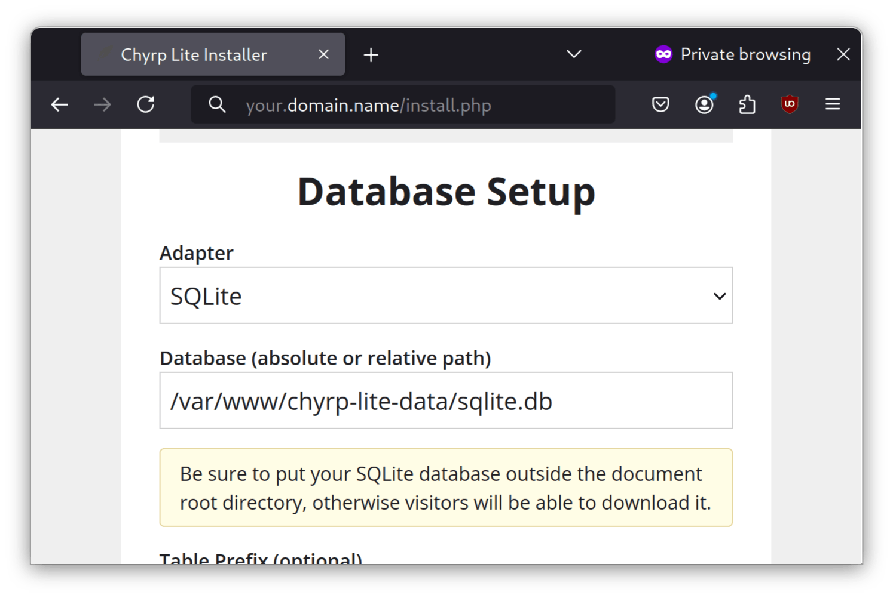

## Вступ

[Chyrp Lite](https://chyrplite.net/) — це надлегка система для ведення блогів, написана мовою PHP.

## Передумови та припущення

Нижче наведено мінімальні вимоги для використання цієї процедури:

- Можливість запускати команди від імені користувача root або використовувати `sudo` для підвищення привілеїв.
- Знайомство з редактором командного рядка. Автор використовує `vi` або `vim` тут, але замініть у вашому улюбленому редакторі.

## Встановлення Caddy

Ми будемо використовувати Caddy як веб-сервер. Щоб інсталювати Caddy, спочатку потрібно інсталювати EPEL (додаткові пакети для Enterprise Linux) і запустити оновлення:

```bash
dnf -y install epel-release && dnf -y update
```

Потім встановіть Caddy:

```bash
dnf -y install Caddy
```

Згодом відкрийте `Caddyfile`:

```bash
vi /etc/caddy/Caddyfile
```

Додайте наступне до свого `Caddyfile`:

```bash
your.domain.name {
        root * /var/www/chyrp-lite
        file_server
        php_fastcgi 127.0.0.1:9000
}
```

Збережіть файл за допомогою `:wq!`, а потім відкрийте відповідні порти брандмауера:

```bash
sudo firewall-cmd --permanent --zone=public --add-service=http
sudo firewall-cmd --permanent --zone=public --add-service=https
sudo firewall-cmd --reload
```

Нарешті, запустіть Caddy:

```bash
systemctl enable --now caddy
```

## Встановлення PHP

!!! note "Примітка"

```
Якщо ви використовуєте Rocky Linux 8.x, замініть вісім біля випуску в рядку встановлення пакета Remi. 
```

Щоб встановити PHP, вам знадобиться репозиторій Remi. Щоб встановити репозиторій Remi, виконайте наступне:

```bash
dnf install https://rpms.remirepo.net/enterprise/remi-release-9.rpm
```

Потім встановіть PHP і необхідні модулі:

```bash
dnf install -y php83-php php83-php-session php83-php-json php83-php-ctype php83-php-filter php83-php-libxml php83-php-simplexml php83-php-mbstring php83-php-pdo php83-php-curl
```

Далі відкрийте файл конфігурації PHP:

```bash
vi /etc/opt/remi/php83/php-fpm.d/www.conf
```

Перейдіть до рядка `listen =` і встановіть для нього наступне:

```bash
listen = 127.0.0.1:9000
```

Вийдіть із `vi` за допомогою `:wq!` і ввімкніть PHP:

```bash
systemctl enable --now php83-php-fpm.service
```

## Встановлення Chyrp

Тепер ми збираємося встановити Chyrp Lite. Для цього завантажте останню версію:

```bash
cd /var/www
wget https://github.com/xenocrat/chyrp-lite/archive/refs/tags/v2024.03.zip
```

Далі розпакуйте та перемістіть видобуту папку:

```bash
unzip v2024.03.zip
mv chyrp-lite-2024.03/ chyrp-lite
```

Встановіть правильні дозволи для папки `chyrp-lite`:

```bash
chown -R apache:apache chyrp-lite/
```

Налаштуйте каталог даних для зберігання бази даних SQLite:

```bash
mkdir chyrp-lite-data
chown -R apache:apache chyrp-lite-data/
```

Далі налаштуйте контекст файлу SELinux:

```bash
semanage fcontext -a -t httpd_sys_rw_content_t "/var/www/chyrp-lite(/.*)?"
semanage fcontext -a -t httpd_sys_rw_content_t "/var/www/chyrp-lite-data(/.*)?"
restorecon -Rv /var/www/chyrp-lite
restorecon -Rv /var/www/chyrp-lite-data
```

На клієнтській машині відкрийте веб-браузер за адресою `https://your.domain.name/install.php` і запустіть програму інсталяції (замініть `your.domain.name` фактичним ім'ям домену або ім'ям хоста):



У розділі **Database** виберіть шлях у створеному раніше каталозі `chyrp-lite-data`, наприклад `/var/www/chyrp-lite-data/sqlite.db`.

Потім заповніть інші поля, які мають бути зрозумілими.

Потім натисніть **Install me**, а потім **Take me to my site**. Тепер ви зможете відвідати завершену інсталяцію вашого сайту Chyrp:


## Висновок

Враховуючи, що WordPress перетворився на швейцарський армійський ніж веб-розробки, не дивно, що деякі веб-майстри (включно з автором) віддадуть перевагу легкому механізму ведення блогів. Chyrp Lite ідеально підходить для таких користувачів.
