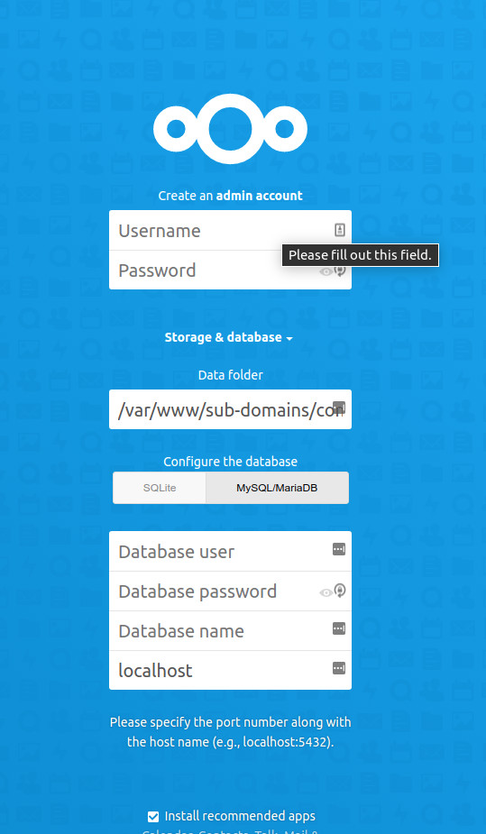

- - -
title: Cloud Server Using Nextcloud author: Steven Spencer contributors: Ezequiel Bruni tested with: 8.5, 8.6 tags:
  - cloud
  - nextcloud
- - -

# Server Cloud con Nextcloud

## Prerequisiti e Presupposti

* Server con Rocky Linux (è possibile installare Nextcloud su qualsiasi distribuzione Linux, ma questa procedura presuppone l'utilizzo di Rocky).
* Un elevato grado di comfort nell'operare dalla riga di comando per l'installazione e la configurazione.
* Conoscenza di un editor a riga di comando. Per questo esempio utilizziamo _vi_, ma potete usare il vostro editor preferito, se ne avete uno.
* Sebbene Nextcloud possa essere installato tramite un'applicazione snap, documenteremo due metodi di installazione, il modulo e il file .zip.
* Applicheremo i concetti del documento Apache "sites enabled" (linkato in basso) per l'impostazione delle directory nel metodo del file .zip.
* Utilizzeremo anche la procedura di hardening di _mariadb-server_ (anch'essa linkata più avanti) per la configurazione del database.
* In questo documento si presuppone che siate root, o che possiate esserlo usando _sudo_.
* Utilizziamo un dominio di esempio "yourdomain.com" nel metodo del file .zip.

## Introduzione

Se siete responsabili di un ambiente server per una grande (o anche piccola) azienda, potreste essere tentati dalle applicazioni cloud. L'utilizzo del cloud può liberare risorse per altre attività, ma c'è un aspetto negativo: la perdita di controllo dei dati aziendali. Se l'applicazione cloud è compromessa, potrebbero esserlo anche i dati della vostra azienda.

Riportare il cloud nel proprio ambiente è un modo per recuperare la sicurezza dei dati a scapito di tempo ed energia. A volte è un costo che vale la pena pagare.

Nextcloud offre un cloud open source che tiene conto della sicurezza e della flessibilità. Si noti che la creazione di un server Nextcloud è un buon esercizio, anche se alla fine si sceglie di portare il cloud fuori sede. La procedura seguente riguarda l'impostazione di Nextcloud su Rocky Linux.

## Procedure comuni necessarie per entrambe le installazioni

Ci sono diversi passaggi che sono gli stessi indipendentemente dal metodo di installazione utilizzato. Si tratta di installare i repository EPEL e Remi, configurare PHP e configurare mariadb. Il link a queste procedure è presente nel metodo di installazione del file .zip (secondo metodo). Siate consapevoli di questo.

## Nextcloud - Metodo del modulo

Perché utilizzare il modulo Nextcloud?  Dopo aver abilitato il modulo, possiamo installare Nextcloud, che scaricherà quasi tutte le dipendenze. Dovrete comunque installare il database che preferite (mariadb, postgresql o sqlite), ma la vostra piattaforma web sarà gestita dai pacchetti Nextcloud, così come tutti gli script back-end. Lo svantaggio di questo metodo particolare è che si perde il controllo sulla posizione in cui si desidera installare Nextcloud.

Quando si gestisce un gruppo di server o container con applicazioni web, un amministratore di sistema preferisce cercare le cose nello stesso punto, senza cercare di capire dove si è installato il pacchetto "A" rispetto al pacchetto "B".

### Installazione e configurazione di repository e moduli
<a name="repositories"></a>

Per questa installazione sono necessari due repository. È necessario installare i pacchetti EPEL (Extra Packages for Enterprise Linux) e il repository Remi per PHP 8.0 (è richiesto un minimo di versione 7.3 o 7.4 e la versione Rocky Linux 7.4 (non abilitata di default) non contiene tutti i pacchetti di cui Nextcloud ha bisogno. Utilizzeremo invece PHP 8.0 dal repository Remi.

Per installare  EPEL esegui:

`dnf install epel-release`

To install the Remi repository run:

`dnf install https://rpms.remirepo.net/enterprise/remi-release-8.rpm`

Quindi eseguire nuovamente `dnf update`.

Eseguire il seguente comando per visualizzare l'elenco dei moduli php che possono essere abilitati:

`dnf module list php`

```
Rocky Linux 8 - AppStream
Name                    Stream                     Profiles                                     Summary                                 
php                     7.2 [d]                    common [d], devel, minimal                   PHP scripting language                  
php                     7.3                        common [d], devel, minimal                   PHP scripting language                  
php                     7.4                        common [d], devel, minimal                   PHP scripting language               
php                     7.4                        common [d], devel, minimal                   PHP scripting language                  
Remi's Modular repository for Enterprise Linux 8 - x86_64
Name                    Stream                     Profiles                                     Summary                                 
php                     remi-7.2                   common [d], devel, minimal                   PHP scripting language                  
php                     remi-7.3                   common [d], devel, minimal                   PHP scripting language                  
php                     remi-7.4                   common [d], devel, minimal                   PHP scripting language                  
php                     remi-8.0                   common [d], devel, minimal                   PHP scripting language                  
php                     remi-8.1                   common [d], devel, minimal                   PHP scripting language                  
Hint: [d]efault, [e]nabled, [x]disabled, [i]nstalled
```

Vogliamo prendere il PHP più recente con cui Nextcloud è compatibile, che in questo momento è l'8.0, quindi abiliteremo il modulo:

`dnf module enable php:remi-8.0`

Per vedere come cambia l'output dell'elenco dei moduli, eseguite di nuovo il comando module list e vedrete la scritta "[e]" accanto a 8.0:

`dnf module list php`

L'output è di nuovo lo stesso, tranne che per questa riga:

`php                    remi-8.0 [e]                   common [d], devel, minimal                  PHP scripting language`

Il passo finale consiste nell'abilitare la versione stabile di Nextcloud dai moduli. È facile come:

`dnf module enable nextcloud:nextcloud-stable`

### Installazione dei pacchetti

Per vedere cosa offre l'abilitazione del modulo Nextcloud da installare, procedere come segue:

`dnf list available | grep nextcloud` che mostrerà un risultato come questo:

```
nextcloud.noarch                                                  22.0.0-2.module_el8+12398+2facbd17                epel-modular
nextcloud-client.x86_64                                           3.2.4-2.el8                                       epel        
nextcloud-client-devel.x86_64                                     3.2.4-2.el8                                       epel        
nextcloud-client-dolphin.x86_64                                   3.2.4-2.el8                                       epel        
nextcloud-client-libs.x86_64                                      3.2.4-2.el8                                       epel        
nextcloud-client-nautilus.x86_64                                  3.2.4-2.el8                                       epel        
nextcloud-httpd.noarch                                            22.0.0-2.module_el8+12398+2facbd17                epel-modular
nextcloud-mysql.noarch                                            22.0.0-2.module_el8+12398+2facbd17                epel-modular
nextcloud-nginx.noarch                                            22.0.0-2.module_el8+12398+2facbd17                epel-modular
nextcloud-postgresql.noarch                                       22.0.0-2.module_el8+12398+2facbd17                epel-modular
nextcloud-sqlite.noarch                                           22.0.0-2.module_el8+12398+2facbd17                epel-modular
```
Il nostro esempio utilizza Apache e mariadb, quindi per installare ciò di cui abbiamo bisogno, dobbiamo semplicemente procedere come segue:

`dnf install nextcloud nextcloud-httpd nextcloud-mysql mariadb-server`

### Configurazione

#### Configurazione di Apache

Impostare l'avvio di _apache_ all'avvio del sistema:

`systemctl enable httpd`

Poi avviatelo:

`systemctl start httpd`

Quando si installa Nextcloud utilizzando il modulo, la configurazione viene già creata per l'utente. In realtà, esistono più configurazioni. È possibile trovarle cercando nella cartella conf.d in questo modo: `ls -al /etc/httpd/conf.d` che dovrebbe mostrare un risultato simile a questo:

```
-rw-r--r--. 1 root root  400 Nov 15 03:13 README
-rw-r--r--. 1 root root 2926 Nov 15 03:13 autoindex.conf
-rw-r--r--. 1 root root  994 Jul 14  2021 nextcloud-access.conf.avail
-rw-r--r--. 1 root root  278 Jul 14  2021 nextcloud-auth-any.inc
-rw-r--r--. 1 root root  313 Jul 14  2021 nextcloud-auth-local.inc
-rw-r--r--. 1 root root  263 Jul 14  2021 nextcloud-auth-none.inc
-rw-r--r--. 1 root root 2407 Jul 14  2021 nextcloud-defaults.inc
-rw-r--r--. 1 root root 1893 Jul 14  2021 nextcloud.conf
-rw-r--r--. 1 root root 1668 Dec 16 06:57 php.conf
-rw-r--r--. 1 root root 1252 Nov 15 03:10 userdir.conf
-rw-r--r--. 1 root root  574 Nov 15 03:10 welcome.conf
```
La configurazione principale per Nextcloud è `nextcloud.conf`, ma si consiglia di esaminare gli altri file. Le istruzioni per l'uso sono riportate all'inizio di ogni file. Nella nostra installazione di laboratorio, localhost non è disponibile da nessuna interfaccia web. Se si guarda all'inizio del file `nextcloud-access.conf.avail`, si vedrà un avviso che invita ad abilitarlo solo dopo che l'account amministratore e l'installazione iniziale sono stati completati. Poiché questo non è possibile nell'istanza di laboratorio, lo stiamo facendo in anticipo:

`ln -s /etc/httpd/conf.d/nextcloud-access.conf.avail /etc/httpd/conf.d/z-nextcloud-access.conf`

Abbiamo anche bisogno di un file speciale vuoto per poter installare Nextcloud. Questo file risiede in `/etc/nextcloud` e si chiama CAN_INSTALL. Per crearlo, è sufficiente procedere come segue:

`touch /etc/nextcloud/CAN_INSTALL`

#### Configurazione di PHP
<a name="confphp"></a>

È necessario impostare il fuso orario per PHP. Per farlo, aprire php.ini con il proprio editor di testo:

`vi /etc/php.ini`

Trovate quindi la riga che dice:

`;date.timezone =`

È necessario rimuovere l'annotazione (;) e impostare il fuso orario. Per il nostro esempio di fuso orario, dovremmo inserire uno dei due:

`date.timezone = "America/Chicago"`

O

`date.timezone = "US/Central"`

Quindi salvare e chiudere il file php.ini.

Si noti che, per mantenere le cose invariate, il fuso orario nel file _php.ini_ dovrebbe corrispondere a quello della macchina. Per sapere a quale valore è impostato, procedere come segue:

`ls -al /etc/localtime`

Questo dovrebbe mostrare qualcosa di simile, supponendo che abbiate impostato il fuso orario quando avete installato Rocky Linux e che viviate nel fuso orario centrale:

`/etc/localtime -> /usr/share/zoneinfo/America/Chicago`

#### Configurazione di mariadb-server
<a name="mariadbproc"></a>

Impostare l'avvio di _mariadb-server_ all'avvio del sistema:

`systemctl enable mariadb`

E poi avviarlo:

`systemctl restart mariadb`

Anche in questo caso, come indicato in precedenza, per la configurazione iniziale si utilizzerà la procedura di configurazione per l'hardening di _mariadb-server_ che si trova [qui](../database/database_mariadb-server.md).

#### Configurazione di Nextcloud

Ora arriva il divertimento! Innanzitutto, assicuratevi che i vostri servizi siano attivi. Se avete seguito i passaggi precedenti, dovrebbero essere già in funzione. Ci sono stati diversi passaggi tra questi avvii iniziali del servizio, quindi andiamo avanti e riavviamoli, per essere sicuri:

```
systemctl restart httpd
systemctl restart mariadb
```

Se tutto si riavvia e non ci sono problemi, siete pronti a proseguire.

Per effettuare la configurazione iniziale, vogliamo caricare il sito in un browser web. Nella nostra istanza di laboratorio, non abbiamo impostato alcun hostname, quindi ci colleghiamo al sito tramite l'indirizzo IP in questo modo:

`http://192.168.1.108/nextcloud`

Supponendo di aver fatto tutto correttamente fino a questo momento, dovrebbe apparire la schermata di configurazione di Nextcloud:



Ci sono un paio di cose che vogliamo fare in modo diverso rispetto alle impostazioni predefinite:

* Nella parte superiore della pagina web, dove è scritto "Crea un account amministratore", impostare l'utente e la password. Ai fini di questo documento, inseriamo "admin" e impostiamo una password forte. Ricordate di salvarla in un posto sicuro (come un gestore di password) per non perderla! Anche se avete digitato in questo campo, non premete "Invio" prima di aver completato tutti i campi di impostazione!
* Nella sezione "Configura il database", cambiare da "SQLite" a "MySQL/MariaDB" facendo clic sul pulsante.
* Nei campi "Utente del database" e "Password del database" digitate l'utente root di MariaDB e la password impostata in precedenza
* Nel campo "Nome del database", digitare "nextcloud"
* Nel campo "localhost", digitate "localhost:3306" (3306 è la porta di connessione predefinita di _mariadb_ )

Una volta fatto tutto questo, fate clic su `Fine dell'installazione` e sarete subito operativi.

### Note per l'Amministratore di Sistema

Come già detto, se si usa l'installazione del modulo per Nextcloud, Nextcloud metterà le cose dove pensa che debbano essere, non dove l'amministratore di sistema potrebbe cercarle. Per questo motivo, come parte delle fasi di configurazione, raccomando di creare un file README.txt in ogni posizione in cui l'amministratore di sistema dovrebbe logicamente cercare.

Venivo da un ambiente in cui usavamo `/etc/httpd/sites-enabled` per i file di configurazione (si vedano i passaggi alternativi per l'installazione) e mettevamo i nostri file web in `/var/www/sub-domains/[site_name]/html`. Se dovessi usare l'installazione del modulo di Nextcloud, vorrei inserire un file README.txt in entrambe le posizioni.

Il file README.txt in `/etc/httpd/sites-enabled/` potrebbe contenere:

```
Nextcloud was installed using the module. La configurazione si trova in /etc/httpd/conf.d/nextcloud.conf
```

Mentre il file README.txt in `/var/www/sub-domains/[site_name]/html` potrebbe contenere:

```
Nextcloud was installed using the module. I file web si trovano in /usr/share/nextcloud
```
## Installazione .zip di Nextcloud

Se l'installazione del modulo è così semplice, perché prendere in considerazione il metodo di installazione del file .zip? Il motivo è il controllo dell'ambiente. Come indicato nella procedura di installazione del modulo Nextcloud, Nextcloud sceglie dove mettere i file web, dove mettere i file di configurazione e la maggior parte delle altre opzioni di configurazione. L'uso del metodo di installazione dei file .zip è sicuramente più intensivo del metodo di installazione dei moduli, ma *offre* all'Amministratore di Sistema un maggiore controllo sulla destinazione dei file.

### Installazione e configurazione dei repository (stessa procedura)

L'operazione si svolge esattamente come la [procedura di installazione del modulo](#repositories).

### Installazione dei pacchetti

Abbiamo bisogno di molti pacchetti installati. Alcuni di questi potrebbero essere già installati con l'installazione predefinita di Rocky Linux, ma è bene accertarsene eseguendo il seguente comando:

`dnf install httpd mariadb-server vim wget zip unzip libxml2 openssl php80-php php80-php-ctype php80-php-curl php80-php-gd php80-php-iconv php80-php-json php80-php-libxml php80-php-mbstring php80-php-openssl php80-php-posix php80-php-session php80-php-xml php80-php-zip php80-php-zlib php80-php-pdo php80-php-mysqlnd php80-php-intl php80-php-bcmath php80-php-gmp`

### Configurazione di pacchetti e directory

#### Configurazione di apache

Impostare l'avvio di _apache_ all'avvio del sistema:

`systemctl enable httpd`

Come già detto, per configurare Apache si utilizza la procedura "Siti Apache Abilitati" che si trova [qui](../web/apache-sites-enabled.md). Seguite questa guida per impostare le directory di configurazione e modificare il file _httpd.conf_, quindi tornate a questo documento per i passi restanti.

#### Creare la Configurazione

Per Nextcloud, è necessario creare il seguente file di configurazione.

`vi /etc/httpd/sites-available/com.yourdomain.nextcloud`

Il file di configurazione dovrebbe essere simile a questo:

```
<VirtualHost *:80>
  DocumentRoot /var/www/sub-domains/com.yourdomain.nextcloud/html/
  ServerName  nextcloud.yourdomain.com
  <Directory /var/www/sub-domains/com.yourdomain.nextcloud/html/>
    Require all granted
    AllowOverride All
    Options FollowSymLinks MultiViews
    <IfModule mod_dav.c>
      Dav off
    </IfModule>
  </Directory>
</VirtualHost>
```

Al termine, salvare le modifiche (con `SHIFT:wq!` per _vi_).

Quindi, creare un collegamento a questo file in /etc/httpd/sites-enabled:

`ln -s /etc/httpd/sites-available/com.yourdomain.nextcloud /etc/httpd/sites-enabled/`

#### Creazione della Directory...

Come indicato nella configurazione precedente, è necessario creare la _DocumentRoot_. Questo può essere fatto da:

`mkdir -p /var/www/sub-domains/com.yourdomain.com/html`

È qui che verrà installata la nostra istanza Nextcloud.

#### Configurare PHP (stessa procedura)

L'operazione si svolge esattamente come la [procedura di installazione del modulo](#confphp).

#### Configurare Mariadb (stessa procedura)

L'operazione si svolge esattamente come la [procedura di installazione del modulo](#mariadbproc).

### Installazione di Nextcloud

Questo metodo di installazione del server Nextcloud utilizza il file .zip di installazione.

#### Ottenere il file .zip di Nextcloud e decomprimerlo

I prossimi passi presuppongono che siate connessi in remoto al vostro server Nextcloud tramite _ssh_ e che abbiate una console remota aperta:

* Accedere al [sito web di Nextcloud](https://nextcloud.com/)
* Passate il mouse su "Get Nextcloud", che farà apparire un menu a discesa.
* Fare clic su "Pacchetti Server".
* Fate clic con il tasto destro del mouse su "Download Nextcloud" e copiate l'indirizzo del link. (la sintassi esatta è diversa da browser a browser)
* Nella console remota del server Nextcloud, digitate "wget", quindi uno spazio e incollate il testo appena copiato. Si dovrebbe ottenere qualcosa di simile a quanto segue: `wget https://download.nextcloud.com/server/releases/nextcloud-21.0.1.zip`
* Una volta premuto il tasto Invio, il download del file .zip inizierà e si concluderà abbastanza rapidamente.

Una volta completato il download, decomprimere il file zip di Nextcloud utilizzando la seguente procedura:

`unzip nextcloud-21.0.1.zip`

### Copiare il contenuto e modificare i permessi

Dopo aver completato la fase di decompressione, si dovrebbe avere una nuova directory in /root chiamata "nextcloud" Passare a questa directory:

`cd nextcloud`

E copiare o spostare il contenuto nella nostra _DocumentRoot_:

`cp -Rf * /var/www/sub-domains/com.yourdomain.nextcloud/html/`

O

`mv * /var/www/sub-domains/com.yourdomain.nextcloud/html/`

Ora che tutto è al suo posto, il passo successivo è assicurarsi che apache possieda la directory. Per farlo, eseguire:

`chown -Rf apache.apache /var/www/sub-domains/com.yourdomain.nextcloud/html`

Per motivi di sicurezza, vogliamo anche spostare la cartella "data" dall'interno all'esterno della _DocumentRoot_. Per farlo, utilizzate il seguente comando:

`mv /var/www/sub-domains/com.yourdomain.nextcloud/html/data /var/www/sub-domains/com.yourdomain.nextcloud/`

### Configurazione di Nextcloud

Ora arriva il divertimento! Innanzitutto, assicuratevi che i vostri servizi siano attivi. Se avete seguito i passaggi precedenti, dovrebbero essere già in funzione. Ci sono stati diversi passaggi tra questi avvii iniziali del servizio, quindi andiamo avanti e riavviamoli, per essere sicuri:

```
systemctl restart httpd
systemctl restart mariadb
```

Se tutto si riavvia e non ci sono problemi, siete pronti a proseguire.

Per effettuare la configurazione iniziale, vogliamo caricare il sito in un browser web:

`http://nextcloud.yourdomain.com/`

Dovrebbe apparire questa schermata:


Ci sono un paio di cose che vogliamo fare in modo diverso rispetto alle impostazioni predefinite:

* Nella parte superiore della pagina web, dove è scritto "Crea un account amministratore", impostare l'utente e la password. Ai fini di questo documento, inseriamo "admin" e impostiamo una password forte. Ricordate di salvarla in un posto sicuro (come un gestore di password) per non perderla! Anche se avete digitato in questo campo, non premete "Invio" prima di aver completato tutti i campi di impostazione!
* Nella sezione "Archiviazione e database", cambiare la posizione della "Cartella dati" dalla radice predefinita del documento alla posizione in cui abbiamo spostato la cartella dati in precedenza: `/var/www/sub-domains/com.yourdomain.nextcloud/data`
* Nella sezione "Configura il database", cambiare da "SQLite" a "MySQL/MariaDB" facendo clic sul pulsante.
* Nei campi "Utente del database" e "Password del database" digitate l'utente root di MariaDB e la password impostata in precedenza
* Nel campo "Nome del database", digitare "nextcloud"
* Nel campo "localhost", digitate "localhost:3306" (3306 è la porta di connessione predefinita di _mariadb_ )

Ora incrociate le dita e fate clic su "Finish Setup".

La finestra del browser si aggiorna per un po' e poi di solito non ricarica il sito. Inserite nuovamente l'URL nella finestra del browser e vi troverete di fronte alle prime pagine predefinite.

A questo punto l'utente amministrativo è già (o dovrebbe essere) loggato, e ci sono diverse pagine informative pensate per farvi acquisire familiarità. La "Dashboard" è ciò che gli utenti vedranno al primo accesso. L'utente amministrativo può ora creare altri utenti, installare altre applicazioni e svolgere molte altre attività.

Il file "Nextcloud Manual.pdf" è il manuale d'uso, in modo che gli utenti possano familiarizzare con ciò che è disponibile. L'utente amministrativo dovrebbe leggere o almeno scansionare i punti salienti del manuale di amministrazione [sul sito web di Nextcloud](https://docs.nextcloud.com/server/21/admin_manual/)

## Prossimi Passi

A questo punto, non dimenticate che si tratta di un server su cui memorizzerete i dati aziendali. È importante mettere in sicurezza il sito con un firewall, [configurare i backup](../backup/rsnapshot_backup.md), proteggere il sito con un [SSL](../security/generating_ssl_keys_lets_encrypt.md) e qualsiasi altra operazione necessaria per mantenere i dati al sicuro.

## Conclusioni e altre risorse
La decisione di portare il cloud aziendale all'interno dell'azienda deve essere valutata con attenzione. Per coloro che decidono che mantenere i dati aziendali in locale è preferibile rispetto a un host cloud esterno, Nextcloud è una buona alternativa.
