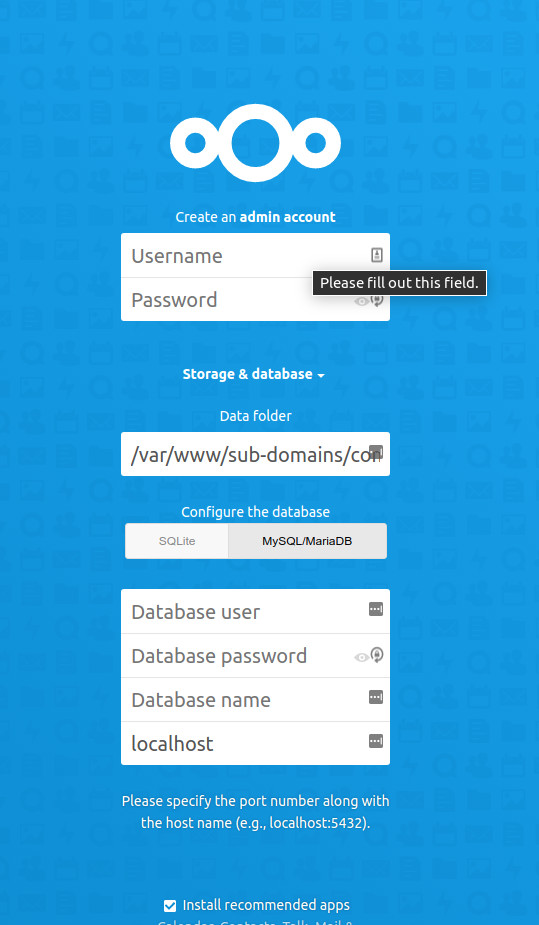

# Cloud Server Using Nextcloud

!!! note "Regarding Rocky Linux 9.x"

    This procedure should work for Rocky Linux 9.x. The difference is that you may need to change version references for some of the repositories to update those to version 9.  If you are using Rocky Linux 9.x, just be aware that this was tested in both 8.6 and 9.0, but written originally for 8.6.

## Prerequisites And Assumptions

- Server running Rocky Linux (you can install Nextcloud on any Linux distribution, but this procedure will assume you're using Rocky).
- A high degree of comfort operating from the command line for installation and for configuration.
- Knowledge of a command-line editor. For this example, we are using _vi_, but you can use your favorite editor if you have one.
- While Nextcloud can be installed via a snap application, we will be documenting just the .zip file installation.
- We will be applying concepts from the Apache _sites enabled_ document (linked to down below) for directory setup.
- We will also be using the _mariadb-server_ hardening procedure (also linked to later) for database setup.
- Throughout this document we will assume that you are root, or that you can be by using _sudo_.
- We are using an example domain of <yourdomain.com> in the configuration.

## Introduction

If you are in charge of a server environment for a large (or even a small) company, you may be tempted by cloud applications. Doing things in the cloud can free up your own resources for other things, but there is a downside to this, and that is the loss of control of your company's data. If the cloud application is compromised, your company's data may be compromised too.

Taking the cloud back into your own environment is a way to reclaim security of your data at the expense of your time and energy. Sometimes, that is a cost worth paying.

Nextcloud offers an open source cloud with security and flexibility in mind. Note that building a Nextcloud server is a good exercise, even if you opt to take your cloud off-site in the end. The following procedure deals with setting up Nextcloud on Rocky Linux.

## Nextcloud Install

### Installing And Configuring Repositories and Modules

For this installation, we will require two repositories. We need to install the EPEL (Extra Packages for Enterprise Linux), and the Remi Repository for PHP 8.3

!!! note

    A minimum PHP version 7.3 or 7.4 is required and the Rocky Linux version of 7.4 does not contain all of the packages that Nextcloud needs. We are going to use PHP 8.3 from the Remi repository instead.

To install the EPEL run:

```bash
dnf install epel-release
```

To install the Remi repository run (note: if you are using Rocky Linux 9.x, substitute in 9 next to `release-` below):

```bash
dnf install https://rpms.remirepo.net/enterprise/remi-release-8.rpm
```

Then run `dnf upgrade` again.

Run the following to see a list of php modules that can be enabled:

```bash
dnf module list php
```

which gives you this output for Rocky Linux 8.x (similar output will show for Rocky Linux 9.x):

```bash
Rocky Linux 8 - AppStream
Name                    Stream                     Profiles                                     Summary                                 
php                     7.2 [d]                    common [d], devel, minimal                   PHP scripting language                  
php                     7.3                        common [d], devel, minimal                   PHP scripting language                  
php                     7.4                        common [d], devel, minimal                   PHP scripting language               
php                     7.4                        common [d], devel, minimal                   PHP scripting language                  
Remi's Modular repository for Enterprise Linux 8 - x86_64
Name                    Stream                     Profiles                                     Summary                                 
php                     remi-7.2                   common [d], devel, minimal                   PHP scripting language                  
php                     remi-7.3                   common [d], devel, minimal                   PHP scripting language                  
php                     remi-7.4                   common [d], devel, minimal                   PHP scripting language                  
php                     remi-8.0                   common [d], devel, minimal                   PHP scripting language                  
php                     remi-8.1                   common [d], devel, minimal                   PHP scripting language                  
php                     remi-8.2                   common [d], devel, minimal                   PHP scripting language                  
php                     remi-8.3                   common [d], devel, minimal                   PHP scripting language                  
Hint: [d]efault, [e]nabled, [x]disabled, [i]nstalled
```

We want to grab the newest PHP that Nextcloud is compatible with, which at this moment is 8.3, so we will enable that module by doing:

```bash
dnf module enable php:remi-8.3
```

To see how this changes the output of the module list, run the module list command again and you will see the "[e]" next to 8.3:

```bash
dnf module list php
```

And the output again is the same except for this line:

```bash
php                    remi-8.3 [e]                   common [d], devel, minimal                  PHP scripting language
```

### Installing Packages

Our example here uses Apache and mariadb, so to install what we need, we simply need to do the following:

```bash
dnf install httpd mariadb-server vim wget zip unzip libxml2 openssl php83-php php83-php-ctype php83-php-curl php83-php-gd php83-php-iconv php83-php-json php83-php-libxml php83-php-mbstring php83-php-openssl php83-php-posix php83-php-session php83-php-xml php83-php-zip php83-php-zlib php83-php-pdo php83-php-mysqlnd php83-php-intl php83-php-bcmath php83-php-gmp
```

### Configuring

#### Configuring Apache

Set _apache_ to start on boot:

```bash
systemctl enable httpd
```

Then start it:

```bash
systemctl start httpd
```

#### Create The Configuration

In the _Prerequisites and Assumptions_ section, we mentioned that we will be using the [Apache Sites Enabled](../web/apache-sites-enabled.md) procedure for our configuration. Click over to that procedure and set up the basics there, and then return to this document to continue.

For Nextcloud, we will need to create the following configuration file.

```bash
vi /etc/httpd/sites-available/com.yourdomain.nextcloud
```

Your configuration file should look something like this:

```bash
<VirtualHost *:80>
  DocumentRoot /var/www/sub-domains/com.yourdomain.nextcloud/html/
  ServerName  nextcloud.yourdomain.com
  <Directory /var/www/sub-domains/com.yourdomain.nextcloud/html/>
    Require all granted
    AllowOverride All
    Options FollowSymLinks MultiViews
    <IfModule mod_dav.c>
      Dav off
    </IfModule>
  </Directory>
</VirtualHost>
```

Once done, save your changes (with ++shift+colon+"w"+"q"+exclam++ for _vi_).

Next, create a link to this file in /etc/httpd/sites-enabled:

```bash
ln -s /etc/httpd/sites-available/com.yourdomain.nextcloud /etc/httpd/sites-enabled/
```

#### Creating The Directory

As noted in the configuration above, the _DocumentRoot_ needs to be created. This can be done by:

```bash
mkdir -p /var/www/sub-domains/com.yourdomain.com/html
```

This is where our Nextcloud instance will be installed.

#### Configuring PHP

We need to set the time zone for PHP. To do this, open up php.ini with your text editor of choice:

```bash
vi /etc/opt/remi/php83/php.ini
```

Then find the line:

```php
;date.timezone =
```

We need to remove the remark (++semicolon++) and set our time zone. For our example time zone, we would put in either:

```php
date.timezone = "America/Chicago"
```

OR

```php
date.timezone = "US/Central"
```

Then save and exit the php.ini file.

Note that for the sake of keeping things the same, your time zone in the _php.ini_ file should match up to your machine's time zone setting. You can find out what this is set to by doing the following:

```bash
ls -al /etc/localtime
```

Which should show you something like this, assuming you set your time zone when you installed Rocky Linux and are living in the Central time zone:

```bash
/etc/localtime -> /usr/share/zoneinfo/America/Chicago
```

#### Configuring mariadb-server

Set _mariadb-server_ to start on boot:

```bash
systemctl enable mariadb
```

And then start it:

```bash
systemctl restart mariadb
```

Again, as indicated earlier, we will be using the setup procedure for hardening _mariadb-server_ found [here](../database/database_mariadb-server.md) for the initial configuration.

### Installing .zip

The next few steps assume that you are remotely connected to your Nextcloud server via _ssh_ with a remote console open:

- Navigate to the [Nextcloud web site](https://nextcloud.com/).
- Let your mouse hover over `Get Nextcloud` which will bring up a drop-down menu.
- Click on `Server Packages`.
- Right-click on `Download Nextcloud` and copy the link address (the exact syntax of this is different from browser to browser).
- In your remote console on the Nextcloud server, type `wget` and then a space and paste in what you just copied. You should get something like the following: `wget https://download.nextcloud.com/server/releases/nextcloud-21.0.1.zip` (note that the version could be different).
- Once you hit enter, the download of the .zip file will start and will be completed fairly quickly.

Once the download is complete, unzip the Nextcloud zip file by using the following:

```bash
unzip nextcloud-21.0.1.zip
```

### Copying Content And Changing Permissions

After completing the unzip step, you should now have a new directory in _/root_ called "nextcloud." Change into this directory:

```bash
cd nextcloud
```

And either copy or move the content to our _DocumentRoot_:

```bash
cp -Rf * /var/www/sub-domains/com.yourdomain.nextcloud/html/
```

OR

```bash
mv * /var/www/sub-domains/com.yourdomain.nextcloud/html/
```

Now that everything is where it should be, the next step is to make sure that apache owns the directory. To do this, run:

```bash
chown -Rf apache.apache /var/www/sub-domains/com.yourdomain.nextcloud/html
```

For security reasons, we also want to move the _data_ folder from inside to outside of the _DocumentRoot_. Do this with the following command:

```bash
mv /var/www/sub-domains/com.yourdomain.nextcloud/html/data /var/www/sub-domains/com.yourdomain.nextcloud/
```

### Configuring Nextcloud

Now comes the fun! First, make sure that you have your services running. If you followed the above steps, they should already be running. We have had several steps between those initial service starts, so let's go ahead and restart them, just to be sure:

```bash
systemctl restart httpd
systemctl restart mariadb
```

If everything restarts and there are no issues, then you are ready to move on.

To do the initial configuration, we want to actually load the site in a web browser:

<http://your-server-hostname/> (replace with your actual hostname)

Assuming that you've done everything correctly so far, you should be presented with a Nextcloud setup screen:



There are a couple of things that we want to do differently than the defaults that show up:

- At the top of the web page, where it says `Create an admin account`, set the user and password. For the sake of this document, we are entering `admin` and setting a strong password. Remember to save this somewhere safe (like a password manager) so that you don't lose it! Even though you have typed into this field, don't hit ++enter++ until we have done all of the setup fields!
- Under the `Storage & database` section, change the `Data folder` location from the default document root, to where we moved the data folder earlier: `/var/www/sub-domains/com.yourdomain.nextcloud/data`.
- Under the `Configure the database` section, change from `SQLite` to `MySQL/MariaDB` by clicking on that button.
- Type the MariaDB root user and password that you set earlier into the `Database user` and `Database password` fields.
- In the `Database name` field, type `nextcloud`.
- In the `localhost` field, type <localhost:3306> (3306 is the default _mariadb_ connect port).

Once you have all this, click `Finish Setup` and you should be up and running.

The browser window will refresh for a bit and then usually not reload the site. Enter your URL in the browser window again and you should be confronted with the default first pages.

Your administrative user is already (or should be) logged in at this point, and there are several informational pages designed to get you up to speed. The "Dashboard" is what users will see when they first login. The administrative user can now create other users, install other applications and many other tasks.

The "Nextcloud Manual.pdf" file is the user manual, so that users can get familiar with what is available. The administrative user should read through or at least scan the high points of the admin manual [On the Nextcloud web site](https://docs.nextcloud.com/server/21/admin_manual/)

## Next Steps

At this point, don't forget that this is a server that you will be storing company data on. It's important to get it locked down with a firewall, get the [backup set up](../backup/rsnapshot_backup.md), secure the site with an [SSL](../security/generating_ssl_keys_lets_encrypt.md), and any other duties that are required to keep your data safe.

## Conclusions

A decision to take the company cloud in house is one that needs to be evaluated carefully. For those that decide that keeping company data locally is preferable over an external cloud host, Nextcloud is a good alternative.
