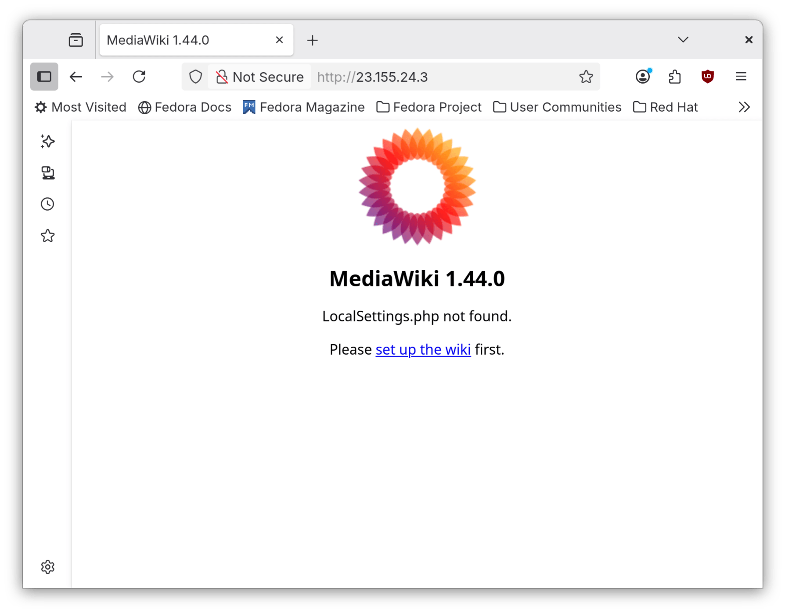
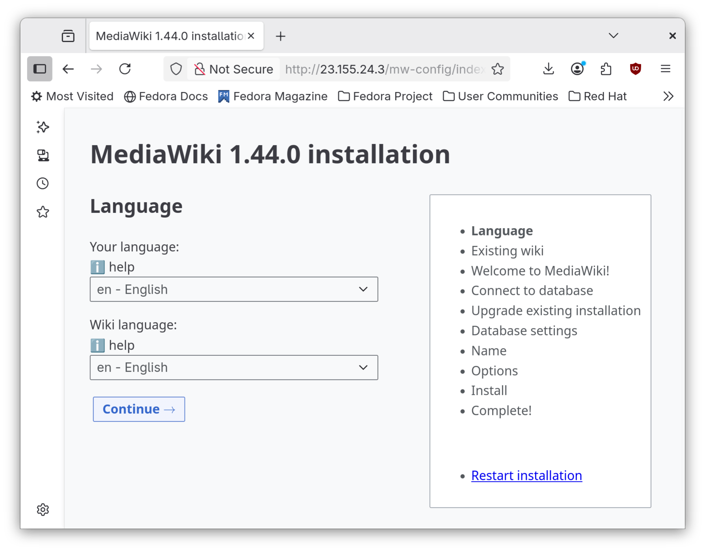
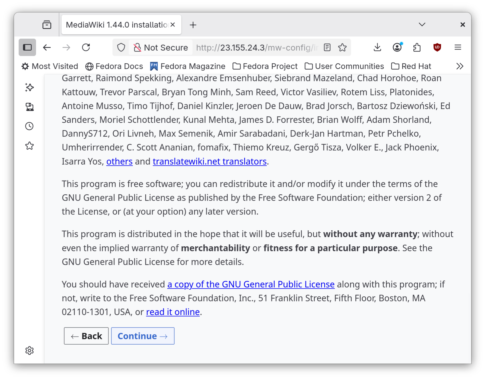
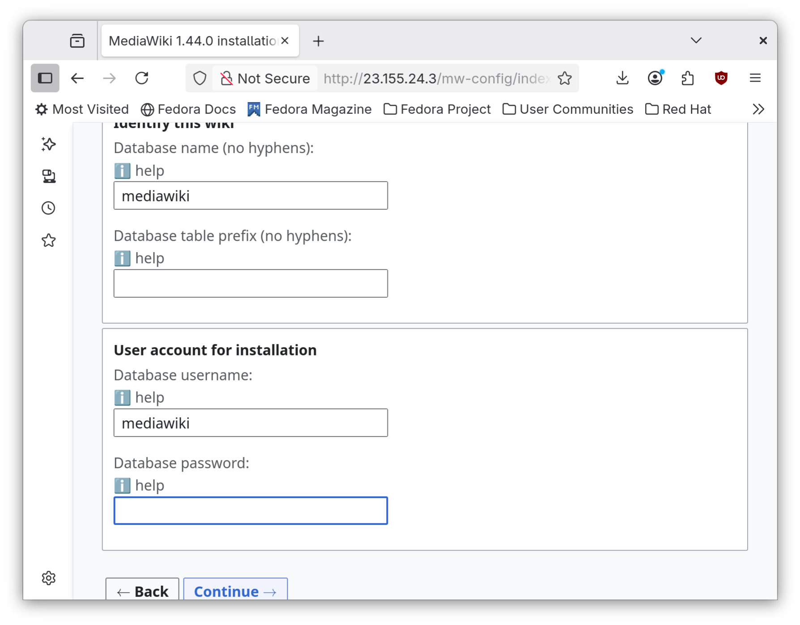
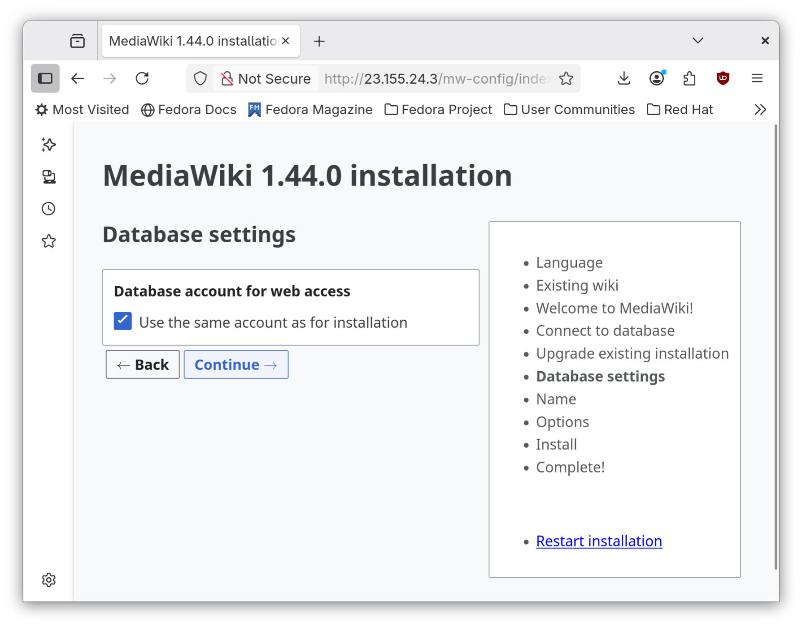
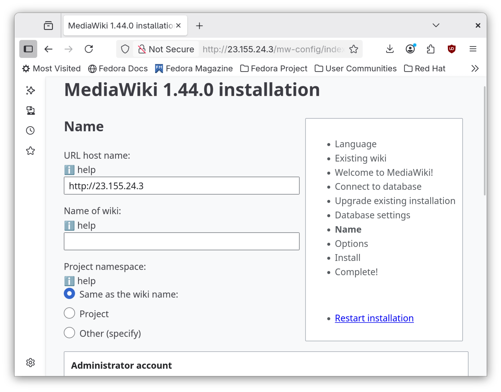
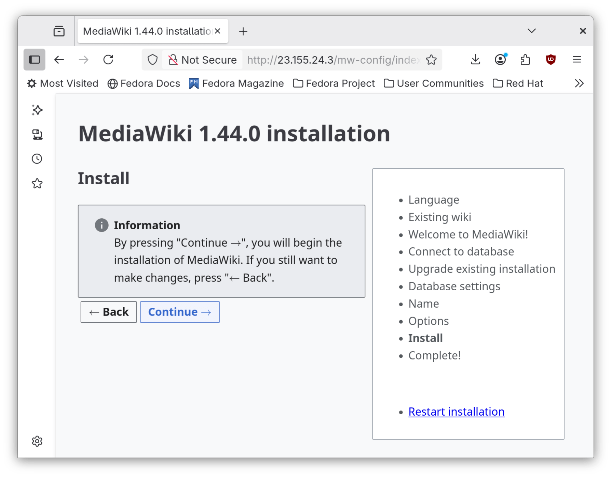
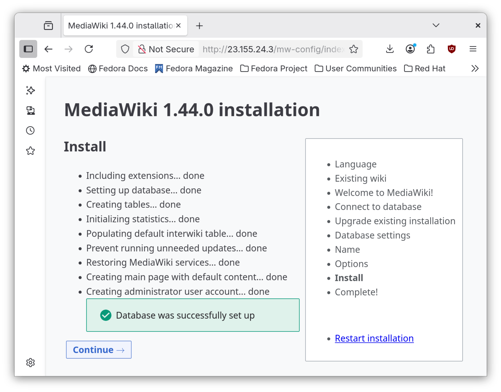
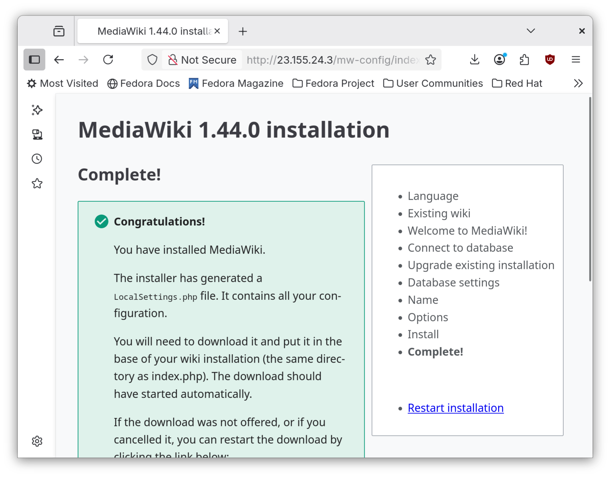
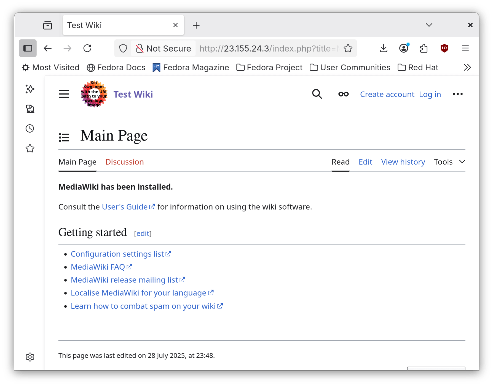

## Introduction

[MediaWiki](https://www.mediawiki.org/wiki/MediaWiki) est un moteur logiciel Wiki Open Source populaire qui alimente des sites tels que `Wikipédia`, `Fandom` et `wikiHow`, entre autres.

## Prérequis

Voici les exigences minimales pour utiliser cette procédure :

- La capacité d'exécuter des commandes en tant qu'utilisateur root ou d'utiliser `sudo` pour élever les privilèges
- Connaissance d'un éditeur de ligne de commande. L'auteur utilise ici `vi` ou `vim`, mais vous pouvez le remplacez par votre éditeur préféré

## Installation d'Apache

Apache est le serveur Web que vous utiliserez. Installez-le avec la commande suivante :

```bash
dnf -y install httpd
```

Ensuite, ouvrez les ports correspondants du pare-feu :

```bash
sudo firewall-cmd --permanent --zone=public --add-service=http
sudo firewall-cmd --permanent --zone=public --add-service=https
sudo firewall-cmd --reload
```

## Installation de `PHP`

Pour installer PHP, vous devez d'abord installer EPEL (Extra Packages for Enterprise Linux) :

```bash
dnf -y install epel-release && dnf -y update
```

Vous avez aussi besoin du dépôt `Remi`. Installez-le avec la commande suivante :

```bash
dnf install https://rpms.remirepo.net/enterprise/remi-release-10.rpm
```

Installez ensuite PHP et les modules requis :

```bash
dnf install -y dnf install php84-php-fpm php84-php-intl php84-php-mbstring php84-php-apcu php84-php-curl php84-php-mysql php84-php-xml
```

Activez PHP en utilisant la commande suivante :

```bash
systemctl enable --now php84-php-fpm.service
```

## Installation de MariaDB

Vous avez besoin de MariaDB comme serveur de base de données. Installez-le avec la commande suivante :

```bash
dnf install mariadb-server
```

Activez ensuite le service `systemd` et exécutez l’assistant d’installation :

```bash
systemctl enable --now mariadb
mysql_secure_installation
```

Lorsqu'on vous demande le mot de passe `root`, appuyez sur ++enter++ :

```bash
Entrez le mot de passe actuel pour root (++enter++ pour aucun) :
```

Répondez ++"n"++ à l'authentification `unix_socket` :

```bash
Switch to unix_socket authentication [Y/n] n
```

Répondez ++"Y"++ pour changer le mot de passe root et entrez le mot de passe `root` requis :

```bash
Change the root password? [Y/n] Y
New password: 
Re-enter new password: 
```

Supprimez les utilisateurs anonymes et interdisez les connexions `root` à distance :

```bash
Remove anonymous users? [Y/n] Y
...
Disallow root login remotely? [Y/n] Y
```

Supprimez l'accès à la base de données de test et rechargez les tables de privilèges :

```bash
Remove test database and access to it? [Y/n] Y
...
Reload privilege tables now? [Y/n] Y
```

Accédez à MariaDB avec la commande :

```bash
mysql -u root -p
```

Entrez le mot de passe `root` que vous avez créé précédemment.

Lorsque vous êtes dans la console MariaDB, créez la base de données pour MediaWiki :

```bash
MariaDB [(none)]> create database mediawiki;
```

Ensuite, créez l’utilisateur MediaWiki :

```bash
MariaDB [(none)]> create user 'mediawiki'@'localhost' identified by 'nchauhan11';
```

Accorder des privilèges sur la base de données MediaWiki :

```bash
grant all privileges on mediawiki.* to 'mediawiki'@'localhost';
```

Finalement, enregistrez les privilèges avec la commande :

```bash
MariaDB [(none)]> flush privileges;
```

## Installation de MediaWiki

Allez au répertoire `/var/www/` et téléchargez MediaWiki :

```bash
cd /var/www/
wget https://releases.wikimedia.org/mediawiki/1.44/mediawiki-1.44.0.zip
```

Décompressez et déplacez MediaWiki :

```bash
unzip mediawiki-1.44.0.zip
mv mediawiki-1.44.0/* html/
```

Définissez les autorisations SELinux correctes :

```bash
chown -R apache:apache /var/www/html
semanage fcontext -a -t httpd_sys_rw_content_t "/var/www/html(/.*)?"
restorecon -Rv /var/www/html
```

Activez `Apache` :

```bash
systemctl enable --now httpd
```

Ensuite, ouvrez un navigateur sur `http://your_ip` (remplacez `your_ip` par votre adresse IP) :



Choisissez votre langue et cliquez sur **Continue** :



Vérifiez que votre configuration PHP est correcte, faites défiler vers le bas et cliquez sur **Continue** :



Maintenant, entrez les informations de la base de données comme suit :

- **Database host**: `localhost`

- **Database name (no hyphens)**: `mediawiki` (ou bien la base de données crée à l'étape **MariaDB**)

- **Database username:**: `mediawiki` (ou bien l'utilisateur créé lors de l'étape **MariaDB**)

- **Database password** : le mot de passe créé lors de l'étape **MariaDB**



Cliquez sur **Continue**



À la page **MediaWiki _version_ installation** tapez :

- **URL host name** : l'URL que vous avez choisi

- **Name of wiki**: le nom du Wiki que vous avez choisi

- **Administrator account**/**Your username**: le nom du compte administrateur que vous voulez utiliser

- **Compte administrateur**/**Mot de passe (encore une fois)** : Le mot de passe administrateur que vous souhaitez utiliser

- **Compte administrateur**/**Adresse email** : L'adresse courriel de l'utilisateur administrateur

En option, vous pouvez sélectionner **Ask me more questions** pour aider à raffiner le Wiki. Pour plus de simplicité, cliquez sur **I'm bored already, just install the wiki** puis **Continue**:



Cliquez sur **Continue** pour installer le Wiki :



MediaWiki va mettre les bases de données en place. Une fois l'opération terminée, cliquez sur **Continue** :



Votre navigateur va télécharger un fichier `LocalSettings.php`. Vous allez le transmettre sur votre serveur avec `sftp`.

À titre d'exemple, l'auteur utilisera son ordinateur portable Fedora 42 pour transmettre ce fichier. Pour ce faire :

```bash
sftp root@your_ip
(Enter password)
cd /var/www/html
put LocalSettings.php 
```



Enfin, cliquez sur **enter your wiki** :



Vous disposez maintenant d'une nouvelle installation de MediaWiki.

## Conclusion

Bien que MediaWiki soit surtout reconnu pour alimenter Wikipédia, il est utile comme système de gestion de contenu lorsque les utilisateurs ont besoin de la possibilité de modifier des pages. MediaWiki propose une solution Open Source en remplacement de SharePoint de Microsoft.
