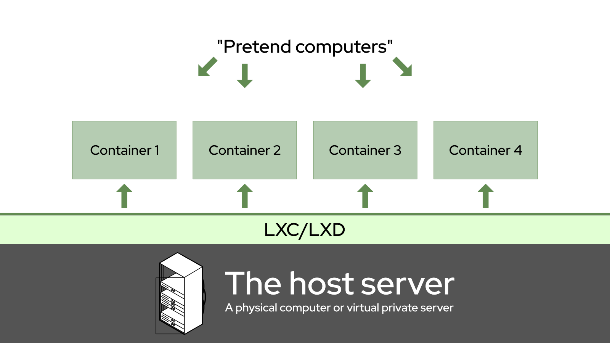
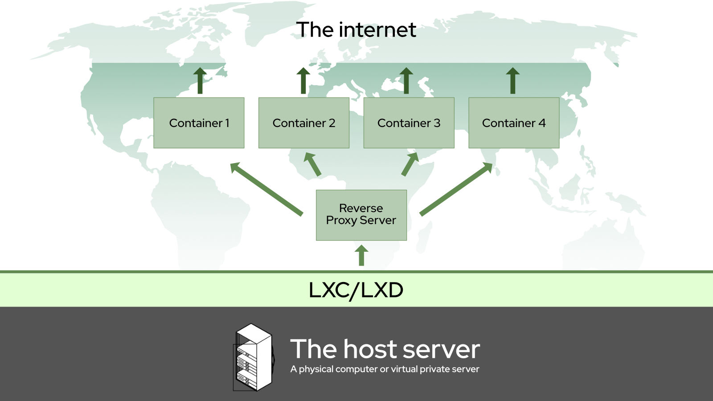
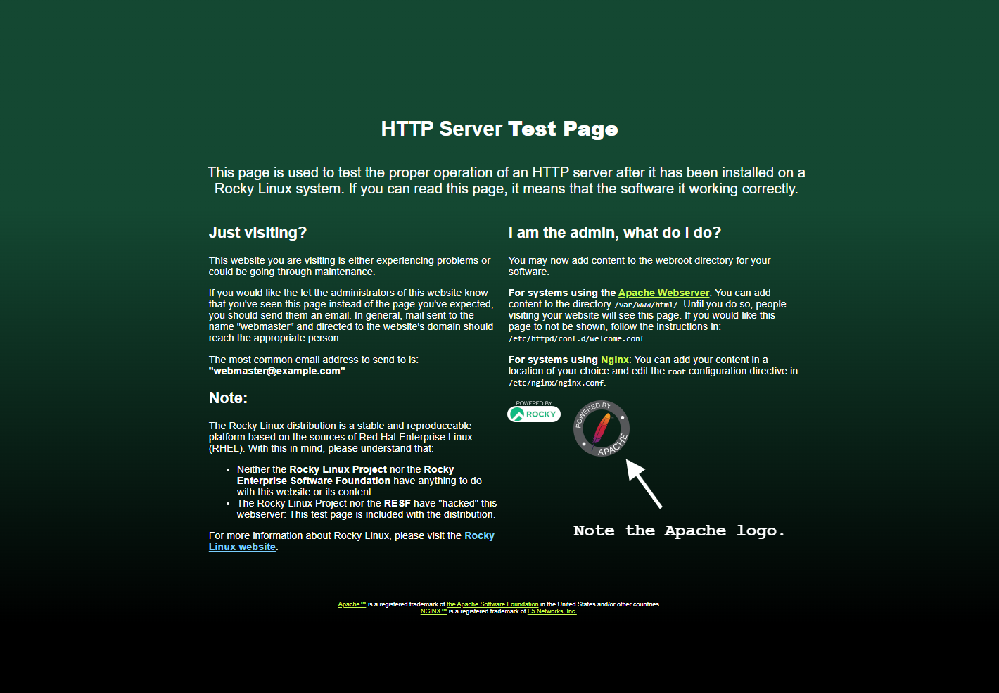
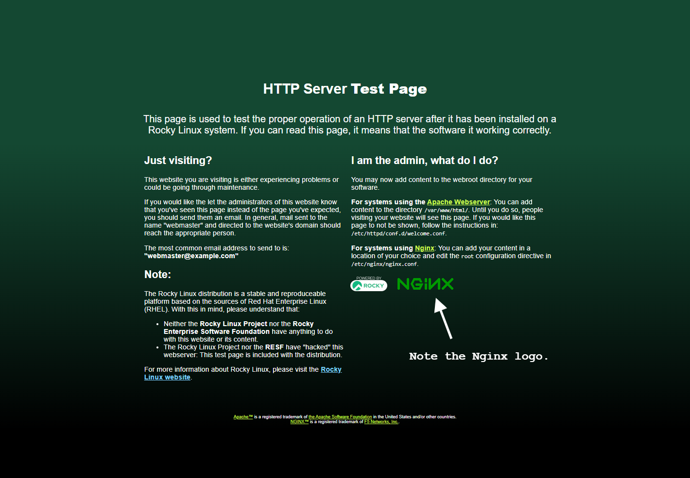

# Створення мережі веб-сайтів/веб-серверів за допомогою LXD для початківців

## Вступ

Гаразд, у нас уже є [посібник із встановлення LXD/LXC на Rocky Linux](../../books/lxd_server/00-toc.md), але його написав хтось, хто знає, що робить, і він хотів побудувати контейнерну мережу серверів та/або програм на фізичній машині у своїй локальній мережі. Це чудово, і я просто вкраду його шматочки, щоб мені не довелося так багато писати.

Але якщо ви щойно чули про контейнери Linux і ще не дуже розумієте, як вони працюють, але хочете розмістити деякі веб-сайти, це посібник для вас. *Цей посібник навчить вас розміщувати основні веб-сайти за допомогою LXD і LXC у будь-якій системі, включаючи віртуальні приватні сервери та хмарний хостинг.*

Отже, по-перше, що таке контейнер Linux? Що ж, для абсолютного початківця це спосіб змусити один комп’ютер удавати, що насправді це набагато більше комп’ютерів. Кожен із цих «контейнерів» містить базову (зазвичай урізану) версію обраної вами операційної системи. Ви можете використовувати кожен контейнер як окремий сервер; помістіть *nginx* на один, *Apache* на інший і навіть використовуйте третій як сервер бази даних.

Основна перевага полягає в тому, що якщо одна програма чи веб-сайт у власному контейнері зазнає серйозних помилок, злому чи інших проблем, це навряд чи вплине на решту вашого сервера чи інші програми та веб-сайти. Крім того, контейнери надзвичайно легко знімати, створювати резервні копії та відновлювати.

У цьому випадку ми будемо запускати Rocky Linux у наших контейнерах поверх нашої «хостової» системи, яка також є Rocky Linux.

Концептуально це приблизно так:



Якщо ви коли-небудь грали з VirtualBox для запуску деяких програм Windows, це так, але ні. На відміну від віртуальних машин, контейнери Linux не емулюють усе апаратне середовище для кожного контейнера. Навпаки, усі вони спільно використовують декілька віртуальних пристроїв за умовчанням для роботи в мережі та зберігання, хоча ви можете додати більше віртуальних пристроїв. Як результат, вони вимагають набагато менше накладних витрат (обчислювальної потужності та оперативної пам’яті), ніж віртуальна машина.

Для тих любителів Docker (Docker — це ще одна система на основі контейнерів, *не* система VM), контейнери Linux менш ефемерні, ніж те, до чого ви звикли. Усі дані в кожному екземплярі контейнера є постійними, і будь-які внесені вами зміни є постійними, якщо ви не повернетеся до резервної копії. Коротше кажучи, закриття контейнера не зітре жодних проблем, які ви могли створити.

Зокрема, LXD — це програма командного рядка, яка допомагає налаштовувати контейнери Linux і керувати ними. Це те, що ми сьогодні встановимо на хост-сервер Rocky Linux. Однак я буду багато писати про LXC/LXD, оскільки існує багато старої документації, яка стосується лише LXC, і я намагаюся полегшити людям пошук оновлених посібників, подібних до цього.

!!! Note "Примітка"

    Був додаток-попередник LXD, який також називався "LXC". Сьогодні LXC – це технологія, а LXD – це додаток.

Ми будемо використовувати їх обидва, щоб створити середовище, яке працює приблизно так:



Зокрема, я покажу вам, як налаштувати прості веб-сервери Nginx і Apache всередині контейнерів ваших серверів і використовувати інший контейнер із Nginx як зворотний проксі. Знову ж таки, це налаштування має працювати в будь-якому середовищі: від локальних мереж до віртуальних приватних серверів.

!!! Note "Примітка"

    Зворотний проксі — це програма, яка приймає вхідні з’єднання з Інтернету (або вашої локальної мережі) і направляє їх на потрібний сервер, контейнер або програму. Існують також спеціальні інструменти для цієї роботи, наприклад HaProxy... але я вважаю Nginx набагато простішим у використанні.

## Передумови та припущення

* Базове знайомство з інтерфейсом командного рядка Linux. Ви повинні знати, як використовувати SSH, якщо ви встановлюєте LXC/LXD на віддаленому сервері.
* Підключений до Інтернету сервер, фізичний або віртуальний, на якому вже працює Rocky Linux.
* Два доменних імена вказують прямо на ваш сервер із записом A.
    * Два субдомени також працюватимуть так само добре. Також буде один домен із записом піддомену зі знаком узагальнення або спеціальний домен локальної мережі.
* Текстовий редактор командного рядка. *nano* підійде, *micro* мій улюблений, але використовуйте те, що вам зручно.
* Ви *можете* стежити за цим посібником як користувач root, але це не дуже гарна ідея. Після початкової інсталяції LXC/LXD ми допоможемо вам створити непривілейованого користувача спеціально для керування командами LXD.
* Тепер доступні образи Rocky Linux для створення контейнерів.
* Якщо ви не надто знайомі з Nginx або Apache, вам **буде** потрібно ознайомитися з деякими іншими нашими посібниками, якщо ви хочете запустити повноцінний робочий сервер. Не хвилюйтеся, я дам посилання на них нижче.

## Налаштування середовища хост-сервера

### Встановіть репозиторій EPEL

Для LXD потрібен репозиторій EPEL (Extra Packages for Enterprise Linux), який легко встановити за допомогою:

```bash
dnf install epel-release
```

Після встановлення перевірте наявність оновлень:

```bash
dnf update
```

Для LXD потрібен репозиторій EPEL (Extra Packages for Enterprise Linux), який легко встановити за допомогою:

### Встановити snapd

LXD потрібно встановити з пакета snap\* для Rocky Linux. З цієї причини нам потрібно встановити snapd з:

```bash
dnf install snapd
```

Якщо під час процесу оновлення було оновлено ядро, перезавантажте сервер

```bash
systemctl enable snapd
```

А потім запустіть:

```bash
systemctl start snapd
```

Перш ніж продовжити, перезавантажте сервер. Це можна зробити за допомогою команди `reboot` або з панелі адміністратора VPS/хмарного хостингу.

А потім запустіть:

### Встановлення LXD

Перш ніж продовжити, перезавантажте сервер. Це можна зробити за допомогою команди `reboot` або з панелі адміністратора VPS/хмарного хостингу.

```bash
snap install lxd
```

Якщо ви використовуєте LXD на фізичному (відомому як «голий метал») сервері, можливо, вам варто повернутися до іншого посібника та прочитати там розділ «Налаштування середовища». Є багато хороших речей про ядра та файлові системи та багато іншого.

Якщо ви використовуєте LXD у віртуальному середовищі, просто перезавантажте програму та читайте далі.

### Ініціалізація LXD

Тепер, коли середовище налаштовано, ми готові ініціалізувати LXD. Це автоматизований сценарій, який задає низку запитань, щоб запустити ваш екземпляр LXD:

```bash
lxd init
```

Ось запитання та наші відповіді щодо сценарію з невеликими поясненнями, де це необхідно:

```
Would you like to use LXD clustering? (Бажаєте використовувати кластеризацію LXD?) (yes/no) [default=no]:
```

Якщо вас цікавить кластеризація, проведіть додаткові дослідження з цього приводу

тут</a. В іншому випадку просто натисніть «Enter», щоб прийняти параметр за замовчуванням.</p> 


```
Do you want to configure a new storage pool? (Бажаєте налаштувати новий пул зберігання?) (yes/no) [default=yes]:
```


Прийміть значення за замовчуванням.


```
Ім’я нового пулу сховищ [default=default]: server-storage
```


Виберіть назву для свого пулу зберігання. Мені подобається називати його на честь сервера, на якому працює LXD. (Пул зберігання — це, по суті, встановлений обсяг місця на жорсткому диску, відведений для ваших контейнерів.)


```
Ім’я сховища для використання (btrfs, dir, lvm, zfs, ceph) [за замовчуванням=zfs]: lvm
```


Запитання вище стосується того, яку файлову систему ви бажаєте використовувати для зберігання, і значення за умовчанням може відрізнятися залежно від того, що доступно у вашій системі. Якщо ви користуєтеся Bare Metal сервером та хочете використовувати ZFS, знову зверніться до посібника, на який є посилання вище.

У віртуальному середовищі я виявив, що «LVM» працює добре, і я зазвичай його використовую. Ви можете прийняти значення за замовчуванням у наступному питанні.


```
Create a new LVM pool? (Створити новий пул LVM?) (yes/no) [default=yes]:
```


Якщо у вас є певний жорсткий диск або розділ, який ви хочете використовувати для всього пулу сховищ, напишіть «так». Якщо ви робите все це на VPS, вам, ймовірно, *доведеться* вибрати «ні».


```
`Would you like to use an existing empty block device (e.g. a disk or partition)? (`Чи бажаєте ви використовувати наявний порожній блочний пристрій (наприклад, диск або розділ)? (yes/no) [default=no]:`
```


Metal As A Service (MAAS) виходить за рамки цього документа. Прийміть для цього значення за замовчуванням.


```
Would you like to connect to a MAAS server? (Бажаєте підключитися до сервера MAAS?) (yes/no) [default=no]:
```


І більше за замовчуванням. Це все добре.


```
Would you like to create a new local network bridge? (Бажаєте створити новий міст локальної мережі?) (yes/no) [default=yes]:

What should the new bridge be called? (Як мав би називатися новий міст?) [default=lxdbr0]: `

What IPv4 address should be used? (Яку адресу IPv4 слід використовувати?) (Позначення підмережі CIDR, «auto» або «none») [за замовчуванням=auto]:
```


Якщо ви хочете використовувати IPv6 у своїх контейнерах LXD, ви можете ввімкнути цей наступний параметр. Це вирішувати вам, але здебільшого вам це не потрібно.


```
What IPv6 address should be used? (Яку адресу IPv6 слід використовувати?) (Позначення підмережі CIDR, «auto» або «none») [за замовчуванням=auto]:
```


Це необхідно для легкого резервного копіювання сервера та може дозволити вам керувати встановленням LXD з інших комп’ютерів. Якщо вам все це подобається, дайте відповідь «так».


```
Would you like the LXD server to be available over the network? (Бажаєте, щоб сервер LXD був доступний через мережу?) (yes/no) [default=no]: yes
```


Якщо ви відповіли «так» на останні запитання, введіть значення за замовчуванням тут:


```
Address to bind LXD to (not including port) [default=all]: (Адреса для прив’язки LXD (без порту) [за замовчуванням=all]:

Port to bind LXD to [default=8443]: (Порт для прив’язки LXD до)
```


Тепер вас попросять ввести пароль довіри. Таким чином ви будете підключатися до хост-сервера LXC з інших комп’ютерів і серверів, тому встановіть для цього те, що має сенс у вашому середовищі. Збережіть цей пароль у безпечному місці, наприклад у менеджері паролів.


```
Trust password for new clients: (Пароль довіри для нових клієнтів:)

Again: (Повторіть)
```


А потім продовжуйте використовувати значення за замовчуванням з цього моменту:


```
Would you like stale cached images to be updated automatically? (Бажаєте, щоб застарілі кешовані зображення оновлювалися автоматично?) (yes/no) [default=yes]

Would you like a YAML "lxd init" preseed to be printed? (yes/no) [default=no]:
```


#### Налаштування прав користувача

Перш ніж продовжити, нам потрібно створити нашого користувача «lxdadmin» і переконатися, що він має необхідні привілеї. Нам потрібен користувач «lxdadmin», щоб він міг використовувати _sudo_ для доступу до кореневих команд, і він має бути членом групи «lxd». Щоб додати користувача та переконатися, що він є членом обох груп, виконайте:


```bash
useradd -G wheel,lxd lxdadmin
```


Потім встановіть пароль:


```bash
passwd lxdadmin
```


Як і інші паролі, збережіть цей пароль у безпечному місці.


## Налаштування брандмауера

Перш ніж ми зробимо щось інше з контейнерами, вам потрібно мати доступ до свого проксі-сервера ззовні. Якщо ваш брандмауер блокує порт 80 (порт за замовчуванням, який використовується для HTTP/веб-трафіку) або порт 443 (використовується для HTTPS/*захищеного* веб-трафіку), тоді ви нічого не робитимете з точки зору сервера.

Інший посібник LXD покаже вам, як це зробити за допомогою брандмауера *iptables*, якщо це те, що ви хочете зробити. Я зазвичай використовую стандартний брандмауер CentOS: *firewalld*. Ось що ми робимо цього разу.

`firewalld` налаштовується за допомогою команди `firewall-cmd`. **Перше, що ми хочемо зробити,** перш ніж відкривати будь-які порти, — переконатися, що IP-адреси ваших контейнерів можуть бути призначені автоматично:


```bash
firewall-cmd --zone=trusted --permanent --change-interface=lxdbr0
```


!!! warning "Важливо"

    Якщо ви не зробите цей останній крок, ваші контейнери не зможуть належним чином отримати доступ до Інтернету або один до одного. Це дуже важливо, і знання цього позбавить вас від розчарування.
    

Тепер, щоб додати новий порт, просто запустіть це:


```bash
firewall-cmd --permanent --zone=public --add-port=80/tcp
```


Давайте розберемо це:

* Прапор `-–permanent` вказує брандмауеру переконатися, що ця конфігурація використовується під час кожного перезапуску брандмауера та під час перезапуску самого сервера.
* `–zone=public` повідомляє брандмауеру приймати вхідні підключення до цього порту від усіх.
* Нарешті, `–add-port=80/tcp` повідомляє брандмауеру приймати вхідні з’єднання через порт 80, якщо вони використовують протокол керування передачею, а це те, що вам потрібно в цьому випадку.

Щоб повторити процес для трафіку HTTPS, просто запустіть команду ще раз і змініть номер.


```bash
firewall-cmd --permanent --zone=public --add-port=443/tcp
```


Ці конфігурації не почнуть діяти, доки ви не примусово усунете проблему. Для цього скажіть *firewalld* перезавантажити свої конфігурації, наприклад:


```bash
firewall-cmd --reload
```


Імовірність того, що це не спрацює, дуже мала. У таких рідкісних випадках змусьте *firewalld* виконувати ваші ставки за допомогою старого вимикання-і-вмикання-знову.


```bash
systemctl restart firewalld
```


Щоб переконатися, що порти додано правильно, запустіть `firewall-cmd --list-all`. Правильно налаштований брандмауер виглядатиме приблизно так (у мене є кілька додаткових портів, відкритих на локальному сервері, ігноруйте їх):


```bash
public (active)
  target: default
  icmp-block-inversion: no
  interfaces: enp9s0
  sources:
  services: cockpit dhcpv6-client ssh
  ports: 81/tcp 444/tcp 15151/tcp 80/tcp 443/tcp
  protocols:
  forward: no
  masquerade: no
  forward-ports:
  source-ports:
  icmp-blocks:
  rich rules:
```


І це має бути все, що вам потрібно, з точки зору брандмауера.


## Налаштування контейнерів

Насправді керувати контейнерами досить просто. Просто подумайте про це як про можливість викликати цілий комп’ютер за командою та запускати чи зупиняти його за бажанням. Ви також можете увійти в згаданий «комп’ютер» і виконувати будь-які команди, які вам подобаються, так само, як і на вашому хост-сервері.

!!! Note "Примітка"

    З цього моменту кожну команду слід запускати від імені користувача `lxdadmin` або як ви вирішите її назвати, хоча деякі потребують використання *sudo* для тимчасових привілеїв адміністратора.
    

Для цього підручника вам знадобляться три контейнери: зворотний проксі-сервер, тестовий сервер Nginx і тестовий сервер Apache, усі вони працюють на основі контейнерів Rocky.

Якщо з якоїсь причини вам потрібен повністю привілейований контейнер (а здебільшого не варто), ви можете запустити всі ці команди від імені користувача root.

Для цього уроку вам знадобляться три контейнери:

Ми назвемо їх «проксі-сервер» (для контейнера, який спрямовуватиме веб-трафік до двох інших контейнерів), «nginx-сервер» і «apache-сервер». Так, я покажу вам, як змінити проксі на сервери на основі *nginx* і *apache*.

Ми почнемо з того, що з’ясуємо, на якому зображенні ми хочемо базувати наші контейнери. У цьому підручнику ми просто використовуємо Rocky Linux. Використання Alpine Linux, наприклад, може призвести до набагато менших контейнерів (якщо зберігання є проблемою), але це виходить за рамки цього конкретного документа.


### Пошук потрібного зображення

Ось швидкий спосіб запуску контейнера з Rocky Linux:


```bash
lxc launch images:rockylinux/8/amd64 my-container
```


Звичайно, цей біт «my-container» у кінці слід перейменувати на будь-яке ім’я контейнера, яке ви хочете, наприклад. “proxy-server”. Частину «/amd64» слід змінити на «arm64», якщо ви робите все це на чомусь на зразок Raspberry Pi.

Тепер ось подовжена версія: щоб знайти потрібні зображення, ви можете використати цю команду для переліку всіх доступних зображень у головних сховищах LXC:


```bash
lxc image list images: | more
```


Потім просто натисніть «Enter», щоб прокрутити вниз величезний список зображень, і натисніть «Control-C», щоб вийти з режиму перегляду списку.

Або ви можете спростити собі життя та вказати, який тип Linux ви хочете, наприклад:


```bash
lxc image list images: | grep rockylinux
```


Це має надрукувати набагато коротший список, який виглядає так:


```bash
| rockylinux/8 (3 more)                    | 4e6beda70200 | yes    | Rockylinux 8 amd64 (20220129_03:44)          | x86_64       | VIRTUAL-MACHINE | 612.19MB  | Jan 29, 2022 at 12:00am (UTC) |
| rockylinux/8 (3 more)                    | c04dd2bcf20b | yes    | Rockylinux 8 amd64 (20220129_03:44)          | x86_64       | CONTAINER       | 127.34MB  | Jan 29, 2022 at 12:00am (UTC) |
| rockylinux/8/arm64 (1 more)              | adc0561d6330 | yes    | Rockylinux 8 arm64 (20220129_03:44)          | aarch64      | CONTAINER       | 124.03MB  | Jan 29, 2022 at 12:00am (UTC) |
| rockylinux/8/cloud (1 more)              | 2591d9716b04 | yes    | Rockylinux 8 amd64 (20220129_03:43)          | x86_64       | CONTAINER       | 147.04MB  | Jan 29, 2022 at 12:00am (UTC) |
| rockylinux/8/cloud (1 more)              | c963253fcea9 | yes    | Rockylinux 8 amd64 (20220129_03:43)          | x86_64       | VIRTUAL-MACHINE | 630.56MB  | Jan 29, 2022 at 12:00am (UTC) |
| rockylinux/8/cloud/arm64                 | 9f49e80afa5b | yes    | Rockylinux 8 arm64 (20220129_03:44)          | aarch64      | CONTAINER       | 143.15MB  | Jan 29, 2022 at 12:00am (UTC) |
```


### Створення контейнерів

!!! Note "Примітка"

    Нижче наведено швидкий спосіб створення всіх цих контейнерів. Ви можете зачекати, перш ніж створювати контейнер проксі-сервера. Є трюк, який я покажу вам нижче, який може заощадити ваш час.
    

Знайшовши потрібне зображення, скористайтеся командою `lxc launch`, як показано вище. Щоб створити контейнери, які нам потрібні для цього підручника, послідовно виконайте ці команди (змінюючи їх за потреби):


```bash
lxc launch images:rockylinux/8/amd64 proxy-server
lxc launch images:rockylinux/8/amd64 nginx-server
lxc launch images:rockylinux/8/amd64 apache-server
```


Коли ви виконуєте кожну команду, ви повинні отримати сповіщення про те, що ваші контейнери створено та навіть запущено. Потім ви захочете перевірити їх усіх.

Виконайте цю команду, щоб переконатися, що всі вони запущені та працюють:


```bash
lxc list
```


Це повинно дати вам результат, який виглядає приблизно так (хоча, якщо ви вибрали використання IPv6, це буде набагато більше тексту):


```bash
+---------------+---------+-----------------------+------+-----------+-----------+
|     NAME      |  STATE  |         IPV4          | IPV6 |   TYPE    | SNAPSHOTS |
+---------------+---------+-----------------------+------+-----------+-----------+
| proxy-server  | RUNNING | 10.199.182.231 (eth0) |      | CONTAINER | 0         |
+---------------+---------+-----------------------+------+-----------+-----------+
| nginx-server  | RUNNING | 10.199.182.232 (eth0) |      | CONTAINER | 0         |
+---------------+---------+-----------------------+------+-----------+-----------+
| apache-server | RUNNING | 10.199.182.233 (eth0) |      | CONTAINER | 0         |
+---------------+---------+-----------------------+------+-----------+-----------+
```


#### Слово про мережу контейнерів

Отже, інший посібник, посилання на який наведено на початку цього, містить цілий посібник про те, як налаштувати LXC/LXD для роботи з Macvlan. Це особливо корисно, якщо ви використовуєте локальний сервер і хочете, щоб кожен контейнер мав IP-адресу, видиму в локальній мережі.

Коли ви працюєте на VPS, ви не часто маєте таку можливість. Насправді у вас може бути лише одна IP-адреса, з якою вам дозволено працювати. Конфігурація мережі за замовчуванням розроблена з урахуванням такого роду обмежень; відповідаючи на запитання `lxd init`, як я вказав вище, *має* подбати про все.

По суті, LXD створює віртуальний мережевий пристрій, який називається мостом (зазвичай називається «lxdbr0»), і всі контейнери підключаються до цього мосту за замовчуванням. Через нього вони можуть підключатися до Інтернету через мережевий пристрій вашого хоста за умовчанням (Ethernet, Wi-Fi або пристрій віртуальної мережі, наданий вашим VPS). Дещо важливіше те, що всі контейнери можуть з’єднуватися один з одним.

Щоб забезпечити такий зв’язок між контейнерами, *кожен контейнер отримує внутрішнє доменне ім’я*. За замовчуванням це просто назва контейнера плюс «.lxd». Отже, контейнер «проксі-сервер» доступний для всіх інших контейнерів у «proxy-server.lxd». Але ось *справді* важлива річ, яку слід знати: за **за умовчанням домени «.lxd» доступні лише всередині самих контейнерів.**

Якщо ви запустите `ping proxy-server.lxd` на головній ОС (або деінде), ви нічого не отримаєте. Однак ці внутрішні домени стануть у нагоді пізніше.

Ви можете технічно змінити це та зробити внутрішні домени контейнера доступними на хості. Ймовірно, найкраще все одно помістити ваш зворотний проксі-сервер у контейнер, щоб ви могли легко зробити знімок і резервне копіювання.


### Керування вашими контейнерами

Деякі речі, які ви повинні знати, перш ніж продовжувати:


#### Запуск & Зупинка

Усі контейнери можна запускати, зупиняти та перезапускати за потреби за допомогою таких команд:


```bash
lxc start mycontainer
lxc stop mycontainer
lxc restart mycontainer
```


Навіть Linux іноді потребує перезавантаження. Ви можете запустити, зупинити та перезапустити всі контейнери одночасно за допомогою наступних команд.


```bash
lxc start --all
lxc stop --all
lxc restart --all
```


Цей параметр `restart --all` дуже корисний для деяких незрозумілих тимчасових помилок.


#### Робіть щось у своїх контейнерах

Ви можете керувати операційною системою всередині контейнера двома способами: запускати команди всередині них із головної ОС або відкривати оболонку.

Ось що я маю на увазі. Щоб виконати команду всередині контейнера, можливо, щоб встановити *Apache*, просто скористайтеся `lxc exec`, наприклад:


```bash
lxc exec my-container dnf install httpd -y
```


Це змусить *Apache* інсталюватися самостійно, і ви побачите результат команди на терміналі вашого хосту.

Щоб відкрити оболонку (де ви можете просто запускати всі команди, які хочете від імені адміністратора), скористайтеся цим:


```bash
lxc exec my-container bash
```


Якщо ви, як я, цінуєте зручність, а не простір для зберігання, і встановили альтернативну оболонку, наприклад *fish*, у всіх своїх контейнерах, просто змініть команду так:


```bash
lxc exec my-container fish
```


Майже в усіх випадках вас автоматично буде розміщено в кореневому обліковому записі та в каталозі `/root`.

Нарешті, якщо ви відкрили оболонку в контейнері, ви залишаєте її так само, як і будь-яку оболонку: за допомогою простої команди `exit`.


#### Копіювання контейнерів

Тепер, якщо у вас є контейнер, який ви хочете скопіювати з мінімальними зусиллями, вам не потрібно запускати абсолютно новий і знову встановлювати всі базові програми. Це вимагає додаткової роботи, яка не потрібна. Просто запустіть:


```bash
lxc copy my-container my-other-container
```


Буде створено точну копію «my-container» з назвою «my-other-container». Однак він може не запуститися автоматично, тому внесіть будь-які зміни в конфігурацію нового контейнера, а потім запустіть:


```bash
lxc start my-other-container
```


На цьому етапі ви можете внести деякі зміни, наприклад змінити внутрішнє ім’я хосту контейнера або щось подібне.


#### Налаштування сховища & Обмеження ЦП

LXC/LXD зазвичай визначає, скільки місця для зберігання отримує контейнер, і загалом керує ресурсами, але ви можете контролювати це. Якщо ви турбуєтеся про те, щоб ваші контейнери були невеликими, ви можете скористатися командою `lxc config`, щоб зменшувати та розтягувати їх за потреби.

Наступна команда встановить «м’який» ліміт у 2 ГБ для контейнера. М’яке обмеження насправді є скоріше «мінімальним обсягом пам’яті», і контейнер використовуватиме більше пам’яті, якщо воно доступне. Як завжди, змініть «my-container» на назву фактичного контейнера.


```bash
lxc config set my-container limits.memory 2GB
```


Ви можете встановити жорстке обмеження так:


```bash
lxc config set my-container limits.memory.enforce 2GB
```


І якщо ви хочете переконатися, що будь-який контейнер не може взяти на себе всю обчислювальну потужність, доступну вашому серверу, ви можете обмежити ядер ЦП, до яких він має доступ, за допомогою цієї команди. Просто змініть кількість ядер процесора в кінці, як вважаєте за потрібне.


```bash
lxc config set my-container limits.cpu 2
```


#### Видалення контейнерів (і як цього уникнути)

Нарешті, ви можете видалити контейнери, виконавши цю команду:


```bash
lxc delete my-container
```


Ви не зможете видалити контейнер, якщо він запущений, тому ви можете або зупинити його, або використати позначку `-–force`, щоб пропустити цю частину.


```bash
lxc delete my-container --force
```


Тепер, завдяки завершенню табуляції, помилці користувача та тому, що «d» стоїть поруч із «s» на більшості клавіатур, ви можете випадково видалити контейнери.

Щоб захиститися від цього, ви можете встановити будь-який контейнер як «захищений» (щоб зробити процес їх видалення займати додатковий крок) за допомогою цієї команди:


```bash
lxc config set my-container security.protection.delete true
```


Щоб зняти захист контейнера, просто запустіть команду ще раз, але змініть «true» на «false».


## Налаштування серверів

Гаразд, тепер, коли ваші контейнери запущені та працюють, настав час встановити те, що вам потрібно. Спочатку переконайтеся, що всі вони оновлені за допомогою таких команд (пропустіть контейнер «проксі-сервер», якщо ви його ще не створили):


```bash
lxc exec proxy-server dnf update -y
lxc exec nginx-server dnf update -y
lxc exec apache-server dnf update -y
```


Потім стрибайте в кожен контейнер і починайте працювати.

Вам також знадобиться текстовий редактор для кожного контейнера. За замовчуванням Rocky Linux постачається з *vi*, але якщо ви хочете спростити своє життя, підійде *nano*. Ви можете встановити його в кожен контейнер перед тим, як його відкрити.


```bash
lxc exec proxy-server dnf install nano -y
lxc exec nginx-server dnf install nano -y
lxc exec apache-server dnf install nano -y
```


Надалі я використовуватиму *nano* в усіх командах, пов’язаних із текстовим редактором, але ви це робите.


### Сервер веб-сайту Apache

Ми будемо писати коротко з метою навчання та тестування. Перегляньте нижче посилання на ваші повні посібники Apache.

Спочатку відкрийте оболонку у вашому контейнері. Зауважте, що за замовчуванням контейнери перекинуть вас до кореневого облікового запису. Для наших цілей це нормально, хоча ви можете створити конкретного користувача веб-сервера для фактичних цілей виробництва.


```bash
lxc exec apache-server bash
```


Увійшовши в систему, просто встановіть *Apache* простим способом:


```bash
dnf install httpd
```


Тепер ви можете слідувати нашому [посібнику з налаштування веб-сервера Apache Multi-Site](../web/apache-sites-enabled.md) від цього моменту, але це насправді надмірно для наших цілей. Зазвичай ми не хочемо налаштовувати Apache для кількох веб-сайтів у такому контейнерному середовищі, як це. Зрештою, суть контейнерів полягає в тому, щоб розділити інтереси.

Крім того, SSL-сертифікати надходять на проксі-сервер, тому ми збираємося зробити все просто.

Після встановлення *Apache* переконайтеся, що він запущений і може продовжувати роботу після перезавантаження:


```bash
systemctl enable --now httpd
```


Прапорець `--now` дозволяє пропустити команду запуску фактичного сервера. Для довідки це буде:


```bash
systemctl start httpd
```


Якщо на хості вашого сервера встановлено `curl`, ви можете переконатися, що веб-сторінка за замовчуванням працює та працює за допомогою:


```bash
curl [container-ip-address]
```


Пам’ятайте, що ви можете побачити всі IP-адреси контейнерів за допомогою `списку lxc`. І якщо ви встановите curl на всіх ваших контейнерах, ви *можете* просто запустити:


```bash
curl localhost
```


#### Отримання реальних IP-адрес користувача з проксі-сервера

Тепер ось крок, який вам потрібно зробити, щоб підготувати Apache до використання зворотного проксі. За замовчуванням фактичні IP-адреси користувачів не реєструватимуться серверами в контейнерах вашого веб-сервера. Ви хочете, щоб ці IP-адреси проходили, оскільки деяким веб-додаткам потрібні IP-адреси користувача для таких речей, як модерація, заборона та усунення несправностей.

Щоб IP-адреси вашого відвідувача проходили через проксі-сервер, вам потрібні дві частини: правильні налаштування проксі-сервера (ми розглянемо це пізніше) і простий файл конфігурації для сервера Apache.

Велика подяка Linode та [їхньому власному посібнику з LXD](https://www.linode.com/docs/guides/beginners-guide-to-lxd-reverse-proxy) за шаблони для цих конфігураційних файлів.

Створіть новий конфігураційний файл:


```bash
nano /etc/httpd/conf.d/real-ip.conf
```


І додайте до нього цей текст:


```
RemoteIPHeader X-Real-IP
RemoteIPTrustedProxy proxy-server.lxd
```


За потреби не забудьте змінити `proxy-server.lxd` на те, що ви назвали фактичним контейнером проксі. Тепер **поки що не перезапускайте сервер Apache.** Цей файл конфігурації, який ми додали, може спричинити проблеми, *поки* ми не запустить проксі-сервер.

Наразі вийдіть із оболонки та розпочнімо роботу на сервері Nginx.

!!! Note "Примітка"

    Хоча ця техніка *працює* (ваші веб-програми та веб-сайти отримають справжні IP-адреси користувачів), власні журнали доступу Apache *не відображатимуть правильні IP-адреси.* Вони зазвичай відображатимуть IP-адресу контейнера, у якому знаходиться ваш зворотний проксі-сервер. Очевидно, це проблема з тим, як Apache веде журнал.
    
    Ви можете перевірити журнали доступу до проксі-сервера, якщо вам потрібно самостійно побачити IP-адреси, або перевірити журнали будь-якої веб-програми, яку ви встановлюєте.
    


### Сервер сайту Nginx

Знову ж таки, ми коротко. Якщо ви хочете використовувати останню (і рекомендовану) версію Nginx у виробництві, перегляньте наш [посібник із встановлення Nginx для початківців](../web/nginx-mainline.md). Це охоплює повний посібник зі встановлення та деякі найкращі методи налаштування вашого сервера.

Для тестування та навчання ви *можете* просто інсталювати Nginx у звичайний спосіб, але я рекомендую інсталювати останню версію, яка називається «основною» гілкою.

Спочатку увійдіть в оболонку контейнера:


```bash
lxc exec nginx-server bash
```


Потім інсталюйте репозиторій `epel-release`, щоб мати змогу встановити останню версію Nginx:


```bash
dnf install epel-release
```


Коли це буде зроблено, знайдіть останню версію Nginx за допомогою:


```bash
dnf module list nginx
```


У результаті ви отримаєте список, який виглядає так:


```bash
Rocky Linux 8 - AppStream
Name       Stream        Profiles        Summary
nginx      1.14 [d]      common [d]      nginx webserver
nginx      1.16          common [d]      nginx webserver
nginx      1.18          common [d]      nginx webserver
nginx      1.20          common [d]      nginx webserver
nginx      mainline      common [d]      nginx webserver
```


Як ви вже здогадалися, вам потрібна основна гілка. Увімкніть модуль за допомогою цієї команди:


```bash
dnf enable module nginx:mainline
```


Вас запитають, чи впевнені ви, що хочете це зробити, тому просто виберіть `Y`, як зазвичай. Потім скористайтеся командою за замовчуванням для встановлення Nginx:


```bash
dnf install nginx
```


Потім увімкніть і запустіть Nginx:


```bash
dnf enable --now nginx
```


!!! Note "Примітка"

    Пам’ятаєте, я казав зачекати перед створенням проксі-контейнера? Ось чому: на цьому етапі ви можете заощадити час, залишивши контейнер «nginx-server» і скопіювавши його, щоб створити контейнер «proxy-server»:
    


    ```bash
    lxc copy nginx-server proxy-server
    ```


    Обов’язково запустіть проксі-контейнер за допомогою lxc start proxy-server і додайте проксі-порти до контейнера, як описано нижче.
    

Знову ж таки, ви можете переконатися, що контейнер працює на хості за допомогою:


```bash
curl [your-container-ip]
```


#### Отримання реальних IP-адрес користувача з проксі-сервера (знову)

Цього разу журнали *мають* працювати. Повинен. Для цього ми розміщуємо дуже схожий файл у `/etc/nginx/conf.d`:


```bash
nano /etc/nginx/conf.d/real-ip.conf
```


Потім вставте в нього цей текст:


```bash
real_ip_header    X-Real-IP;
set_real_ip_from  proxy-server.lxd;
```


Нарешті, **ще не перезапускайте сервер**. Знову ж таки, файл конфігурації може викликати проблеми, доки не буде налаштовано проксі-сервер.


### Зворотний проксі-сервер

Пам’ятайте, як я сказав, що вам знадобляться два домени чи субдомени? Ось де вони вам потрібні. Субдомени, які я використовую для цього посібника:

* apache.server.test
* nginx.server.test

За потреби змініть їх у всіх файлах та інструкціях.

Якщо ви скопіювали контейнер «проксі-сервер» із контейнера «nginx-сервер» і додали до нього свої проксі-пристрої, просто перейдіть до оболонки. Якщо ви створили контейнер раніше, вам потрібно буде повторити всі кроки для встановлення Nginx у контейнері «проксі-сервер».

Після того, як його встановлено, і ви переконаєтеся, що він працює нормально, вам просто потрібно налаштувати кілька конфігураційних файлів для спрямування трафіку з вибраних вами доменів на справжні сервери веб-сайтів.

Перш ніж це зробити, переконайтеся, що ви можете отримати доступ до обох серверів через їхні внутрішні домени:


```bash
curl apache-server.lxd
curl nginx-server.lxd
```


Якщо ці дві команди завантажують HTML сторінок привітання сервера за умовчанням у вашому терміналі, це означає, що все налаштовано правильно.


#### *Обов’язковий крок:* Налаштування контейнера «проксі-сервер» для прийому всього вхідного трафіку сервера

Знову ж таки, ви можете зробити це пізніше, коли ви фактично створите проксі-сервер, але ось інструкції, які вам знадобляться:

Пам’ятаєте, ми відкрили порти 80 і 443 у брандмауері? Тут ми змушуємо контейнер «проксі-сервер» слухати ці порти та приймати весь трафік, спрямований на них.

Просто виконайте ці дві команди послідовно:


```bash
lxc config device add proxy-server myproxy80 proxy listen=tcp:0.0.0.0:80 connect=tcp:127.0.0.1:80
lxc config device add proxy-server myproxy443 proxy listen=tcp:0.0.0.0:443 connect=tcp:127.0.0.1:443
```


Давайте розберемо це. Кожна команда додає віртуальний «пристрій» до контейнера проксі-сервера. Ці пристрої налаштовані на прослуховування портів 80 і 443 головної ОС і прив’язують їх до портів 80 і 443 контейнера. Для кожного пристрою потрібна назва, тому я вибрав «myproxy80» і «myproxy443».

Параметр «слухати» — це порт на ОС хоста, і, якщо я не помиляюся, 0.0.0.0 — це IP-адреса хоста на мосту «lxdbr0». Параметр «підключення» — це локальна IP-адреса та порти, до яких підключено.

!!! Note "Примітка"

    Після налаштування цих пристроїв вам слід перезавантажити всі контейнери, щоб переконатися.
    

Цей віртуальний пристрій в ідеалі має бути унікальним. Зазвичай краще не додавати пристрій «myport80» до іншого контейнера, який зараз працює; це потрібно буде назвати якось інакше. 

*Подібним чином лише один контейнер може одночасно слухати будь-який конкретний порт ОС хоста.*


#### Спрямування трафіку на сервер Apache

У контейнері «проксі-сервер» створіть файл конфігурації під назвою `apache-server.conf` у `/etc/nginx/conf.d/`:


```bash
nano /etc/nginx/conf.d/apache-server.conf
```


Потім вставте цей тест, змініть доменне ім’я за потреби та збережіть його:


```
upstream apache-server {
    server apache-server.lxd:80;
}

server {
    listen 80 proxy_protocol;
    listen [::]:80 proxy_protocol;
    server_name apache.server.test; #< Your domain goes here

    location / {
        proxy_pass http://apache-server;

        proxy_redirect off;
        proxy_set_header Host $host;
        proxy_set_header X-Real-IP $remote_addr;
        proxy_set_header X-Forwarded-For $proxy_add_x_forwarded_for;
        proxy_set_header X-Forwarded-Proto $scheme;
    }
}
```


Давайте трохи розберемо це:

* Розділ `upstream` точно визначає, куди зворотний проксі надсилатиме весь свій трафік. Зокрема, він надсилає трафік до внутрішнього доменного імені контейнера «apache-server»: `apache-server.lxd`.
* Два рядки, які починаються з `listen`, повідомляють серверу прослуховувати трафік, який надходить на порт 80 за допомогою протоколу проксі. Перший через IPv4, а другий через IPv6.
* Функція `server_name` приймає весь трафік, який надходить спеціально до "apache.server.test", і направляє його через зворотний проксі.
* Функція `proxy-pass` — це частина, яка фактично спрямовує весь трафік, отриманий змінною `server_name`, і надсилає його на сервер, визначений у розділі `upstream`.
* Очевидно, що функція `proxy_redirect` може заважати зворотним проксі-серверам, тому ми переконалися, що її вимкнено.
* Усі параметри `proxy-set-header` надсилають на веб-сервер таку інформацію, як IP-адреса користувача тощо.

!!! warning "Важливо"

    Біт `proxy_protocol` у змінних `listen` є *необхідним* для роботи проксі-сервера. Ніколи не залишайте це поза увагою.
    

Для кожного файлу конфігурації LXD/веб-сайту вам потрібно буде відповідно змінити налаштування `upstream`, `server`, `server_name` та `proxy_pass`. Текст після "http://" у `proxy-pass` має збігатися з текстом, що йде після тексту `upstream`.

Перезавантажте сервер за допомогою `systemctl restart nginx`, а потім укажіть у своєму браузері будь-який домен, який ви використовуєте, замість `apache.server.test`. Якщо ваша сторінка виглядає так, ви досягли успіху:



!!! Note "Примітка"

    Ви можете називати конфігураційні файли як завгодно. Я використовую спрощені імена для навчальних посібників, але деякі системні адміністратори рекомендують імена на основі фактичного домену, але навпаки. Це організація в алфавітному порядку.
    
    напр. "apache.server.test" отримає файл конфігурації з назвою "test.server.apache.conf".
    


#### Спрямування трафіку на сервер Nginx

Просто повторіть процес. Створіть файл, як і раніше:


```bash
nano /etc/nginx/conf.d/nginx-server.conf
```


Додайте відповідний текст:


```
upstream nginx-server {
    server rocky-nginx.lxd:80;
}

server {
    listen 80 proxy_protocol;
    listen [::]:80 proxy_protocol;
    server_name nginx.server.test; #< Your domain goes here

    location / {
        proxy_pass http://nginx-server;

        proxy_redirect off;
        proxy_set_header Host $host;
        proxy_set_header X-Real-IP $remote_addr;
        proxy_set_header X-Forwarded-For $proxy_add_x_forwarded_for;
        proxy_set_header X-Forwarded-Proto $scheme;
    }
}
```


Знову перезавантажте проксі-сервер, наведіть свій браузер на відповідну адресу та сподівайтеся, що ви побачите це:




#### Перезапустіть сервери в контейнерах веб-серверів

Вийдіть із контейнера «проксі-сервер» і перезапустіть сервери в інших двох контейнерах за допомогою однієї простої команди:


```bash
lxc exec apache-server systemctl restart httpd && lxc exec nginx-server restart nginx
```


Це застосує створені нами файли «real-ip.conf» до відповідних конфігурацій сервера.


#### Отримання SSL сертифікатів для ваших сайтів

Отримати офіційні належні сертифікати SSL найпростіше за допомогою Let's Encrypt і невеликої програми під назвою certbot. certbot автоматично виявить ваші веб-сайти, отримає для них сертифікати SSL і налаштує самі сайти. Він навіть оновлюватиме сертифікати кожні 30 днів або близько того, без будь-якого втручання з вашого боку чи завдань cron.

Це все потрібно робити з контейнера «проксі-сервер», тому увійдіть у цю оболонку. Опинившись там, встановіть репозиторії EPEL так само, як ви робили на хості. Спочатку переконайтеся, що контейнер оновлено:


```bash
dnf update
```


Потім додайте репозиторій EPEL:


```bash
dnf install epel-release
```


Далі вам просто потрібно встановити certbot і його модуль Nginx:


```bash
dnf install certbot python3-certbot-nginx
```


Після встановлення, якщо у вас уже є кілька налаштованих веб-сайтів, просто запустіть:


```bash
certbot --nginx
```


Certbot прочитає вашу конфігурацію Nginx і з’ясує, скільки у вас веб-сайтів і чи потрібні їм сертифікати SSL. На цьому етапі вам буде запропоновано кілька запитань. Чи приймаєте ви умови обслуговування, хочете отримувати електронні листи тощо?

Найважливіші питання полягають у наступному. Введіть адресу електронної пошти, коли побачите це:


```
Saving debug log to /var/log/letsencrypt/letsencrypt.log
Enter email address (used for urgent renewal and security notices)
 (Enter 'c' to cancel):
```


Тут ви можете вибрати, які веб-сайти отримають сертифікати. Просто натисніть Enter, щоб отримати сертифікати для всіх них.


```
Which names would you like to activate HTTPS for?
- - - - - - - - - - - - - - - - - - - - - - - - - - - - - - - - - - - - - - - -
1: apache.server.test
2: nginx.server.test
- - - - - - - - - - - - - - - - - - - - - - - - - - - - - - - - - - - - - - - -
Виберіть відповідні числа, розділені комами та/або пробілами, або залиште введення пустим, щоб вибрати всі показані параметри (введіть 'c', щоб скасувати):
```


Ви побачите купу тексту підтвердження, і це буде зроблено. Але якщо ви зайдете на свої веб-сайти, ви можете виявити, що вони не працюють. Це тому, що коли certbot створює оновлену конфігурацію, він забуває одну дуже важливу річ.

Перейдіть до файлів `apache-server.conf` і `nginx-server.conf` і знайдіть такі два рядки:


```
listen [::]:443 ssl ipv6only=on; # managed by Certbot
listen 443 ssl; # managed by Certbot
```


Так, у них відсутній параметр `proxy_protocol`, і це погано. Додайте його.


```
listen proxy_protocol [::]:443 ssl ipv6only=on; # managed by Certbot
listen proxy_protocol 443 ssl; # managed by Certbot
```


Збережіть файл, перезапустіть сервер, і ваші веб-сайти завантажуватимуться без проблем.


## Примітки

1. У цьому підручнику я мало згадував налаштування фактичних веб-серверів. Найменше, що вам слід зробити під час виробництва, це змінити доменні імена у файлах конфігурації сервера у фактичних контейнерах веб-сервера, а не лише в контейнері проксі. І, можливо, налаштуйте користувача веб-сервера в кожному.
2. Якщо ви хочете дізнатися більше про керування сертифікатами SSL і конфігураціями SSL-сервера вручну, перегляньте [наш посібник із встановлення certbot і генерації сертифікатів SSL](../security/generating_ssl_keys_lets_encrypt.md).
3. Такі програми, як Nextcloud, вимагатимуть додаткової конфігурації (з міркувань безпеки), якщо ви помістите їх у контейнер LXD за проксі.


## Висновок

Можна ще багато чого дізнатися про LXC/LXD, контейнеризацію, веб-сервери та запущені веб-сайти, але, чесно кажучи, це повинно дати вам хороший початок. Коли ви дізнаєтесь, як усе має бути налаштовано та як налаштовувати речі так, як вам подобається, ви навіть можете почати автоматизувати процес.

Ви можете використовувати Ansible, або ви можете бути схожими на мене, і просто мати спеціально написаний набір сценаріїв, які ви запускаєте, щоб зробити все швидшим. Ви навіть можете створити невеликі «контейнери шаблонів» із попередньо встановленим усім вашим улюбленим програмним забезпеченням, а потім просто скопіювати їх і за потреби розширити їхню ємність для зберігання.

Добре. Це зроблено. Я йду грати у відеоігри. Розважайтесь!
