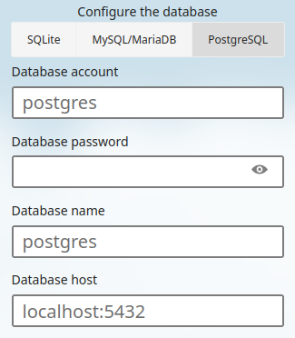

# Introduction

!!! note "Note"

    This document represents expanded content from its [parent document found here](../../gemstones/containers/podman.md). If you need a quick how-to, that parent document may suffice. 

[Podman](https://podman.io/) (Pod Manager) is a container and image management tool compatible with the [OCI](https://opencontainers.org/) (Open Container Initiative).

Podman:

* works without a daemon (it can run containers as a `systemd` service)
* allows you to manage containers as an unprivileged user (no need to be root)
* included, unlike docker, in the Rocky Linux repositories

That makes Podman not only a docker-compatible alternative container runtime but much more.

## Install Podman

Use the `dnf` utility to install Podman:

```bash
dnf install podman
```

You can retrieve the list of available Podman subcommands with the following command:

```bash
$ podman --help

Manage pods, containers and images

Usage:
  podman [options] [command]

Available Commands:
  attach      Attach to a running container
  auto-update Auto update containers according to their auto-update policy
...
```

Here is a non-exhaustive list of the most commonly used subcommands:

| Subcommand  | Description                                                     |
| ----------- | --------------------------------------------------------------- |
| `build`     | Builds an image using instructions from Containerfiles          |
| `commit`    | Creates a new image based on the changed container              |
| `container` | Manages containers                                               |
| `cp`        | Copies files/folders between a container and the local filesystem |
| `create`    | Creates but does not start a container                             |
| `exec`      | Runs a process in a running container                            |
| `image`     | Manages images                                                   |
| `images`    | Lists images in local storage                                    |
| `info`      | Displays Podman system information                               |
| `init`      | Initializes one or more containers                               |
| `inspect`   | Displays the configuration of the object denoted by ID               |
| `kill`      | Kills one or more running containers with a specific signal      |
| `login`     | Logs in to a container registry                                  |
| `logs`      | Fetches the logs of one or more containers                        |
| `network`   | Manages networks                                                 |
| `pause`     | Pauses all the processes in one or more containers               |
| `ps`        | Lists containers                                                 |
| `pull`      | Pulls an image from a registry                                   |
| `push`      | Pushes an image to a specified destination                        |
| `restart`   | Restarts one or more containers                                  |
| `rm`        | Removes one or more containers                                   |
| `rmi`       | Removes one or more images from local storage                    |
| `run`       | Runs a command in a new container                                |
| `start`     | Starts one or more containers                                    |
| `stats`     | Displays a live stream of container resource usage statistics    |
| `stop`      | Stops one or more containers                                     |
| `system`    | Manages Podman                                                   |
| `top`       | Displays the running processes of a container                    |
| `unpause`   | Unpauses the processes in one or more containers                 |
| `volume`    | Manages volumes                                                  |

!!! note "Note"

    Podman can run almost any Docker command thanks to its similar CLI interface.

If you need to use a compose file, remember to install the `podman-compose` package:

```bash
dnf install podman-compose
```

## Adding a container

Run a [Nextcloud](https://nextcloud.com/) self-hosted cloud platform as an example:

```bash
podman run -d -p 8080:80 nextcloud
```

You will receive a prompt to select the container registry to download from. In our example, you will use `docker.io/library/nextcloud:latest`.

Once you have downloaded the Nextcloud image, it will run.

Enter **ip_address:8080** in your web browser (assuming you opened the port in `firewalld`) and set up Nextcloud:


## Running containers as `systemd` services

### Using `quadlet`

Since 4.4 Podman ships with [Quadlet](https://docs.podman.io/en/latest/markdown/podman-systemd.unit.5.html) – a systemd generator. It can be used to generate unit files for rootless and rootful systemd services.

Quadlet files for rootful services can be placed in 

- `/etc/containers/systemd/`
- `/usr/share/containers/systemd/`

while rootless files can be placed in either of

- `$XDG_CONFIG_HOME/containers/systemd/` or `~/.config/containers/systemd/`
- `/etc/containers/systemd/users/$(UID)`
- `/etc/containers/systemd/users/`

While, aside from single containers, pod, image, network, volume and kube files are supported, let's focus on our Nextcloud example. Create a new file `~/.config/containers/systemd/nextcloud.cotainer` with the following content:

```systemd
[Container]
Image=nextcloud
PublishPort=8080:80
```

A [lot of other options](https://docs.podman.io/en/latest/markdown/podman-systemd.unit.5.html#container-units-container) are available.

To run the generator and let systemd know that there is a new service run:

```bash
systemctl --user daemon-reload
```

To now run your service run:

```bash
systemctl --user start nextcloud.service
```

!!! note "Note"

    If you created a file in one of the directories for rootful services, omit the `--user` flag.

To automatically run the container upon system start or user login, you can add another section to your `nextcloud.container` file:

```systemd
[Install]
WantedBy=default.target
```

Then let the generator run again, and enable your service:

```bash
systemctl --user daemon-reload;
systemctl --user enable nextcloud.service;
```

Other file types are supported: pod, volume, network, image and kube. [Pods](https://docs.podman.io/en/latest/markdown/podman-systemd.unit.5.html#pod-units-pod) for instance can be used to group containers – the generated systemd services and theirs dependencies (create the pod before the containers) are automatically managed by systemd.

### Using `podman generate systemd`

Podman additionally provides the `generate systemd` subcommand. It can be used to generate `systemd` service files. 

!!! warning "Warning"

    `generate systemd` is now deprecated and will not receive further features. Usage of Quadlet is recommended.

Let us now do it with Nextcloud. Run:

```bash
podman ps
```

You will get a list of running containers:

```bash
04f7553f431a  docker.io/library/nextcloud:latest  apache2-foregroun...  5 minutes ago  Up 5 minutes  0.0.0.0:8080->80/tcp  compassionate_meninsky
```

As seen above, our container's name is `compassionate_meninsky`.

To make a `systemd` service for the Nextcloud container and enable it on reboot, run the following:

```bash
podman generate systemd --name compassionate_meninsky > /usr/lib/systemd/system/nextcloud.service
systemctl enable nextcloud
```

Replace `compassionate_meninsky` with your container's assigned name.

When your system reboots, Nextcloud will restart in Podman.

## Containerfiles

A Containerfile is a file used by Podman  to create container images. Containerfiles use the same syntax as Dockerfiles, so you can build your container images with Podman like you would with Docker.

### Web server from a Containerfile

You will create an `httpd` server based on a RockyLinux 9.

Create a folder dedicated to our image:

```bash
mkdir myrocky && cd myrocky
```

Create an `index.html` file that will run in our web server:

```bash
echo "Welcome to Rocky" > index.html
```

Create a `Containerfile` file with the following content:

```text
# Use the latest rockylinux image as a start
FROM rockylinux:9

# Make it uptodate
RUN dnf -y update
# Install and enable httpd
RUN dnf -y install httpd
RUN systemctl enable httpd
# Copy the local index.html file into our image
COPY index.html /var/www/html/

# Expose the port 80 to the outside
EXPOSE 80

# Start the services
CMD [ "/sbin/init" ]
```

You are ready to build our image called `myrockywebserver`:

```bash
$ podman build -t myrockywebserver .

STEP 1/7: FROM rockylinux:9
Resolved "rockylinux" as an alias (/etc/containers/registries.conf.d/000-shortnames.conf)
Trying to pull docker.io/library/rockylinux:9...
Getting image source signatures
Copying blob 489e1be6ce56 skipped: already exists
Copying config b72d2d9150 done
Writing manifest to image destination
STEP 2/7: RUN dnf -y update
Rocky Linux 9 - BaseOS                          406 kB/s | 2.2 MB     00:05    
Rocky Linux 9 - AppStream                       9.9 MB/s | 7.4 MB     00:00    
Rocky Linux 9 - Extras                           35 kB/s |  14 kB     00:00    
Dependencies resolved.
================================================================================
 Package                   Arch      Version                 Repository    Size
================================================================================
Upgrading:
 basesystem                noarch    11-13.el9.0.1           baseos       6.4 k
 binutils                  x86_64    2.35.2-42.el9_3.1       baseos       4.5 M
...
Complete!
--> 2e8b93d30f31
STEP 3/7: RUN dnf -y install httpd
Last metadata expiration check: 0:00:34 ago on Wed Apr  3 07:29:56 2024.
Dependencies resolved.
================================================================================
 Package                Arch       Version                  Repository     Size
================================================================================
Installing:
 httpd                  x86_64     2.4.57-5.el9             appstream      46 k
...
Complete!
--> 71db5cabef1e
STEP 4/7: RUN systemctl enable httpd
Created symlink /etc/systemd/system/multi-user.target.wants/httpd.service → /usr/lib/systemd/system/httpd.service.
--> 423d45a3cb2d
STEP 5/7: COPY index.html /var/www/html/
--> dfaf9236ebae
STEP 6/7: EXPOSE 80
--> 439bc5aee524
STEP 7/7: CMD [ "/sbin/init" ]
COMMIT myrockywebserver
--> 7fcf202d3c8d
Successfully tagged localhost/myrockywebserver:latest
7fcf202d3c8d059837cc4e7bc083a526966874f978cd4ab18690efb0f893d583
```

 You can run your Podman image and confirm that it started:

```bash
$ podman run -d --name rockywebserver -p 8080:80 localhost/myrockywebserver
282c09eecf845c7d9390f6878f9340a802cc2e13d654da197d6c08111905f1bd

$ podman ps
CONTAINER ID  IMAGE                              COMMAND     CREATED         STATUS         PORTS                 NAMES
282c09eecf84  localhost/myrockywebserver:latest  /sbin/init  16 seconds ago  Up 16 seconds  0.0.0.0:8080->80/tcp  rockywebserver
```

You launched your Podman image in daemon mode (`-d`) and named it `rockywebserver` (option `--name`).

You redirected port 80 (protected) to port 8080 with the `-p` option. See if the port is listening with:

```bash
ss -tuna | grep "*:8080"
tcp   LISTEN    0      4096                *:8080             *:*
```

Verify that the `index.html` file is accessible:

```bash
$ curl http://localhost:8080
Welcome to Rocky
```

Congratulations! You can now stop and destroy your running image, giving the name you provided during creation:

```bash
podman stop rockywebserver && podman rm rockywebserver
```

!!! tip "Tip"

    You can add the `--rm` switch to automatically delete the container once it stopps.

If you relaunch the build process, `podman` will use a cache at each step of the build:

```bash
$ podman build -t myrockywebserver .

STEP 1/7: FROM rockylinux:9
STEP 2/7: RUN dnf -y update
--> Using cache 2e8b93d30f3104d77827a888fdf1d6350d203af18e16ae528b9ca612b850f844
--> 2e8b93d30f31
STEP 3/7: RUN dnf -y install httpd
--> Using cache 71db5cabef1e033c0d7416bc341848fbf4dfcfa25cd43758a8b264ac0cfcf461
--> 71db5cabef1e
STEP 4/7: RUN systemctl enable httpd
--> Using cache 423d45a3cb2d9f5ef0af474e4f16721f4c84c1b80aa486925a3ae2b563ba3968
--> 423d45a3cb2d
STEP 5/7: COPY index.html /var/www/html/
--> Using cache dfaf9236ebaecf835ecb9049c657723bd9ec37190679dd3532e7d75c0ca80331
--> dfaf9236ebae
STEP 6/7: EXPOSE 80
--> Using cache 439bc5aee524338a416ae5080afbbea258a3c5e5cd910b2485559b4a908f81a3
--> 439bc5aee524
STEP 7/7: CMD [ "/sbin/init" ]
--> Using cache 7fcf202d3c8d059837cc4e7bc083a526966874f978cd4ab18690efb0f893d583
COMMIT myrockywebserver
--> 7fcf202d3c8d
Successfully tagged localhost/myrockywebserver:latest
7fcf202d3c8d059837cc4e7bc083a526966874f978cd4ab18690efb0f893d583
```

You can clear that cache with the `prune` subcommand:

```bash
podman system prune -a -f
```

| Options     | Description                                             |
| ----------- | ------------------------------------------------------- |
| `-a`        | Removes all unused data, not only the external to Podman |
| `-f`        | No prompt for confirmation                              |
| `--volumes` | Prune volumes                                           |

## Pods

Pods are a way to group container together. Containers in a pod share some settings, like mounts, ressource allocations or port mappings. 

In Podman, pods are managed using the `podman pod` subcommand, which is quite simmilar to a lot of the Podman commands to control containers:

| Command | Description                                                                       |
|--       |--                                                                                 |
| clone   | Create a copy of an existing pod.                                                 |
| create  | Create a new pod.                                                                 |
| exists  | Check if a pod exists in local storage.                                           |
| inspect | Display information describing a pod.                                             |
| kill    | Kill the main process of each container in one or more pods.                      |
| logs    | Display logs for pod with one or more containers.                                 |
| pause   | Pause one or more pods.                                                           |
| prune   | Remove all stopped pods and their containers.                                     |
| ps      | Print out information about pods.                                                 |
| restart | Restart one or more pods.                                                         |
| rm      | Remove one or more stopped pods and containers.                                   |
| start   | Start one or more pods.                                                           |   
| stats   | Display a live stream of resource usage stats for containers in one or more pods. |
| stop    | Stop one or more pods.                                                            |
| top     | Display the running processes of containers in a pod.                             |
| unpause | Unpause one or more pods.                                                         |

Containers grouped into a pod can access each over by using localhost. This is usefull, for instance when setting up a Nextcloud with a dedicated database like postgres. Nextcloud can access the database, but the database does not need to be accessible from outside the containers.

To create a pod containing Nextcloud and a dedicated database run:

```bash
# Create the pod with a port mapping
podman pod create --name nextcloud -p 8080:80

# Add a Nextcloud container to the pod – the port mapping must not be specified again!
podman create --pod nextcloud --name nextcloud-app nextcloud

# Add a Postgres database. This container has a postgres specific environment variable set.
podman create --pod nextcloud --name nextcloud-db -e POSTGRES_HOST_AUTH_METHOD=trust postgres
```

To run you newly created pod run:

```bash
podman pod start nextcloud
```

You can now setup Nextcloud using a local database:


