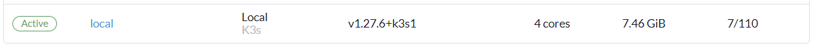
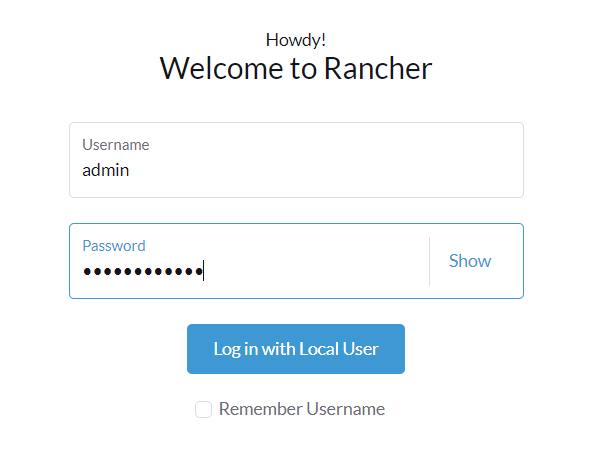
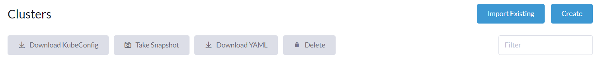
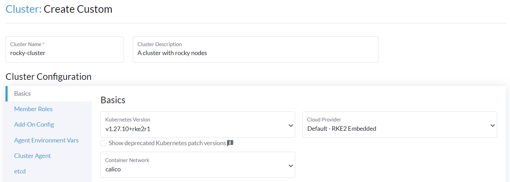
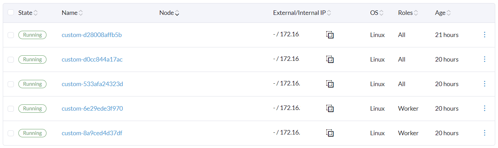

# Working with Rancher and Kubernetes

**Kubernetes** (**K8s**) is an open-source container orchestration system for managing the deployment and management of containerized applications.

K8S has made a name for itself on the market, so there's really no need to introduce it anymore.

Cloud providers have made it easy to deploy managed Kubernetes platforms, but what about setting up and managing an on-premises cluster?

How easy is it to manage multiple clusters, whether on-premise or multi-cloud?

The last two questions can be answered in the negative... No, setting up an on-premise cluster isn't easy, and managing a multi-cloud cluster can be a real headache.

That's where the subject of this guide comes in: **Rancher**! Rancher is also an open-source system, enabling the installation and orchestration of several multi-cloud or on-premise clusters, and providing interesting features such as an application catalog and a practical web interface for visualizing resources.

Rancher will enable you to deploy kubernetes clusters managed by cloud providers, import existing kubernetes clusters or deploy K3S (for short, it's a lighter version of K8S) or K8S clusters.

This guide will help you discover Rancher, install and start it, and then create an on-premise kubernetes cluster deployed on RockyLinux servers.

## Rancher deployment

Installing Rancher is quite trivial, as long as you have docker installed on your server.

Docker installation is covered by the gemstone [docker installation](./gemstones/docker/).

To run on a Rocky 9, rancher will also require modules to be loaded.

One way of ensuring that the necessary modules are loaded during system startup is to create a `/etc/modules-load.d/rancher.conf` file with the following contents:

```text
ip_tables
ip_conntrack
iptable_filter
ipt_state
```

And the easiest way to apply that changes is to reboot the server: `sudo reboot`.

Once rebooted, you can ensure the modules are loaded thanks to the `lsmod | grep <module_name>` command.

We now have a system ready to receive the rancher container:

```bash
docker pull rancher/rancher:latest
docker run -d --name=rancher --privileged --restart=unless-stopped -p 80:80 -p 443:443 rancher/rancher:latest
```

!!! NOTE

    If you're curious, have a look at the new container's logs. You'll see that a K3S cluster (with a single node) has just been created! This is how rancher works in its standalone version.

    

As Rancher listens on port 443, open your firewall to allow access from the outside:

```bash
firewall-cmd --permanent --zone=public --add-service=https
firewall-cmd --zone=public --add-service=https
```

If you go to the newly deployed rancher web interface, a message will inform you how to retrieve the admin administrator password which is present in your container logs.

To do this, launch the following command:

```bash
docker logs rancher  2>&1 | grep "Bootstrap Password:"
```

You are ready to connect to the Rancher's webUI.



!!! NOTE

    This solution is by no means production-ready. You'll need to make sure the system is highly available, but it's a good start. Consider deploying Rancher on an existing K8S cluster for optimal HA.

## Kubernetes on RockyLinux 9 servers

Rancher offers its own docker-based version of Kubernetes: RKE (Rancher Kubernetes Engine).

All you need is several RockyLinux servers and the [Docker engine](./gemstones/docker/) installed on them.

Don't forget that one of the requirements of kubernetes is to have an odd number of master nodes (1 or 3, for example). For the purposes of our tests, I propose to start with 3 master nodes and 2 additional nodes with only the worker role.

Once Docker is installed on the servers, stop firewalld and run nftables on each servers:

```bash
systemctl stop firewalld
systemctl disable firewalld
systemctl start nftables
systemctl enable nftables
```

We are ready for our cluster creation.

### Cluster creation

In the cluster management area, create a new cluster:



You are free to create a cluster in a hosted Kubernetes provider, provision new nodes and create a cluster using RKE2/K3s, or, and that is our case, use existing nodes and create a cluster using RKE2/K3s.

Choose the last option.

Enter a cluster name and description.

Take your time to discover the various options available before launching cluster creation.



Once the cluster has been created, go to the Registration tab to add our servers:


First, select the various roles of the node you are adding and copy the necessary command line. If your cluster uses a self-signed certificate, check the appropriate box.

Go to the node you wish to add to the configuration and paste the command you copied earlier.

After a few minutes, the server will be added to the cluster, and if it's the first server and has all the roles, the cluster will become available in the web interface.

Once you've added the 5 servers, you should get a result similar to this one:



## Conclusion

Congratulations! You've installed your first kubernetes cluster in just a few minutes/hours, thanks to Rancher's features.

If you're new to kubernetes, you can already be proud of yourself: you're on the right track. You now have everything you need to continue your discovery of kubernetes.
