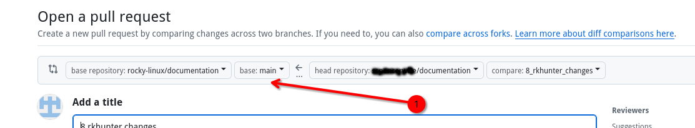
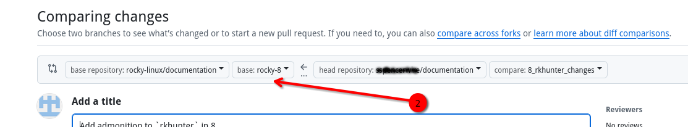

## Einleitung

Im Frühherbst 2025 wechselte das Dokumentationsteam von einer einzigen, alle Versionen umfassenden Dokumentationsversion zu einer Version mit einem eigenen Dokumentationszweig für jede Version. Dadurch können die Anweisungen der einzelnen Versionen leichter unterschieden werden. Es _erschwert_ jedoch den Prozess des Schreibens oder Korrigierens der Dokumentation, insbesondere wenn es sich um eine der älteren Versionen (Rocky Linux 8 oder 9) handelt. Dieses Dokument beschreibt eine Strategie zur Bewältigung des Prozesses mithilfe eines doppelten Remote-Ansatzes.

!!! info "Rocky Linux Versionen"

    Zum heutigen Datum, Oktober 2025, lauten die Versionen wie folgt:
    
    | Branch | Version |
    |--------|---------|
    | main   | Rocky Linux 10 |
    | rocky-9 | Rocky Linux 9 |
    | rocky-8 | Rocky Linux 8 |

## Voraussetzungen

- Ein persönliches GitHub-Konto mit [bereits verwendeten SSH-Schlüsseln](https://docs.github.com/en/authentication/connecting-to-github-with-ssh/adding-a-new-ssh-key-to-your-github-account)
- Ein bestehender Fork der Rocky Linux-Dokumentation
- Ein wenig Wissen über die Verwendung von `git` auf der Kommandozeile oder die Bereitschaft, dies kennen zu lernen
- Das Dienstprogramm `git` bereits installiert

## Repository klonen

Durch das Klonen des Rocky Linux-Repository wird eine Kopie der Rocky Linux-Dokumentation in ein Verzeichnis `/documentation` auf Ihrer Workstation aufgesetzt. Möglicherweise haben Sie irgendwann oder bei anderen GitHub-Projekten gelesen, dass Sie immer von Ihrem persönlichen Fork des Projekts klonen sollen. In diesem Fall ist dies nicht der Fall, damit Ihr Klon die vorhandenen RL-Versionen der Dokumentation verwalten kann. Sie werden vom Rocky Linux-Projekt klonen. In diesem Artikel erfahren Sie, warum das so ist. Darüber hinaus müssen Sie Ihre Git-Remotes umbenennen, damit sie logisch Sinn ergeben (Rocky Linux `upstream` und Ihr GitHub `origin`).

1. Klonen Sie die Rocky Linux-Dokumentation:

    ```bash
    git clone git@github.com:rocky-linux/documentation.git
    ```

2. Wechseln Sie in das Verzeichnis `/documentation`:

    ```bash
    cd documentation
    ```

3. Überprüfen Sie den Remote-Namen:

    ```bash
    git remote -v
    ```

   Dies wird folgendes Ergebnis liefern:

    ```bash
    origin git@github.com:rocky-linux/documentation.git (fetch)
    origin git@github.com:rocky-linux/documentation.git (push)
    ```

   Sie werden diese Ressource auf `upstream` und nicht `origin` setzen.

4. Ändern des Remote-Namens

    ```bash
    git remote rename origin upstream
    ```

   Wenn Sie `git remote -v` erneut ausführen, wird nun Folgendes angezeigt:

    ```bash
    upstream git@github.com:rocky-linux/documentation.git (fetch)
    upstream git@github.com:rocky-linux/documentation.git (push)
    
    ```

## Ihr `fork` als Remote hinzufügen

Nachdem Sie die Rocky Linux-Remote nun hinzugefügt und richtig benannt haben, müssen Sie Ihren eigenen persönlichen GitHub-Fork als
`origin remote` hinzufügen.

1. Für diesen Schritt müssen Sie Ihren GitHub-Benutzernamen kennen, den Sie bereits besitzen sollten. Ersetzen Sie das Feld `[username]` durch den richtigen Namen. Fügen Sie Ihr `remote` hinzu:

    ```bash
    git remote add origin git@github.com:[username]/documentation.git
    ```

2. Überprüfen Sie Ihre Git-Remotes:

    ```bash
    git remote -v
    ```

   Dies wird folgendes Ergebnis liefern:

    ```bash
    origin git@github.com:[username]/documentation.git (fetch)
    origin git@github.com:[username]/documentation.git (push)
    upstream git@github.com:rocky-linux/documentation.git (fetch)
    upstream git@github.com:rocky-linux/documentation.git (push)
    ```

## Suchen Sie nach Updates und fügen Sie die Versionszweige zu Ihrem Fork hinzu

1. Nachdem Sie die Remotes hinzugefügt haben, beginnen Sie damit, alle Updates vom Upstream abzurufen und sie zum Ursprung zu übertragen. Wenn Sie gerade Ihren Fork und Ihre Remotes erstellt haben, müssen keine Updates gepusht werden. Es ist jedoch eine gute Idee, mit Folgendem zu beginnen:

    ```bash
    git pull upstream main && git push origin main
    ```

2. Schauen Sie sich einen der beiden älteren Versionszweige an:

    ```bash
    git checkout rocky-8
    ```

       !!! warning "Dies funktioniert nicht, wenn Ihr Klon von Ihrem Fork stammt"

        ```
         Aus diesem Grund wird der Klonvorgang von Rocky Linux und nicht von Ihrem Fork aus durchgeführt. Ihr Fork kennt die älteren Zweige nicht. Um die folgende Meldung zu erhalten, *müssen* Sie Ihr lokales Dokumentations-Repository von Rocky Linux aus klonen. 
        ```

   Wenn Sie Ihre `remotes` richtig eingerichtet haben, sollten Sie jetzt Folgendes sehen:

    ```bash
    branch 'rocky-8' set up to track 'upstream/rocky-8'.
    Switched to a new branch 'rocky-8'
    ```

   Dadurch wird effektiv ein lokaler Zweig `rocky-8` erstellt. Ihr nächster Schritt besteht darin, alle Änderungen von `rocky-8` abzurufen und sie an Ihren `origin` zu übertragen. Es sollten keine lokalen Änderungen vorgenommen werden, aber der Zweig ist auf Ihrem Fork nicht vorhanden, daher wird er durch diesen Prozess erstellt:

    ```bash
    git pull upstream rocky-8 && git push origin rocky-8
    ```

   Sie erhalten wahrscheinlich eine Art Nachricht, dass Sie aus dem Push ein Pull-Request erstellen können. Sie können dies ignorieren. Was passiert ist, ist, dass Ihr Fork jetzt einen `rocky-8`-Branch hat.

3. Schauen Sie sich den verbleibenden älteren Zweig an. (`rocky-9`) und wiederholen Sie die Schritte, die Sie gerade mit diesem Zweig ausgeführt haben.

Nach Abschluss verfügen Sie nun über die Zweige `main`, `rocky-8` und `rocky-9` auf Ihrem lokalen Fork und Klon und können Dokumentationen zu jedem dieser Zweige schreiben.

## Schreiben eines Dokuments oder Aktualisieren eines vorhandenen Dokuments auf einer älteren Version

Wenn Sie mit dem Schreiben eines Pull Requests (PR) für den `main`-Branch der Dokumentation vertraut sind, funktioniert dieser Vorgang weiterhin wie immer. Denken Sie daran, dass `main` für die neueste Version steht (10 zum Zeitpunkt —2025-10-19— des Schreibens dieses Artikels). Um eine kleine Änderung an einer der älteren Versionen vorzunehmen, müssen Sie zunächst einen Zweig zur lokalen Bearbeitung basierend auf diesem Zweig erstellen. Verwenden Sie dazu die Option `-b` mit Ihrem Befehl `git checkout`. Dieser Befehl erstellt einen Zweig namens `8_rkhunter_changes` und basiert auf dem Zweig `rocky-8`:

```bash
git checkout -b 8_rkhunter_changes rocky-8
```

Sie können jetzt die Datei bearbeiten, an der Sie Änderungen vornehmen möchten. Dabei wird die Version des Dokuments verwendet, die im Zweig `rocky-8` vorhanden ist.

Wenn Sie mit der Bearbeitung fertig sind, speichern, inszenieren und übernehmen Sie Ihre Änderungen wie gewohnt und übertragen Sie sie dann auf Ihr `origin`-Remote:

```bash
git push origin 8_rkhunter_changes
```

Wenn Sie den PR erstellen, geht GitHub jedoch automatisch davon aus, dass Sie einen PR erstellen, um den Zweig `main` zu ändern, obwohl Sie beim Ändern des Dokuments ausdrücklich den Zweig `rocky-8` verwendet haben. Achten Sie darauf, den PR nicht zu schnell zu erstellen, wenn Sie diesen falschen Vergleichsbildschirm sehen:



Was Sie hier tun müssen, ist, den Vergleichszweig in den richtigen Zweig (in diesem Fall `rocky-8`) zu ändern:



Fahren Sie nach der Korrektur des Vergleichszweigs mit der Erstellung des PR fort und warten Sie dann auf die Zusammenführung Ihres PR.

## Aktualisieren Ihrer älteren Versionszweige nach einer Zusammenführung

Genau wie beim `main`-Zweig ist es eine gute Idee, Ihre älteren Versionszweige mit allen Änderungen auf dem neuesten Stand zu halten. Der folgende Befehlssatz aktualisiert _alle_ Ihre Versionen, sodass sie mit dem `upstream` übereinstimmen:

```bash
git checkout rocky-8
git pull upstream rocky-8 && git push origin rocky-8
git checkout rocky-9
git pull upstream rocky-9 && git push origin rocky-9
git checkout main
git pull upstream main && git push origin main
```

Nach Abschluss dieser Befehle sind alle Ihre lokalen Branches und Ihr Fork aktuell.

## Fazit

Dieses Dokument führt Sie durch eine doppelte Remote-Strategie für den Umgang mit neuen Dokumenten oder Korrekturen seit der Erstellung von Dokumentation-Versionen.
