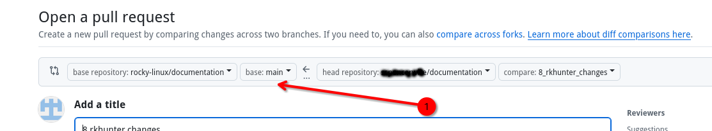
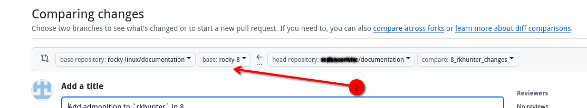

## Вступ

На початку осені 2025 року команда документації перейшла від однієї версії документації, яка охоплювала всі версії, до того, що кожна версія мала власну гілку документації. Це спрощує розрізнення інструкцій між версіями. Однак це _дійсно_ ускладнює процес написання або виправлення документації, особливо якщо вона стосується старішої версії (Rocky Linux 8 або 9). У цьому документі окреслено стратегію обробки процесу з використанням подвійного віддаленого підходу.

!!! info "Версії Rocky Linux"

    Станом на цю дату, жовтень 2025 року, версії такі:
    
    | Гілка | Версія |
    |--------|---------|
    | main   | Rocky Linux 10 |
    | rocky-9 | Rocky Linux 9 |
    | rocky-8 | Rocky Linux 8 |

## Передумови

- Особистий обліковий запис GitHub з [ключами SSH, які вже використовуються] (https://docs.github.com/en/authentication/connecting-to-github-with-ssh/adding-a-new-ssh-key-to-your-github-account)
- Існуючий форк документації Rocky Linux
- Невеликі знання про використання `git` у командному рядку або бажання навчатися
- Встановлено утиліту `git`

## Клонування репозиторію

Клонування репозиторію Rocky Linux переміщує копію документації Rocky Linux на вашу робочу станцію в каталог `/documentation`. Можливо, ви колись читали або в інших проектах GitHub, що завжди слід клонувати з вашого особистого форку проекту. У цьому випадку, щоб ваш клон був версійно-залежним, це не так. Ви хочете клонувати з проекту Rocky Linux. У цьому документі буде пояснено, чому це так, по ходу справи. Крім того, вам потрібно буде перейменувати ваші віддалені git, щоб вони мали логічний сенс (Rocky Linux "upstream", а ваш GitHub "origin").

1. Клонуйте документацію Rocky Linux:

    ```bash
    git clone git@github.com:rocky-linux/documentation.git
    ```

2. Перейдіть до каталогу `/documentation`:

    ```bash
    cd documentation
    ```

3. Перевірте ім'я віддаленого пристрою:

    ```bash
    git remote -v
    ```

   Це покаже:

    ```bash
    origin git@github.com:rocky-linux/documentation.git (fetch)
    origin git@github.com:rocky-linux/documentation.git (push)
    ```

   Ви хочете, щоб цей ресурс був "вище за течією", а не "походженням".

4. Змінити назву віддаленого репозиторію

    ```bash
    git remote rename origin upstream
    ```

   Повторний запуск команди `git remote -v` тепер покаже:

    ```bash
    upstream git@github.com:rocky-linux/documentation.git (fetch)
    upstream git@github.com:rocky-linux/documentation.git (push)
    
    ```

## Додавання вашого форку як віддаленого репозиторію

Після додавання та відповідної назви пульта Rocky Linux вам потрібно встановити ваш особистий форк GitHub як пульт origin.

1. Для цього кроку вам потрібно буде знати своє ім'я користувача GitHub, яке ви вже повинні знати. Замініть поле "[username]" правильним іменем. Додайте свій віддалений репозиторій:

    ```bash
    git remote add origin git@github.com:[username]/documentation.git
    ```

2. Перевірте свої віддалені репозиторії Git:

    ```bash
    git remote -v
    ```

   Це покаже:

    ```bash
    origin git@github.com:[username]/documentation.git (fetch)
    origin git@github.com:[username]/documentation.git (push)
    upstream git@github.com:rocky-linux/documentation.git (fetch)
    upstream git@github.com:rocky-linux/documentation.git (push)
    ```

## Перевірка оновлень та додавання гілок версій до вашого fork

1. Після додавання віддалених серверів, отримайте будь-які оновлення з основного ресурсу та надішліть їх до джерела. Якщо ви щойно створили свою форку та пульти, то оновлень для надсилання не буде, але гарною ідеєю буде почати з цього:

    ```bash
    git pull upstream main && git push origin main
    ```

2. Повідомте свій локальний клон про гілки, що існують у `upstream`, за допомогою:

    ```bash
    git fetch upstream
    ```

3. Перегляньте одну з двох гілок старіших версій:

    ```bash
    git checkout rocky-8
    ```

       !!! warning "Це не працює, якщо ваш клон був з вашого fork."

        ```
         Ось чому процес клонування виконується з Rocky Linux, а не з вашого fork. Ваш fork не знатиме про старіші гілки. Щоб отримати наступне повідомлення, вам *потрібно* клонувати ваш локальний репозиторій документації з Rocky Linux. 
        ```

   Якщо ви правильно налаштували пульти дистанційного керування, тепер ви повинні побачити:

    ```bash
    branch 'rocky-8' set up to track 'upstream/rocky-8'.
    Switched to a new branch 'rocky-8'
    ```

   Це фактично створює локальну гілку `rocky-8`. Ваш наступний крок — витягнути будь-які зміни з «rocky-8» та перенести їх до вашого початкового каталогу. Локально змін не повинно бути, але гілка не існує на вашому fork, тому цей процес її створить:

    ```bash
    git pull upstream rocky-8 && git push origin rocky-8
    ```

   Ви, ймовірно, отримаєте повідомлення про те, що можете створити пул-реквест з push-повідомлення. Ви можете це ігнорувати. Сталося так, що ваш fork тепер має гілку `rocky-8`.

4. Перевірте решту старої гілки. (`rocky-9`) та повторіть кроки, які ви щойно виконали з цією гілкою.

Після завершення у вас будуть гілки `main`, `rocky-8` та `rocky-9` на вашому локальному форку та клоні, і ви зможете писати документацію для будь-якої з цих гілок.

## Написання документа або оновлення існуючого документа у старішій версії

Якщо ви знайомі з написанням запитів на зміщення (PR) для гілки `main` документації, цей процес все ще працює як завжди. Просто пам’ятайте, що `main` призначений для найновішої версії (10 на момент написання цієї статті). Щоб внести невелику зміну в одну зі старіших версій, спочатку потрібно створити гілку для локального редагування на основі цієї гілки. Для цього використовуйте опцію `-b` з вашою командою `git checkout`. Ця команда створює гілку під назвою `8_rkhunter_changes` та базує її на гілці `rocky-8`:

```bash
git checkout -b 8_rkhunter_changes rocky-8
```

Тепер ви можете редагувати файл, який хочете змінити, і буде використано версію цього документа з гілки `rocky-8`.

Після завершення редагування збережіть, підготуйте та зафіксуйте зміни як завжди, а потім надішліть їх на ваш віддалений сервер `origin`:

```bash
git push origin 8_rkhunter_changes
```

Однак, коли ви створюєте PR, GitHub автоматично розглядатиме його як зміну в гілці `main`, навіть якщо ви використовували гілку `rocky-8` для модифікації документа. Будьте обережні, щоб не створювати PR занадто швидко, коли бачите цей неправильний екран порівняння:



Що вам тут потрібно зробити, це змінити гілку порівняння на правильну (у цьому випадку `rocky-8`):



Після виправлення гілки порівняння продовжуйте створення PR та зачекайте на її об'єднання.

## Оновлення гілок старішої версії після злиття

Як і у випадку з гілкою `main`, гарною ідеєю буде оновлювати гілки старішої версії з урахуванням будь-яких змін. Наступний набір команд оновить _всі_ ваші версії, щоб вони відповідали версії основної розробки:

```bash
git checkout rocky-8
git pull upstream rocky-8 && git push origin rocky-8
git checkout rocky-9
git pull upstream rocky-9 && git push origin rocky-9
git checkout main
git pull upstream main && git push origin main
```

Після виконання цих команд усі ваші локальні гілки та ваш форк будуть оновлені.

## Висновок

У цьому документі описано стратегію подвійного віддаленого керування для роботи з новими документами або виправленнями з моменту створення версій документів.
