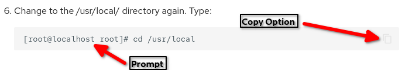

## Introduzione

Questa guida mette in evidenza le opzioni di formattazione più avanzate, tra cui ammonizioni, elenchi numerati, tabelle e altro ancora.

Un documento può contenere o meno uno di questi elementi. Tuttavia, se ritenete che il vostro documento possa beneficiare di una formattazione speciale, questa guida dovrebbe aiutarvi.

!!! note "Una nota sulle Intestazioni"

    I titoli non sono caratteri di formattazione speciali, ma sintassi markdown standard. Includono una **singola** voce di primo livello:

    ```
    # Questo è il Primo Livello
    ```


    E un numero qualsiasi di valori di sottotitolo, livelli da 2 a 6:

    ```
    ## Un livello 2 heading
    ### Un livello 3 heading
    #### Un livello 4 heading
    ##### Un livello 5 heading
    ###### Un livello 6 heading
    ```


    La chiave è che si possono usare tutti i titoli dal 2 al 6, ma solo **UNO** di livello 1. Mentre il documento viene visualizzato correttamente con più di un'intestazione di livello 1, l'indice generato automaticamente per il documento, che appare sul lato destro, **NON** viene visualizzato correttamente (o talvolta per niente) con più di un'intestazione. Tienilo a mente quando scrivi i tuoi documenti.
    
    Un'altra nota importante sull'intestazione del livello 1: Se è in uso il meta `title:`, questo sarà l'intestazione predefinita del livello 1. Non è il caso di aggiungerne un altro. Un esempio è che il meta titolo di questo documento è:

    ```
    ---
    title: Document Formatting
    ```


    Il primo titolo aggiunto è quindi "Introduzione" al livello 2.

    ```
    ## Introduction
    ```

!!! warning "Una nota sugli elementi HTML supportati"

    Esistono elementi HTML che sono tecnicamente supportati in Markdown. Alcuni di questi sono descritti in questo documento e non esiste una sintassi Markdown per sostituirli. Questi tag HTML supportati dovrebbero essere usati raramente, poiché i linters markdown si lamenteranno della loro presenza in un documento. Per esempio:

    * Inline HTML [nome elemento]

    Se è necessario utilizzare un elemento HTML supportato, è possibile verificare se esiste un altro modo per scrivere il documento che non preveda l'uso di tali elementi. Se dovete usarli, è comunque consentito.

!!! info "Una nota sui link"

    I link non sono una formattazione speciale, ma metodi standard per fare riferimento ad altri documenti (link interni) o pagine web esterne. Tuttavia, esiste un tipo particolare di collegamento che non dovreste utilizzare quando scrivete documenti per Rocky Linux: un anchor, ovvero un collegamento a un punto all'interno dello stesso documento.
    
    Gli anchor funzionano nella lingua di origine di Rocky Linux (inglese), ma non appena vengono tradotti dalla nostra interfaccia Crowdin, smettono di funzionare in quelle lingue. Questo accade perché un anchor accettabile in markdown che non contiene elementi HTML utilizza l'intestazione per creare il link:

    ```
    ## A Header

    Some text

    A Link to [that header](#-a-header)
    ```


    Questo link si trova passando il mouse sul permalink in un documento creato ed è essenzialmente l'intestazione con il simbolo "#" più l'intestazione in minuscolo, separati da un trattino (-).
    
    Quando il documento viene tradotto, però, l'intestazione viene tradotta, MA il link non rientra tra gli elementi che Crowdin consente di tradurre, quindi rimane nella sua versione originale (inglese).
    
    Se è necessario utilizzare un'ancora, rivedere il documento per verificare se una riorganizzazione del contenuto la renda superflua. Sappiate che se utilizzate un ancora in un documento appena composto, tale ancora si interromperà una volta effettuata la traduzione del documento.

## Ammonimenti

Gli ammonimenti sono speciali "scatole" visive che richiamano l'attenzione su fatti importanti e li evidenziano. I seguenti sono tipi di ammonimenti:

| tipo       | Descrizione                                                                |
| ---------- | -------------------------------------------------------------------------- |
| note       | visualizza il testo in un riquadro blu                                     |
| abstract   | visualizza il testo in un riquadro azzurro                                 |
| info       | visualizza il testo in un riquadro blu-verde                               |
| tip        | visualizza il testo in un riquadro blu-verde (icona leggermente più verde) |
| success    | visualizza il testo in un riquadro verde                                   |
| question   | visualizza il testo in un riquadro verde chiaro                            |
| warning    | visualizza il testo in un riquadro arancione                               |
| failure    | visualizza il testo in un riquadro rosso chiaro                            |
| danger     | visualizza il testo in un riquadro rosso                                   |
| bug        | visualizza il testo in un riquadro rosso                                   |
| example    | visualizza il testo in un riquadro viola                                   |
| quote      | visualizza il testo in una casella grigia                                  |
| custom ^1^ | visualizza sempre il testo in un riquadro blu                              |
| custom ^2^ | visualizza il testo nel colore del riquadro della tipologia prescelta      |

Gli ammonimenti sono illimitati, come si può notare in custom <sub>1</sub> sopra. Per ottenere il colore del riquadro desiderato per un ammonimento specifica, aggiungete un titolo personalizzato a qualsiasi tipo di ammonimento, come indicato nella precedente sezione <sub>2</sub>.

Un'ammonimento viene sempre inserito in questo modo:

```text
!!! admonition_type "titolo personalizzato, se presente".

    testo dell'ammonimento
```

Il testo del corpo dell'ammonimento deve avere un rientro di quattro (4) spazi dal margine iniziale. È facile capire dove si trova, perché sarà sempre allineato sotto la prima lettera del tipo di ammonimento. La riga in più tra il titolo e il corpo non apparirà, ma il nostro motore di traduzione (Crowdin) ne ha bisogno per funzionare correttamente.

Ecco alcuni esempi di ogni tipo di ammonimento e il loro aspetto nel documento:

!!! note

    testo

!!! abstract

    testo

!!! info

    testo

!!! tip

    testo

!!! success

    testo

!!! question

    testo

!!! warning

    testo

!!! failure

    testo

!!! danger

    testo

!!! custom

    Un tipo custom^1^. Abbiamo usato " custom" come tipo di ammonimento. Di nuovo, questo risulterà sempre in blu.

!!! warning "titolo personalizzato"

    Un tipo custom^2^. Abbiamo modificato il tipo di ammonimento "warning" con un'intestazione personalizzata. Ecco come appare:

    ```
    !!! warning "titolo personalizzato"
    ```

### Ammonimenti espandibili

Se un'ammonizione è molto lunga, prendete in considerazione un'ammonizione espandibile. Ha le stesse caratteristiche di un ammonimento regolare, ma inizia con tre punti interrogativi, anziché con tre punti esclamativi. Si applicano tutte le altre regole degli ammonimenti. Un ammonimento espandibile assomiglia a questo:

??? warning "Avvertenze sul contenuto"

    Questo è un avviso con pochissimi contenuti. Per questo si dovrebbe usare un ammonimento normale, ma questo è solo un esempio!

Che si presenta così nell'editor:

```text
??? warning "Avvertenze sul contenuto"

    Si tratta di un avviso, con poco contenuto. Per questo si dovrebbe usare un ammonimento normale, ma questo è solo un esempio!
```

## Contenuto a schede all'interno di un documento

La formattazione dei contenuti a schede è simile a quella degli ammonimenti. Invece di tre punti esclamativi o interrogativi, inizia con tre segni uguale. Tutta la formattazione dell'ammonimento (4 spazi, ecc.) si applica a questo contenuto. Ad esempio, un documento potrebbe richiedere una procedura diversa a seconda di come è stato installato il sistema operativo. Con l'implementazione del controllo delle versioni della documentazione, la formattazione dei contenuti con schede non dovrebbe più essere necessaria per separare i contenuti delle versioni complete (ad esempio, 9.6 e 8.10).

=== "9"

    Utilizzare questa procedura se avete eseguito l'installazione con l'intero sistema operativo o un'immagine Live.

=== "9-minimal"

    Utilizzare questa procedura se avete installato il sistema operativo dall'ISO minimale.

Che si presenterebbe così nell'editor:

```text
=== “9”


    Utilizzare questa procedura se l'installazione è stata eseguita tramite il sistema operativo completo o da un'immagine Live.

=== “9-minimal”

    Utilizza questa procedura se il vostro sistema operativo è stato installato con l'ISO minimale.

```

Ricordate che tutto ciò che rientra nella sezione deve continuare a utilizzare il rientro di 4 spazi fino al completamento della sezione stessa. Questa è una funzione molto utile!

## Liste numerate

Gli elenchi numerati sembrano facili da creare e da usare e, una volta che ci si è abituati, lo sono. Se si dispone di un unico elenco di elementi senza alcuna complessità, questo tipo di formato va bene:

```text
1. Elemento 1

2. Elemento 2

3. Elemento 3
```

1. Elemento 1

2. Elemento 2

3. Elemento 3

Se è necessario aggiungere blocchi di codice, righe multiple o addirittura paragrafi di testo a un elenco numerato, il testo deve avere la stessa indentazione di quattro (4) spazi utilizzata negli ammonimenti.

Tuttavia, non è possibile allinearli con gli occhi sotto l'elemento numerato perché questo ha uno spazio in meno. Se si utilizza un buon editor di markdown, è possibile impostare il valore di tabulazione a quattro (4), rendendo più semplice la formattazione.

Ecco un esempio di elenco numerato a più righe, con un blocco di codice aggiunto per buona norma:

1. Quando si tratta di elenchi numerati a più righe che includono blocchi di codice o altri elementi, si può usare l'indentazione spaziale per ottenere ciò che si desidera.

    Ad esempio: questo ha un rientro di quattro (4) spazi e rappresenta un nuovo paragrafo di testo. Inoltre, aggiungiamo un blocco di codice all'interno. È anche rientrato degli stessi quattro (4) spazi del nostro paragrafo:

    ```bash
    dnf update
    ```

2. Ecco il nostro secondo articolo in elenco. Poiché è stato utilizzato un rientro di quattro (4) spazi (sopra), viene visualizzata la sequenza di numerazione successiva (2). Se si fosse inserito l'elemento 1 senza rientro (nel paragrafo e nel codice successivi), questo sarebbe apparso nuovamente come elemento 1, il che non è desiderabile.

Ecco come appare il testo raw:

```markdown
1. Quando si tratta di elenchi numerati a più righe che includono blocchi di codice o altri elementi, si può usare l'indentazione spaziale per ottenere ciò che si desidera.

    Ad esempio: questo ha un rientro di quattro (4) spazi e rappresenta un nuovo paragrafo di testo. Inoltre, è stato aggiunto un blocco di codice in. È anche rientrato degli stessi quattro (4) spazi del nostro paragrafo:
    ```

2. Ecco il nostro secondo articolo in elenco. Poiché è stato utilizzato un rientro di quattro (4) spazi (sopra), viene visualizzata la sequenza di numerazione successiva (2). Tuttavia, se si fosse inserito l'elemento 1 senza il rientro (nel paragrafo e nel codice successivi), questo sarebbe apparso nuovamente come elemento 1, il che non è ciò che si desidera.
```

## Tabelle

Nel caso precedente, le tabelle aiutano a disporre le opzioni di comando o i tipi di ammonimento e le relative descrizioni. Questo mostra la voce della tabella nella sezione Ammonimenti:

```text
| tipo      | Descrizione                                                |
|-----------|------------------------------------------------------------|
| note      | visualizza il testo in un riquadro blu                                |
| abstract  | visualizza il testo in un riquadro azzurro                          |
| info      | visualizza il testo in un riquadro blu-verde                          |
| tip       | visualizza il testo in un riquadro blu-verde (icona leggermente più verde) |
| success   | visualizza il testo in un riquadro verde                              |
| question  | visualizza il testo in un riquadro verde chiaro                         |
| warning   | visualizza il testo in un riquadro arancione                             |
| failure   | visualizza il testo in un riquadro rosso chiaro                           |
| danger    | visualizza il testo in un riquadro rosso                                |
| bug       | visualizza il testo in un riquadro rosso                                 |
| example   | visualizza il testo in un riquadro viola                              |
| quote     | visualizza il testo in un riquadro grigio                                |
| custom^1^ | visualizza sempre il testo in un riquadro blu                         |
| custom^2^ | visualizza il testo in un riquadro con il colore del tipo scelto   |

```

Si noti che non è necessario suddividere ogni colonna in base alle dimensioni (come abbiamo fatto nella prima parte della tabella), ma è sicuramente più leggibile nel file sorgente markdown. La confusione può essere maggiore quando si mettono in fila gli elementi, semplicemente interrompendo le colonne con il carattere pipe "|" ovunque si trovi l'interruzione naturale, come si può vedere nell'ultimo elemento della tabella.

## Virgolettato

Le virgolette servono per citare il testo di altre fonti da includere nella documentazione. Esempi di virgolette in markdown sono:

```text
> **un elemento** - Una descrizione dell'elemento 

Seguito da:

> **un altro elemento** - Un'altra descrizione dell'elemento
```

Se si mettono insieme due citazioni, è necessario separarle con altre parole per evitare di generare un errore di markdown (come fatto sopra).

L'aspetto finale è questo quando la pagina viene visualizzata:

> **un elemento** - Una descrizione dell'elemento

Seguito da:

> **un altro elemento** - Un'altra descrizione di quell'elemento

## Blocchi di codice in linea e a livello di blocco

Our approach to code blocks is pretty simple. Se `il codice` è abbastanza breve da poterlo (e volerlo) utilizzare in una frase come quella appena vista, utilizzare i singoli backtick ++"`"++:

```bash
Una frase che contiene un `comando a scelta`.
```

Tutti i comandi che non vengono utilizzati all'interno di un paragrafo di testo (soprattutto quelli lunghi con più righe) devono essere un blocco di codice completo, definito con tripli backtick ++"```"++:

````markdown
```bash
sudo dnf install the-kitchen-sink
```
````
La parte `bash` di questa formattazione è un identificatore di codice raccomandato da markdown, ma può essere utile per l'evidenziazione della sintassi. Se mostrate testo, Python, PHP, Ruby, HTML, CSS o qualsiasi altro codice, "bash" cambierà in qualsiasi linguaggio utilizzato.
Per inciso, se è necessario mostrare un blocco di codice all'interno di un blocco di codice, aggiungere un altro backtick ++"`"++ al blocco padre:

`````markdown
````markdown
```bash
sudo dnf install the-kitchen-sink
```
````
`````

Sì, il blocco di codice appena visto ha usato cinque backtick all'inizio e alla fine per renderlo corretto.

### Soppressione del prompt visualizzato e dell'avanzamento automatico di riga

Può capitare, durante la stesura della documentazione, di voler mostrare un prompt nel comando, ma di non volere che l'utente copi il prompt quando usa l'opzione di copia. Un'applicazione di questo tipo potrebbe essere quella dei laboratori di scrittura in cui si vuole mostrare la posizione con la richiesta, come in questo esempio:



Se la formattazione è normale, l'opzione di copia copierà il prompt e il comando, mentre è preferibile copiare solo il comando. Per ovviare a questo problema, si può usare la seguente sintassi per indicare all'opzione di copia ciò che si vuole copiare:

````text
``` { .sh data-copy="cd /usr/local" }
[root@localhost root] cd /usr/local
```
````
Quando si utilizza questo metodo, anche l'avanzamento automatico delle righe viene soppresso.
## Tastiera
Un altro modo per rendere i tuoi documenti il più chiari possibile è mostrare il modo corretto di digitare i tasti sulla tastiera. In markdown, questo avviene circondando il tasto o i tasti con doppi segni più (`++`). Eseguire questa operazione con `++tasto++`. Per esempio, per rappresentare la necessità di premere il tasto escape nel documento, si usa `++escape++`. Quando è necessario indicare la pressione di più tasti, aggiungete un `+` tra di essi, in questo modo: `++ctrl+f4++`. Per i tasti che non sono definiti (ad esempio, stiamo indicando un tasto funzione misterioso, `Fx`), mettete la definizione tra virgolette`(++ctrl+"Fx"++`). Se è necessario premere più tasti contemporaneamente, aggiungere “contemporaneamente”, “allo stesso tempo” o una frase simile alle istruzioni. Se si richiede la pressione simultanea dei tasti, aggiungere "simultaneamente" o "allo stesso tempo" o una frase simile alle istruzioni.

```text
Un'installazione di tipo workstation (con un'interfaccia grafica) avvia questa interfaccia sul terminale 1. Poiché Linux è multiutente, è possibile collegare contemporaneamente più utenti a diversi **terminali fisici** (TTY) o **terminali virtuali** (PTS). I terminali virtuali sono disponibili in un ambiente grafico. L'utente passa da un terminale fisico a un altro utilizzando ++alt+"Fx"++ dalla riga di comando o ++ctrl+alt+"Fx"++.
```

Ecco come viene visualizzato:

Un'installazione di tipo workstation (con un'interfaccia grafica) avvia questa interfaccia sul terminale 1. Essendo Linux multiutente, è possibile collegare più utenti più volte, su **terminali fisici** (TTY) o **virtuali** (PTS) diversi. I terminali virtuali sono disponibili in un ambiente grafico. L'utente passa da un terminale fisico a un altro utilizzando ++alt+"Fx"++ dalla riga di comando o ++ctrl+alt+"Fx"++.

Elenco dei comandi da tastiera accettati [in questo documento](https://facelessuser.github.io/pymdown-extensions/extensions/keys/#key-map-index).

!!! note

    Queste scorciatoie da tastiera sono sempre inserite in minuscolo, tranne quando è utilizzato un comando da tastiera personalizzato, tra virgolette.

## Forzare le interruzioni di riga

Ci sono volte in cui un semplice ++enter++ sulla tastiera non permette di creare una nuova riga in markdown. Ciò si verifica talvolta quando gli elementi puntati utilizzano molti caratteri di formattazione. È possibile aggiungere un'interruzione di riga per formattare meglio il testo. In casi come questi, è necessario aggiungere due spazi alla fine della riga in cui si vuole creare una nuova riga.  Poiché gli spazi non sono visibili in alcuni editor di markdown, questo esempio mostra l'inserimento degli spazi:

* **Un elemento puntato con formattazione extra** ++spazio+spazio++
* **Un altro elemento**

## Superscript, subscript e simboli speciali

La notazione in apice e in pedice è supportata nella documentazione di Rocky Linux dall'uso di `^` per l'apice e `~` per il pedice. Il superscript pone il testo inserito tra i tag leggermente al di sopra del testo normale, mentre il subscript lo pone leggermente al di sotto. Superscript è di gran lunga il più usato tra questi due nella scrittura. Alcuni caratteri speciali appaiono già in apice senza l'aggiunta dei tag. Tuttavia, è anche possibile combinare il tag per modificare l'orientamento di tali caratteri, come si può vedere nel simbolo del copyright riportato di seguito. È possibile utilizzare il superscript per:

* rappresentano numeri ordinali, come 1<sup>st</sup>, 2<sup>nd</sup>, 3<sup>rd</sup>
* simboli di copyright e di marchio, come ^&copy;^, ^TM^, or ^&trade;^, ^&reg;&^
* come notazione per i riferimenti, come questo^1^, questo^2^ e questo^3^

Alcuni caratteri speciali, come &copy;, non sono normalmente superscript, mentre altri, come &trade;, lo sono.

Ecco come appare tutto questo nel codice markdown:

```text
* rappresentano numeri ordinali, come 1^st^, 2^nd^, 3^rd^
* simboli di copyright e di marchio, come ^&copy;^, ^TM^ or ^&trade;^, ^&reg;^
* come notazione per i riferimenti, come this^1^, this^2^ and this^3^

Alcuni caratteri speciali, come &copy;, non sono normalmente superscript, mentre altri, come &trade;, lo sono.
```

Per forzare l'apice, si circonda il testo con l'apice `^`.

Per inserire un pedice basta circondare il testo con il tag `~` (H~2~0 è `H~2~0`) e, come già detto, non è molto usato nella scrittura.

### Superscript per i riferimenti

Alcuni di voi potrebbero aver bisogno di fare riferimento a fonti esterne quando scrivono la documentazione. Se si dispone di una sola fonte, è possibile includerla nella conclusione come un singolo link, ma se si dispone di più fonti^1^, si può usare l'apice per annotarle nel testo^2^ e poi elencarle alla fine del documento. Si noti che il posizionamento dei riferimenti deve avvenire dopo la sezione "Conclusioni".

Dopo la conclusione, è possibile inserire le notazioni in un elenco numerato in corrispondenza dell'apice o come link. Si mostrano entrambi gli esempi:

1. "Come si usano i multipli nel testo" di Wordy W. McWords [https://site1.com](https://site1.com)
2. "Usare l'apice nel testo" di Sam B. Supersecret [https://site2.com](https://site2.com)

o

[1](https://site1.com) "Come si usano i multipli nel testo" di Wordy W. McWords  
[2](https://site2.com) "Utilizzo dell'apice nel testo" di Sam B. Supersecret

Ecco come si presenta il tutto nell'editor:

```text
1. "Come si usano i multipli nel testo" di Wordy W. McWords [https://site1.com](https://site1.com)
2. "Usare l'apice nel testo" di Sam B. Supersecret [https://site2.com](https://site2.com)

o

[1](https://site1.com) "Come si usano i multipli nel testo" di Wordy W. McWords  
[2](https://site2.com) "Usare l'apice nel testo" di by Sam B. Supersecret  

```

## Evidenziare il testo

Un altro modo possibile per migliorare la documentazione è l'==evidenziazione==. È possibile utilizzare l'evidenziazione circondando il testo con `==`.

L'aspetto è questo nell'editor:

```bash
Un altro modo possibile per migliorare la documentazione è l'==evidenziazione==. È possibile utilizzare l'evidenziazione circondando il testo con `==`. 
```

## Raggruppare diversi tipi di formattazione

La documentazione Rocky offre alcune eleganti opzioni di formattazione quando si combinano più elementi all'interno di un altro elemento. Ad esempio, un'ammonizione con un elenco numerato:

!!! note

    Le cose possono diventare un po' strane quando si raggruppano gli oggetti. Come quando:

    1. Si aggiunge un elenco numerato di opzioni all'interno di un ammonimento

    2. Oppure si aggiunge un elenco numerato con più blocchi di codice:

        ```
        dnf install some-great-package
        ```

        Che è anche all'interno di un elenco numerato di più paragrafi.

Oppure si può avere un elenco numerato, con un'ulteriore ammonimento:

1. Questo elemento è molto importante

    Qui si aggiunge un comando da tastiera all'elemento dell'elenco:

    Premere ++escape++ senza un motivo particolare.

2. Ma questo articolo è qualcosa di molto importante *e* ha più paragrafi ad esso dedicati

    E ha un ammonimento nel mezzo:

    !!! warning
   
        Le cose possono diventare un po' strane con più elementi all'interno di diversi tipi di formattazione!

Se si tiene conto dei magici quattro (4) spazi per rientrare e separare questi elementi, essi verranno visualizzati in modo logico ed esattamente come si desidera. A volte questo è davvero importante.

È anche possibile incorporare una tabella o una citazione a blocchi (letteralmente qualsiasi tipo di elemento di formattazione) all'interno di un'altra. Qui ci sono un elenco numerato, un ammonimento, una tabella e alcuni elementi di blocco di citazione, tutti raggruppati insieme:

1. Cercare di tenere il passo con tutto ciò che accade nel documento può essere un vero compito quando si lavora con più elementi.

2. Se vi sentite sopraffatti, prendete in considerazione:

    !!! warning "importante: credo che mi faccia male la testa!"
   
        Quando si combinano più elementi di formattazione, è possibile che il cervello impazzisca. Prendete in considerazione l'idea di assumere un po' di caffeina in più prima di cominciare!
       
        | tipo            |   dose giornaliera di caffeina       |
        |-----------------|----------------------------------|
        | tea             | alla fine ci arriverete |
        | coffee          | per palati esigenti        |
        | red bull        | Ha un sapore terribile, ma vi farà andare avanti! |
        | mountain dew    | eccessivamente ipnotico                       |
       
        > **zucchero** se la caffeina non è di vostro gradimento
       
        > **soffrire** se tutto il resto fallisce, concentrarsi di più

3. Esistono molti esempi, ma quello sopra illustra come sia possibile annidare tutto all'interno. Ricordate i quattro (4) spazi magici.

Ecco come appare questo esempio nell'editor:

```text

Basta tenere presente che questi elementi devono essere separati da quattro (4) spazi per essere visualizzati in modo logico e preciso, proprio come si desidera. A volte è davvero importante.

È anche possibile incorporare una tabella o una citazione a blocchi (letteralmente qualsiasi tipo di elemento di formattazione) all'interno di un'altra. Qui abbiamo un elenco numerato, un'ammonimento, una tabella e alcuni elementi di citazione a blocchi, tutti raggruppati insieme:

1. Cercare di tenere il passo con tutto ciò che accade nel documento può essere un vero compito quando si lavora con più elementi.

2. Se vi sentite sopraffatti, prendete in considerazione:

    !!! warning "importante: credo che mi faccia male la testa!"

        Quando si combinano più elementi di formattazione, è possibile che il cervello impazzisca. Prendete in considerazione l'idea di assumere un po' di caffeina in più prima di cominciare!

        | tipo            |   dose giornaliera di caffeina       |
        |-----------------|----------------------------------|
        | tea             | alla fine ci arriverete |
        | coffee          | per palati esigenti        |
        | red bull        | Ha un sapore orribile, ma vi farà andare avanti! |
        | mountain dew    | eccessivamente ipnotico                       |

        > **zucchero** se la caffeina non è di vostro gradimento

        > **soffrire** se tutto il resto fallisce, concentrarsi di più

3. Esistono molti esempi, ma quello sopra illustra come sia possibile annidare tutto all'interno. Basta ricordare i quattro (4) spazi magici.
```

## Caratteri non visualizzati

Ci sono alcuni caratteri nel markdown che non vengono visualizzati correttamente. A volte è perché questi caratteri sono HTML o altri tipi di tag (ad esempio i link). In alcuni casi, durante la stesura della documentazione, potrebbe essere necessario visualizzare questi caratteri per far capire il proprio punto di vista. La regola per visualizzare questi caratteri è l'escape. Ecco una tabella di questi caratteri non visualizzabili seguita da un blocco di codice che mostra il codice della tabella.

| simbolo | description                                                         |
| ------- | ------------------------------------------------------------------- |
| \\    | backslash (usato per l'escape)                                      |
| \`    | backtick (usato per i blocchi di codice)                            |
| \*    | asterisco (usato per i pallini)                                     |
| \_    | trattino basso                                                      |
| \{ \} | parentesi graffe                                                    |
| \[ \] | parentesi quadre (utilizzate per creare i link dei titoli)          |
| < >     | parentesi angolari (usate per l'HTML diretto)                       |
| \( \) | parentesi (utilizzate per il contenuto del link)                    |
| \#    | segno di cancelletto (usato per le intestazioni markdown)           |
| &#124;  | pipe (usato nelle tabelle)                                          |
| &#43;   | segno più (usato nelle tabelle)                                     |
| &#45;   | segno meno o trattino (usato nelle tabelle e negli elenchi puntati) |
| &#33;   | esclamativo (usato in avvisi e tabelle)                             |

La tabella in codice è:

```table
| symbol      | description                                       |
|-------------|---------------------------------------------------|
| \\          | backslash (used for escaping)                     |
| \`          | backtick (used for code blocks)                   |
| \*          | asterisk (used for bullets)                       |
| \_          | underscore                                        |
| \{ \}       | curly braces                                      |
| \[ \]       | brackets (used for link titles)                   |
| &#60; &#62; | angle brackets (used for direct HTML)             |
| \( \)       | parentheses (used for link content)               |
| \#          | pound sign (used for markdown headers)            |
| &#124;      | pipe (used in tables)                             |
| &#43;       | plus sign (used in tables)                        |
| &#45;       | minus sign or hyphen (used in tables and bullets) |
| &#33;       | exclamation (used in admonitions and tables)      |
```

L'ultimo codice mostra che alcuni caratteri richiedono il loro codice HTML se utilizzati in una tabella.

Nel testo vero e proprio, il carattere di escape viene utilizzato. Ad esempio, `\|` mostrerà il simbolo del pipe, `>` mostrerà il simbolo della parentesi angolari, `\+` mostrerà il segno più, `\-` mostrerà il segno meno e `\!` mostrerà il punto esclamativo.

Si può notare che se eliminiamo i backtick in questa frase:

Nel testo vero e proprio, il carattere di escape viene utilizzato. Ad esempio, \| mostrerà il simbolo del pipe, \062; mostrerà il simbolo della parentesi angolare, \+ mostrerà il segno più, \- mostrerà il segno meno e \! mostrerà il punto esclamativo.

## Un ultimo punto - i commenti

Di tanto in tanto, si potrebbe voler aggiungere un commento al markdown che non verrà visualizzato quando sarà reso. Le ragioni sono molteplici. Se si vuole aggiungere un etichetta per qualcosa che si aggiungerà in seguito, si può usare un commento per contrassegnare il punto.

Il modo migliore per aggiungere un commento al markdown è usare le parentesi quadre "[]" attorno a due barre in avanti "//" seguite da due punti e dal contenuto. Il risultato sarebbe il seguente:

```text

[//]: Questo è un commento da sostituire in seguito

```

Un commento deve avere una riga vuota prima e dopo il commento.

## Ulteriori Letture

* Il documento Rocky Linux [come contribuire](README.md)

* Altro sugli [ammonimenti](https://squidfunk.github.io/mkdocs-material/reference/admonitions/#supported-types)

* [Riferimento rapido Markdown](https://wordpress.com/support/markdown-quick-reference/)

* [Ulteriori riferimenti rapidi](https://github.com/adam-p/markdown-here/wiki/Markdown-Cheatsheet) per Markdown

## Conclusione

La formattazione del documento con titoli, ammonimenti, tabelle, elenchi numerati e virgolette può aggiungere chiarezza al documento. Quando si utilizzano gli ammonimenti, fare attenzione a scegliere il tipo corretto. In questo modo è più facile capire visivamente l'importanza di una particolare ammonimento.

Non è *necessario* utilizzare opzioni di formattazione avanzate. L'uso eccessivo di elementi speciali può aggiungere disordine. Imparare a usare questi elementi di formattazione in modo prudente e corretto può essere molto utile per far capire il proprio punto di vista in un documento.

Infine, per facilitare la formattazione, si consiglia di modificare il valore TAB dell'editor markdown in quattro (4) spazi.
