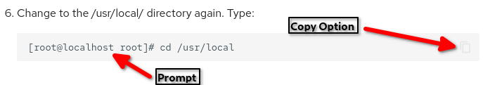

# Вступ

У цьому посібнику описано додаткові параметри форматування, зокрема попередження, нумеровані списки, таблиці тощо.

Документ може або не повинен містити жодного з цих елементів. Якщо ви вважаєте, що спеціальне форматування допоможе вашому документу, цей посібник має допомогти.

!!! note "Примітка про заголовки"

    Заголовки не є спеціальними символами форматування; скоріше це стандартний markdown синтаксис. Вони містять **один** заголовок першого рівня:

    ```
    # Це перший рівень
    ```


    і будь-яка кількість значень підзаголовків, рівні від 2 до 6:

    ```
    ## Заголовок рівня 2
     ### Заголовок рівня 3
     #### Заголовок рівня 4
     ##### Заголовок 5 рівня
     ###### Заголовок 6 рівня
    ```


    Ключовим тут є те, що ви можете використовувати скільки завгодно заголовків із 2–6, але лише **ОДИН** заголовок рівня 1. Хоча документ відображатиметься правильно з кількома заголовками рівня 1, автоматично створений зміст документа, який з’являється праворуч, **НЕ** відображатиметься правильно (або іноді взагалі) із кількома заголовками. Майте це на увазі під час написання документів.

!!! warning "Примітка про підтримувані елементи HTML"

    Існують елементи HTML, які технічно підтримуються у розмітці. Деякі з них описані в цьому документі, де не існує синтаксису розмітки, який би їх замінив. Ці підтримувані HTML-теги слід використовувати рідко, оскільки лінтери розмітки скаржаться на них у документі. Наприклад:

    * Inline HTML [element name]

    Якщо вам потрібно використовувати підтримуваний елемент HTML, подивіться, чи можете ви знайти інший спосіб написати свій документ, який не використовуватиме ці елементи. Якщо ви повинні їх використовувати, це все одно дозволено.

## Застереження

Попередження — це спеціальні візуальні «коробки», які дозволяють привернути увагу до важливих фактів і виділити їх серед решти тексту. Існують наступні типи застережень:

| тип                 | Опис                                                           |
| ------------------- | -------------------------------------------------------------- |
| note "примітка"     | відображає текст у синьому полі                                |
| abstract "анотація" | відображає світло-блакитне текстове поле                       |
| info "Інформація"   | відображає синьо-зелене текстове поле                          |
| tip "Підказка"      | відображає синьо-зелене текстове поле (значок трохи зеленіший) |
| success "Успіх"     | відображає зелене текстове поле                                |
| question "Питання"  | відображає світло-зелене текстове поле                         |
| warning "Важливо"   | відображає помаранчеве текстове поле                           |
| failure "Невдача"   | відображає світло-червоне текстове поле                        |
| danger "Небезпечно" | відображає червоне текстове поле                               |
| bug "Помилка"       | відображає червоне текстове поле                               |
| example "Приклад"   | відображає фіолетове текстове поле                             |
| quote "Цитата"      | відображає сіре текстове поле                                  |
| custom ^1^          | завжди відображає синє текстове поле                           |
| custom ^2^          | використовує спеціальну назву в іншому типі                    |

Попередження необмежені, як зазначено в custom <sub>1</sub> вище. Додайте спеціальний заголовок до будь-якого типу попередження, щоб отримати потрібний колір рамки для конкретного попередження, як зазначено в custom <sub>2</sub> вище.

Застереження завжди вводиться таким чином:

```text
!!! тип_застереження "Заголовок застереження якщо є"

    текст застереження
```

Основний текст застереження має бути з відступом на чотири (4) інтервали від початкового поля. Легко побачити, де це, тому що він завжди вишиковується під першою літерою типу застереження. Зайвий рядок між заголовком і основним текстом не з’являтиметься, але наша система перекладу (Crowdin) має працювати правильно.

Ось приклади кожного типу застережень і того, як вони виглядатимуть у вашому документі:

!!! note "Примітка"

    текст

!!! abstract "анотація"

    текст

!!! info "Інформація"

    текст

!!! tip "Підказка"

    текст

!!! success "Успіх"

    текст

!!! question "Питання"

    текст

!!! warning "Важливо"

    текст

!!! failure "Невдача"

    текст

!!! danger "Небезпечно"

    текст

!!! custom "Власний заголовок"

    Спеціальний тип^1^. Тут ми використали "спеціальний" як наш тип попередження. Знову ж таки, це завжди відображатиметься синім кольором.

!!! warning "Власний заголовок"

    Спеціальний тип^2^. Ми змінили тип попередження «попередження» за допомогою спеціального заголовка. Ось як це виглядає:

    ```
    !!! warning "Власний заголовок"
    ```

### Попередження, що розгортаються

Якщо застереження має дуже довгий вміст, розгляньте можливість використання розгорнутого застереження. Це розглядається як звичайне застереження, але починається з трьох знаків питання, а не з трьох знаків оклику. Застосовуються всі інші правила попередження. Попередження, що розгортається, виглядає так:

??? warning "Вміст попередження"

    Це попередження, не дуже багато змісту. Ви б хотіли використовувати для цього звичайне попередження, але це лише приклад!

Це виглядає так у вашому редакторі:

```text
??? warning "Вміст попередження"

     Це попередження, має не дуже багато змісту. Ви б хотіли використовувати для цього звичайне попередження, але це лише приклад!
```

## Вміст із вкладками в документі

Вміст із вкладками форматується подібно до попереджень. Замість трьох знаків оклику чи питання, він починається трьома знаками рівності. Усе форматування попередження (4 пробіли тощо) застосовується до цього вмісту. Наприклад, для документації може знадобитися інша процедура для іншої версії Rocky Linux. Якщо для версій використовується вміст із вкладками, останній випуск Rocky Linux має бути першим. На момент написання цієї статті це було 9.0:

=== "9.0"

    Процедура для цього в 9.0

=== "8.6"

    Процедура для цього в 8.6

У вашому редакторі це виглядатиме так:

```text
=== "9,0"

     Процедура для цього в 9.0

=== "8,6"

     Процедура для цього в 8.6
```

Пам’ятайте, що все, що потрапляє всередину розділу, має продовжувати використовувати 4-пробілний відступ, доки розділ не буде завершено. Це дуже зручна функція!

## Нумеровані списки

Нумеровані списки схоже на те, що їх легко створювати та використовувати, і коли ви з ними зрозумієте, це дійсно так. Якщо у вас є лише один список елементів без складності, тоді такий формат працює добре:

```text
1. Пункт 1

2. Пункт 2

3. Пункт 3
```

1. Пункт 1

2. Пункт 2

3. Пункт 3

Якщо вам потрібно додати блоки коду, кілька рядків або навіть абзаци тексту до нумерованого списку, тоді текст має бути з відступом із тими самими чотирма (4) пробілами, які використовуються в попередженнях.

Однак ви не можете використовувати очі, щоб вирівняти їх під пронумерованим пунктом, оскільки це один інтервал. Якщо ви користуєтеся хорошим редактором розміток, ви можете встановити значення табуляції на чотири (4), що спростить форматування всього.

Ось приклад багаторядкового нумерованого списку з доданим блоком коду:

1. Коли ви маєте справу з багаторядковими нумерованими списками, які включають блоки коду, використовуйте відступ пробілу, щоб отримати те, що ви хочете.

    Наприклад: це має відступ на чотири (4) пробіли та представляє новий абзац тексту. Крім того, ми додаємо блок коду. Він також має такі ж чотири (4) пробіли, як і наш абзац:

    ```bash
    dnf update
    ```

2. Ось наш другий пункт у списку. Оскільки ми використали відступ (вище), він відображається з наступною послідовністю нумерації (іншими словами, 2), але якби ми ввели елемент 1 без відступу (у наступному абзаці та коді), тоді це відображалося б як елемент 1 знову, що не те, чого ми хочемо.

І ось як це виглядає як необроблений текст:

```markdown
1. Коли ви маєте справу з багаторядковими нумерованими списками, які включають блоки коду, використовуйте відступ пробілу, щоб отримати те, що ви хочете.

    Наприклад: це має відступ на чотири (4) пробіли та представляє новий абзац тексту. Крім того, ми додаємо блок коду. Він також має такі ж чотири (4) пробіли, як і наш абзац:
    ```

2. Ось наш другий пункт у списку. Оскільки ми використали відступ (вище), він відображається з наступною послідовністю нумерації (іншими словами, 2), але якби ми ввели елемент 1 без відступу (у наступному абзаці та коді), тоді це відображалося б як елемент 1 знову, що не те, чого ми хочемо.
```

## Таблиці

У наведеному вище випадку таблиці допомагають нам розмістити параметри команд або типи попереджень і описи. Here is how the table in the Admonitions section was entered:

```text
| type      | Description                                               |
|-----------|-----------------------------------------------------------|
| note      | displays text in a blue box                                   |
| abstract  | displays text in a light blue box                             |
| info      | displays text in a blue-green box                             |
| tip       | displays text in a  blue-green box (icon slightly greener)    |
| success   | displays text in a  green box                                 |
| question  | displays text in a light green box                            |
| warning   | displays text in a orange box                                 |
| failure   | displays text in a light red box                              |
| danger    | displays text in a  red box                                   |
| bug       | displays text in a red box                                    |
| example   | displays text in a purple box                                 |
| quote     | displays text in a grey box                                   |
| custom^1^ | always displays text in a blue box                  |
| custom^2^ | displays text in a box with the color of the chosen type |

```

Зауважте, що необов’язково розбивати кожен стовпець за розміром (як ми зробили в першій частині таблиці), але це, звичайно, легше читається у вихідному файлі розмітки. Це може заплутати, коли ви об’єднуєте елементи разом, просто розбиваючи стовпці вертикальною рискою «|» де б не було природного розриву, як ви можете бачити в останніх двох пунктах таблиці.

## Блок з цитатою

Блоки цитат призначені для цитування тексту з інших джерел для включення у вашу документацію, але їх необов’язково використовувати таким чином. Деякі учасники використовують цитати замість таблиць, наприклад, щоб перелічити деякі параметри. Приклади блоків з цитатами у розмітці:

```text
> **предмет** – опис цього предмета

> **інший предмет** – інший опис цього предмета
```

Додатковий «розривний» рядок необхідний, щоб рядки не йшли разом.

Під час відтворення сторінки це виглядає так:

> **елемент** – опис цього елемента **інший предмет** – інший опис елемента

## Вбудовані та блочні кодові блоки

Our approach to the use of code blocks is pretty simple. Якщо `ваш код` достатньо короткий, щоб ви могли (і хотіли) використати його у реченні, яке ви щойно бачили, використовуйте одинарні зворотні галочки ++"`"++:

```bash
Речення з `командою за вашим вибором`.
```

Будь-яка команда, яка не використовується всередині текстового абзацу (особливо довгі шматки коду з кількома рядками), має бути повним блоком коду, визначеним потрійними зворотними галочками ++"```"++:

````markdown
```bash
sudo dnf install the-kitchen-sink
```
````
Біт `bash` у цьому форматуванні є рекомендованим ідентифікатором коду, але може допомогти підсвічувати синтаксис. Якщо ви демонструєте текст, Python, PHP, Ruby, HTML, CSS або будь-який інший код, «bash» зміниться на будь-яку мову, яку ви використовуєте.
До речі, якщо вам потрібно показати блок коду в блоці коду, просто додайте ще одну зворотну галочку ++"`"++ до батьківського блоку:

`````markdown
````markdown
```bash
sudo dnf install the-kitchen-sink
```
````
`````

І так, блок коду, який ви щойно бачили, використовував п’ять зворотних галочок на початку та в кінці, щоб правильно відтворити його.

### Придушення підказки та автоматичного переходу рядка

Під час написання документації можуть бути випадки, коли ви хочете показати підказку у своїй команді, але ви не хочете, щоб користувач копіював цю підказку, коли він використовує параметр копіювання. Застосуванням цього може бути написання лабораторних робіт, де ви хочете показати розташування з підказкою, як у цьому прикладі:



У разі нормального форматування параметр копіювання скопіює підказку та команду, тоді як копіювання лише команди є кращим. Щоб обійти це, ви можете використати такий синтаксис, щоб повідомити опції копіювання, що ви хочете скопіювати:

````text
``` { .sh data-copy="cd /usr/local" }
[root@localhost root] cd /usr/local
```
````
При використанні цього методу автоматичний переклад рядка також пригнічується.
## Клавіатура
Інший спосіб додати якомога більше ясності вашим документам — правильно відобразити введення клавіш на клавіатурі. У розмітці зробіть це, оточивши ключ або ключі подвійними знаками плюс (`++`). Зробіть це за допомогою `++key++`. Наприклад, щоб показати, що вам потрібно натиснути клавішу виходу у вашому документі, ви б використали `++escape++`. Якщо потрібно вказати натискання кількох клавіш, додайте між ними `+` так: `++ctrl+f4++`. Для клавіш, які не визначені (наприклад, ми вказуємо таємничу функціональну клавішу, `Fx` нижче), помістіть своє визначення в лапки (`++ctrl+"Fx"++`). Якщо потрібно натискати клавіші одночасно, додайте до своїх інструкцій «одночасно» або «одночасно» або іншу подібну фразу. Ось приклад клавіатурної інструкції у вашому редакторі:

```text
Інсталяція типу робочої станції (з графічним інтерфейсом) запускає цей інтерфейс на терміналі 1. Оскільки Linux є багатокористувацьким, можна підключати кількох користувачів кілька разів до різних **фізичних терміналів** (TTY) або **віртуальних терміналів** (PTS). Віртуальні термінали доступні в графічному середовищі. Користувач перемикається з одного фізичного терміналу на інший за допомогою ++alt+"Fx"++ у командному рядку або за допомогою ++ctrl+alt+"Fx"++.
```

Ось як це відображається під час відображення:

Інсталяція типу робочої станції (з графічним інтерфейсом) запускає цей інтерфейс на терміналі 1. Оскільки Linux є багатокористувацьким, можна підключати кількох користувачів кілька разів до різних **фізичних терміналів** (TTY) або **віртуальних терміналів** (PTS). Віртуальні термінали доступні в графічному середовищі. Користувач перемикається з одного фізичного терміналу на інший за допомогою ++alt+"Fx"++ у командному рядку або за допомогою ++ctrl+alt+"Fx"++.

Список прийнятих команд клавіатури [у цьому документі](https://facelessuser.github.io/pymdown-extensions/extensions/keys/#key-map-index).

!!! note "Примітка"

    Ці комбінації клавіш завжди вводяться в нижньому регістрі, за винятком випадків, коли в лапках використовується спеціальна клавіатурна команда.

## Верхній, нижній індекс та спеціальні символи

Верхній і нижній індекси підтримуються в документації Rocky Linux за допомогою `^` для верхнього індексу та `~` для нижнього індексу. Верхній індекс розміщує текст, введений між тегами, трохи вище звичайного тексту, тоді як нижній індекс розміщує текст трохи нижче. Верхній індекс є найбільш часто використовуваним з цих двох на письмі. Деякі спеціальні символи вже з’являються в верхньому індексі без додавання тегів, але ви також можете комбінувати теги, щоб змінити орієнтацію цих символів, як показано на символі авторського права нижче. Ви можете використовувати верхній індекс, щоб:

* представити порядкові числа, наприклад 1^st^, 2^nd^, 3^rd^
* символи авторського права та товарних знаків, наприклад ^&copy;^, ^TM^, або ^&trade;^, ^&reg;&^
* як позначення для посилань, наприклад так^1^, так^2^ та так^3^

Деякі спеціальні символи, такі як &copy; зазвичай не мають верхнього індексу, тоді як інші, наприклад &trade;, мають.

Ось як все вищесказане виглядає у вашому коді markdown:

```text
* позначають порядкові числівники, наприклад 1^st^, 2^nd^, 3^rd^
* символи авторського права та товарних знаків, наприклад ^&copy;^, ^TM^ або ^&trade;^, ^&reg;^
* як позначення для посилань, наприклад this^1^, this^2^ і this^3^

Деякі спеціальні символи, такі як &copy; зазвичай не є верхнім індексом, тоді як інші, такі як &trade;, є.
```

Щоб змусити верхній індекс, обведіть потрібний верхній індекс `^`.

Введіть нижній індекс, оточивши текст тегом `~` (H~2~0 це `H~2~0`), і, як зазначалося раніше, він майже не використовується в письмі.

### Верхній індекс для посилань

Декому з вас може знадобитися посилання на зовнішні джерела під час написання документації. Якщо у вас є лише одне джерело, ви можете включити його у свій висновок як одне посилання, але якщо у вас є кілька^1^, ви можете використовувати верхній індекс, щоб позначити їх у своєму тексті^2^, а потім перелічити їх у кінці ваш документ. Зверніть увагу, що літературу слід розташовувати після розділу «Висновок».

Після висновку ви можете мати свої позначки в пронумерованому списку відповідно до верхнього індексу, або ви можете ввести їх як посилання. Обидва приклади показано тут:

1. "How Multiples Are Used In Text" by Wordy W. McWords [https://site1.com](https://site1.com)
2. "Using Superscript In Text" by Sam B. Supersecret [https://site2.com](https://site2.com)

або

[1](https://site1.com) "How Multiples Are Used In Text" by Wordy W. McWords  
[2](https://site2.com) "Using Superscript In Text" by Sam B. Supersecret

А ось як це все виглядає у вашому редакторі:

```text
1. "How Multiples Are Used In Text" by Wordy W. McWords [https://site1.com](https://site1.com)
2. "Using Superscript In Text" by Sam B. Supersecret [https://site2.com](https://site2.com)

or

[1](https://site1.com) "How Multiples Are Used In Text" by Wordy W. McWords  
[2](https://site2.com) "Using Superscript In Text" by Sam B. Supersecret  

```

## Виділення тексту

Ще один можливий спосіб покращити документацію за допомогою ==підсвічування==. Виділення виконується оточуванням тексту `==`.

У вашому редакторі це виглядає так:

```bash
Ще один можливий спосіб покращити документацію за допомогою ==підсвічування==. Підсвічування обробляється оточуванням тексту `==`. 
```

## Групування різних типів форматування

Документація Rocky пропонує кілька елегантних варіантів форматування при поєднанні кількох елементів в одному елементі. Наприклад, попередження з пронумерованим списком:

!!! note "Примітка"

    Усе може стати трохи божевільним, коли ви групуєте речі. Як коли:

    1. Ви додаєте пронумерований список опцій до попередження

    2. Або ви додаєте нумерований список із кількома блоками коду:

        ```
        dnf install some-great-package
        ```

        Це також є в нумерованому списку з кількох абзаців.

Або у вас може бути пронумерований список із додатковим зауваженням:

1. Цей предмет є дуже важливим

    Тут ми додаємо команду з клавіатури до елемента списку:

    Натисніть ++escape++ без особливої причини.

2. Але цей пункт є дуже важливим *і* містить кілька абзаців

    І в середині це застереження:

    !!! warning "Важливо"
   
        З кількома елементами в різних типах форматування все може стати трохи божевільним!

Якщо ви будете стежити за магічними чотирма (4) пробілами, щоб робити відступи та розділяти ці елементи, вони відображатимуться логічно та саме так, як ви хочете. Іноді це дійсно важливо.

Ви можете вставити таблицю або заблокувати цитату (буквально будь-який тип елемента форматування) в іншу. Тут у вас є пронумерований список, попередження, таблиця та деякі елементи блок-цитат, об’єднані разом:

1. Намагатися встигати за всім, що відбувається у вашому документі, може бути справжньою проблемою під час роботи з кількома елементами.

2. Якщо ви відчуваєте себе перевантаженими, подумайте про:

    !!! warning "важливо: я думаю, що болить мозок!"
   
        Поєднуючи кілька елементів форматування, ваш мозок може трохи збожеволіти. Подумайте про те, щоб висмоктати трохи кофеїну, перш ніж почати!
       
        | тип | добова норма кофеїну |
         |-----------------|------------------------------ ---|
         | чай | зрештою це приведе вас туди |
         | кава | для вибагливих смакових рецепторів |
         |  red bull | на смак жахливий, але він вас утримає! |
         | гірська роса | над розкрученим |
       
         > **цукор**, якщо кофеїн вам не подобається
       
         > **потерпіть**, якщо нічого не допомагає, зосередьтеся більше

3. Є більше прикладів, але наведене вище повинно показати, що все може бути вкладено всередину. Просто запам’ятайте чотири (4) магічних місця.

Ось як цей приклад виглядає у вашому редакторі:

```text

Поки ви стежите за чарівними чотирма (4) пробілами для розділення цих предметів, вони відображатимуться логічно й саме так, як ви хочете. Іноді це дійсно важливо.

Ви можете вставити таблицю або заблокувати цитату (буквально будь-який тип елемента форматування) в іншу. Тут є пронумерований список, застереження, таблиця та деякі елементи блок-цитат, усі разом:

1. Намагатися встигати за всім, що відбувається у вашому документі, може бути справжньою проблемою під час роботи з кількома елементами.

2. Якщо ви відчуваєте себе перевантаженими, подумайте про:

    !!! warning "важливо: я думаю, що болить мозок!"

        Поєднуючи кілька елементів форматування, ваш мозок може трохи збожеволіти. Подумайте про те, щоб висмоктати трохи кофеїну, перш ніж почати!

        | тип           |   добова норма кофеїну       |
        |-----------------|----------------------------------|
        | чай             | зрештою це приведе вас туди |
        | кава          | для вибагливих смакових рецепторів        |
        | red bull        | на смак жахливий, але він вас утримає! |
        | mountain dew    | роздутий                       |

        > **цукор** якщо кофеїн вам не до вподоби

        > **страждання** якщо нічого не допомагає, зосередьтеся більше

3. Є більше прикладів, але наведене вище повинно показати, що все може бути вкладено всередину. Просто запам’ятайте чотири (4) магічних місця.
```

## Останній пункт – коментарі

Час від часу ви можете додати коментар до розмітки, який не відображатиметься під час візуалізації. Для цього існує багато причин. Наприклад, якщо ви хочете додати заповнювач для чогось, що буде додано пізніше, ви можете використати коментар, щоб позначити своє місце.

Найкращий спосіб додати коментар до вашої розмітки – використовувати квадратні дужки «[]» навколо двох похилих рисок «//», за якими йде двокрапка та вміст. Це виглядало б так:

```text

[//]: Це коментар, який буде замінено пізніше

```

У коментарі має бути порожній рядок перед і після коментаря.

## Більше читання

* Rocky Linux [документ про те, як зробити внесок](README.md)

* Докладніше про [застереження](https://squidfunk.github.io/mkdocs-material/reference/admonitions/#supported-types)

* [Коротка довідка щодо уцінки](https://wordpress.com/support/markdown-quick-reference/)

* [Більше коротких довідників](https://github.com/adam-p/markdown-here/wiki/Markdown-Cheatsheet) для Markdown

## Висновок

Форматування документа за допомогою заголовків, попереджень, таблиць, нумерованих списків і цитат може додати чіткості вашому документу. Використовуючи поради, подбайте про те, щоб вибрати правильний тип. Це може полегшити візуальне розуміння важливості конкретного застереження.

Вам не *потрібно* використовувати розширені параметри форматування. Надмірне використання спеціальних елементів може створити безлад там, де вони не потрібні. Навчання використовувати ці елементи форматування консервативно та добре може бути дуже корисним, щоб донести свою точку зору в документі.

Нарешті, щоб спростити форматування, подумайте про те, щоб змінити значення TAB редактора розмітки на чотири (4) пробіли.
