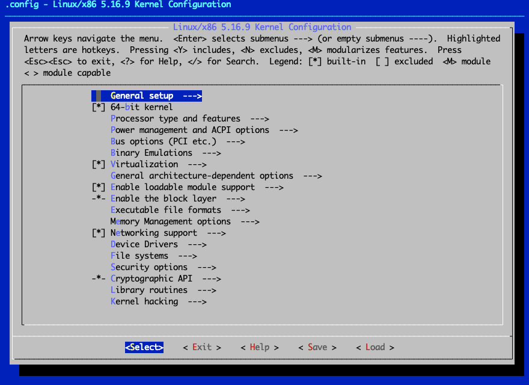
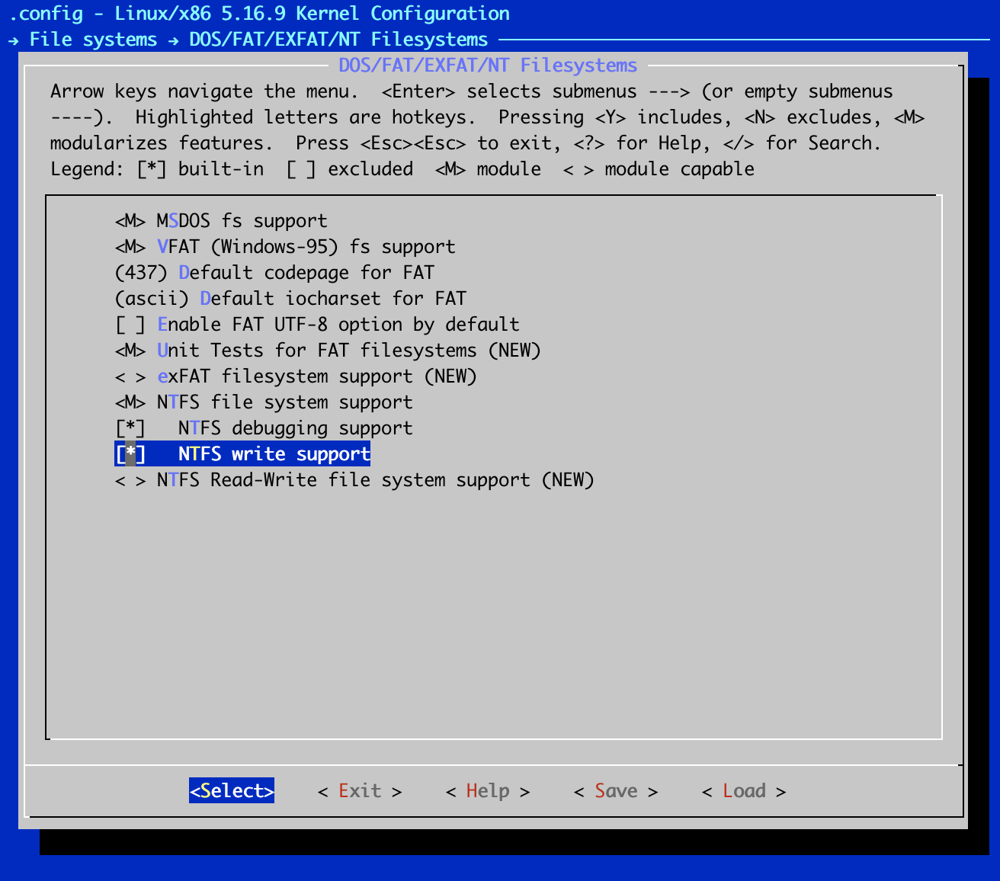

# Vue d'ensemble

Dans ce guide, nous allons examiner le processus d'acquisition d'une arborescence des sources du noyau, de sa configuration, de sa compilation et finalement, de l'installation et de l'amorçage du noyau.

!!! warning "Les reconstructions du noyau ne sont ni recommandées ni prises en charge pour Rocky Linux. Avant de construire un noyau personnalisé ou même de l'envisager, posez-vous les questions suivantes :"

    * La fonctionnalité dont vous avez besoin est-elle disponible en installant un module de noyau à partir d'[elrepo](https://elrepo.org)?
    * La fonctionnalité dont vous avez besoin est-elle disponible sous la forme d'un module distinct du noyau lui-même ?
    * Rocky Linux et la plupart des autres dérivés d'EL ont été conçus pour fonctionner comme un environnement complet. Le remplacement de composants critiques peut avoir une incidence sur le fonctionnement du système.
    * La plupart des utilisateurs n'ont pas besoin de construire leur propre noyau. Il se peut que vous ayez simplement besoin d'un module/pilote de noyau ou de construitre votre propre module de noyau (kmod/dkms)

    Dernier avertissement : Si vous cassez le noyau, vous êtes responsable de la résolution des problèmes qui en résultent sur votre système.

## Le noyau

Le plus souvent, lorsque les gens disent _Linux_, ils font généralement référence à une "_distribution Linux_" - par exemple, Rocky Linux et Debian sont des types de distribution Linux. Une distribution comprend tout ce qui est nécessaire pour que Linux existe en tant que système d'exploitation fonctionnel. Les distributions utilisent du code provenant de divers projets open source indépendants de GNU/Linux.

Linux, c'est le noyau. Le noyau est littéralement au cœur [du système d'exploitation].

La seule chose plus fondamentale que le noyau est le matériel du système lui-même. Bien que le noyau ne soit qu'une petite partie d'une distribution Linux complète, il est de loin l'élément le plus critique. Si le noyau échoue ou plante, le reste du système en fait de même.

## Le code source du Noyau

La distribution Rocky Linux fournit le code source pour la version spécifique du noyau qu'elle supporte sous une forme ou une autre. Çela pourrait être sous la forme d'un binaire compilé (`*.src.rpm`), d'un RPM source (`*.srpm`) ou similaire.

Si vous avez besoin de télécharger une version (peut-être plus récente) différente de celle que votre distribution spécifique de Rocky Linux fournit, le premier endroit où chercher le code source se trouve sur le site officiel du noyau :

[www.kernel.org](https://www.kernel.org)

Ce site maintient une liste de sites web reflétant les sources du noyau, ainsi que des tonnes d'autres logiciels libres, de distributions et d'utilitaires d'usage général.

La liste des miroirs est maintenue à :

[mirrors.kernel.org](http://mirrors.kernel.org)

!!! tip "Remarque"

    La majorité du téléchargement, de la configuration et de la compilation du noyau Linux effectués dans les sections suivantes peuvent/doivent être faits en tant qu'utilisateur sans privilège. Cependant, les dernières étapes qui nécessitent l'installation ou la modification des fichiers système et des binaires doivent être effectuées avec des privilèges élevés.
    
    Nous pouvons effectuer la majeure partie du travail en tant qu'utilisateur non privilégié car nous utiliserons une option spéciale de construction du noyau, qui nous permet de spécifier un répertoire de travail ou de sortie personnalisé. Plus précisément, nous utiliserons l'option `O=~/build/kernel` pour toutes les invocations de make.
    
    Où `~/build/kernel` est équivalent à `/home/$USER/build/kernel` ou `$HOME/build/kernel`

## Versions du noyau et conventions de nommage

La liste des noyaux disponibles sur le site web contient des dossiers pour v1.0, v2.5, v2.6, v3.0, v3.x, v4.x, v5.x, v6.x et ainsi de suite. Avant de suivre votre penchant naturel pour la dernière version, assurez-vous de bien comprendre le fonctionnement du système de versions du noyau Linux.

La convention actuelle consiste à nommer et à numéroter les nouvelles versions majeures du noyau "Linux 5.x" (également appelé noyau vanille ou noyau principal). Ainsi, le premier de cette série sera la version 5.0 de Linux (identique à la version 5.0.0), le suivant sera la version 5.1 de Linux (identique à la version 5.1.0), suivi de la version 5.2 de Linux, et ainsi de suite.

Toute modification ou mise à jour mineure au sein de chaque version majeure sera reflétée par des incréments jusqu'au troisième chiffre. Ces versions sont communément appelées "versions stables". Ainsi, la prochaine version stable du noyau de la série 5.0.0 sera la version 5.0.1 de Linux, suivie de la version 5.0.2, et ainsi de suite. Une autre façon de le dire est de dire, par exemple, que Linux version 5.0.4 est la quatrième version stable basée sur la série Linux 5.0.0.

## Installation des outils et bibliothèques prérequis

Une source commune d'échec rencontrée pendant le processus de compilation du noyau peut être causée par le fait que tous les logiciels requis ne sont pas disponibles pour compiler et construire le noyau Linux principal. Les outils et bibliothèques manquants peuvent être installés en utilisant le gestionnaire de paquets DNF sur une distribution Rocky Linux. Nous nous en occuperons dans cette section.

1. Sur une distribution Rocky Linux, vous pouvez rapidement obtenir la plupart des outils de développement nécessaires en exécutant cette commande :

    ```bash
    sudo dnf -y groupinstall 'C Development Tools and Libraries'
    ```

    Si vous obtenez l'erreur "Module or Group 'C Development Tools and Libraries' is not available.", la commande ci-dessous est équivalente à la précédante :

    ```bash
    sudo dnf -y groupinstall 'Development Tools'
    ```

2. D'autres bibliothèques, fichiers d'en-tête et applications dont vous pourriez avoir besoin peuvent également être obtenus en installant les paquets suivants. Entrer la commande :

    ```bash
    sudo dnf -y install ncurses-devel openssl-devel elfutils-libelf-devel python3
    ```

3. Ensuite, nous avons besoin d'autres utilitaires qui ne sont disponibles que dans certains dépôts tiers pris en charge. Un de ces dépôts est le dépôt Powertools. Activez ce dépôt sur notre système Rocky. Entrer la commande :

    ```bash
    sudo dnf config-manager --set-enabled powertools
    ```

4. Pour terminer, installons un des paquets nécessaires à partir du dépôt Powertool. Entrer la commande suivante :

    ```bash
    sudo  dnf -y install dwarves
    ```

C'est tout pour les paquets prérequis nécessaires à la construction du noyau !

## Téléchargement et Décompression du Noyau Linux

La version du noyau que nous allons construire dans ce qui suit, est la version **6.5.7**, qui est disponible à l'adresse suivante :

[www.kernel.org/pub/linux/kernel/v6.x/linux-6.5.7.tar.xz](https://www.kernel.org/pub/linux/kernel/v6.x/linux-6.5.7.tar.xz)

Lançons le processus.

1. Premièrement, utilisez la commande `curl` suivante pour télécharger les sources du noyau dans votre répertoire de travail actuel. Entrer la commande suivante :

    ```bash
    curl -L -o linux-6.5.7.tar.xz \
    https://www.kernel.org/pub/linux/kernel/v6.x/linux-6.5.7.tar.xz
    ```

2. La source du noyau que vous allez télécharger à partir d'Internet est un fichier qui a été compressé avec tar. Par conséquent, pour utiliser la source, vous devez décompresser le fichier source.

    Assurez-vous d'être dans le répertoire dans lequel vous avez téléchargé l'archive du noyau. Utilisez la commande tar pour décompresser le fichier, en exécutant :

    ```bash
    tar xvJf linux-6.*.tar.xz
    ```

## Construire le noyau

Dans cette section, nous allons examiner le processus de configuration et de construction d'un noyau. Contrairement à macOS ou aux systèmes d'exploitation basés sur Windows, qui sont préconfigurés et prennent donc en charge de nombreuses fonctionnalités que vous pouvez souhaiter ou non.

La philosophie de conception de Linux permet à l'individu de décider des parties importantes du noyau. Cette conception individualisée présente l'avantage important de vous permettre d'alléger la liste des fonctionnalités afin que Linux puisse fonctionner aussi efficacement que possible.

C'est également l'une des raisons pour lesquelles il est possible d'adapter Linux à différentes configurations matérielles, des systèmes bas de gamme aux systèmes embarqués, en passant par les systèmes haut de gamme.

Deux étapes principales sont requises dans la construction d'un noyau :

- la configuration
- la compilation

La première étape de la construction du noyau consiste à configurer ses caractéristiques. En général, la liste des fonctionnalités souhaitées est basée sur le matériel que vous devez prendre en charge. Cela signifie bien sûr que vous aurez besoin d’une liste de ce matériel.

Sur un système fonctionnant déjà sous Linux, vous pouvez exécuter des commandes telles que - `lspci`, `lshw` et ainsi de suite pour obtenir des informations détaillées sur la configuration matérielle exacte de votre système. Sur les distros à base de RPM, ces utilitaires sont fournis par les paquets `pciutils*.rpm` et `lshw*.rpm`.

Une meilleure compréhension de ce qui constitue votre matériel sous-jacent peut vous aider à mieux déterminer ce dont vous avez besoin dans votre noyau personnalisé. Vous êtes prêt à configurer le noyau.

### Nettoyage de l'environnement de compilation

Nous pouvons commencer la configuration proprement dite en ayant une idée approximative des types de matériel et des fonctionnalités que notre nouveau noyau doit prendre en charge. Mais tout d'abord, quelques informations générales.

L'arborescence des sources du noyau Linux contient plusieurs fichiers nommés **Makefile** (un makefile est simplement un fichier texte avec des directives et il décrit également les relations entre les fichiers d'un programme).

Ces makefiles permettent de coller ensemble les milliers d'autres fichiers qui composent le noyau. Ce qui est plus important pour nous ici, c'est que les makefiles contiennent également des cibles. Les cibles sont les commandes, ou directives, qui sont exécutées par le programme make.

!!! warning "avertissement : Évitez les mises à jour inutiles du noyau"

    Gardez à l'esprit que si vous disposez d'un système stable et performant, il n'y a guère de raison de mettre à jour le noyau, à moins que l'une de ces conditions ne s'applique à vous :

    - Un correctif de sécurité ou de bug affecte votre système et doit être appliqué
    - Vous avez besoin d'une nouvelle fonctionnalité spécifique dans une version stable

    En cas de correctif de sécurité, décidez si le risque vous affecte. Par exemple, si un problème de sécurité est détecté dans un pilote de périphérique que vous n'utilisez pas, il n'y a peut-être aucune raison de le mettre à jour. Si un correctif de bogue est publié, lisez attentivement les notes de version et décidez si les bogues s'appliquent réellement à vous - si vous disposez d'un système stable, mettre à jour le noyau avec des correctifs que vous n'utilisez jamais peut être inutile.

    Dans les systèmes de production, le noyau ne doit pas simplement être mis à jour pour obtenir le « dernier noyau » ; vous devriez avoir une bonne raison de mettre à niveau.

Le fichier Makefile situé à la racine de l'arborescence des sources du noyau contient des cibles spécifiques qui peuvent être utilisées pour préparer l'environnement de construction du noyau, configurer le noyau, compiler le noyau, installer le noyau, etc. Certains de ces objectifs sont examinés plus en détail ici :

`make mrproper`
:

Cet cible nettoie l’environnement de construction de tous les fichiers et dépendances hérités qui auraient pu être laissés par une version précédente du noyau. Toutes les configurations précédentes du noyau seront nettoyées (supprimées) de l'environnement de construction.

`make clean`
:

Cette cible n'est pas aussi efficace que la cible mrproper. Il ne supprime que la plupart des fichiers générés. Il ne supprime pas le fichier de configuration du noyau (.config).

`make menuconfig`
:

Cette cible invoque une interface d'éditeur de texte avec des menus, des listes d'options et des boîtes de dialogue de texte pour configurer le noyau.

`make xconfig`
:

Cet outil/cible de réglage du noyau basé sur une interface graphique est basé sur les bibliothèques Qt GUI. Ces bibliothèques sont utilisées par les applications basées sur KDE/Plasma.

`make gconfig`
:

C'est également un outil/cible de configuration du noyau basé sur une interface graphique, mais il s'appuie sur la boîte à outils GTK\+. Ce toolkit GTK\+ est largement utilisé dans le monde de bureau GNOME.

`make olddefconfig`
:

Cette cible utilise un fichier .config existant dans le répertoire de travail actuel, met à jour les dépendances et définit automatiquement les nouveaux symboles aux valeurs par défaut.

`make help`
:

Cette cible vous montrera tous les targets possibles et vous servira de système de référence rapide en ligne.

Dans cette section, nous n'utiliserons qu'une seule des cibles pour configurer le noyau. En particulier, nous utiliserons la commande make menuconfig. L'éditeur de configuration du noyau menuconfig est un utilitaire de configuration simple et populaire qui se compose de menus, de listes de boutons radio et de dialogues.

Il possède une interface simple et propre qui peut être facilement navigable avec votre clavier et est presque intuitif à utiliser.

Nous devons passer (cd) dans le répertoire des sources du noyau, après quoi nous pouvons commencer la configuration du noyau. Mais avant de commencer la configuration du noyau, vous devez nettoyer (préparer) l'environnement de construction du noyau en utilisant la commande make mrproper :

```bash
cd linux-6.*
make  O=~/build/kernel mrproper
```

### Configuration du noyau

Ensuite, nous commencerons par configurer le noyau Linux de la série 6.*. Pour explorer certains tenants et aboutissants de ce processus, nous allons activer la prise en charge d'une fonctionnalité que nous considérerons comme obligatoire dans le système. Une fois que vous avez compris son fonctionnement, vous pouvez appliquer la même procédure pour ajouter la prise en charge de toute nouvelle fonctionnalité du noyau de votre choix. Plus précisément, nous allons activer le support du système de fichiers NTFS dans notre noyau personnalisé.

La plupart des distributions Linux modernes sont livrées avec un fichier de configuration du noyau en cours d'exécution, disponible sur le système de fichiers local sous forme de fichier compressé ou normal. Dans notre exemple de système Rocky, ce fichier se trouve dans le répertoire `/boot` et est habituellement nommé `config-*`.

The configuration file contains a list of the options and features that were enabled for the particular kernel it represents. Un fichier de configuration similaire à celui-ci est ce que nous voulons créer à travers le processus de configuration du noyau. La seule différence entre le fichier que nous allons créer et le fichier prêt à créer est que nous ajouterons une personnalisation mineure à la nôtre.

!!! tip "Remarque"

    L'utilisation d'un fichier de configuration préexistant connu comme base de notre fichier personnalisé permet de garantir que nous ne passons pas trop de temps à dupliquer les efforts que d'autres personnes ont déjà déployés pour trouver ce qui fonctionne et ce qui ne fonctionne pas !

Les étapes suivantes couvrent la configuration du noyau. Nous utiliserons un utilitaire de configuration du noyau en mode texte, qui vous permettra de suivre sur votre terminal que vous utilisiez ou non un environnement de bureau GUI.

1. Pour commencer, nous allons copier et renommer un fichier de configuration existant du répertoire `/boot` dans notre environnement de construction du noyau :

    ```bash
    cp /boot/config-`uname -r` ~/build/kernel/.config
    ```

    Nous utilisons `uname -r` ici pour nous aider à obtenir le fichier de configuration du noyau en cours d'exécution. La commande `uname -r` affiche la version exécutée du noyau. L'utiliser permet de s'assurer que nous obtenons la version exacte que nous voulons, juste au cas où d'autres versions seraient présentes.

    !!! NOTE

     L'éditeur de configuration du noyau Linux commence explicitement à rechercher et à générer un fichier nommé .config (prononcé « dot config ») à la racine de l'arborescence des sources du noyau. Ce fichier est masqué.

2. Lancez l'utilitaire graphique de configuration du noyau :

    ```bash
    make O=~/build/kernel menuconfig
    ```

    Un écran similaire à ceci apparaîtra :

    

    L'écran de configuration du noyau qui apparaît est divisé en environ trois zones. La partie supérieure montre diverses informations utiles, des raccourcis clavier et des légendes qui peuvent vous aider à naviguer dans l'application. Le corps principal de l'écran montre une liste arborescente extensible des options globales du noyau. Vous pouvez également descendre vers le bas dans les éléments avec des flèches dans le parent pour afficher et/ou configurer les éléments du sous-menu (ou de l'enfant). Enfin, le bas de l'écran affiche les actions/options réelles que l'utilisateur peut choisir.

3. Ensuite, nous ajouterons la prise en charge NTFS à notre noyau personnalisé à des fins de démonstration.

    Lorsque vous êtes sur l'écran de configuration principal, utilisez vos touches fléchées pour naviguer vers l'élément système de fichiers et le mettre en surbrillance. Avec les systèmes de fichiers sélectionnés, appuyez sur Entrée pour afficher le sous-menu ou les éléments enfants pour les systèmes de fichiers.

    Dans la section Systèmes de fichiers, utilisez vos touches fléchées pour accéder aux systèmes de fichiers DOS/FAT/NT. Appuyez sur Entrée pour voir les éléments enfants pour les systèmes de fichiers DOS/FAT/NT.

4. Dans la section Systèmes de fichiers DOS/FAT/NT, accédez à la prise en charge du système de fichiers NTFS.

    Tapez ++M++ (majuscules) pour permettre aux modules de prendre en charge le système de fichiers NTFS.

    Utilisez les touches fléchées pour accéder au support du débogage NTFS (NEW) puis appuyez sur y pour l'inclure.

    Utilisez les touches fléchées pour accéder à la prise en charge de l'écriture NTFS, puis appuyez sur ++y++ pour l'inclure. Lorsque vous avez terminé, la lettre `M` ou le symbole étoile (`*`) devrait apparaître à côté de chaque paramètre, comme indiqué ici :

    

    !!! tip "Astuce"
   
        Pour chacune des options configurables, dans l'utilitaire de configuration du noyau, les parenthèses d'angle vides <>, indiquent que la fonctionnalité en question est désactivée. La lettre « M » entre crochets angulaires, <M>, indique que la fonction sera compilée en tant que module.
       
        Le symbole étoile entre crochets, <*>, indique que la prise en charge de cette fonctionnalité sera intégrée directement dans le noyau. Vous pouvez généralement parcourir toutes les options possibles à l’aide de la barre d’espace de votre clavier.

5. Retournez à l'écran principal Systèmes de fichiers en appuyant deux fois sur la touche Echap de votre clavier dans l'écran Systèmes de fichiers DOS/FAT/NT. Retournez à l'écran principal de configuration du noyau en appuyant à nouveau deux fois sur la touche Echap de votre clavier.

6. Enfin, enregistrez vos modifications dans le fichier .config à la racine de l'arborescence des sources du noyau et quittez le programme de configuration du noyau après avoir enregistré le fichier en appuyant deux fois sur esc sur votre clavier.

7. Une boîte de dialogue apparaîtra vous invitant à enregistrer votre nouvelle configuration. Assurez-vous que Yes est sélectionné, puis appuyez sur Enter.

8. Une fois l'utilitaire de configuration du noyau terminé, vous reviendrez à votre shell dans l'arborescence des sources du noyau. Vous êtes presque prêt à construire votre noyau !

9. Nous avons besoin de compléter quelques personnalisations supplémentaires sur notre distribution Rocky. Entrer la commande :

    ```bash
    sed -ri '/CONFIG_SYSTEM_TRUSTED_KEYS/s/=.+/=""/g' ~/build/kernel/.config
    ```

    !!! TIP

     Pour voir les résultats de certaines des modifications que vous avez faites en utilisant l'outil menuconfig, utilisez l'utilitaire grep pour voir le fichier .config que vous avez sauvegardé directement. Par exemple, pour voir l'effet du support du système de fichiers NTFS que nous avons activé précédemment, tapez ce qui suit :
        ```
        $ grep NTFS ~/build/kernel/.config
        CONFIG_NTFS_FS=m
        CONFIG_NTFS_DEBUG=y
        CONFIG_NTFS_RW=y
        ```

    !!! note "Une note rapide sur les modules du noyau"

     Le support du module chargeable est une fonctionnalité du noyau Linux qui permet le chargement dynamique (ou la suppression) des modules du noyau.    
    
     Les modules du noyau sont des morceaux de code compilé qui peuvent être insérés dynamiquement dans le noyau en cours d'exécution, plutôt que d'être intégrés de façon permanente dans le noyau. De cette façon, vous pouvez activer des fonctionnalités que vous n'utilisez pas souvent, mais elles n'occuperont pas de mémoire lorsqu'elles ne sont pas utilisées.
    
     Heureusement, le noyau Linux peut automatiquement déterminer ce qu'il faut charger et quand. Naturellement, toutes les fonctionnalités ne peuvent pas être compilées en tant que module. Le noyau doit avoir quelques Informations avant de pouvoir charger et décharger des modules, comme comment accéder au disque dur et analyser à travers le système de fichiers où sont stockés les modules chargeables. Certains modules du noyau sont aussi communément appelés pilotes.

### Compilation du noyau

Dans la section précédente, nous avons décrit le processus de création d'un fichier de configuration pour le noyau personnalisé que nous voulons construire. Dans cette section, nous allons procéder à la construction du noyau. Mais avant cela, nous allons ajouter une personnalisation plus simple à l'ensemble du processus.

La personnalisation finale consistera à ajouter un élément d'information supplémentaire utilisé dans le nom final de notre noyau. Cela nous permettra de différencier ce noyau de tout autre noyau ayant le même numéro de version. Nous ajouterons la balise "custom" aux informations sur la version du noyau. Ceci peut être fait en éditant le Makefile principal et en ajoutant le tag que nous voulons à la variable EXTRAVERSION.

L'étape de compilation du processus de construction du noyau est de loin la plus facile, mais c'est aussi celle qui prend le plus de temps. À ce stade, il suffit d'exécuter la commande make, qui générera automatiquement les dépendances et s'en occupera, compilera le noyau lui-même et toutes les fonctionnalités (ou pilotes) qui ont été activées en tant que modules chargeables.

En raison de la quantité de code qui doit être compilée, préparez-vous à attendre quelques minutes, au minimum, en fonction de la puissance de traitement de votre système. Voyons maintenant les étapes spécifiques nécessaires à la compilation de votre nouveau noyau.

1. Tout d'abord, nous allons ajouter un élément supplémentaire à la chaîne d'identification du noyau que nous sommes sur le point de construire. Tout en restant à la racine de l'arborescence des sources du noyau, nous utiliserons l'utilitaire sed pour éditer le Makefile en place. La variable que nous voulons modifier est proche du haut du fichier. Nous voulons changer la ligne dans le fichier qui ressemble à ceci :

    ```bash
    EXTRAVERSION =
    ```

    Par cela :

    ```bash
    EXTRAVERSION = -custom
    ```

    Utilisez la commande `sed` suivante pour effectuer la modification. Entrer la commande :

    ```bash
    sed  -i 's/^EXTRAVERSION.*/EXTRAVERSION = -custom/'  Makefile
    ```

    Bien entendu, vous pouvez également utiliser n'importe quel éditeur de texte avec lequel vous vous sentez à l'aise pour effectuer la modification. N'oubliez pas de sauvegarder vos modifications dans le fichier !

2. Passez la cible kernelversion à la commande make pour afficher la version complète du noyau que vous venez de personnaliser :

    ```bash
    make O=~/build/kernel kernelversion
    ```

    !!! Tip

     Vous pouvez tirer parti de toute cette puissance de traitement supplémentaire (CPU, cœurs, etc.) sur la plupart des systèmes modernes et accélérer considérablement les opérations à forte intensité de CPU telles que la compilation du noyau. Pour ce faire, vous pouvez passer un paramètre à la commande make qui spécifie le nombre de travaux à exécuter simultanément. Le nombre spécifié de tâches est ensuite distribué et exécuté simultanément sur chaque cœur de processeur. La syntaxe de la commande est :

            ```bash
            make -j N
            ```


         où N est le nombre de travaux à exécuter simultanément. For example, if you have a octa (8) core–capable CPU, you can type :

            ```bash
            make -j 8
            ```

3. La seule commande nécessaire pour compiler le noyau est la commande make :

    ```bash
    $ make  O=~/build/kernel
    make[1]: Entering directory '/home/super/build/kernel'
    SYNC    include/config/auto.conf.cmd
    GEN     Makefile
    HOSTCC  scripts/kconfig/conf.o
    HOSTLD  scripts/kconfig/conf
    GEN     Makefile
    ...<OUTPUT TRUNCATED>…
    LD [M]  sound/usb/usx2y/snd-usb-usx2y.ko
    LD [M]  sound/x86/snd-hdmi-lpe-audio.ko
    LD [M]  sound/xen/snd_xen_front.ko
    LD [M]  virt/lib/irqbypass.ko
    make[1]: Leaving directory '/home/super/build/kernel'
    ```

4. Le produit final de cette commande (c'est-à-dire le noyau) est sagement assis et attend dans le chemin :

    ```bash
    ~/build/kernel/arch/x86/boot/bzImage
    ```

5. Nous devons installer les modules parce que nous avons compilé des parties du noyau sous forme de modules (par exemple, le module NTFS). Tapez ce qui suit :

    ```bash
    sudo make O=~/build/kernel modules_install
    ```

    Sur notre système Rocky, cette commande installera tous les modules compilés du noyau dans le répertoire `/lib/modules/<new_kernel-version>`. Dans cet exemple, ce chemin se traduira par `/lib/modules/6.5.7-custom/`. Il s'agit du chemin à partir duquel le noyau chargera tous les modules chargeables, le cas échéant.

    !!! TIP

     L'empreinte (taille) des modules du noyau installés via `make modules_install` peut finir par devenir assez importante parce que les modules incluent des symboles de débogage. En conséquence, vous pourriez facilement vous retrouver avec un répertoire `/lib/modules/6.5.7-custom/` d'une taille proche de 5GB !
    
     Pour ce guide, nous évitons cette taille importante en incluant l'option `INSTALL_MOD_STRIP=1` dans notre invocation `make modules_install`. Vous pouvez réduire la taille totale par ordre de magnitude (par exemple - moins de 200 Mo!!) en retirant ces symboles de débogage.
    
     Cela peut être fait en incluant l'option `INSTALL_MOD_STRIP=1` à la commande `make modules_install`.

## Installation du noyau

En supposant que vous avez un PC et que vous travaillez dans le répertoire `~/build/kernel/` , le noyau compilé qui a été créé dans l'exercice précédent sera situé dans ce chemin - `<kernel-build-dir>/arch/x86/boot/bzImage` ou, pour être précis, dans notre exemple  `~/build/kernel/arch/x86/boot/bzImage`.

Le fichier map correspondant sera situé dans `~/build/kernel/System.map`. Vous aurez besoin de ces deux fichiers pour la phase d'installation.

Le fichier `System.map` est utile lorsque le noyau se comporte mal et génère des messages « Oups ». Un "Oops" est généré pour certaines erreurs du noyau dues à des bogues du noyau ou à du matériel défectueux.

Cette erreur s'apparente à l'écran bleu de la mort (BSOD) de Microsoft Windows. Ces messages contiennent de nombreux détails sur l'état actuel du système, y compris plusieurs nombres hexadécimaux.

`System.map` permet à Linux de transformer ces nombres hexadécimaux en noms lisibles, ce qui facilite le débogage. Bien que cette fonction soit principalement destinée aux développeurs, elle peut s'avérer utile lorsque vous signalez un problème.

Passons en revue les étapes nécessaires à l'installation de la nouvelle image du noyau.

1. À la racine de votre répertoire de construction du noyau, copiez et renommez le fichier `bzImage` dans le répertoire `/boot` :

    ```bash
    sudo cp ~/build/kernel/arch/x86/boot/bzImage \
    /boot/vmlinuz-<kernel-version>
    ```

    Ici, `<kernel-version>` est le numéro de version du noyau. Pour l'exemple de noyau que nous utilisons dans ce guide, le nom de fichier serait `vmlinuz-6.5.7-custom`. Voici donc la commande exacte pour cet exemple :

    ```bash
    sudo cp ~/build/kernel/arch/x86/boot/bzImage \
    /boot/vmlinuz-6.5.7-custom
    ```

    !!! Note

     La décision de nommer l'image du noyau `vmlinuz-6.5.7-custom` est relativement arbitraire. C'est pratique, étant donné que les images de noyaux sont communément appelées vmlinuz, et le suffixe du numéro de version est utile lorsque vous avez plusieurs noyaux disponibles ou des noyaux qui fournissent des fonctionnalités spécifiques (par exemple `vmlinuz-6.50.0-ws`).

2. Maintenant que l'image du noyau est en place, copiez et renommez le fichier `System.map` correspondant dans le répertoire `/boot` en utilisant la même convention de nommage :

    ```bash
    sudo cp -v  ~/build/kernel/System.map \
    /boot/System.map-6.5.7-custom
    ```

3. Avec le noyau en place, le fichier `System.map` en place, et les modules en place, nous sommes maintenant prêts pour l'étape finale. La syntaxe de la commande nécessaire est la suivante :

    ```bash
    kernel-install add <kernel-version> <kernel-image>
    ```

    Ici, `<kernel-version>` est le numéro de version (et le nom) du noyau. Et `<kernel-image>` est le chemin d'accès à l'image du noyau nouvellement compilée.

    Pour notre exemple, tapez :

    ```bash
    sudo kernel-install \
    add  6.5.7-custom /boot/vmlinuz-6.5.7-custom
    ```

La commande `kernel-install` utilisée ici est un petit script shell très pratique. Il n'est peut-être pas disponible dans toutes les distributions Linux, mais il l'est dans les distributions Fedora, RHEL et CentOS les plus récentes. Cet outil automatise une grande partie des opérations manuelles finales que nous devrions normalement effectuer pour configurer le système afin de démarrer le nouveau noyau que nous venons de construire.

En particulier, l'outil effectue les opérations suivantes :

- Il crée l'image initiale appropriée du système de fichiers RAM (l'image initramfs, c'est-à-dire le fichier `/boot/initramfs-<kernel-version>.img`). Pour effectuer cette opération manuellement sur les systèmes où `kernel-install` n'est pas disponible, utilisez la commande `mkinitramfs`.
- Il exécute la commande `depmod` (qui crée une liste des dépendances des modules).
- Il met à jour la configuration du chargeur de démarrage.

Pour les systèmes utilisant les versions plus récentes de GRUB2, le fichier sera `/boot/grub2/grub.cfg`. Pour les systèmes basés sur l'EFI, `/boot/efi/<distro>/fedora/grub.cfg` est également mis à jour.

Et pour les systèmes utilisant les anciennes versions de GRUB, il s'agira du fichier `/boot/grub/grub.conf` ou `/boot/grub/menu.lst`. Et pour les toutes nouvelles distributions qui ont implémenté la nouvelle spécification de chargeur de démarrage (BLS), une nouvelle entrée de chargeur de démarrage sera ajoutée au répertoire `/boot/loader/entries/`, ou à tout autre répertoire indiqué par la variable nommée `blsdir`.

Sur notre serveur Rocky de démonstration basé sur EFI et exécutant GRUB 2 à l'aide de BLS, une nouvelle entrée de démarrage est créée dans le fichier du chargeur de démarrage situé ici : `/boot/loader/entries/6fa25ca775f64accb0d3e53f0e4e6e92-6.5.7-custom.conf`

```bash
$ sudo cat  /boot/loader/entries/6fa25ca775f64accb0d3e53f0e4e6e92-6.5.7-custom.conf
title Rocky Linux (6.5.7-custom) 8.5 (Green Obsidian)
version 6.5.7-custom
linux /vmlinuz-6.5.7-custom
initrd /initramfs-6.5.7-custom.img $tuned_initrd
options $kernelopts $tuned_params
id rocky-20220212013135-6.5.7-custom
grub_users $grub_users
grub_arg --unrestricted
grub_class kernel
```

!!! Note

    La plupart des distributions disposent de plusieurs utilitaires `grub2-*` qui peuvent être utilisés pour effectuer diverses tâches d'entretien de GRUB2 et du chargeur de démarrage. Par exemple, vous pouvez utiliser la commande `grub2-set-default` pour changer ou définir le noyau par défaut à démarrer au démarrage du système.

## Démarrage sur le noyau personnalisé

L'étape suivante est de tester le nouveau noyau pour s'assurer que le système peut effectivement démarrer avec lui.

1. En supposant que vous ayez tout fait de la manière exacte que le médecin vous a prescrit et que tout s'est déroulé exactement comme le médecin le disait, vous pouvez redémarrer le système en toute sécurité et sélectionner le nouveau noyau dans le menu du chargeur de démarrage pendant le démarrage du système :

    ```bash
    sudo reboot
    ```

2. Après le démarrage du système, vous pouvez utiliser la commande uname pour trouver le nom du noyau actuel :

    ```bash
    $ uname -r
    6.5.7-custom
    ```

3. Vous vous rappellerez que l'une des fonctionnalités que nous avons ajoutées à notre nouveau noyau est la possibilité de prendre en charge le système de fichiers NTFS. Assurez-vous que le nouveau noyau a bien le support de NTFS en affichant des informations sur le module NTFS :

    ```bash
    [rockstar ~]$ modinfo ntfs
    filename:       /lib/modules/6.5.7-custom/kernel/fs/ntfs/ntfs.ko
    license:        GPL
    version:        2.1.32
    description:    NTFS 1.2/3.x driver - Copyright …..
    ...OUTPUT TRUNCATED...
    ```

Et c’est tout !
