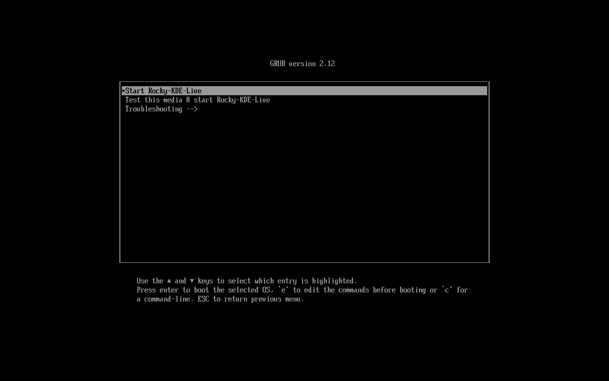
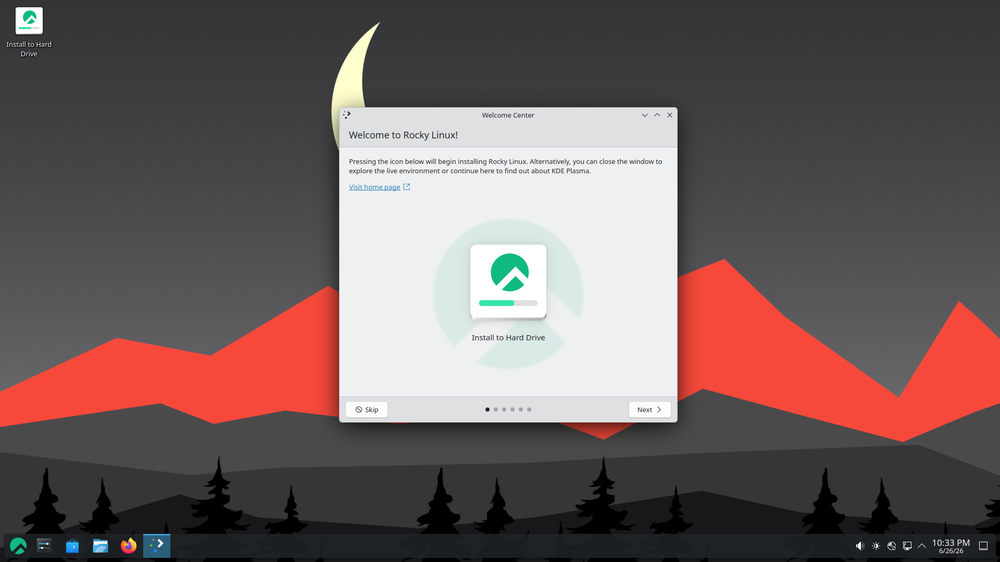
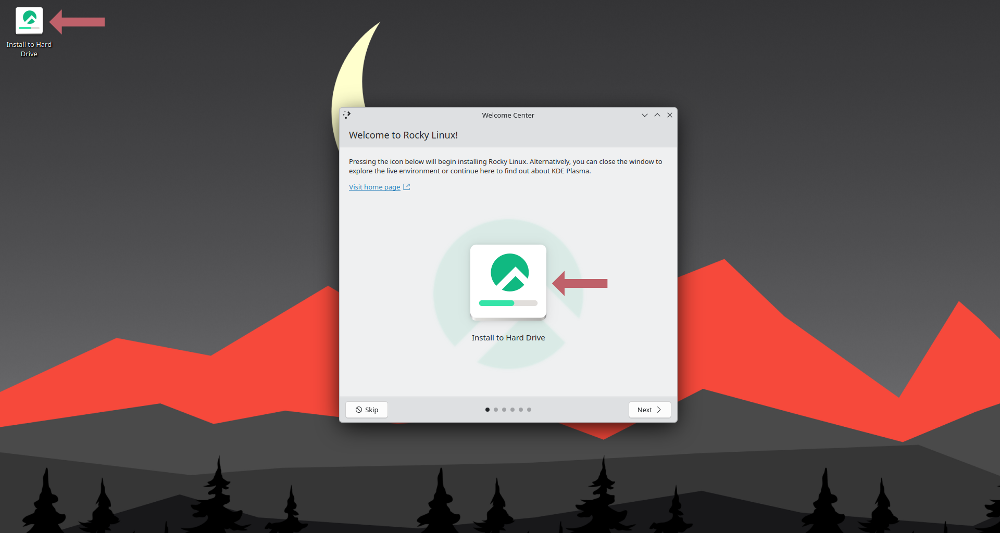
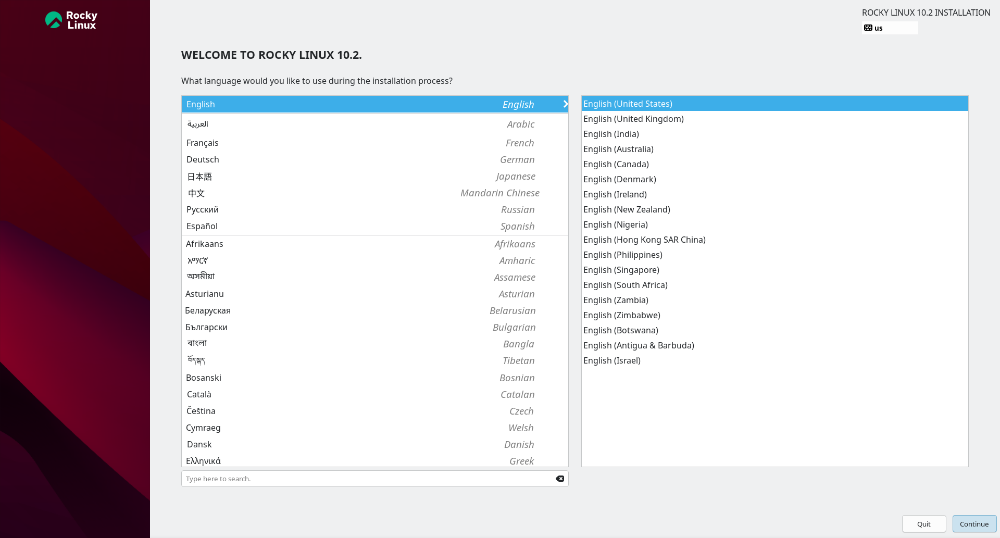
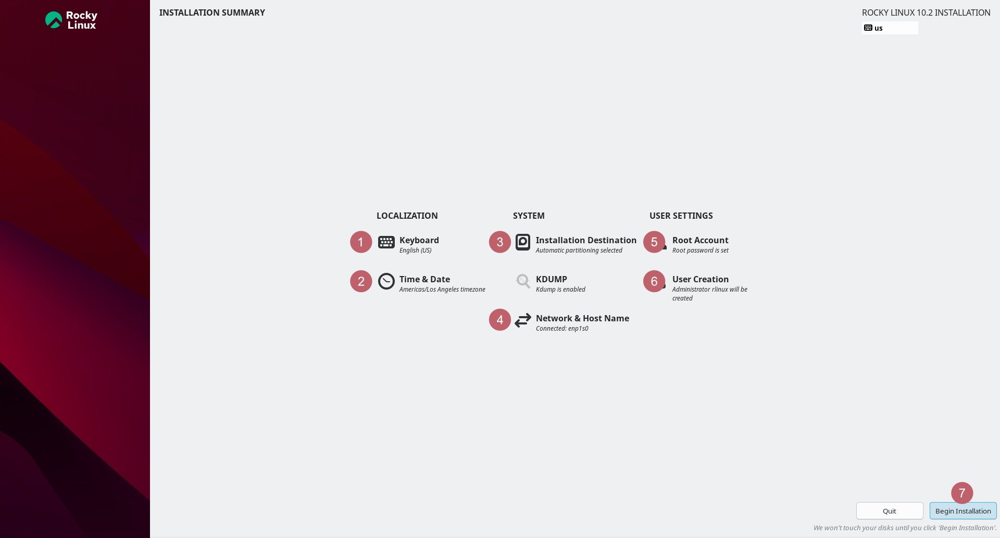
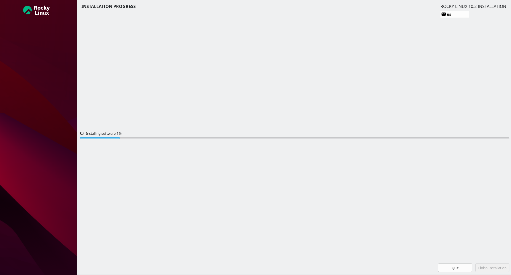
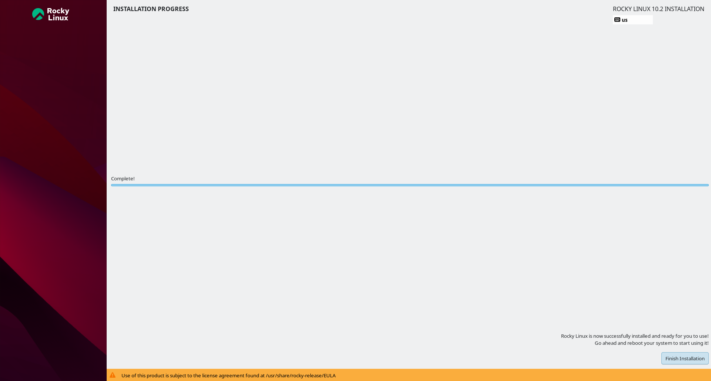
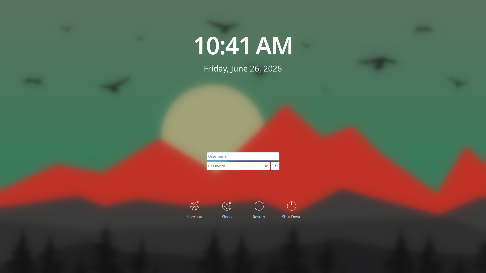
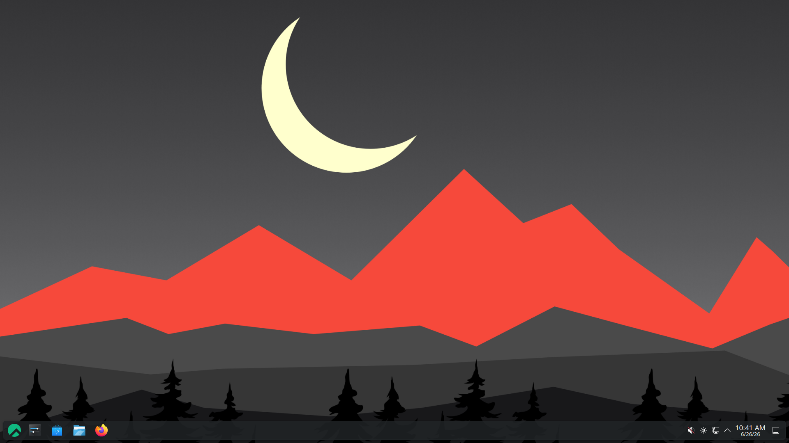

# Introduction

Thanks to the Rocky Linux development team, live images for several desktop environments are available, including KDE. For those that might not know what a live image is, it will boot up to the OS and the desktop environment using the installation media and give you a chance to kick the tires (try it out) before installing it.


!!! note

	This procedure applies to Rocky Linux 10. While there may be minor differences in screenshots or the installer between releases, the overall installation process remains the same.

## Prerequisites

- A machine compatible with Rocky Linux 10 (desktop, notebook, or server) that you want to run the KDE desktop on.
- The ability to do a few things from the command line, such as test the image checksums.
- The knowledge of how to write a bootable image to a DVD or USB thumb drive.

## Get, verify, and write the KDE live image

Prior to installation, the first step is to download the appropriate live image and write it to either a DVD or a USB thumb drive. As stated earlier, the image will be bootable, just like any other installation media for Linux. Be sure to download both the live image and its corresponding checksum file.

The latest Rocky Linux 10 KDE live images and corresponding checksum files are available from the Rocky Linux downloads page for both x86_64 and aarch64 devices:

- [x86_64](https://dl.rockylinux.org/pub/rocky/10/live/x86_64/)
- [aarch64](https://dl.rockylinux.org/pub/rocky/10/live/aarch64/)

Verify the image with the CHECKSUM file by using the following (note: this is an example! Ensure your image name and CHECKSUM files match):

```text
sha256sum -c --ignore-missing Rocky-10-KDE-x86_64-latest.iso.CHECKSUM
```

If all goes well, you should receive this message:

```text
Rocky-10-KDE-x86_64-latest.iso: OK
```

If the checksum for the file returns OK, you are now ready to write your ISO image to your media. We are assuming that you know how to write the image to your media. This procedure differs depending on the OS, the media, and the tools.

## Booting

This again is different by machine, BIOS, OS, and so on. You will need to ensure that your machine is set to boot to whatever your media is (DVD or USB) as the first boot device. You will see this screen if you are successful:



If so, you are on your way! If you want to test the media, you can choose that option first, or you can press the **Enter** key to **Start Rocky Linux KDE 10**.

Remember, this is a live image. It will take some time to boot to the first screen. Do not panic, just wait! When the live image is up, you will see this screen:



## Installing KDE

At this point, you can use the KDE environment and see if you like it. When you have decided to use it permanently, double-click **Install to Hard Drive** either on the desktop or in the Welcome Center window.



This will start a pretty familiar installation process for those who have installed Rocky Linux before. The first screen will allow you to change to your regional language:



When you have chosen your language and clicked **Continue**, the install will advance to the following screen. We have highlighted things that you *may* want to change or verify:



1. **Keyboard** - Ensure that it matches up to the keyboard layout that you use.
2. **Time & Date** - Ensure this matches up to your time zone.
3. **Installation Destination** - You will need to click into this option, even if it is just to accept what is already there.
4. **Network & Host Name** - Verify that you have what you want here. Provided the network is enabled, you can always change this later if you need to.
5. **Root Password** - Go ahead and set a root password. Remember to save this somewhere safe (password manager), particularly if it is not something you use often.
6. **User Creation** - Definitely create at least one user. If you want the user to have administrative rights, remember to set this option when creating the user.
7. **Begin Installation** - When you have set or verified all of the settings, click this option.

When you do step 7, the installation process will start installing packages, shown in this screenshot:



After the installation completes, you will see the following screen:



Take note of the license agreement message at the bottom of the installer window, then click **Finish Installation** to complete the installation process.

At this point you will need to reboot the OS and remove your boot media. When the OS comes up for the first time, a login screen will appear. You can now enter the username and password you created earlier to log in.



After logging in you will be greeted with a pristine KDE desktop screen:



## Conclusion

Thanks to the Rocky Linux development team, several desktop environments are available as live images for Rocky Linux. KDE is a solid alternative to the default GNOME desktop, and installing it from the live image is simple.

