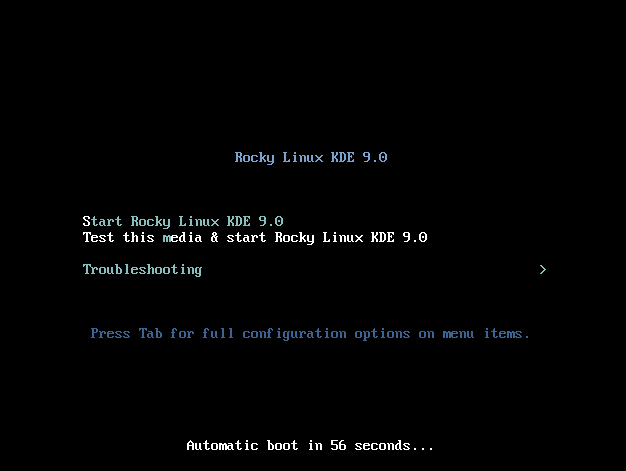
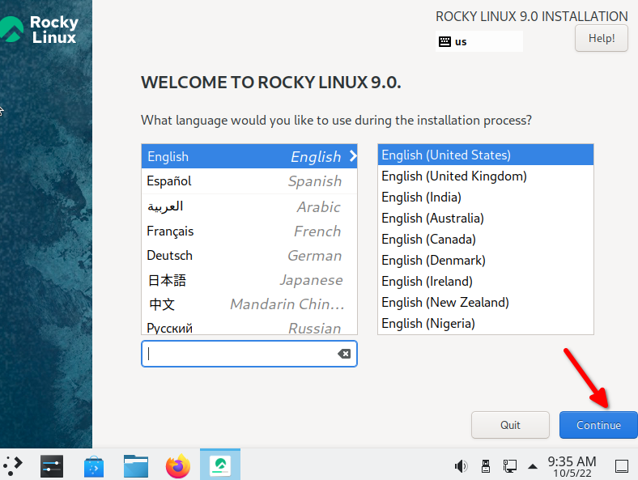
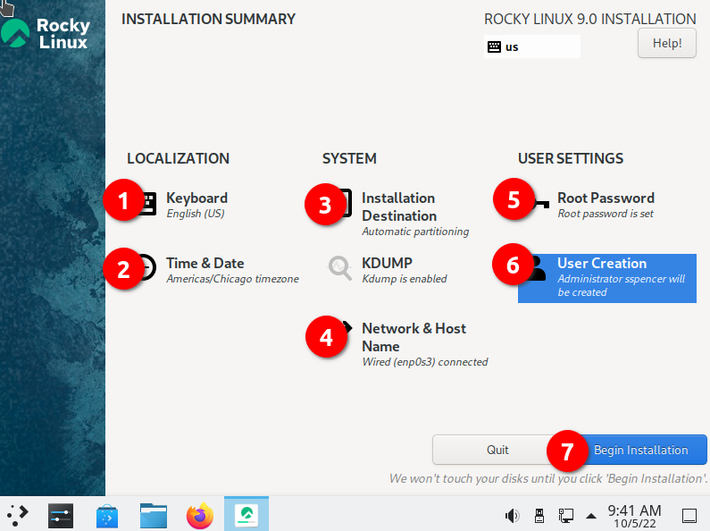
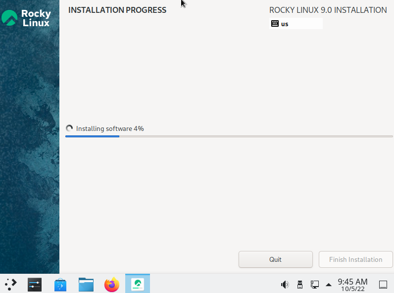
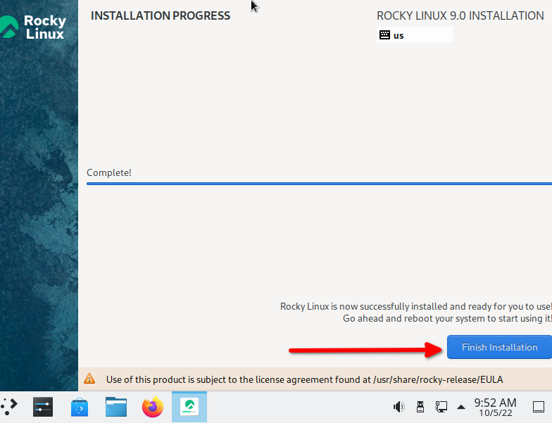
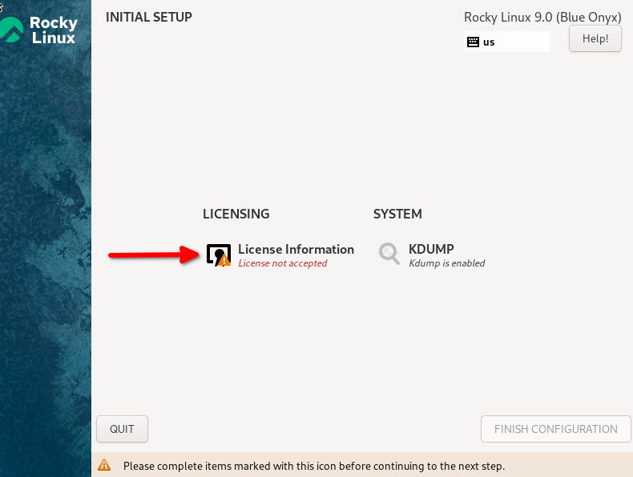
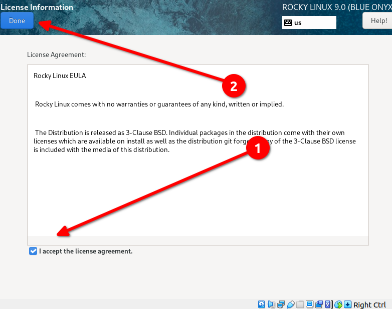
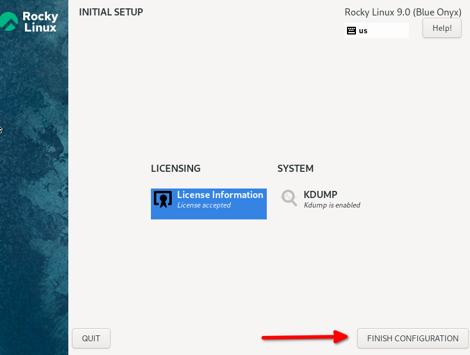
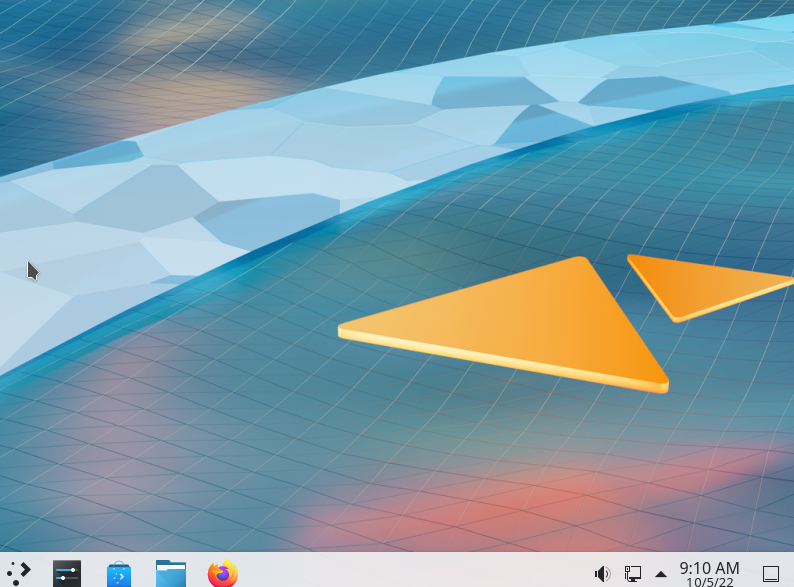

# Вступ

Завдяки команді розробників Rocky Linux є живі образи для кількох установок на робочому столі, включаючи KDE. Для тих, хто може не знати, що таке живий образ, він завантажить ОС і середовище робочого столу за допомогою інсталяційного носія та дасть вам можливість попрацювати (випробувати) перед встановленням.

!!! note "Примітка"

    Ця процедура є специфічною для Rocky Linux 9.0. Наразі не існує процедури встановлення KDE для попередніх версій Rocky Linux. 
    Не соромтеся написати одну!

## Передумови

* Машина сумісна з Rocky Linux 9.0 (настільний комп’ютер, ноутбук або сервер), на якій ви хочете запустити робочий стіл KDE.
* Можливість виконувати деякі дії з командного рядка, наприклад перевіряти контрольні суми зображення.
* Знання того, як записати завантажувальний образ на DVD або флешку USB.

## Отримання, перевірка та запис живого образу KDE

Першим кроком до інсталяції є завантаження живого образу та запис його на DVD або флешку USB. Як було зазначено раніше, образ буде завантажувальний, як і будь-який інший інсталяційний носій для Linux. Ви можете знайти останній образ KDE у розділі завантаження для Rocky Linux 9 [живі образи](https://dl.rockylinux.org/pub/rocky/9.2/live/x86_64/).

Зауважте, що це конкретне посилання передбачає x86_64 як архітектуру вашого процесора. Якщо у вас є архітектура aarch64, ви можете використовувати це зображення. Завантажте живий образ і файли контрольної суми.

Тепер перевірте зображення за допомогою файлу CHECKSUM за допомогою наступного (зверніть увагу: це приклад! Переконайтеся, що назва вашого зображення та файли CHECKSUM збігаються):

```
sha256sum -c CHECKSUM --ignore-missing Rocky-9-KDE-x86_64-latest.iso.CHECKSUM
```

Якщо все піде добре, ви повинні отримати це повідомлення:

```
Rocky-9-KDE-x86_64-latest.iso: OK
```

Якщо контрольна сума для файлу повертає ОК, тепер ви готові записати образ ISO на носій. Ця процедура відрізняється залежно від вашої ОС, носія та інструментів. Ми припускаємо, що ви знаєте, як записати зображення на свій носій.

## Завантаження

Знову ж таки, це залежить від машини, BIOS, ОС тощо. Вам потрібно переконатися, що ваша машина налаштована на завантаження будь-якого носія (DVD або USB) як першого завантажувального пристрою. У разі успіху ви повинні побачити цей екран:



Якщо так, то ви на вірному шляху! Якщо ви хочете перевірити носій, ви можете спочатку вибрати цей параметр або ввести **S**, щоб **запустити Rocky Linux KDE 9.0 **.

Пам’ятайте, що це живе зображення, тому для завантаження першого екрана знадобиться деякий час. Не панікуйте, просто почекайте! Після завантаження живого образу ви повинні побачити цей екран:


## Встановлення KDE

На цьому етапі ви можете використовувати середовище KDE і перевірити, чи воно вам подобається. Коли ви вирішите, що хочете використовувати його назавжди, двічі клацніть опцію **Установити на жорсткий диск**.

Це почне знайомий процес встановлення для тих, хто встановив Rocky Linux. Перший екран дозволить вам змінити мову на вашу регіональну мову:



Після вибору мови та натискання **Продовжити** програма встановлення перейде до наступного екрана. Ми виділили те, що ви *можете* забажати змінити та/або перевірити:



1. **Keyboard**. Подивіться на цей параметр і переконайтеся, що він відповідає розкладці клавіатури, яку ви використовуєте.
2. **Time & Date** – переконайтеся, що вона відповідає вашому часовому поясу.
3. **Installation Destination**. Вам потрібно буде натиснути цей параметр, навіть якщо це потрібно для прийняття того, що вже є.
4. **Network & Host Name**. Переконайтеся, що тут є те, що ви хочете. Поки мережа ввімкнена, ви завжди можете змінити це пізніше, якщо знадобиться.
5. **Root Password** – встановіть пароль адміністратора. Не забудьте зберегти це в безпечному місці (менеджер паролів), головним чином, якщо ви не використовуєте його часто.
6. **User Creation** – обов’язково створіть принаймні одного користувача. Якщо ви хочете, щоб користувач мав права адміністратора, не забудьте встановити цей параметр під час створення користувача.
7. **Begin Installation** – коли всі параметри встановлено або перевірено, натисніть цю опцію.

Коли ви виконаєте крок 7, процес інсталяції має почати інсталяцію пакетів, як на знімку екрана нижче:



Після завершення інсталяції на жорсткий диск ви побачите такий екран:



Натисніть **Finish Installation**.

На цьому етапі вам потрібно буде перезавантажити ОС і видалити завантажувальний носій. Коли ОС з’являється вперше, з’являється екран конфігурації:



Натисніть опцію **Licensing Information** та прийміть Ліцензійну угоду, як зазначено тут:



І нарешті завершіть налаштування:



Після завершення цього кроку з’явиться створене вами ім’я користувача. Введіть пароль, який ви створили для користувача, і натисніть <kbd>ENTER</kbd>. Це повинно показати вам незайманий екран стільниці KDE:



## Висновок

Завдяки команді розробників Rocky Linux ви можете інсталювати декілька варіантів робочого столу з живих образів для Rocky Linux 9.0. KDE — ще один варіант для тих, кому не подобається робочий стіл GNOME за замовчуванням, і його можна легко встановити разом із живим образом. 
