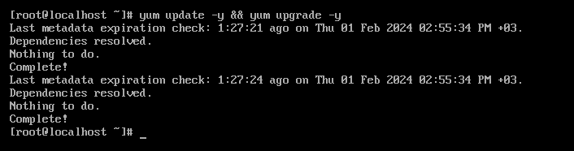
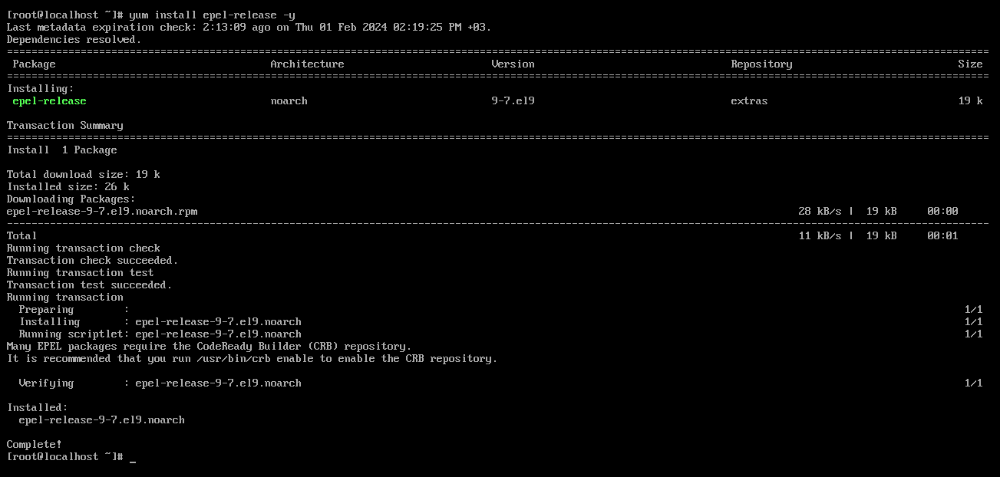
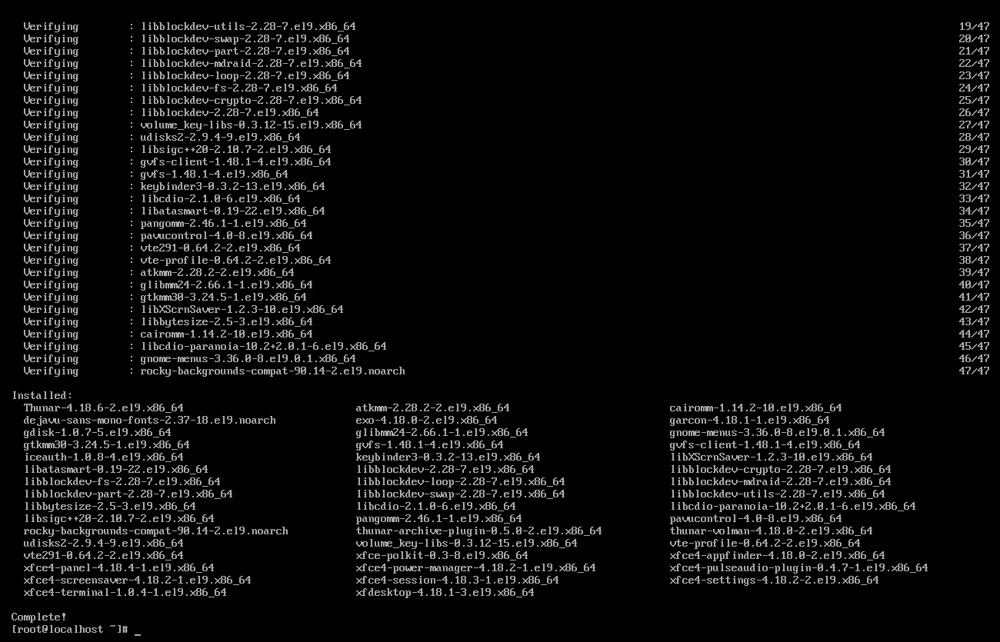
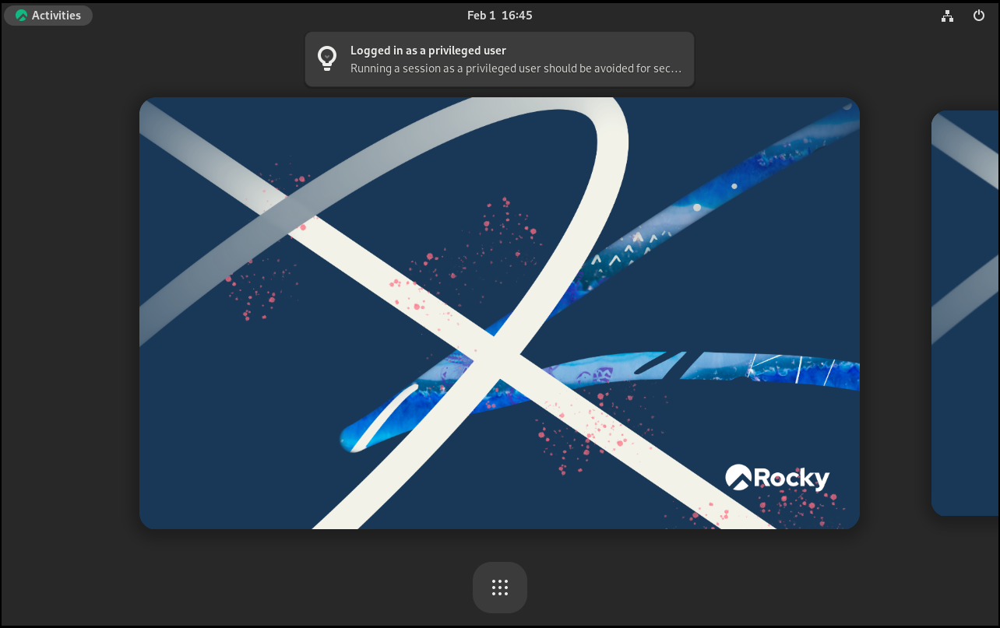
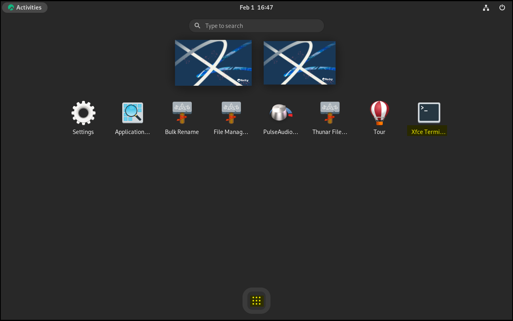

# Environnement de bureau XFCE

L'environnement de bureau XFCE, créé en tant que fork du Common Desktop Environment (CDE), incarne la philosophie Unix traditionnelle de Modularité et de Réutilisabilité. Vous pouvez installer XFCE sur la plupart des distributions GNU/Linux, y compris Rocky Linux.

C'est aussi l'un des environnements de bureau les plus faciles à combiner avec des gestionnaires de fenêtres alternatifs, tels que Awesome ou i3. Cette procédure est cependant conçue pour vous permettre de démarrer avec Rocky Linux en utilisant une installation typique de XFCE.

## Prérequis

- Une station de travail ou un notebook
- L'intention d'utiliser l'environnement de bureau XFCE au lieu de GNOME, celui par défaut
- Pour les procédures 9-minimal et 8, la possibilité d'utiliser `sudo` pour élever les privilèges

\=== "9"

    ````
    ## 9: Introduction 
    
    L'équipe de développement de Rocky Linux 9 a facilité l'installation de XFCE et d'autres environnements de bureau populaires, en incluant des images de live CD. Une image d'installation autonome, pour ceux qui ne savent peut-être pas ce que c'est, est une image amorçable qui chargera le système d'exploitation sans installation. Une fois chargé, vous pouvez l'installer sur le disque de votre ordinateur et l'utiliser.
    
    ## 9: Obtenir, vérifier et écrire l'image live XFCE
    
    Avant l'installation, la première étape consiste à télécharger l'image live et à l'écrire sur un DVD ou une clé USB. Comme indiqué précédemment, l'image sera amorçable, tout comme avec tout autre support d'installation pour Linux. Vous pouvez trouver l'image XFCE la plus récente dans la section téléchargement pour Rocky Linux 9 [images live](https://dl.rockylinux.org/pub/rocky/9.5/live/x86_64/). Notez que ce lien particulier suppose que x86_64 est l'architecture de votre processeur. 
    
    Au Moment de l'écriture de cet article, vous pouvez utiliser l'architecture x86_64 ou aarch64 pour cette image live. Téléchargez à la fois l'image live et les fichiers de vérification correspondants. 
    
    Vérifiez l'image ISO avec le fichier CHECKSUM en utilisant la commande suivante
    (n'oubliez pas qu'il sagit d'un exemple ! Assurez-vous que le nom de votre image et les fichiers CHECKSUM correspondent) :
    
    ```
    sha256sum -c CHECKSUM --ignore-missing Rocky-9-XFCE-x86_64-latest.iso.CHECKSUM
    ```
    
    
    Si tout se passe bien, vous devriez voir le message suivant :
    
    ```
    Rocky-9-XFCE-x86_64-latest.iso: OK
    ```
    
    
    Si la somme de contrôle du fichier retourne OK, vous êtes maintenant prêt à enregistrer votre image ISO sur votre support de stockage. Cette procédure est différente selon le système que vous utilisez, le support d'enregistrement et les outils. Nous supposons ici que vous savez enregistrer l'image sur un support adéquat.
    
    ## 9: Démarrage
    
    Ceci est différent selon la machine, BIOS, OS, etc. Vous devez vous assurer que votre machine est configurée pour démarrer avec n'importe quel support (DVD ou USB) comme premier périphérique de démarrage. Si l'opération a réussi, cet écran devrait apparaître :
    
    
    
    Si c'est le cas, vous êtes sur la bonne voie ! Si vous souhaitez tester la prise en charge, vous pouvez d'abord saisir cette option, ou vous pouvez saisir **S** pour **Démarrer Rocky Linux XFCE 9.0**.
    
    N'oubliez pas qu'il s'agit d'une image live. Le lancement jusqu'au premier écran prend un certain temps. Pas de panique, il suffit d'attendre ! Lors du démarrage de l'image live, vous devriez voir l'affichage suivant :
    
    
    
    
    ## 9: Installation de XFCE
    
    À partir de ce moment, vous pouvez utiliser l'environnement XFCE. Une fois que vous avez décidé de l'utiliser de manière permanente, double-cliquez sur l'option <strong x-id="1">Install to Hard Drive</strong>.
    
    Cela lancera un processus d'installation assez familier pour ceux qui ont déjà installé Rocky Linux par le passé. Le premier écran vous permet de choisir votre langue par défaut :
    
    
    
    Sur l'écran suivant vous devrez effectuer des vérifications et les modifications nécessaires. Les options sont numérotées pour référence :
    
    
    
    1. **Clavier** - Jetez un coup d'œil à cette option et assurez-vous qu'elle correspond bien à la disposition du clavier que vous utilisez.
    2. **Heure & Date** - Assurez-vous que cela correspond à votre fuseau horaire.
    3. **Destination d'installation** - Vous devrez cliquer sur cette option, même si c'est juste pour accepter ce qui est déjà indiqué.
    4. **Réseau & Nom d'Hôte** - Vérifiez que vous avez ce dont vous avez besoin ici. Tant que le réseau est activé, vous pouvez toujours modifier plus tard si vous le souhaitez.
    5. **Mot de passe root** - Allez-y et choisissez un mot de passe root. N'oubliez pas de sauvegarder ce mot de passe dans un endroit sûr (gestionnaire de mots de passe par ex.).
    6. **Création d'utilisateur** - Créez au moins un utilisateur. Si vous voulez qu'il dispose de droits d'administration, n'oubliez pas de définir cette option lors de la création de l'utilisateur.
    7. **Begin Installation** - Après vérification, cochez cette option.
    
    Une fois que vous avez effectué l'étape 7, le processus d'installation devrait commencer à installer des paquets, comme indiqué dans la capture d'écran ci-dessous :
    
    
    
    Après l'installation sur le disque dur, vous devriez voir l'affichage suivant :
    
    
    
    Cliquez sur **Finish Installation**.
    
    Lorsque vous avez fait cela, il vous ramène à l'écran de l'image live. Redémarrez votre machine et retirez le support de démarrage que vous avez utilisé pour l'installation XFCE.
    
    Ensuite, vous obtiendrez un écran de connexion avec l'utilisateur que vous avez créé précédemment. Saisissez votre mot de passe, qui vous mènera au bureau XFCE :
    
    
    ````

\=== "9-minimal"

    ````
    ## 9 minimal: Introduction
    
    If you installed Rocky Linux 9.x and decide that you want to install XFCE after, this procedure will get you there. This procedure assumes installation of `Rocky-9.4-x86_64-minimal.iso`.
    
    ### Update your system
    
    First, ensure the update of your system:
    
    ```bash
    sudo dnf update -y && dnf upgrade -y
    ```
    
    
    
    Secondly, run the command below to install epel-release repo which contains all packages that we need to install for Xfce Desktop.
    
    ```bash
    sudo dnf install epel-release -y
    ```
    
    
    
    ### Install XFCE desktop
    
    Install XFCE by running this command:
    
    ```bash
    sudo dnf groupinstall xfce -y
    ```
    
    
    
    ### Starting the XFCE desktop
    
    You can launch the XFCE desktop from the command line if you see the message "Complete!" in the command output and no errors. 
    
    ```bash
    sudo systemctl isolate graphical.target
    ```
    
    ### Enable XFCE desktop on boot
    
    At this point you have installed the XFCE desktop on the system and ensured it functions by running it from the command line. If you always want your system to start with XFCE instead of the command line, you need to run the following command. You will need to open the XFCE terminal from the 9 points icon first:
    
    ```bash
    sudo systemctl set-default graphical.target
    ```
    
    
    
    **NOTE:** You can log in with your root username and password.
    
    
    
    Now you can test it. Reboot your system with the `sudo reboot` command. You will see your system opening with the XFCE desktop login screen.
    
    
    ````

\=== "8"

    ````
    ## 8: Installation de Rocky Linux Minimal
    
    !!! note
    
        Dans cette section, vous devrez soit être l'utilisateur `root`, soit être en mesure d'exécuter `sudo` pour élever vos privilèges.
    
    Lors de l'installation de Rocky Linux, nous avons utilisé les paquets suivants :
    
    * Minimal
    * Standard
    
    
    ## 8: Exécuter la mise à jour du système
    
    D'abord, lancez la commande de mise à jour du serveur. Le système va renouveler le cache des dépôts. Lors de cette opération, le système va reconnaître les paquets disponibles.
    
    ```
    dnf update
    ```
    
    
    ## 8: Activation des dépôts
    
    Nous avons besoin du dépôt non officiel pour XFCE dans le référentiel EPEL, pour fonctionner sur les versions de Rocky 8.x.
    
    Activer ce dépôt en entrant la commande suivante :
    
    ```
    dnf install epel-release
    ```
    
    Répondez 'Y' pour l'installer.
    
    Vous avez également besoin des Powertools et des dépôts lightdm. Activez-les ainsi :
    
    ```
    dnf config-manager --set-enabled powertools
    dnf copr enable stenstorp/lightdm
    ```
    
    !!! warning "Avertissement"
    
        Le système de compilation `copr` crée un dépôt connu pour installer `lightdm`, mais n'est pas maintenu par la communauté Rocky Linux. Utilisez tout ça à vos risques et périls !
    
    Encore une fois, un message d'avertissement concernant le répertoire vous sera présenté. Allez-y et répondez `Y` à l'invite.
    
    
    ## 8.6 : Vérifiez les Environnements et Outils disponibles dans le Groupe
    
    Maintenant que les dépôts sont activés, exécutez les commandes suivantes pour tout vérifier.
    
    Tout d'abord, vérifiez votre liste de dépôts avec :
    
    ```
    dnf repolist
    ```
    
    Vous devriez récupérer les résultats suivants affichant tous les dépôts activés :
    
    ```bash
    appstream                                                        Rocky Linux 8 - AppStream
    baseos                                                           Rocky Linux 8 - BaseOS
    copr:copr.fedorainfracloud.org:stenstorp:lightdm                 Copr repo for lightdm owned by stenstorp
    epel                                                             Extra Packages for Enterprise Linux 8 - x86_64
    epel-modular                                                     Extra Packages for Enterprise Linux Modular 8 - x86_64
    extras                                                           Rocky Linux 8 - Extras
    powertools                                                       Rocky Linux 8 - PowerTools
    ```
    
    Exécutez la commande suivante pour vérifier la présence de XFCE:
    
    ```
    dnf grouplist
    ```
    
    Vous devriez obtenir "Xfce" en bas de la liste.
    
    Exécutez `dnf update` une ou plusieurs fois pour vous assurer que tous les dépôts activés sont inclus dans le système.
    
    
    ## 8: Installation des paquets
    
    Pour installer XFCE, exécutez la commande suivante :
    
    ```
    dnf groupinstall "xfce"
    ```
    
    Installez également 'lightdm' :
    
    ```
    dnf install lightdm
    ```
    
    
    ## 8: Étapes finales
    
    Nous devons désactiver le paquet `gdm`, qui est ajouté et activé pendant *dnf groupinstall "xfce"* :
    
    ```
    systemctl disable gdm
    ```
    
    Maintenant nous pouvons activer *lightdm* :
    
    ```
    systemctl enable lightdm
    ```
    
    Vous devez indiquer au système d'utiliser seulement l'interface graphique après le démarrage. Définissez le système cible par défaut vers l'interface GUI :
    
    ```
    systemctl set-default graphical.target
    ```
    
    Puis redémarrez le système :
    
    ```
    reboot
    ```
    
    Vous devriez vous retrouver avec une invite de connexion dans l'interface XFCE et, lorsque vous vous connectez, vous aurez tout l'environnement XFCE.
    ````

## Conclusion

XFCE est un environnement léger avec une interface simple. C'est une alternative à l'environnement GNOME par défaut sur Rocky Linux. Si vous utilisez Rocky Linux 9, les développeurs ont créé une image pratique qui accélère le processus d'installation.
