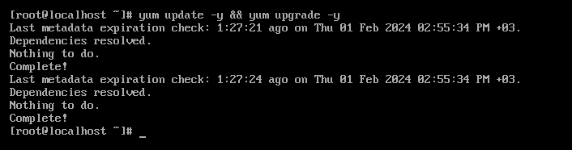
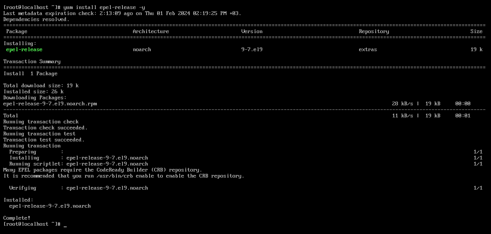
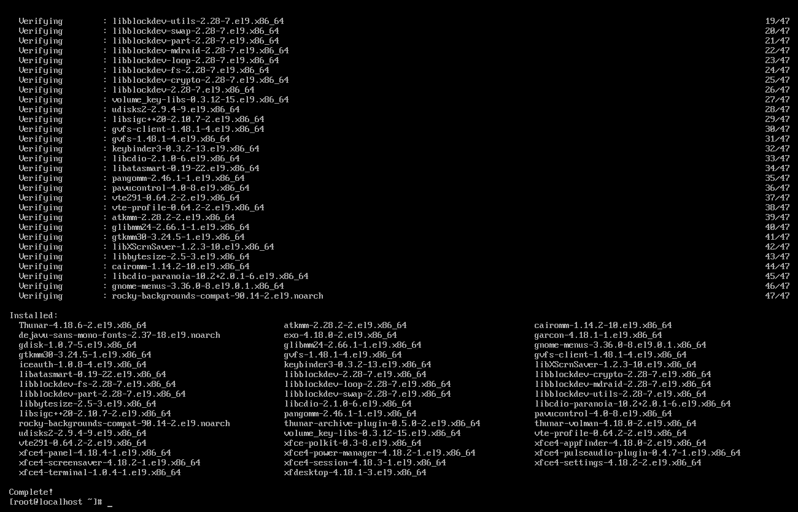
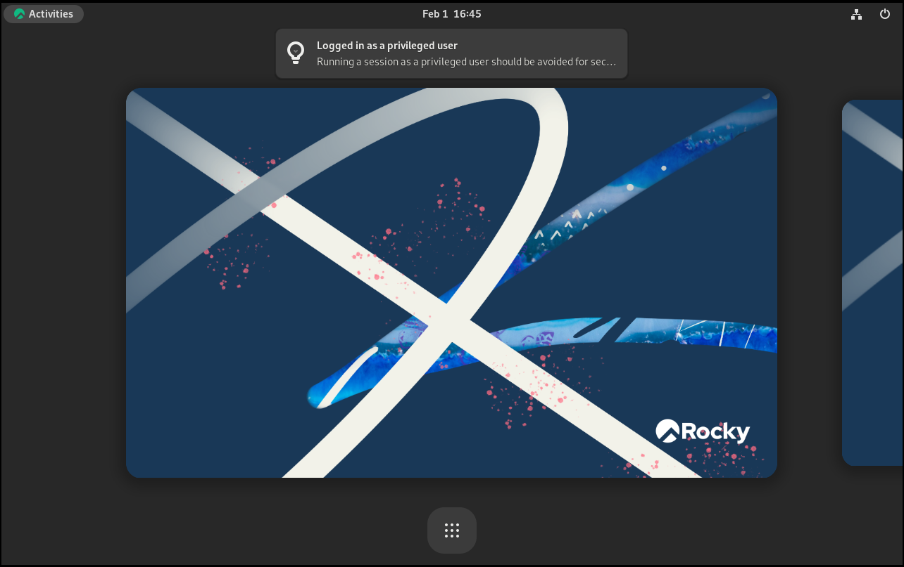

# XFCE desktop environment

The XFCE desktop environment, created as a fork of the Common Desktop Environment (CDE), embodies the traditional Unix philosophy of modularity and re-usability. You can install XFCE on almost any version of Linux, including Rocky Linux.

It is also one of the most accessible desktop environments to combine with alternate window managers, such as Awesome or i3. This procedure, however, will get you up and running with Rocky Linux and a more typical XFCE installation.

## Prerequisites

* A workstation or notebook
* A desire to run XFCE as your desktop instead of the default GNOME desktop
* For the 9 minimal and 8 procedures, the ability to `sudo` to elevate privileges

=== "9"

    ## 9: Introduction

    The development team for Rocky Linux 9 has made installing XFCE, and other popular desktop environments, uncomplicated by including live images. For those that might not know what that is, a live image is a bootable image that will load the OS without installation. When loaded, you have the option to install it to your machine's disk drive and use it.

    ## 9: Get, verify, and write the XFCE live image

    Prior to installation, the first step is to download the live image and write that to a DVD or a USB thumb drive. As stated earlier, the image will be bootable, just like any other installation media for Linux. You can find the latest XFCE image in the download section for Rocky Linux 9 [live images](https://dl.rockylinux.org/pub/rocky/9.3/live/x86_64/). Note that this particular link assumes x86_64 is your processor's architecture. 
    
    As of this writing, you can use x86_64 or aarch64 architectures for this live image. Download the live image and checksum files. 

    Verify the image with the CHECKSUM file with the following 

    (note this is an example! Ensure your image name and CHECKSUM files match): 

    ```
    sha256sum -c CHECKSUM --ignore-missing Rocky-9-XFCE-x86_64-latest.iso.CHECKSUM
    ```

    If all goes well, you will see this message:

    ```
    Rocky-9-XFCE-x86_64-latest.iso: OK
    ```

    If the checksum for the file returns OK, you are now ready to write your ISO image to your media. This procedure differs depending on the OS, the media, and the tools. We are assuming here that you know how to write the image to your media.

    ## 9: Booting

    This again is different by machine, BIOS, OS, and so on. You will need to ensure that your machine is set to boot to whatever your media is (DVD or USB) as the first boot device. This screen will show if you are successful:

    

    If so, you are on your way! If you want to test the media, you can enter that option first, or you can enter **S** to **Start Rocky Linux XFCE 9.0**.

    Remember, this is a live image. It is going to take some time to boot to the first screen. Do not panic, just wait! When the live image boots, you will see this screen:


    

    ## 9: Installing XFCE

    At this point, you can use the XFCE environment. When you decide to use it permanently, double-click the option to Install to Hard Drive.

    This will start a pretty familiar installation process for those who have installed Rocky Linux before. The first screen will allow the selection your default language:

    

    The next screen will have some things that you need to verify or change. The options are numbered for reference:

    

    1. **Keyboard** - Ensure that it matches up to the keyboard layout that you use.
    2. **Time & Date** - Ensure this matches up to your time zone.
    3. **Installation Destination** - You will need to click into this option, even if it is just to accept what is already there.
    4. **Network & Host Name** - Verify that you have what you want here. Provided the network is enabled, you can always change this later if you need to.
    5. **Root Password** - Set a root password. Remember to save this somewhere safe (password manager).
    6. **User Creation** - Create at least one user. If you want the user to have administrative rights, set this option when creating the user.
    7. **Begin Installation** - When completed and verified, click this option.

    When you do step 7, the installation process will start installing packages, shown in this screenshot:

    

    After the installation to the hard drive is complete, you will see the following screen:

    

    Click **Finish Installation**.

    When you have done this, it will take you back to the live image screen. Reboot your machine and remove the boot media you used for the XFCE install.

    Next you will get a login screen with the user you created above. Enter your password, which will get you to the XFCE desktop:

    

=== "9-minimal"

    ## 9 minimal: Introduction

    If you installed Rocky Linux 9.x and decide that you want to install XFCE after, this procedure will get you there. This procedure assumes installation of `Rocky-9.3-x86_64-minimal.iso`.

    ### Update your system

    First, ensure the update of your system:

    ```bash
    sudo dnf update -y && dnf upgrade -y
    ```

    

    Secondly, run the command below to install epel-release repo which contains all packages that we need to install for Xfce Desktop.

    ```bash
    sudo dnf install epel-release -y
    ```

    

    ### Install XFCE desktop

    Install XFCE by running this command:

    ```bash
    sudo dnf groupinstall xfce -y
    ```

    

    ### Starting the XFCE desktop

    If you see the message "Complete!" in the command output and no errors, you are now ready to launch the XFCE desktop from the command line.

    ```bash
    sudo systemctl isolate graphical.target
    ```

    ### Enable XFCE desktop on boot

    At this point you have installed the XFCE desktop on the system and ensured it functions by running it from the command line. If you always want your system to start with XFCE instead of the command line, you need to run the following command. You will need to open the XFCE terminal from the 9 points icon first:

    ```bash
    sudo systemctl set-default graphical.target
    ```

    

    **NOTE:** You can login as your root username and password.

    

    Now you can test it. Reboot your system with the `sudo reboot` command. You will see your system opening with the XFCE desktop login screen.

    

=== "8"

    ## 8: Install Rocky Linux minimal

    !!! note

        Throughout this section, you will either need to be the root user or be able to `sudo` to elevate your privileges.

    When installing Rocky Linux, we used the following sets of packages:

    * Minimal
    * Standard

    ## 8: Run System Update

    First, run the server update command. The system will rebuild the repository cache. In this way, the system cab recognize the packages available.

    ```
    dnf update
    ```

    ## 8: Enabling repositories

    You need the unofficial repository for XFCE in the EPEL repository, to run on Rocky 8.x versions.

    Enable this repository by entering:

    ```
    dnf install epel-release
    ```

    Answer 'Y' to install it.

    You also need the Powertools and lightdm repositories. Enable those now:

    ```
    dnf config-manager --set-enabled powertools
    dnf copr enable stenstorp/lightdm
    ```

    !!! Warning

        The `copr` build system creates a repository that is known to work for installing `lightdm`, but is not maintained by the Rocky Linux community. Use at your own risk!

    Again, you will be presented with a warning message about the repository. Go ahead and answer `Y` to the prompt.

    ## 8: Check the available environments and tools in the group

    Now that the repositories are enabled, run the following commands to check everything.

    First, check your repository listing with:

    ```
    dnf repolist
    ```

    You should get the following back showing all of the enabled repositories:

    ```bash
    appstream                                                        Rocky Linux 8 - AppStream
    baseos                                                           Rocky Linux 8 - BaseOS
    copr:copr.fedorainfracloud.org:stenstorp:lightdm                 Copr repo for lightdm owned by stenstorp
    epel                                                             Extra Packages for Enterprise Linux 8 - x86_64
    epel-modular                                                     Extra Packages for Enterprise Linux Modular 8 - x86_64
    extras                                                           Rocky Linux 8 - Extras
    powertools                                                       Rocky Linux 8 - PowerTools
    ```

    Run the following command to check for XFCE:

    ```
    dnf grouplist
    ```

    You should see "Xfce" at the bottom of the listing.

    Run `dnf update` one more time to ensure all of the enabled repositories read into the system.

    ## 8: Installing packages

    To install XFCE, run:

    ```
    dnf groupinstall "xfce"
    ```

    Also install lightdm:

    ```
    dnf install lightdm
    ```

    ## 8: Final steps

    You need to disable `gdm`, which gets added and enabled during *dnf groupinstall "xfce"*:

    ```
    systemctl disable gdm
    ```

    Now you can enable *lightdm*:

    ```
    systemctl enable lightdm
    ```

    You need to tell the system after booting to use only the graphical user interface. Set the default target system to the GUI interface:

    ```
    systemctl set-default graphical.target
    ```

    Then reboot:

    ```
    reboot
    ```

    You should end up with a login prompt in the XFCE GUI, and when you login, you will have all of the XFCE environment.

## Conclusion

XFCE is a light environment with a simplistic interface. It is an alternative to the default GNOME desktop on Rocky Linux. If you are running Rocky Linux 9, the developers have created a handy live image that speeds up the installation process.
