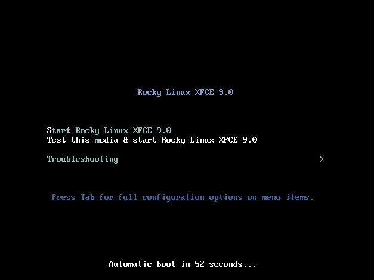
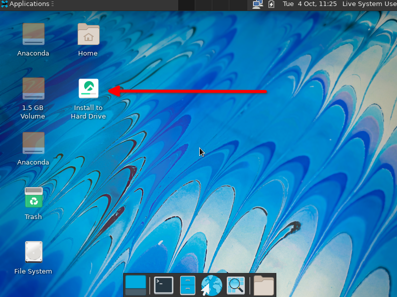
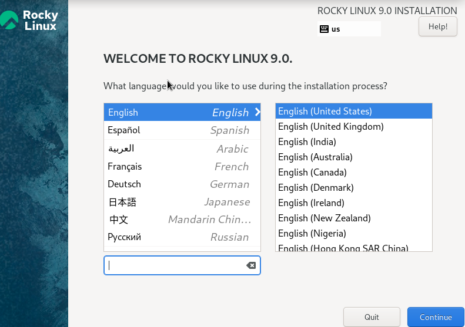
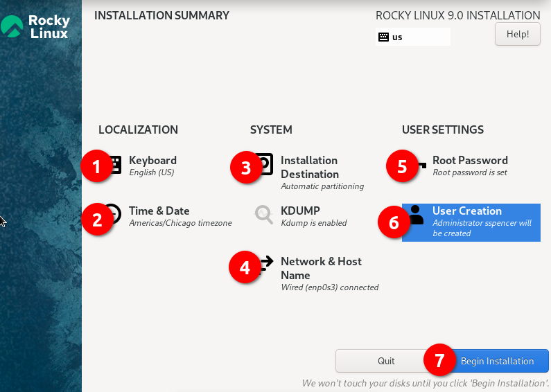
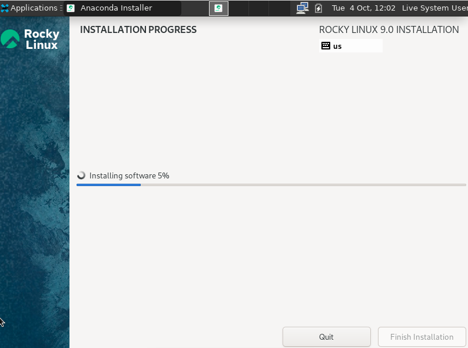
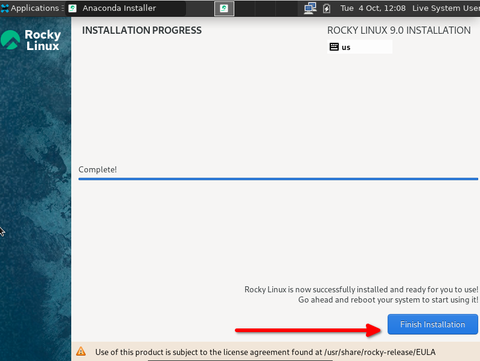
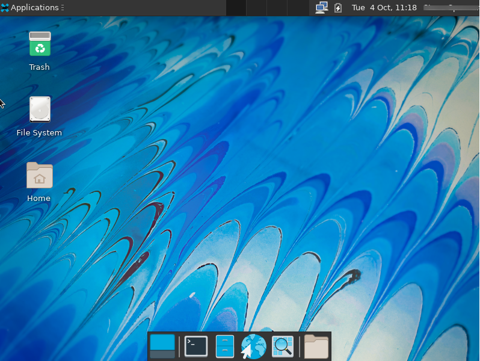

- - -
title: XFCE Desktop author: Gerard Arthus, Steven Spencer contributors: Steven Spencer, Antoine Le Morvan, K.Prasad tested_with: 8.5, 8.6, 9.0 tags:
  - xfce
  - робочий стіл
- - -

# Середовище робочого столу XFCE

Середовище робочого столу XFCE було створено як розгалуження загального середовища робочого столу (CDE). XFCE втілює традиційну філософію Unix модульності та багаторазового використання. XFCE можна встановити практично на будь-яку версію Linux, включаючи Rocky Linux.

Це також одне з найдоступніших середовищ робочого столу для поєднання з альтернативними менеджерами вікон, такими як Awesome або i3. Ця процедура, однак, призначена для того, щоб ви почали працювати з Rocky Linux за допомогою типовішої інсталяції XFCE.

## Передумови

* Робоча станція або ноутбук
* Бажання запустити XFCE як робочий стіл замість стандартного робочого столу GNOME

=== "9"

    ## 9: Вступ
    
    Команда розробників Rocky Linux 9 спростила встановлення XFCE та інших популярних робочих середовищ, включивши живі образи. Для тих, хто може не знати, що це таке, живий образ – це завантажувальний образ, який завантажує ОС без встановлення. Після завантаження ви можете встановити його на дисковод вашої машини та використовувати.
    
    ## 9: Отримайте, перевірте та запишіть живий образ XFCE
    
    Першим кроком до інсталяції є завантаження живого образу та запис його на DVD або флешку USB. Як було зазначено раніше, образ буде завантажувальний, як і будь-який інший інсталяційний носій для Linux. Ви можете знайти останній образ XFCE у розділі завантаження для Rocky Linux 9 [живі зображення](https://dl.rockylinux.org/pub/rocky/9.2/live/x86_64/). 
    Зауважте, що це конкретне посилання передбачає, що x86_64 є архітектурою вашого процесора. 
    
    На момент написання цієї статті ви можете використовувати архітектуру x86_64 або aarch64 для цього живого образу. Завантажте живий образ і файли контрольної суми. 
    
    Тепер перевірте зображення за допомогою файлу CHECKSUM за допомогою наступного
    (зверніть увагу, це приклад! Переконайтеся, що назва вашого зображення та файли CHECKSUM збігаються):

    ```
    sha256sum -c CHECKSUM --ignore-missing Rocky-9-XFCE-x86_64-latest.iso.CHECKSUM
    ```


    Якщо все піде добре, ви повинні побачити це повідомлення:

    ```
    Rocky-9-XFCE-x86_64-latest.iso: OK
    ```


    Якщо контрольна сума для файлу повертає ОК, тепер ви готові записати образ ISO на носій. Ця процедура відрізняється залежно від вашої ОС, носія та інструментів. Ми припускаємо, що ви знаєте, як записати зображення на свій носій.
    
    ## 9: Завантаження
    
    Знову ж таки, це залежить від машини, BIOS, ОС тощо. Вам потрібно переконатися, що ваша машина налаштована на завантаження будь-якого носія (DVD або USB) як першого завантажувального пристрою. У разі успіху ви повинні побачити цей екран:
    
    
    
    Якщо так, то ви на вірному шляху! Якщо ви хочете протестувати носій, ви можете спочатку вибрати цей параметр або ввести **S**, щоб **запустити Rocky Linux XFCE 9.0**.
    
    Пам’ятайте, що це живе зображення, тому для завантаження першого екрана знадобиться деякий час. Не панікуйте, просто почекайте! 
    
    ## 9: Встановлення XFCE
    
    На цьому етапі ви можете використовувати середовище XFCE і перевірити, чи воно вам подобається. Коли ви вирішите, що хочете використовувати його назавжди, двічі клацніть опцію «Встановити на жорсткий диск».
    
    Це почне знайомий процес встановлення для тих, хто встановив Rocky Linux. На першому екрані буде вибір мови за умовчанням:
    
    
    
    На наступному екрані буде ряд речей, які вам потрібно або перевірити, або змінити. Параметри пронумеровані для довідки:
    
    

    1. **Keyboard**. Подивіться на цей параметр і переконайтеся, що він відповідає розкладці клавіатури, яку ви використовуєте.
    2. **Time & Date** – переконайтеся, що вона відповідає вашому часовому поясу.
    3. **Installation Destination**. Вам потрібно буде натиснути цей параметр, навіть якщо це потрібно для прийняття того, що вже є.
    4. **Network & Host Name**. Переконайтеся, що тут є те, що ви хочете. Поки мережа ввімкнена, ви завжди можете змінити це пізніше, якщо знадобиться.
    5. **Root Password** – встановіть пароль адміністратора. Не забудьте зберегти це в безпечному місці (менеджер паролів), головним чином, якщо ви не використовуєте його часто.
    6. **User Creation** – обов’язково створіть принаймні одного користувача. Якщо ви хочете, щоб користувач мав права адміністратора, не забудьте встановити цей параметр під час створення користувача.
    7. **Begin Installation** – коли всі параметри встановлено або перевірено, натисніть цю опцію.

    Коли ви виконаєте крок 7, процес інсталяції має почати інсталяцію пакетів, як на знімку екрана нижче:

    

    Після завершення інсталяції на жорсткий диск ви побачите такий екран:

    

    Натисніть **Finish Installation**.

    Коли ви це зробите, ви повернетеся до екрана живого зображення. Перезавантажте машину та видаліть завантажувальний носій, який використовувався для встановлення XFCE.

    Далі ви отримаєте екран входу з користувачем, якого ви створили вище. Введіть свій пароль, який переведе вас на робочий стіл XFCE:

    

=== "8"

    ## 8: Встановлення Rocky Linux Minimal
    
    !!! note "Примітка"
    
         У цьому розділі вам потрібно буде або бути користувачем root, або мати можливість використовувати sudo, щоб підвищити свої привілеї.
    
    Під час встановлення Rocky Linux ми використовували такі набори пакетів:

    * Minimal
    * Standard


    ## 8: Запуск оновлення системи

    Спочатку запустіть команду server update, щоб дозволити системі перебудувати кеш сховища, щоб вона могла розпізнавати пакети, доступні в ньому.

    ```
    dnf update
    ```


    ## 8: Увімкнення репозиторіїв

    Нам потрібен неофіційний репозиторій для XFCE у сховищі EPEL для роботи на версіях Rocky 8.x.

    Увімкніть це сховище, ввівши:

    ```
    dnf install epel-release
    ```

    Щоб установити його, дайте відповідь «Y».

    Вам також потрібні репозиторії Powertools і lightdm. Увімкніть їх зараз:

    ```
    dnf config-manager --set-enabled powertools
    dnf copr enable stenstorp/lightdm
    ```

    !!! Warning "Увага"

        Система збірки `copr` створює репозиторій, який, як відомо, працює для встановлення `lightdm`, але не підтримується спільнотою Rocky Linux. Використовуйте на свій страх і ризик!

    Знову вам буде запропоновано попередження про репозиторій. Дайте відповідь `Y` на підказку.


    ## 8: Перевірте доступні середовища та інструменти в групі

    Тепер, коли репозиторії ввімкнено, виконайте наступні команди, щоб перевірити все.

    Спочатку перевірте свій список сховища за допомогою:

    ```
    dnf repolist
    ```

    Ви повинні отримати наступне, що показує всі ввімкнені сховища:

    ```bash
    appstream                                                        Rocky Linux 8 - AppStream
    baseos                                                           Rocky Linux 8 - BaseOS
    copr:copr.fedorainfracloud.org:stenstorp:lightdm                 Copr repo for lightdm owned by stenstorp
    epel                                                             Extra Packages for Enterprise Linux 8 - x86_64
    epel-modular                                                     Extra Packages for Enterprise Linux Modular 8 - x86_64
    extras                                                           Rocky Linux 8 - Extras
    powertools                                                       Rocky Linux 8 - PowerTools
    ```

    Потім виконайте таку команду, щоб перевірити XFCE:

    ```
    dnf grouplist
    ```

    Ви повинні побачити «Xfce» у нижній частині списку.

    Запустіть `dnf update` ще раз, щоб переконатися, що всі активовані репозиторії зчитуються в системі.


    ## 8: Встановлення пакетів

    Щоб встановити XFCE, запустіть:

    ```
    dnf groupinstall "xfce"
    ```

    Також встановіть lightdm:

    ```
    dnf install lightdm
    ```


    ## 8: Останні кроки

    Нам потрібно вимкнути `gdm`, який додається та вмикається під час *dnf groupinstall "xfce"*:

    ```
    systemctl disable gdm
    ```

    Тепер ми можемо ввімкнути *lightdm*:

    ```
    systemctl enable lightdm
    ```

    Нам потрібно повідомити системі після завантаження використовувати лише графічний інтерфейс користувача, тому для цього встановіть цільовою системою за замовчуванням інтерфейс GUI:

    ```
    systemctl set-default graphical.target
    ```

    Потім перезавантажте:

    ```
    reboot
    ```

    Ви маєте отримати запит на вхід у графічний інтерфейс XFCE, і коли ви ввійдете, ви матимете все середовище XFCE.

## Висновок

XFCE — це легке середовище з простим інтерфейсом. Це альтернатива стандартному робочому столу GNOME у Rocky Linux. Якщо ви використовуєте Rocky Linux 9, розробники створили зручний живий образ, який пришвидшує процес встановлення.
