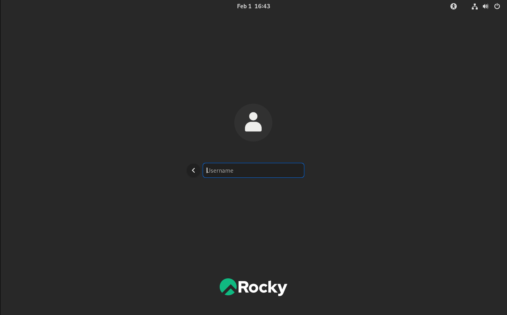
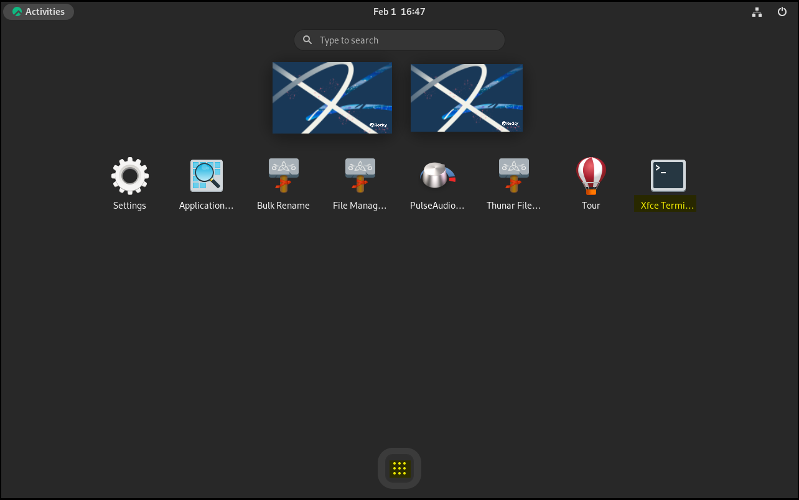

# Середовище робочого столу XFCE

Середовище робочого столу XFCE, створене як розгалуження загального середовища робочого столу (CDE), втілює традиційну філософію Unix модульності та багаторазового використання. Ви можете встановити XFCE практично на будь-яку версію Linux, включаючи Rocky Linux.

Це також одне з найдоступніших середовищ робочого столу для поєднання з альтернативними менеджерами вікон, такими як Awesome або i3. Ця процедура, однак, призначена для того, щоб ви почали працювати з Rocky Linux за допомогою типовішої інсталяції XFCE.

## Передумови

- Робоча станція або ноутбук
- Бажання запустити XFCE як робочий стіл замість стандартного робочого столу GNOME
- Для 9 мінімальних та 8 процедур, можливість підвищення привілеїв за допомогою `sudo`

\=== "9"

    ````
    ## 9: Вступ
    
    Команда розробників Rocky Linux 9 спростила встановлення XFCE та інших популярних середовищ робочого столу, включивши live-образи. Для тих, хто, можливо, не знає, що це таке, live-образ – це завантажувальний образ, який завантажує ОС без встановлення. Після завантаження ви маєте можливість встановити його на диск вашого комп’ютера та використовувати.
    
    ## 9: Отримання, перевірка та запис живого образу XFCE
    
    Перед встановленням першим кроком є ​​завантаження образу Live-версії та запис його на DVD-диск або USB-флешку. Як зазначалося раніше, образ буде завантажувальним, як і будь-який інший інсталяційний носій для Linux. Ви можете знайти найновіший образ XFCE у розділі завантажень для Rocky Linux 9 [образи Live-версії] (https://dl.rockylinux.org/pub/rocky/9.6/live/x86_64/). Зверніть увагу, що це посилання передбачає, що архітектура вашого процесора — x86_64. 
    
    На момент написання цієї статті для цього образу Live-версії можна використовувати архітектури x86_64 або aarch64. Завантажте файли образу Live-версії та контрольної суми. 
    
    Перевірте зображення з файлом CHECKSUM за допомогою наступного 
    
    (зверніть увагу, що це приклад! Переконайтеся, що назва вашого образу та файли CHECKSUM збігаються): 
    
    ```
    sha256sum -c CHECKSUM --ignore-missing Rocky-9-XFCE-x86_64-latest.iso.CHECKSUM
    ```
    
    Якщо все буде добре, ви побачите це повідомлення:
    
    ```
    Rocky-9-XFCE-x86_64-latest.iso: OK
    ```
    
    Якщо контрольна сума файлу вказана правильно, ви готові записати ISO-образ на носій. Ця процедура залежить від ОС, носія та інструментів. Ми припускаємо, що ви знаєте, як записати образ на носій.
    
    ## 9: Booting
    
    Це знову ж таки залежить від машини, BIOS, ОС тощо. Вам потрібно буде переконатися, що ваша машина налаштована на завантаження з будь-якого вашого носія (DVD або USB) як першого пристрою завантаження. Цей екран покаже, чи вам вдалося це зробити:
    
    
    
    Якщо так, то ви на правильному шляху! Якщо ви хочете протестувати носій, ви можете спочатку ввести цю опцію або ввести **S**, щоб **Запустити Rocky Linux XFCE 9.0**.
    
    Пам’ятайте, що це живий образ. Завантаження до першого екрана займе деякий час. Не панікуйте, просто зачекайте! Коли живий образ завантажиться, ви побачите цей екран:
    
    
    
    
    ## 9: Встановлення XFCE
    
    На цьому етапі ви можете використовувати середовище XFCE. Якщо ви вирішите використовувати його постійно, двічі клацніть опцію «Встановити на жорсткий диск».
    
    Це розпочне досить знайомий процес встановлення для тих, хто раніше встановлював Rocky Linux. На першому екрані ви зможете вибрати мову за замовчуванням:
    
    
    
    На наступному екрані буде показано деякі речі, які вам потрібно перевірити або змінити. Варіанти пронумеровані для довідки:
    
    
    
    1. **Keyboard** - Переконайтеся, що вона відповідає розкладці клавіатури, яку ви використовуєте.
    2. **Time & Date** - Переконайтеся, що це відповідає вашому часовому поясу.
    3. **Installation Destination** - Вам потрібно буде скористатися цією опцією, навіть якщо це просто для того, щоб прийняти те, що вже є.
    4. **Network & Host Name** - Перевірте, чи у вас тут є все, що вам потрібно. За умови, що мережа ввімкнена, ви завжди можете змінити це пізніше, якщо вам потрібно.
    5. **Root Password** - Встановіть пароль root. Не забудьте зберегти його в безпечному місці (у менеджері паролів).
    6. **User Creation** - Створіть принаймні одного користувача. Якщо ви хочете, щоб користувач мав права адміністратора, установіть цей параметр під час створення користувача.
    7. **Begin Installation** - Після завершення та перевірки натисніть цю опцію.
    
    Коли ви виконаєте крок 7, процес встановлення розпочнеться, як показано на цьому скріншоті:
    
    
    
    Після завершення встановлення на жорсткий диск ви побачите наступний екран:
    
    
    
    Натисніть **Finish Installation**.
    
    Після цього ви повернетеся до екрана образу в реальному часі. Перезавантажте комп'ютер і вийміть завантажувальний носій, який ви використовували для встановлення XFCE.
    
    Далі ви побачите екран входу з користувачем, якого ви створили вище. Введіть свій пароль, який переведе вас на робочий стіл XFCE:
    
    
    ````

\=== "9-minimal"

    ````
    ## 9 minimal: Вступ
    
    Якщо ви встановили Rocky Linux 9.x і вирішили, що після цього хочете встановити XFCE, ця процедура допоможе вам у цьому. Ця процедура передбачає встановлення `Rocky-9.4-x86_64-minimal.iso`.
    
    ### Оновіть свою систему
    
    Спочатку переконайтеся, що ваша система оновлена:
    
    ```bash
    sudo dnf update -y && dnf upgrade -y
    ```
    
    
    
    По-друге, виконайте команду нижче, щоб встановити репозиторій epel-release, який містить усі пакети, необхідні для Xfce Desktop.
    
    ```bash
    sudo dnf install epel-release -y
    ```
    
    
    
    ### Встановлення робочого столу XFCE
    
    Встановіть XFCE, виконавши цю команду:
    
    ```bash
    sudo dnf groupinstall xfce -y
    ```
    
    
    
    ### Запуск робочого столу XFCE
    
    Ви можете запустити робочий стіл XFCE з командного рядка, якщо у виведеному командному рядку відображається повідомлення "Complete!" (Завершено!) і помилок немає. 
    
    ```bash
    sudo systemctl isolate graphical.target
    ```
    
    ### Увімкнути робочий стіл XFCE під час завантаження
    
    На цьому етапі ви встановили робочий стіл XFCE в систему та забезпечили його функціональність, запустивши його з командного рядка. Якщо ви завжди хочете, щоб ваша система запускалася з XFCE, а не з командного рядка, вам потрібно виконати таку команду. Спочатку вам потрібно буде відкрити термінал XFCE за допомогою значка з 9 точками:
    
    ```bash
    sudo systemctl set-default graphical.target
    ```
    
    
    
    **ПРИМІТКА:** Ви можете увійти, використовуючи своє ім’я користувача та пароль root.
    
    
    
    Тепер ви можете це перевірити. Перезавантажте систему за допомогою команди `sudo reboot`. Ви побачите, як ваша система відкриється з екраном входу на робочий стіл XFCE.
    
    
    ````

\=== "8"

    ````
    ## 8: Встановлення мінімальної версії Rocky Linux
    
    !!! note
    
        У цьому розділі вам потрібно буде або бути користувачем root, або мати можливість підвищити свої привілеї за допомогою команди `sudo`.
    
    Під час встановлення Rocky Linux ми використовували такі набори пакетів:
    
    * Minimal
    * Standard
    
    ## 8: Запустити оновлення системи
    
    Спочатку виконайте команду оновлення сервера. Система перебудує кеш репозиторію. Таким чином, система зможе розпізнати доступні пакети.
    
    ```
    dnf update
    ```
    
    ## 8: Увімкнення репозиторіїв
    
    Вам потрібен неофіційний репозиторій XFCE у репозиторії EPEL, щоб він працював на версіях Rocky 8.x.
    
    Увімкніть цей репозиторій, ввівши:
    
    ```
    dnf install epel-release
    ```
    
    Дайте відповідь «Y», щоб встановити його.
    
    Вам також знадобляться репозиторії Powertools та lightdm. Увімкніть їх зараз:
    
    ```
    dnf config-manager --set-enabled powertools
    dnf copr enable stenstorp/lightdm
    ```
    
    !!! Warning
    
        Система збірки `copr` створює репозиторій, який, як відомо, працює для встановлення `lightdm`, але не підтримується спільнотою Rocky Linux. Використовуйте на свій страх і ризик!
    
    Знову ж таки, вам буде представлено попередження про репозиторій. Спробуйте відповісти «Так» на запитання.
    
    ## 8: Перевірте доступні середовища та інструменти в групі
    
    Тепер, коли репозиторії ввімкнено, виконайте наступні команди, щоб перевірити все.
    
    Спочатку перевірте список вашого репозиторію за допомогою:
    
    ```
    dnf repolist
    ```
    
    Ви повинні отримати наступне повідомлення, яке відображає всі ввімкнені репозиторії:
    
    ```bash
    appstream                                                        Rocky Linux 8 - AppStream
    baseos                                                           Rocky Linux 8 - BaseOS
    copr:copr.fedorainfracloud.org:stenstorp:lightdm                 Copr repo for lightdm owned by stenstorp
    epel                                                             Extra Packages for Enterprise Linux 8 - x86_64
    epel-modular                                                     Extra Packages for Enterprise Linux Modular 8 - x86_64
    extras                                                           Rocky Linux 8 - Extras
    powertools                                                       Rocky Linux 8 - PowerTools
    ```
    
    Виконайте таку команду, щоб перевірити наявність XFCE:
    
    ```
    dnf grouplist
    ```
    
    Ви повинні побачити "Xfce" внизу списку.
    
    Виконайте команду `dnf update` ще раз, щоб переконатися, що всі ввімкнені репозиторії зчитано в систему.
    
    ## 8: Встановлення пакетів
    
    Щоб встановити XFCE, виконайте команду:
    
    ```
    dnf groupinstall "xfce"
    ```
    
    Також встановіть lightdm:
    
    ```
    dnf install lightdm
    ```
    
    ## 8: Заключні кроки
    
    Вам потрібно вимкнути `gdm`, який додається та вмикається під час *dnf groupinstall "xfce"*:
    
    ```
    systemctl disable gdm
    ```
    
    Тепер ви можете увімкнути *lightdm*:
    
    ```
    systemctl enable lightdm
    ```
    
    Після завантаження потрібно вказати системі використовувати лише графічний інтерфейс користувача. Встановіть графічний інтерфейс як цільову систему за замовчуванням:
    
    ```
    systemctl set-default graphical.target
    ```
    
    Потім перезавантажте:
    
    ```
    reboot
    ```
    
    У графічному інтерфейсі XFCE має з'явитися запит на вхід, і після входу ви матимете доступ до всього середовища XFCE.
    ````

## Висновок

XFCE — це легке середовище з простим інтерфейсом. Це альтернатива стандартному робочому столу GNOME у Rocky Linux. Якщо ви використовуєте Rocky Linux 9, розробники створили зручний живий образ, який пришвидшує процес встановлення.
