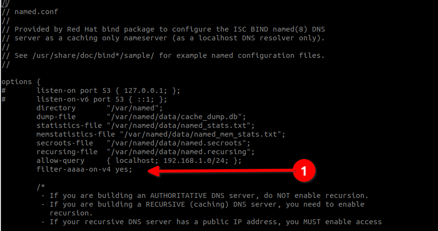

# Приватний DNS-сервер за допомогою Bind

## Передумови та припущення

* Сервер під керуванням Rocky Linux
* Кілька внутрішніх серверів, доступ до яких потрібен лише локально, але не через Інтернет
* Кілька робочих станцій, яким потрібен доступ до тих самих серверів, які існують в одній мережі
* Здоровий рівень комфорту при введенні команд із командного рядка
* Знайомство з редактором командного рядка (у цьому прикладі ми використовуємо _vi_)
* Можна використовувати _firewalld_ або _iptables_ для створення правил брандмауера. Ми надали параметри _iptables_ і _firewalld_. Якщо ви плануєте використовувати _iptables_, скористайтеся [процедурою ввімкнення брандмауера Iptables](../security/enabling_iptables_firewall.md)

## Вступ

Зовнішні або загальнодоступні DNS-сервери використовуються в Інтернеті для зіставлення імен хостів з IP-адресами та, у випадку записів PTR (відомих як «вказівник» або «зворотний»), для зіставлення IP з іменем хоста. Це важлива частина Інтернету. Завдяки цьому ваш поштовий сервер, веб-сервер, FTP-сервер або багато інших серверів і служб працюють належним чином, незалежно від того, де ви знаходитесь.

У приватній мережі, особливо в тій, яка використовується для розробки кількох систем, ви можете використовувати файл */etc/hosts* вашої робочої станції Rocky Linux, щоб зіставити ім’я з IP-адресою.

Це працюватиме для _вашої_ робочої станції, але не для будь-якої іншої машини у вашій мережі. Якщо ви хочете зробити речі універсальними, найкращий спосіб – взяти деякий час і створити локальний приватний DNS-сервер, який оброблятиме це для всіх ваших машин.

Якби ви створювали загальнодоступні DNS-сервери та резолвери робочого рівня, тоді цей автор, ймовірно, рекомендував би надійніший авторитетний і рекурсивний DNS [PowerDNS](https://www.powerdns.com/), який легко встановлюється на серверах Rocky Linux. Однак це надмірно для локальної мережі, яка не розкриє її. Ось чому ми вибрали _bind_ для цього прикладу.

### Пояснення компонентів DNS-сервера

Як було зазначено, DNS поділяє служби на авторитетні та рекурсивні сервери. Тепер рекомендовано розміщувати ці служби окремо на окремому обладнанні чи контейнерах.

Авторитетний сервер є областю зберігання для всіх IP-адрес та імен хостів, а рекурсивний сервер використовується для пошуку адрес та імен хостів. У випадку нашого приватного DNS-сервера як офіційний, так і рекурсивний серверні служби працюватимуть разом.

## Встановлення та ввімкнення Bind

Першим кроком є встановлення пакетів. У випадку _bind_ нам потрібно виконати таку команду:

```
dnf install bind bind-utils
```

Службовий демон для _bind_ називається _named_, і нам потрібно ввімкнути його, щоб запускатися під час завантаження:

```
systemctl enable named
```

І тоді нам потрібно його запустити:

```
systemctl start named
```

## Конфігурація

Перш ніж вносити зміни до будь-якого файлу конфігурації, доцільно створити резервну копію вихідного встановленого робочого файлу, у цьому випадку _named.conf_:

```
cp /etc/named.conf /etc/named.conf.orig
```

Це допоможе в майбутньому, якщо у файл конфігурації будуть внесені помилки. *Завжди* є чудовою ідеєю зробити резервну копію перед внесенням змін.

Ці зміни вимагають редагування файлу named.conf, для цього ми використовуємо _vi_, але ви можете замінити свій улюблений редактор командного рядка (редактор ` nano` також встановлено в Rocky Linux і його простіше використовувати, ніж `vi`):

```
vi /etc/named.conf
```

Перше, що ми хочемо зробити, це вимкнути прослуховування на локальному хості, це можна зробити, позначивши знаком «#» ці два рядки в розділі «параметри». Це ефективно вимикає будь-який зв’язок із зовнішнім світом.

Це корисно, особливо коли ми додаємо цей DNS на наші робочі станції, оскільки ми хочемо, щоб DNS-сервер відповідав лише тоді, коли IP-адреса, яка запитує службу, є локальною, і не реагував, якщо послугу шукають в Інтернеті.

Таким чином, інші налаштовані DNS-сервери майже негайно візьмуть на себе роботу для пошуку Інтернет-служб:

```
options {
#       listen-on port 53 { 127.0.0.1; };
#       listen-on-v6 port 53 { ::1; };
```

Нарешті, перейдіть до кінця файлу *named.conf* і додайте розділ для вашої мережі. У нашому прикладі використовується ourdomain, тому додайте те, що ви хочете назвати хостами локальної мережі:

```
# primary forward and reverse zones
//forward zone
zone "ourdomain.lan" IN {
     type master;
     file "ourdomain.lan.db";
     allow-update { none; };
    allow-query {any; };
};
//reverse zone
zone "1.168.192.in-addr.arpa" IN {
     type master;
     file "ourdomain.lan.rev";
     allow-update { none; };
    allow-query { any; };
};
```

Тепер збережіть зміни (для _vi_, `SHIFT:wq!`)

## Прямі та зворотні записи

Далі ми повинні створити два файли в `/var/named`. Ці файли є тими, які ви редагуєте, якщо додаєте машини до своєї мережі, які ви хочете включити в DNS.

Перший — це файл пересилання, щоб зіставити нашу IP-адресу з іменем хоста. Знову ж таки, ми використовуємо "ourdomain" як приклад. Зверніть увагу, що IP-адреса нашого локального DNS тут 192.168.1.136. Хости додаються внизу цього файлу.

```
vi /var/named/ourdomain.lan.db
```

Коли ви закінчите, файл виглядатиме приблизно так:

```
$TTL 86400
@ IN SOA dns-primary.ourdomain.lan. admin.ourdomain.lan. (
    2019061800 ;Serial
    3600 ;Refresh
    1800 ;Retry
    604800 ;Expire
    86400 ;Minimum TTL
)

;Name Server Information
@ IN NS dns-primary.ourdomain.lan.

;IP for Name Server
dns-primary IN A 192.168.1.136

;A Record for IP address to Hostname
wiki IN A 192.168.1.13
www IN A 192.168.1.14
devel IN A 192.168.1.15
```

Додайте стільки хостів, скільки потрібно, у нижній частині файлу разом із їхніми IP-адресами, а потім збережіть зміни.

Далі нам потрібен зворотний файл, щоб зіставити наше ім’я хоста з IP-адресою. У цьому випадку єдиною частиною IP-адреси, яка вам потрібна, є останній октет хоста (в адресі IPv4 кожне число, розділене крапкою, є октетом), а потім PTR і ім’я хоста.

```
vi /var/named/ourdomain.lan.rev
```

І файл повинен виглядати приблизно так, коли ви закінчите:

```
$TTL 86400
@ IN SOA dns-primary.ourdomain.lan. admin.ourdomain.lan. (
    2019061800 ;Serial
    3600 ;Refresh
    1800 ;Retry
    604800 ;Expire
    86400 ;Minimum TTL
)
;Name Server Information
@ IN NS dns-primary.ourdomain.lan.

;Reverse lookup for Name Server
136 IN PTR dns-primary.ourdomain.lan.

;PTR Record IP address to HostName
13 IN PTR wiki.ourdomain.lan.
14 IN PTR www.ourdomain.lan.
15 IN PTR devel.ourdomain.lan.
```

Додайте всі імена хостів у файл пересилання, а потім збережіть зміни.

### Що все це означає

Тепер, коли ми все це додали та готуємося перезапустити наш DNS-сервер _bind_, давайте розглянемо деякі терміни, які використовуються в цих двох файлах.

Просто змушувати все працювати недостатньо, якщо ви не знаєте, що означає кожен термін, чи не так?

* **TTL** з’являється в обох файлах і означає «Time To Live». TTL повідомляє DNS-серверу, як довго зберігати його кеш, перш ніж запитувати нову копію. У цьому випадку TTL є налаштуванням за замовчуванням для всіх записів, якщо не встановлено певний TTL запису. За замовчуванням тут встановлено 86400 секунд або 24 години.
* **IN** означає Інтернет. У цьому випадку ми не використовуємо Інтернет, тому сприймайте це як Інтранет.
* **SOA** означає "Start Of Authority" або те, що є основним сервером DNS для домену.
* **NS** означає "сервер імен"
* **Serial** – це значення, яке використовує сервер DNS для перевірки актуальності вмісту файлу зони.
* **Refresh** вказує, як часто підлеглий DNS-сервер має виконувати передачу зони від головного.
* **Retry** вказує тривалість очікування в секундах перед повторною спробою під час невдалої передачі зони.
* **Expire** визначає, як довго підлеглий сервер має чекати відповіді на запит, коли головний недоступний.
* **A** – це адреса хоста або запис пересилання, і він міститься лише у файлі пересилання (вище).
* **PTR** - це запис вказівника, більш відомий як "реверс" і міститься лише в нашому файлі реверсу (вище).

## Тестування конфігурацій

Після того, як ми створили всі наші файли, нам потрібно переконатися, що файли конфігурації та зони працюють у належному стані, перш ніж знову запустити службу _bind_.

Перевірте основну конфігурацію:

```
named-checkconf
```

Це має повернути порожній результат, якщо все гаразд.

Потім перевірте передню зону:

```
named-checkzone ourdomain.lan /var/named/ourdomain.lan.db
```

Це повинно повернути щось на зразок цього, якщо все добре:

```
zone ourdomain.lan/IN: loaded serial 2019061800
OK
```

І нарешті перевірте реверсну зону:

```
named-checkzone 192.168.1.136 /var/named/ourdomain.lan.rev
```

Що має повернути щось подібне, якщо все добре:

```
zone 192.168.1.136/IN: loaded serial 2019061800
OK
```

Якщо припустити, що все виглядає добре, перезапустіть _bind_:

```
systemctl restart named
```

=== "9"

    ## 9 Використання IPv4 у вашій локальній мережі
    
    Щоб використовувати ТІЛЬКИ IPv4 у вашій локальній мережі, вам потрібно внести одну зміну в `/etc/sysconfig/named`:

    ```
    vi /etc/sysconfig/named
    ```


    а потім додайте це внизу файлу:

    ```
    OPTIONS="-4"
    ```


    Тепер збережіть ці зміни (знову, для _vi_, `SHIFT:wq!`)
    
    ## 9 Тестування машин
    
    Вам потрібно додати DNS-сервер (у нашому прикладі 192.168.1.136) до кожної машини, до якої ви хочете отримати доступ до серверів, які ви додали до свого локального DNS. Ми лише покажемо вам приклад того, як це зробити на робочій станції Rocky Linux, але існують подібні методи для інших дистрибутивів Linux і комп’ютерів Windows і Mac.
    
    Пам’ятайте, що ви захочете додати DNS-сервери до списку, а не замінити те, що зараз є, оскільки вам усе одно знадобиться доступ до Інтернету, для якого знадобляться ваші наразі призначені DNS-сервери. Вони можуть бути призначені через DHCP (протокол динамічної конфігурації хоста) або призначені статично.
    
    Ми додамо наш локальний DNS за допомогою `nmcli`, а потім перезапустимо з’єднання. 
    
    ??? warning "Дурні імена профілів"
    
         У NetworkManager підключення змінюються не за назвою пристрою, а за назвою профілю. Це можуть бути такі речі, як «Дротове підключення 1» або «Бездротове підключення 1». Ви можете переглянути профіль, запустивши `nmcli` без будь-яких параметрів:

        ```
        nmcli
        ```


        Це покаже вам такі результати:

        ```bash
        enp0s3: connected to Wired Connection 1
        "Intel 82540EM"
        ethernet (e1000), 08:00:27:E4:2D:3D, hw, mtu 1500
        ip4 default
        inet4 192.168.1.140/24
        route4 192.168.1.0/24 metric 100
        route4 default via 192.168.1.1 metric 100
        inet6 fe80::f511:a91b:90b:d9b9/64
        route6 fe80::/64 metric 1024

        lo: unmanaged
            "lo"
            loopback (unknown), 00:00:00:00:00:00, sw, mtu 65536

        DNS configuration:
            servers: 192.168.1.1
            domains: localdomain
            interface: enp0s3

        Use "nmcli device show" to get complete information about known devices and
        "nmcli connection show" to get an overview on active connection profiles.
        ```


        Перш ніж ми навіть почнемо змінювати з’єднання, ви повинні назвати це як-небудь розумне, наприклад ім’я інтерфейсу (**зверніть увагу**, що «\» нижче пропускає пробіли в назві):

        ```
        nmcli connection modify Wired\ connection\ 1 con-name enp0s3
        ```


        Зробивши це, знову запустіть `nmcli` самостійно, і ви побачите щось на зразок цього:

        ```bash
        enp0s3: connected to enp0s3
        "Intel 82540EM"
        ethernet (e1000), 08:00:27:E4:2D:3D, hw, mtu 1500
        ip4 default
        inet4 192.168.1.140/24
        route4 192.168.1.0/24 metric 100
        route4 default via 192.168.1.1 metric 100
        ...
        ```


        Це значно спростить решту конфігурації DNS!
    
    Якщо припустити, що ім’я вашого профілю з’єднання – «enp0s3», ми включимо вже налаштований DNS, але спочатку додамо наш локальний DNS-сервер:

    ```
    nmcli con mod enp0s3 ipv4.dns '192.168.1.138,192.168.1.1'
    ```


    Ви можете мати більше DNS-серверів, а для комп’ютера, налаштованого на загальнодоступні DNS-сервери, скажімо, відкритий DNS Google, замість цього ви можете мати щось на зразок цього:

    ```
    nmcli con mod enp0s3 ipv4.dns '192.168.1.138,8.8.8.8,8.8.4.4'
    ```


    Додавши потрібні DNS-сервери до з’єднання, ви зможете розпізнавати хости в *ourdomain.lan*, а також хости Інтернету.
    
    ## 9 Правила брандмауера - `firewalld`
    
    !!! note "`firewalld` за замовчуванням"
    
         У Rocky Linux 9.0 і вище використання правил `iptables` застаріло. Замість цього слід використовувати `firewalld`.
    
    Ми не робимо жодних припущень щодо мережі чи послуг, які можуть знадобитися, за винятком того, що ми вмикаємо доступ SSH і доступ DNS лише для нашої локальної мережі. Для цього ми будемо використовувати вбудовану зону `firewalld`, "довірену". Нам також доведеться внести зміни в службу «публічної» зони, щоб обмежити доступ SSH до локальної мережі.
    
    Першим кроком буде додавання нашої локальної мережі до «довіреної» зони:

    ```
    firewall-cmd --zone=trusted --add-source=192.168.1.0/24 --permanent
    ```


    Далі нам потрібно додати дві наші служби в «довірену» зону:

    ```
    firewall-cmd --zone=trusted --add-service=ssh --permanent
    firewall-cmd --zone=trusted --add-service=dns --permanent
    ```


    Нарешті, нам потрібно видалити службу SSH із нашої «публічної» зони, яка ввімкнена за замовчуванням:

    ```
    firewall-cmd --zone=public --remove-service=ssh --permanent
    ```


    Далі перезавантажте брандмауер і перерахуйте зони, до яких ми внесли зміни:

    ```
    firewall-cmd --reload
    firewall-cmd --zone=trusted --list-all
    ```


    Це має показати, що ви правильно додали служби та вихідну мережу:

    ```
    trusted (active)
        target: ACCEPT
        icmp-block-inversion: no
        interfaces:
        sources: 192.168.1.0/24
        services: dns ssh
        ports:
        protocols:
        forward: no
        masquerade: no
        forward-ports:
        source-ports:
        icmp-blocks:
        rich rules:
    ```


    Перелік "загальнодоступної" зони має показати, що доступ SSH більше не дозволено:

    ```
    firewall-cmd --zone=public --list-all
    ```


    Який повинен показати вам:

    ```
    public
        target: default
        icmp-block-inversion: no
        interfaces:
        sources:
        services: cockpit dhcpv6-client
        ports:
        protocols:
        forward: no
        masquerade: no
        forward-ports:
        source-ports:
        icmp-blocks:
        rich rules:
    ```


    Ці правила мають забезпечити вирішення DNS на вашому приватному DNS-сервері з хостів у мережі 192.168.1.0/24. Крім того, ви повинні мати можливість SSH з будь-якого з цих хостів до вашого приватного DNS-сервера.

=== "8"

    ## 8 Використання IPv4 у вашій локальній мережі
    
    Вам потрібно внести дві зміни, якщо ви використовуєте IPv4 лише у своїй локальній мережі. Перший міститься в `/etc/named.conf`, а другий — у `/etc/sysconfig/named`
    
    Спочатку поверніться до файлу `named.conf` за допомогою `vi /etc/named.conf`. Нам потрібно додати наступний параметр у будь-якому місці розділу параметрів.

    ```
    filter-aaaa-on-v4 yes;
    ```


    Це показано на зображенні нижче:
    
    
    
    Після внесення змін збережіть їх і вийдіть із `named.conf` (для _vi_, `SHIFT:wq!`)
    
    Далі нам потрібно внести аналогічні зміни до `/etc/sysconfig/named`:

    ```
    vi /etc/sysconfig/named
    ```


    А потім додайте це внизу файлу:

    ```
    OPTIONS="-4"
    ```


    Тепер збережіть ці зміни (знову, для _vi_, `SHIFT:wq!`)
    
    
    ## 8 Тестування машин
    
    Вам потрібно додати сервер DNS (у нашому прикладі 192.168.1.136) до кожної машини, до якої ви хочете отримати доступ до серверів, які ви додали до свого нового локального DNS. Ми лише покажемо вам приклад того, як це зробити на робочій станції Rocky Linux, але існують подібні методи для інших дистрибутивів Linux і комп’ютерів Windows і Mac.
    
    Пам’ятайте, що ви захочете додати DNS-сервер до списку, оскільки вам усе одно знадобиться доступ до Інтернету, для якого знадобляться ваші наразі призначені DNS-сервери. Вони можуть бути призначені через DHCP (протокол динамічної конфігурації хоста) або призначені статично.
    
    На робочій станції Rocky Linux, де активним мережевим інтерфейсом є eth0, ви повинні використовувати:

    ```
    vi /etc/sysconfig/network-scripts/ifcfg-eth0
    ```


    Якщо ваш увімкнений мережевий інтерфейс відрізняється, ви повинні замінити це ім’я інтерфейсу. Файл конфігурації, який ви відкриваєте, виглядатиме так для статично призначеної IP-адреси (не DHCP, як згадувалося вище). У прикладі нижче IP-адреса нашої машини 192.168.1.151:

    ```
    DEVICE=eth0
    BOOTPROTO=none
    IPADDR=192.168.1.151
    PREFIX=24
    GATEWAY=192.168.1.1
    DNS1=8.8.8.8
    DNS2=8.8.4.4
    ONBOOT=yes
    HOSTNAME=tender-kiwi
    TYPE=Ethernet
    MTU=
    ```


    Ми хочемо замінити на нашому новому DNS-сервері основний (DNS1), а потім перемістити кожен з інших DNS-серверів нижче, щоб це було так:

    ```
    DEVICE=eth0
    BOOTPROTO=none
    IPADDR=192.168.1.151
    PREFIX=24
    GATEWAY=192.168.1.1
    DNS1=192.168.1.136
    DNS2=8.8.8.8
    DNS3=8.8.4.4
    ONBOOT=yes
    HOSTNAME=tender-kiwi
    TYPE=Ethernet
    MTU=
    ```


    Після внесення змін перезавантажте машину або перезапустіть мережу за допомогою:

    ```
    systemctl restart network
    ```


    Тепер ви зможете отримати доступ до будь-чого в домені *ourdomain.lan* зі своїх робочих станцій, які все ще можуть розпізнавати та отримувати доступ до Інтернет-адрес.
    
    ## 8 Правила брандмауера
    
    ### Додавання правил брандмауера - `iptables`
    
    !!! note "Щодо `iptables`"
    
         Хоча правила `iptables` все ще працюють у Rocky Linux 8.x, ми рекомендуємо перейти до правил `firewalld` у розділі нижче. Причина полягає в тому, що в майбутніх версіях Rocky Linux `iptables` буде застарілим і видалений. Крім того, `firewalld` є типовим способом виконання завдань. Ви знайдете більше прикладів використання `firewalld`, коли шукаєте допомоги, ніж використання `iptables`. Ми включили сюди правила `iptables`, але для найкращих результатів і безпеки в майбутньому ми рекомендуємо перейти до `firewalld` зараз.
    
    Спочатку створіть файл у */etc* під назвою "firewall.conf", який містить такі правила. Це мінімальний набір правил, і вам, можливо, доведеться налаштувати його для свого середовища:

    ```
    #!/bin/sh
    #
    #IPTABLES=/usr/sbin/iptables

    #  Unless specified, the defaults for OUTPUT is ACCEPT
    #    The default for FORWARD and INPUT is DROP
    #
    echo "   clearing any existing rules and setting default policy.."
    iptables -F INPUT
    iptables -P INPUT DROP
    iptables -A INPUT -p tcp -m tcp -s 192.168.1.0/24 --dport 22 -j ACCEPT
    # dns rules
    iptables -A INPUT -p udp -m udp -s 192.168.1.0/24 --dport 53 -j ACCEPT
    iptables -A INPUT -i lo -j ACCEPT
    iptables -A INPUT -m state --state ESTABLISHED,RELATED -j ACCEPT
    iptables -A INPUT -p tcp -j REJECT --reject-with tcp-reset
    iptables -A INPUT -p udp -j REJECT --reject-with icmp-port-unreachable

    /usr/sbin/service iptables save
    ```


    Давайте оцінимо наведені вище правила:

    * Перший рядок «iptables» очищає поточні завантажені правила (-F).
    * Далі ми встановлюємо політику за замовчуванням для ланцюжка INPUT DROP. Це означає, що його буде видалено, якщо трафік тут явно не дозволено.
    * Далі у нас є правило SSH для нашої локальної мережі, щоб ми могли віддалено зайти на сервер DNS.
    * Тоді у нас є правило дозволу DNS лише для нашої локальної мережі. Зауважте, що DNS використовує протокол UDP (протокол дейтаграм користувача).
    * Далі ми дозволяємо INPUT з локального інтерфейсу.
    * Тоді, якщо ви встановили з’єднання для чогось іншого, ми також дозволяємо пов’язані пакети.
    * І, нарешті, ми відкидаємо все інше.
    * Останній рядок повідомляє iptables зберегти правила, щоб під час перезапуску машини правила також завантажувалися.

    Після створення файлу firewall.conf нам потрібно зробити його виконуваним:

    ```
    chmod +x /etc/firewall.conf
    ```

    Потім запустіть:

    ```
    /etc/firewall.conf
    ```

    І це те, що ви повинні отримати натомість. Якщо ви отримуєте щось інше, подивіться на наявність помилок у своєму сценарії:

    ```bash
    clearing any existing rules and setting default policy..
    iptables: Saving firewall rules to /etc/sysconfig/iptables:[  OK  ]
    ```


    ### Додавання правил брандмауера - `firewalld`

    За допомогою `firewalld` ми дублюємо правила, виділені в `iptables` вище. Ми не робимо жодних інших припущень щодо мережі чи послуг, які можуть знадобитися. Ми вмикаємо SSH і DNS-доступ лише для нашої локальної мережі. Для цього ми будемо використовувати вбудовану зону `firewalld`, «довірену». Нам також доведеться внести зміни в службу «публічної» зони, щоб обмежити доступ SSH до локальної мережі.

    Першим кроком буде додавання нашої локальної мережі до «довіреної» зони:

    ```
    firewall-cmd --zone=trusted --add-source=192.168.1.0/24 --permanent
    ```

    Далі нам потрібно додати дві наші служби в «довірену» зону:

    ```
    firewall-cmd --zone=trusted --add-service=ssh --permanent
    firewall-cmd --zone=trusted --add-service=dns --permanent
    ```

    Нарешті, нам потрібно видалити службу SSH із нашої «публічної» зони, яка ввімкнена за замовчуванням:

    ```
    firewall-cmd --zone=public --remove-service=ssh --permanent
    ```

    Далі перезавантажте брандмауер і перерахуйте зони, до яких ми внесли зміни:

    ```
    firewall-cmd --reload
    firewall-cmd --zone=trusted --list-all
    ```

    Це має показати, що ви правильно додали служби та вихідну мережу:

    ```bash
    trusted (active)
        target: ACCEPT
        icmp-block-inversion: no
        interfaces:
        sources: 192.168.1.0/24
        services: dns ssh
        ports:
        protocols:
        forward: no
        masquerade: no
        forward-ports:
        source-ports:
        icmp-blocks:
        rich rules:
    ```

    Перелік "загальнодоступної" зони має показати, що доступ SSH більше не дозволено:

    ```
    firewall-cmd --zone=public --list-all
    ```

    ```bash
    public
        target: default
        icmp-block-inversion: no
        interfaces:
        sources:
        services: cockpit dhcpv6-client
        ports:
        protocols:
        forward: no
        masquerade: no
        forward-ports:
        source-ports:
        icmp-blocks:
        rich rules:
    ```


    Ці правила мають забезпечити вирішення DNS на вашому приватному DNS-сервері з хостів у мережі 192.168.1.0/24. Крім того, ви повинні мати можливість SSH з будь-якого з цих хостів до вашого приватного DNS-сервера.

## Висновки

Хоча використання */etc/hosts* на окремій робочій станції дасть вам доступ до машини у вашій внутрішній мережі, ви можете використовувати її лише на одній машині. Додавши приватний DNS-сервер за допомогою _bind_, ви можете додати хости до DNS, і якщо робочі станції мають доступ до цього приватного DNS-сервера, вони зможуть отримати до цих локальних серверів.

Якщо вам не потрібні машини для вирішення в Інтернеті, але потрібен локальний доступ з кількох пристроїв до локальних серверів, подумайте про використання приватного DNS-сервера.
