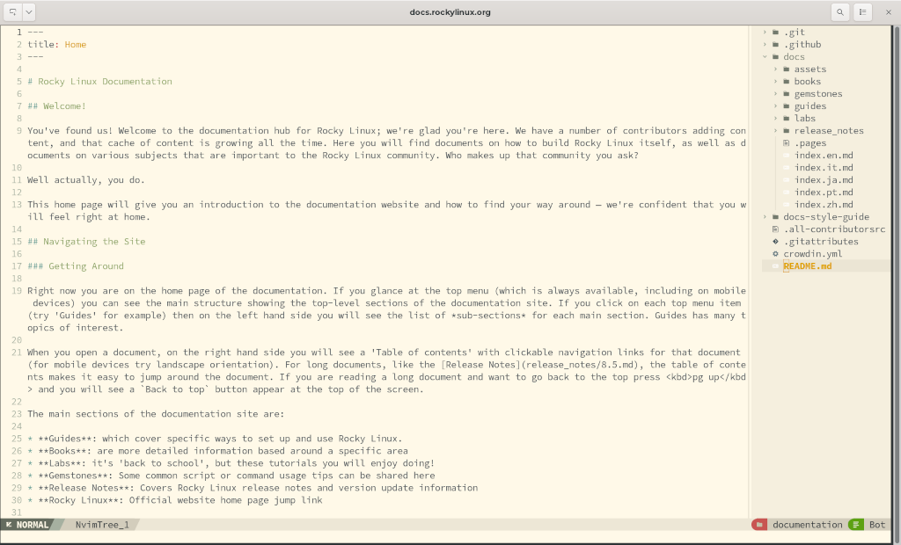
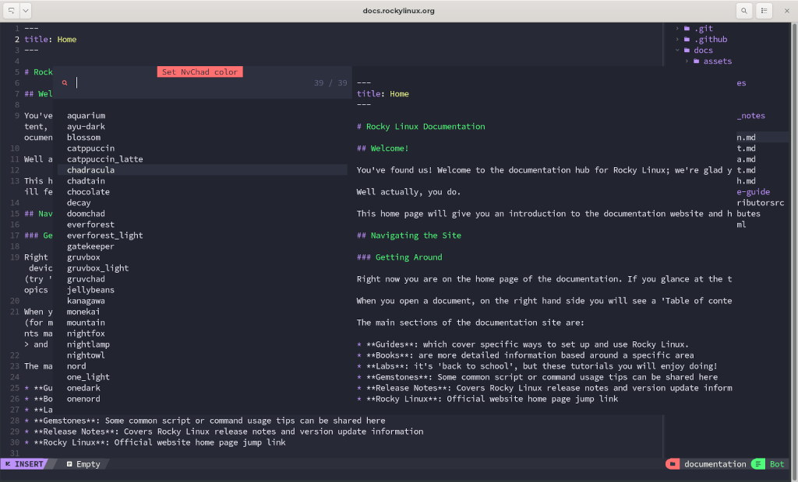
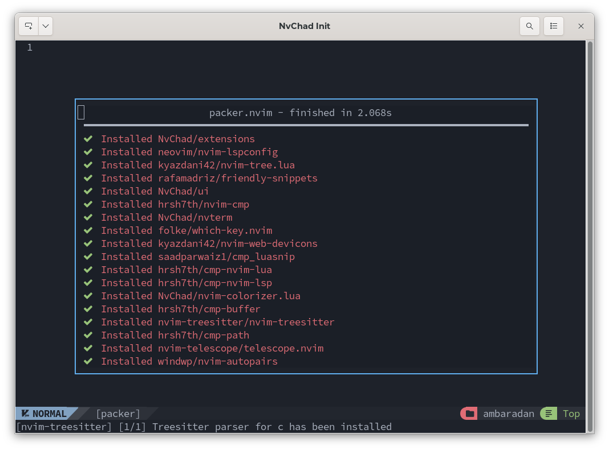
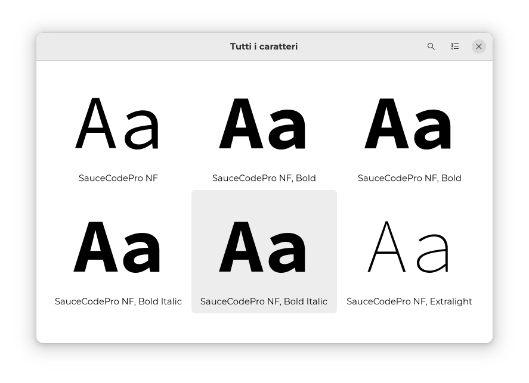
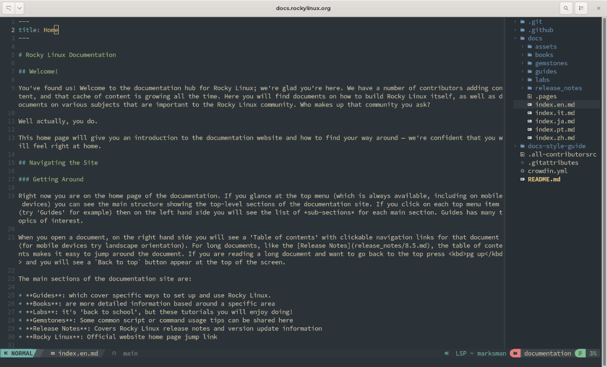

## Usare Neovim come IDE

Nvchad è un progetto creato allo scopo di fornire, attraverso una configurazione personalizzata di Neovim, un punto di partenza su cui costruire il proprio IDE (Integrated Development Environment) con uno sforzo minimo.

La configurazione è scritta in Lua, un linguaggio di programmazione molto veloce che permette a NvChad di avere tempi di avvio e di esecuzione molto rapidi per comandi e digitazioni. Questo è reso possibile anche dalla tecnica `Lazy loading` utilizzata per i plugin che permette ai plugin di caricarsi solo quando necessario.

L'interfaccia risulta essere molto pulita e piacevole.

Come tengono a precisare gli sviluppatori di NvChad il progetto vuole essere solo una base sulla quale costruire il proprio IDE personale. La successiva personalizzazione viene effettuata attraverso l'uso di plugin.



### Caratteristiche Principali

- **Progettato per essere veloce.** Dalla scelta del linguaggio di programmazione alle tecniche di caricamento dei componenti, tutto è progettato per ridurre al minimo il tempo di esecuzione.

- **Interfaccia accattivante.** Pur essendo un'applicazione _cli_ l'interfaccia risulta moderna e bella graficamente, inoltre tutti i componenti si adattano perfettamente alla UI.

- **Estremamente configurabile.** Grazie alla modularità derivata dalla base utilizzata (NeoVim) l'editor può essere adattato perfettamente alle proprie esigenze. Si tenga in considerazione però che quando si parla di personalizzazione ci si riferisce alle funzionalità non all'aspetto dell'interfaccia.

- **Meccanismo automatico di aggiornamento.** L'editor è fornito con un meccanismo (attraverso l'uso di _git_) che permette l'aggiornamento con un semplice comando ``<escape>uu`\`.

- **Powered by Lua.** La configurazione di NvChad è scritta interamente in _lua_ e questo gli permette di integrarsi perfettamente nella configurazione di Neovim sfruttando tutte le potenzialità dell'editor su cui è basata.

- **Numerosi temi integrati.** La configurazione include già un gran numero di temi da usare, tenendo sempre presente che stiamo parlando di un'applicazione _cli_ , i temi possono essere selezionati con la chiave `<escape>th`.



## Installare NvChad

### Pre-requisiti

- Una macchina che esegue Rocky Linux, la guida è stata scritta utilizzando Rocky Linux 9, ma anche la versione 8.6 dovrebbe essere supportata.
- Neovim 0.7.2, questa è la versione minima richiesta. EPEL fornisce una versione obsoleta ma la versione richiesta può essere installata dal pacchetto precompilato.
- Un carattere Nerd per il tuo terminale, questo ti permette di avere caratteri che rappresentano varie icone (cartelle, attività, ecc.). L'installazione sarà trattata alla fine del presente documento.
- Una conoscenza di base di Vim, questo è forse il requisito più importante in quanto tutte le operazioni sono eseguite dalla statusline __ sotto forma di comandi testuali, va notato che NvChad implementa già alcune funzionalità che coinvolgono l'integrazione del mouse, ma la conoscenza di base dei comandi è essenziale.

#### Semi-opzionale

- ripgrep, questo componente è considerato opzionale ma per avere la piena funzionalità di `:Telescope` è fortemente raccomandato.

## Installazione di Neovim

### Installazione da EPEL

Prima di passare all'installazione di NvChad dobbiamo assicurarci di avere un'installazione di Neovim disponibile. Se non è già installato è possibile installarlo dal repository EPEL, anche se la versione fornita non soddisfa i requisiti minimi.

Per installare il rilascio Neovim fornito da EPEL, abbiamo bisogno del repository installato:

```bash
dnf install epel-release
```

E digitiamo il seguente comando per installare l'applicazione:

```bash
dnf install neovim
```

### Installazione da Pacchetto Precompilato

Al fine di soddisfare i requisiti minimi di NvChad, è possibile installare il pacchetto precompilato fornito da Neovim. Questo risolve il problema della versione fornita da EPEL (attualmente 0.7.0.1) che non soddisfa il requisito minimo.

Per poter utilizzare tutte le caratteristiche della nuova versione dobbiamo ancora soddisfare le dipendenze richieste da Neovim, quindi se decidiamo di rimuovere o non installare la versione datata dobbiamo fornire _il nostro_ `nvim` con le dipendenze manualmente. I pacchetti richiesti possono essere installati con:

```bash
dnf install compat-lua-libs libtermkey libtree-sitter libvterm luajit luajit2.1-luv msgpack unibilium xsel git
```

In primo luogo scariciamo l'archivio compresso per la nostra architettura (linux64), da questo indirizzo:

```text
https://github.com/neovim/neovim/releases
```

Il file da scaricare è `nvim-linux64.tar. z`, per verificare l'integrità dell'archivio scariciamo anche il file `nvim-linux64. ar.gz.sha256sum`, una volta scaricato abbiamo bisogno di verificarne l'integrità e scompattarlo da qualche parte nella nostra `home directory`. La soluzione proposta è quella di scompattarlo in `~/.local/share/`, supponendo di averlo scaricato in _/home/user/downloads/_ dovremo eseguire i seguenti comandi:

```bash
sha256sum -c /home/user/downloads/nvim-linux64.tar.gz.sha256sum
nvim-linux64.tar.gz: OK

tar xvzf /home/user/downloads/nvim-linux64.tar.gz
mv /home/user/downloads/nvim-linux64 ~/.local/share/nvim-linux64
```

A questo punto non rimane che creare un link simbolico in `~/.local/bin/` per il nostro _nvim_.

```bash
cd ~/.local/bin/
ln -sf ~/.local/share/nvim-linux64/bin/nvim nvim
```

Per essere sicuri controlliamo la versione fornita dal comando `nvim -v`, che dovrebbe ora mostrare:

```txt
nvim -v
NVIM v0.7.2
Build type: Release
LuaJIT 2.1.0-beta3
Compiled by runner@fv-az164-457

Features: +acl +iconv +tui
See ":help feature-compile"

   system vimrc file: "$VIM/sysinit.vim"
  fall-back for $VIM: "/share/nvim"

Run :checkhealth for more info
```

## Installazione di NvChad

Ora che abbiamo installato l'editor di base possiamo passare all'installazione di NvChad. Questo in realtà non è una vera installazione, ma piuttosto la scrittura di una configurazione personalizzata di Neovim. Questo è scritto nella cartella `.config` dell'utente.

Per farlo basta eseguire il comando seguente da quasiasi posizione all'interno della propria _home directory_:

``` bash
git clone https://github.com/NvChad/NvChad ~/.config/nvim --depth 1 && nvim
```

Il comando esegue un clone della configurazione NvChad ospitata su GitHub nella cartella utente `~/.config/nvim`, se la cartella è già presente, viene sostituita dalla cartella NvChad.

Per completare la configurazione è necessario aprire un terminale e avviare un'istanza di `nvim`, in questo primo avvio i plugin che fanno parte della configurazione predefinita saranno installati e configurati e una volta finito si avrà l'IDE pronto per l'editing.



## Installazione dei Caratteri Nerd

Nerd Fonts è una raccolta di font modificati rivolta agli sviluppatori con un gran numero di glifi (icone). In particolare, "font iconici" come Font Awesome, Devics, Octicons ecc sono utilizzati per aggiungere glifi extra.

Nerd Fonts prende i caratteri di programmazione più popolari e li modifica aggiungendo un gruppo di glifi. È disponibile anche un font patcher se il font desiderato non è già stato modificato. Nel sito è disponibile anche una comoda anteprima che consente di visualizzare come il font dovrebbe apparire nell'editor.  Per ulteriori informazioni, consultare [Nerd Fonts](https://www.nerdfonts.com/).

I caratteri sono disponibili per il download su:

```text
https://www.nerdfonts.com/font-downloads
```

La procedura di installazione dei font su Rocky Linux consiste nel salvare da qualche parte i font che si vogliono aggiungere per poi installarli con il comando `fc-cache`, la procedura non è una vera e propria installazione quanto piuttosto una registrazione dei nuovi font nel sistema.

Per questa guida utilizzeremo il carattere `Sauce Code Pro Nerd`.

Scarica il pacchetto con:

```bash
https://github.com/ryanoasis/nerd-fonts/releases/download/v2.1.0/SourceCodePro.zip
```

Scompattiamo il contenuto della cartella e copiiamo i caratteri in `~/.local/share/fonts/` con:

```bash
mkdir ~/.local/share/fonts
unzip SourceCodePro.zip -d ~/.local/share/fonts/
fc-cache ~/.local/share/fonts
```

A questo punto il _font nerd_ dovrebbe essere disponibile alla selezione, per selezionarlo bisogna fare riferimento al desktop utilizzato.



Per cambiare il carattere nell'emulatore di terminale se stai usando il desktop predefinito Rocky Linux (Gnome) devi solo aprire `gnome-terminal` andare su Preferenze e impostare il carattere Nerd per il tuo profilo.

Il font del terminale dovrebbe cambiare e NvChad dovrebbe avere un aspetto migliore.



## Conclusione

Come avete visto, NvChad modifica l'eccellente editor Nvim, per creare un ambiente di sviluppo specifico alle esigenze dell'utente. Per questo motivo, il presente documento si limita a scalfire la superficie. Una ricerca tra i plugin disponibili *vi permetterà* di capire come poter modificare Nvim per adattarlo meglio alle vostre esigenze.
