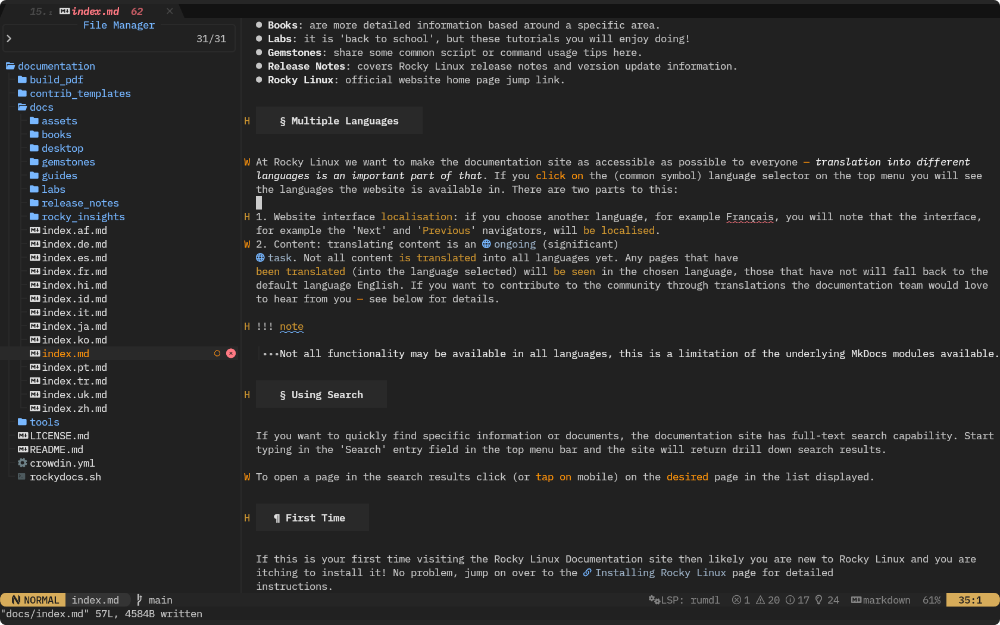
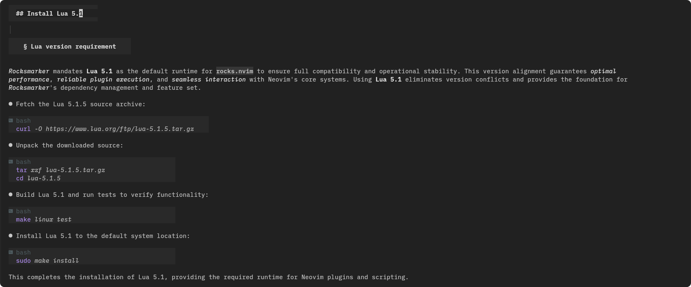
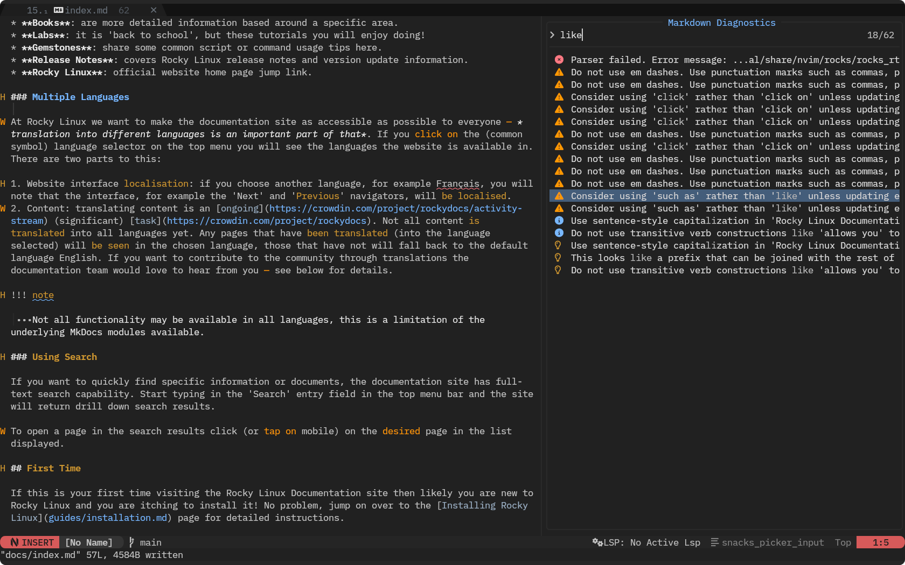
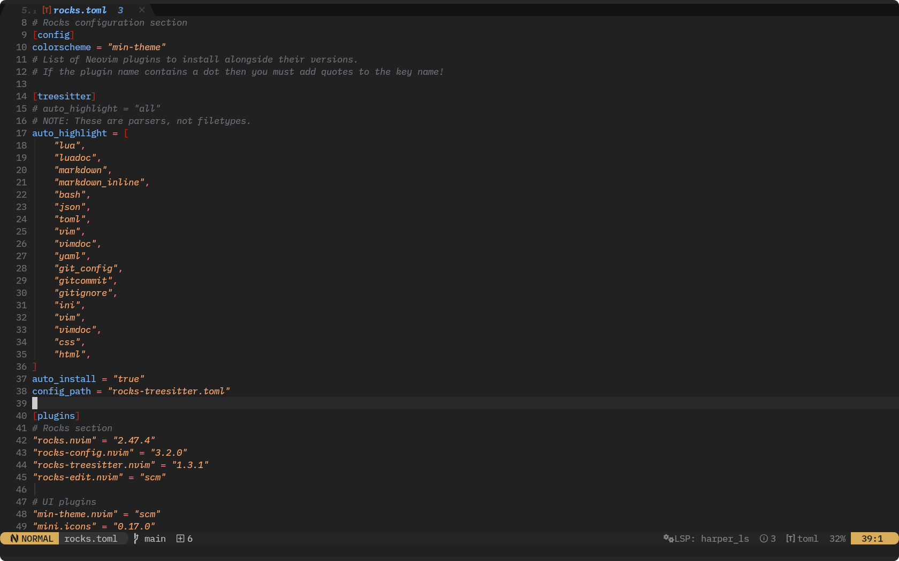
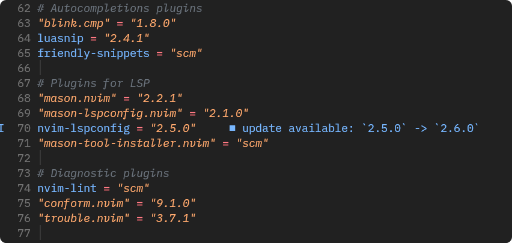
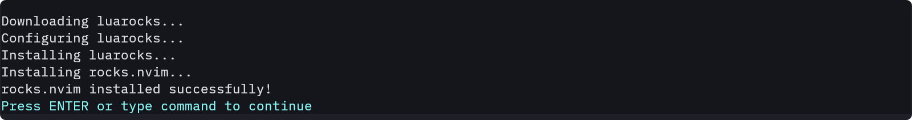
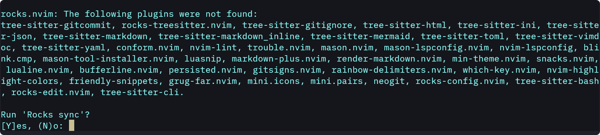

## Neovim IDE for Markdown documentation

*Rocksmarker* is an experimental Neovim configuration designed to transform
Neovim into a specialized IDE for *Markdown-based documentation*. It combines
Neovim's extensibility with a curated selection of *Lua plugins* to create a
focused, efficient, and feature-rich environment for *technical writing*,
*code documentation*, and *structured content creation*.



Built for developers and technical writers, *Rocksmarker* eliminates workflow
fragmentation by integrating real-time Markdown rendering, LSP-powered code
intelligence, and modular plugin management into a unified editing experience.  
Unlike generic text editors, Rocksmarker prioritizes clarity, precision, and
productivity, ensuring that writing, coding, and formatting occur in a single,
cohesive interface.

By leveraging **`rocks.nvim`** for plugin management and **Lumen-OSS** tools for
configuration, Rocksmarker simplifies set up while maintaining *flexibility* and
*performance*.  
Whether drafting API documentation, tutorials, or code-heavy articles,
Rocksmarker provides the tools and workflows needed to produce high-quality
content without leaving the editor. Its declarative, Lua-driven architecture
guarantees reproducibility, stability, and ease of maintenance, making it an
ideal choice for who demand both power and simplicity in their documentation
toolchain.

## Markdown editing

Rocksmarker enhances Neovim as a powerful Markdown editor through two core plugins:

- **`render-markdown.nvim`**
Provides real-time visual rendering of Markdown elements such as headings, code
blocks and lists directly in the editor. This eliminates the need for external
previews, allowing you to see formatted content as you write.

- **`markdown-plus.nvim`**
  Introduces modern editing features, including:
    - Smart list management (auto-continuation, indentation, and reordering).
    - Text formatting shortcuts for bold, italics, links, and code spans.
    - Efficient navigation between sections and references.



Together, these plugins streamline drafting, structuring, and refining
documentation while maintaining focus and productivity.

## Language server protocol

Rocksmarker uses Neovim's native LSP client to deliver robust support for
Markdown syntax, structure, and content quality. The integration includes the
following LSP servers for specific tasks:

- **`marksman`**
validates Markdown syntax, ensuring correct tag usage, proper indentation, and
right nesting of elements (e.g., headers, lists, code blocks, tables).

- **`rumdl`**
validates and manipulates Markdown code, guaranteeing syntactic correctness and
enabling programmatic modifications, such as restructuring or reformatting
content.

- **`vale_ls`**
enforces style guidelines, grammatical accuracy, and consistency in written content.

- **`harper_ls`**
performs advanced linting for readability and tone, ensuring professional and
accessible text.

This setup ensures Markdown files remain structurally sound, functionally
correct, and aligned with high standards of clarity and style.



The LSP workflow in Rocksmarker relies on three core plugins:

- **`mason.nvim`**
Automates the installation and management of language servers, reducing manual
setup. It handles versioning, dependencies, and path configurations, ensuring
that the correct LSP servers are always available for your project.

- **`nvim-lspconfig`**
Provides configured settings for a wide range of languages (e.g., Markdown,
Lua, Rust). This plugin simplifies LSP integration, allowing you to enable
language-specific features such as hover documentation, symbol navigation, and
code actions with minimal configuration.

- **`mason-lspconfig.nvim`**
Bridges mason.nvim and nvim-lspconfig, automating the association between
installed servers and their configurations. It ensures that language servers are
correctly initialized when opening files, maintaining consistency across
projects.

Rocksmarker delivers a unified editing experience by enabling users to write,
debug, and document code within a single environment, eliminating tool
switching. It enhances efficiency through autocompletion, linting, and real-time
error detection directly in Markdown, minimizing the risk of undocumented or
non-functional code snippets.  

The solution scales effectively by supporting many languages in the same
project, making it suitable for polyglot documentation, such as tutorials with
code examples in different languages. Performance stays optimal, as language
servers operate asynchronously to keep editor responsiveness even during
resource-intensive tasks for project-wide symbol analysis.

## Plugin management

**`rocks.nvim`** is a Lua-based plugin manager for Neovim, designed to
streamline dependency management through Luarocks, the standard package manager
for Lua modules.  
Unlike traditional plugin managers, **`rocks.nvim`** treats plugins as Luarocks
packages, enabling direct installation, updates, and management within Neovim's
Lua runtime. This ensures version consistency, automatic dependency resolution,
and seamless integration with Neovim's native features.



The manager uses a declarative configuration approach, where users define
plugins in a structured Lua table for consistent environment setup. It optimizes
performance with fast loading and minimal overhead, reducing startup time.
Rocks.nvim maintains full compatibility with Neovim's Lua API, LSP, Tree-sitter,
and other modern features.



By using rocks.nvim, Rocksmarker ensures a reliable and maintainable plugin
ecosystem, where each component is explicitly declared and version-locked.

### Core plugins

Rocksmarker integrates a curated set of plugins to enhance functionality and
user experience:

#### **UI and navigation**

- **`mini.theme`** and **`nvim-highlight-colors`**
Offer a cohesive visual theme and syntax highlighting for colors in code and
Markdown.
- **`mini.icons`** and **`mini.pairs`**
Improve visual clarity with file-type icons and automatic bracket pairing.
- **`lualine.nvim`** and **`bufferline.nvim`**
Deliver a customizable statusline and efficient buffer management for quick file
navigation.
- **`gitsigns.nvim`**
Displays Git changes directly in the editor, enabling real-time version control
feedback.
- **`which-key.nvim`**
Offers a menu for keybindings, improving **accessibility** and workflow efficiency.
- **`rainbow-delimiters.nvim`**
Enhances code readability by color-coding nested delimiters.
- **`persisted.nvim`**
Manages session persistence, allowing users to restore their workspace state.
- **`snacks.nvim`**
Provides utility functions for module reloading, setting toggles, and window management.
- **`grug-far.nvim`**
Enables advanced search-and-replace operations across files.
- **`neogit`**
Integrates a Git interface directly within Neovim for streamlined version control.

#### **Autocompletion**

- **`blink.cmp`**
Offers intelligent, context-aware code completion for faster development.
- **`luasnip`**
Provides snippet expansion and management, supporting dynamic and customizable
code templates.

#### **Diagnostics and formatting**

- **`nvim-lint`**
Performs asynchronous linting to enforce code quality and adherence to standards.
- **`conform.nvim`**
Ensures consistent code formatting across embedded blocks in Markdown.
- **`trouble.nvim`**
Provides a streamlined diagnostic viewer for navigating and resolving errors
from LSP and linters.

This plugin architecture ensures that Rocksmarker stays lightweight and
adaptable, while offering a cohesive experience for technical writing and code
documentation. We select each plugin for stability, functionality, and
compatibility, aligning with Rocksmarker's goal of a distraction-free, powerful
Markdown IDE.

## Installation

This guide outlines the step-by-step process for installing Rocksmarker. You
will configure Neovim, prepare the Lua 5.1 environment, and apply Rocksmarker
settings.  
Each step ensures proper setup, performance optimization, and smooth integration
with your development environment. By the end, you will have a fully operational
Rocksmarker instance ready for advanced editing and plugin management.

## Prerequisites

### System requirements

- **Operating system**:
*Rocky Linux 10* (or a compatible distribution such as RHEL or CentOS, Fedora)

- **Administrative permissions**:
Required to install *Neovim* and the required packages and configure *Lua 5.1*

- **Enable CRB repository**:
(for `ninja-build`)

    ```bash
    sudo dnf config-manager --set-enabled crb
    ```

- **Packages**: Install the following packages:

    ```bash
    sudo dnf install -y epel-release yum-utils npm ncurses readline-devel icu ninja-build cmake gcc make unzip gettext curl glibc-gconv-extra tar git
    ```

!!! info "About CRB"

    Red Hat's CodeReady Builder (CRB) repository provides additional development
    tools, libraries, and dependencies for Red Hat Enterprise Linux (RHEL) and
    compatible distributions.  
    Designed to complement the base RHEL repositories, CRB offers open source
    packages commonly required for software development, debugging, and system
    administration.

!!! warning "Rocky Linux version"

    Rocksmarker requires **Rocky Linux 10** or later.  

    Rocky Linux 9 and earlier versions use **glibc 2.34**, which is outdated and
    causes compatibility issues, especially with tools like **rumdl** and **vale**
    for code linting and analysis.  

    Upgrade to Rocky Linux 10 to ensure *full functionality*.

## Install Neovim from source

To achieve the best performance and compatibility with Rocksmarker, compile
Neovim from source. This method guarantees access to the new features,
performance optimizations, and complete plugin support for Tree-sitter and LSP.

The result is a system-optimized Neovim installation that aligns with
Rocksmarker's requirements.

- Clone the Neovim repository

Retrieve the latest Neovim source code from GitHub:

```bash
git clone https://github.com/neovim/neovim
cd neovim/
```

- Select the stable branch

Switch to the `stable` branch for a production-ready release:

```bash
git checkout stable
```

!!! info "Using stable release"

    Omitting this step defaults to the development branch (**0.13+**), which might
    contain *unfinished* or *experimental features*.

- Compile with optimization

Build Neovim by using `make` with `Release` optimizations for performance:

```bash
make CMAKE_BUILD_TYPE=Release
```

- Install system-wide

Install the compiled binary to the system:

```bash
sudo make install
```

- Installation check

```bash
nvim --version
NVIM v0.12.2
Build type: Release
LuaJIT 2.1.1774638290
Run "nvim -V1 -v" for more info
```

This process ensures a clean, optimized Neovim installation from source.

## Install Lua 5.1

### Lua version requirement

*Rocksmarker* mandates Lua 5.1 as the default runtime for **`rocks.nvim`** to
ensure full compatibility and operational stability. This version alignment
guarantees *optimal performance*, *reliable plugin execution*, and
*seamless interaction* with Neovim's core systems. Using *Lua 5.1* eliminates
version conflicts and provides the foundation for *Rocksmarker*'s dependency
management and feature set.

- Fetch the Lua 5.1.5 source archive:

```bash
curl -O https://www.lua.org/ftp/lua-5.1.5.tar.gz
```

- Unpack the downloaded source:

```bash
tar xzf lua-5.1.5.tar.gz
cd lua-5.1.5
```

- Build and run tests to verify functionality:

```bash
make linux test
```

- Install to the default system location:

```bash
sudo make install
```

This completes the installation of Lua 5.1, providing the required runtime for
Neovim plugins and scripting.

!!! info "Installation path"

    This will install lua 5.1 to `/usr/local/bin` and its headers to `/usr/local/include`.

### Configure Lua for rocks.nvim

This configuration isolates **`rocks.nvim`** from system-wide Lua installations,
guaranteeing plugin stability, consistent dependency resolution through
Luarocks, and predictable behavior.

!!! warning "Warning - Important step"

    Omitting this step risks plugin loading issues and inconsistent performance.
    Proper setup ensures *Rocksmarker* operates as intended.

- Append an alias for Lua 5.1 to the shell configuration:

```bash
echo "alias lua='/usr/local/bin/lua'" >> ~/.bashrc
```

- Apply the updated configuration:

```bash
. ~/.bashrc
```

- Confirm the installed Lua version:

```bash
lua -v
```

- Expected output

```text
Lua 5.1.5  Copyright (C) 1994-2012 Lua.org, PUC-Rio
```

### Lua header symlinks

When installing Lua 5.1 for use with **`rocks.nvim`** and Rocksmarker, linking
the Lua headers is essential because Luarocks requires access to these header
files during the compilation and installation of Lua modules.

The headers contain *definitions* and *declarations* necessary for building
native Lua extensions and ensuring compatibility between Lua and the system
libraries.

- Move to the system headers location:

```bash
cd /usr/include/
```

- Create a symbolic link

```bash
sudo mkdir lua && cd lua
sudo ln -s /usr/local/include/ 5.1
```

This ensures the system can locate Lua 5.1 headers during compilation, enabling
compatibility with Neovim and other lua-dependent applications.

## Download configuration

*Rocksmarker* provides two distinct setup configurations, tailored to your
workflow needs:

**Primary Neovim Environment**  
:   Replace your existing Neovim configuration with *Rocksmarker*, making it your
default editing environment. This approach is ideal for users who want a
*fully integrated*, *production-ready* setup with all features enabled out of
the box.

**Isolated Testing Configuration**  
:   Install *Rocksmarker* as a standalone configuration, keeping your current Neovim
setup intact. This option is perfect for *evaluation*, *development*, or
*experimentation* without affecting your main workflow.

Both methods ensure a seamless experience, whether you seek a permanent upgrade
or a sandboxed trial. Choose based on your preference for stability or
flexibility.

=== "Main editor"

    Use this option if you want *Rocksmarker* to be your default Neovim
    configuration for daily use.

    ```bash title="Clone the repository"
    git clone https://github.com/ambaradan/rocksmarker.git ~/.config/nvim
    ```

=== "Secondary editor"

    Use this option if you want to test *Rocksmarker* without affecting
    your current Neovim setup.

    ```bash title="Clone the repository"
    git clone https://github.com/ambaradan/rocksmarker.git ~/.config/rocksmarker/
    ```

    This starts Neovim by using the *Rocksmarker* configuration, leaving
    your main setup unchanged.

    !!! admonition "Create an alias for easier access"

        ```bash
        echo "alias rocksmarker='NVIM_APPNAME=rocksmarker nvim'" >> ~/.bashrc
        . ~/.bashrc
        ```

## Install the configuration

### Launch Neovim

=== "Main editor"

    `nvim`

=== "Secondary editor"

    `NVIM_APPNAME=rocksmarker nvim`

### Rocks.nvim installation

- A bootstrap script will automatically install the **`rocks.nvim`** plugin manager.



### Synchronize plugins

- Follow the instructions on the screen and accept the synchronization
of all plugins.



!!! info "Plugins path"

    Plugins install to:

    `**`.local/share/nvim/rocks/lib/luarocks/rocks-5.1/`**

### Restart Neovim

- Close and reopen Neovim to load the new configurations.

!!! note "Automatic LSP installation"

    On the second startup, the **`mason-lspconfig`** and
    **`mason-tool-installer`** plugins will automatically install
    all necessary *language servers*, *linters* and *formatters*.

### Troubleshooting

- **Logs**: If you meet issues, check the installation logs with `:Rocks log`
- **Dependencies**: Install all required system dependencies, such as *git*,
*curl*, and *gcc*
- **Lua Version**: Ensure Lua 5.1 is the default version to keep compatibility
with **`rocks.nvim`**

## Next steps

- **Verify installation**:
Open a Markdown file or run `:checkhealth` to ensure everything is working correctly.
- **Start using Rocksmarker**:
Your environment is now ready for Markdown editing, coding, or any other task.

## References

- **[Lumen-OSS](https://github.com/lumen-oss)**
  Organization focused on modernizing the Lua ecosystem. Lumen Labs develops tools
such as **Lux** (package manager), **Luanox** (module hosting), and integration
solutions for applications using Lua as a scripting language.

- **[Luarocks](https://luarocks.org/modules/neorocks)**
  Portal for distributing Luarocks packages, including those used in Rocksmarker.

- **[mkdocs-material](https://squidfunk.github.io/mkdocs-material/)**
  Documentation theme for Mkdocs, referenced for custom snippets in Rocksmarker.

- **[CRB repository (CodeReady Linux Builder)](https://wiki.rockylinux.org/rocky/repo/#notes-on-crb)**
  Required repository for installing development tools on Rocky Linux.

- **[Neovim Build Instructions](https://github.com/neovim/neovim/blob/master/BUILD.md)**
  Official guide for building Neovim from source.

- **[Lua Official Download Page](https://www.lua.org/download.html)**
Source for downloading Lua 5.1, required for compatibility with Luarocks-based
plugins.

- **[Rocksmarker Framagit Repository](https://framagit.org/ambaradan/rocksmarker)**
  Main repository for the Rocksmarker configuration.

- **[Rocksmarker Guide](https://dynadocs-037479.frama.io/rocksmarker/)**
  English guide for Rocksmarker configuration and usage (under development).
