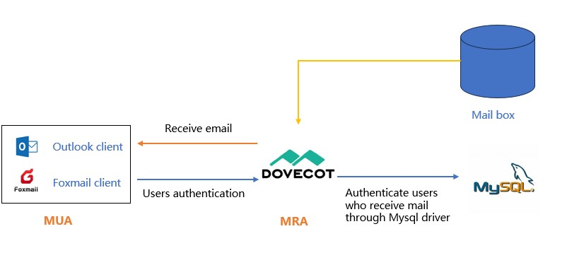

# Vue d'ensemble du système de courrier électronique

Le courrier électronique, qui était l'un des trois principaux services (FTP, Web et courrier électronique) au début de l'internet, est encore utilisé par de nombreuses personnes aujourd'hui. Le courrier électronique est apparu dans les années 1960, et le courrier électronique basé sur la transmission en réseau est apparu pour la première fois en 1971.

Contrairement aux systèmes de messagerie des entreprises commerciales, la version open source du système de messagerie se compose de plusieurs éléments. Il ne s'agit pas d'un service unique, ce qui conduit à des systèmes de messagerie plus complexes dans les environnements GNU/Linux.

## Le concept de base du système de messagerie électronique

Le système de messagerie électronique se compose principalement de quatre parties : **MUA**, **MTA**, **MRA** et **MDA**.

- **MUA (Mail User Agent)** : Il s'agit des clients de messagerie pour les utilisateurs, tels que Outlook, Foxmail, etc.
- **MTA (Mail Transfer Agent)**: Il s'agit d'un programme de serveur de messagerie utilisé pour transmettre le courrier. Le MTA est l'implémentation du SMTP.
- **MDA (Mail Delivery Agent)**: Lorsque le MTA reçoit le courrier, le MDA est chargé de l'enregistrer à l'emplacement désigné sur le serveur de messagerie, tout en effectuant des opérations de filtrage et d'antivirus.
- **MRA (Mail Retrieval Agent)**: Le MRA est une implémentation d'IMAP et de POP3, utilisée pour interagir avec le MUA et transmettre les courriels aux clients de messagerie via IMAP ou POP3.

### Trois protocoles

- **SMTP (Simple Mail Transfer Protocol)**: Le protocole standard pour l'envoi de courriers électroniques, utilisant par défaut le port 25 (TCP). Utilisez le port « TCP 465 » lorsqu'une fonction de chiffrement est requise.
- **IMAP (Internet Mail Access Protocol)**: Utilisé pour recevoir des courriels du serveur de messagerie, le port par défaut est 143 (TCP). Utilisez le port 993 lorsqu'une fonction de chiffrement est requise.
- **POP3 (Post Office Protocol - Version 3)**: Utilisé pour recevoir des courriels du serveur de messagerie, le port par défaut est 110 (TCP). Utilisez le port 995 lorsqu'une fonction de chiffrement est requise.

La différence entre IMAP et POP3 est la suivante :

|  Lieu de l’opération  |                                Contenu de l'opération                                 |                                  IMAP                                  |             POP3             |
|:---------------------:|:-------------------------------------------------------------------------------------:|:----------------------------------------------------------------------:|:----------------------------:|
|  Boîte de réception   |               Lire, étiqueter, déplacer, supprimer des courriels, etc.                | Le client se synchronise avec les mises à jour de la boîte aux lettres | Au sein du client uniquement |
|     Boîte d'envoi     |                          Enregistrer dans le courrier envoyé                          | Le client se synchronise avec les mises à jour de la boîte aux lettres | Au sein du client uniquement |
|   Créer un dossier    |                         Créer un nouveau dossier personnalisé                         | Le client se synchronise avec les mises à jour de la boîte aux lettres | Au sein du client uniquement |
|       brouillon       |                         Sauvegarder un brouillon de courriel                          | Le client se synchronise avec les mises à jour de la boîte aux lettres | Au sein du client uniquement |
|  Dossier indésirable  |        Réception de courriels déplacés par erreur dans le dossier indésirable         |                                supporté                                |         non supporté         |
| Courriel publicitaire | Recevoir les messages qui ont été déplacés dans le dossier des messages publicitaires |                                supporté                                |         non supporté         |

### Concrètement

Comme le montre l'image ci-dessous, il s'agit d'une illustration simple de l'envoi et de la réception d'un système de courrier électronique.

- **MTA**: Dans GNU/Linux, les MTA les plus courants sont **postfix**,**qmail**, **sendmail**.
- **MDA**: Dans GNU/Linux, les MDA les plus courants sont **procmail** et **maildrop**.
- **MRA**: Dans GNU/Linux, le MDA principal et fréquemment rencontré est **dovecot**.

!!! question "Question"

    **En quoi le DNS est-il nécessaire au fonctionnement du système de courrier électronique ?**
    Au quotidien, le format standard pour un utilisateur de messagerie est "nom d'utilisateur@nom de domaine". Un nom de domaine ne peut pas représenter un hôte spécifique, vous devez faire pointer le nom de domaine vers un nom d'hôte spécifique, nous avons donc besoin d'un enregistrement de résolution DNS de type MX.

## Postfix Le processus d'envoi et de réception des courriels

**Sendmail** est né en 1983 et était installé par défaut dans les versions antérieures à CentOS6. Pour des raisons historiques (comme la complexité des fichiers de configuration), le développement de sendmail a été freiné. Bien que sendmail soit complexe, si vous avez de solides compétences techniques ou une grande expérience, un sendmail bien réglé est excellent en termes d'efficacité et de performances.

**Postfix** a été créé en 1990 par Wietse Venema, un chercheur néerlandais d'IBM, pour améliorer le serveur de messagerie sendmail.

Pour plus d'informations sur postfix, veuillez consulter ces deux liens :

- [Dépôt GitHub](https://github.com/vdukhovni/postfix)
- [Site Officiel](http://www.postfix.org/)

### Le processus d'envoi de courriels par le client

Postfix détermine si un courriel envoyé par un client appartient au domaine local ou externe. Le courriel sera stocké dans la boîte aux lettres du domaine local s'il appartient au domaine local. Si le courriel envoyé appartient à un domaine externe, il est transféré à un autre MTA (l'identité de l'utilisateur doit être vérifiée dans la base de données avant le transfert).

### Le processus de réception des courriels par le client

## Serveur de messagerie open source

Un système de messagerie électronique complet se compose d'éléments décentralisés et gérés par différentes personnes ou organisations, et les barrières à l'utilisation pour certaines personnes sont élevées. En conséquence, certains serveurs de messagerie open source émergent au fil du temps, ces serveurs de messagerie combinent ces composants pour en faire un produit prêt à l'emploi, pour les utilisateurs, tous les aspects sont relativement simples et faciles.

- [iredmail](https://www.iredmail.com/index.html)
- [Serveur de messagerie Zimbra](https://www.zimbra.com/)
- [modoboa](https://modoboa.org/en/)
- [Mail-in-a-Box](https://mailinabox.email/)
- [squirrelmail](https://www.squirrelmail.org/index.php)
- [hmailserve](https://www.hmailserver.com/) ...
