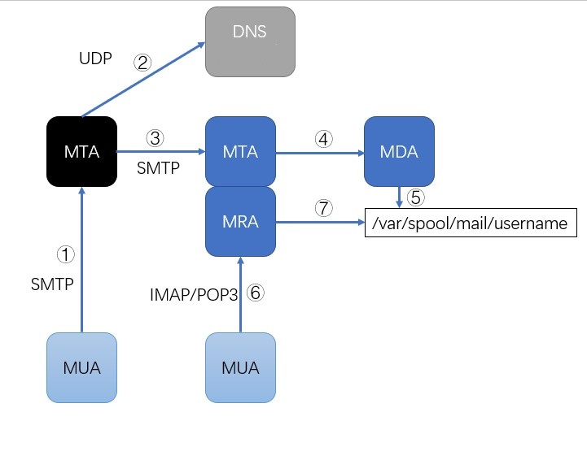

# 이메일 시스템 개요

이메일은 인터넷 초기에 시작된 세 가지 주요 서비스 (FTP, 웹, 이메일) 중 하나로, 오늘날에도 여전히 많은 사람들에 의해 사용되고 있습니다. 이메일은 1960년대에 처음 등장했으며, 네트워크 기반의 이메일은 1971년에 처음으로 등장했습니다.

상업 회사의 이메일 시스템과는 달리, 오픈 소스 버전의 이메일 시스템은 여러 부분으로 구성되어 있으며 단일 서비스가 아니기 때문에 GNU/Linux 환경에서 더 복잡한 이메일 시스템으로 이어집니다.

## 이메일 시스템의 기본 개념

이메일 시스템은 주로 **MUA**, **MTA**, **MRA** and **MDA** 네 가지 부분으로 구성됩니다.

* **MUA (Mail User Agent)**: 사용자를 위한 메일 클라이언트로, Outlook, Foxmail 등이 있습니다.
* **MTA (Mail Transfer Agent)**: 메일을 전송하는 데 사용되는 이메일 서버 프로그램입니다. MTA는 SMTP의 구현체입니다.
* **MDA (Mail Delivery Agent)**: MTA가 메일을 수신하면 MDA가 이메일을 이메일 서버의 지정된 위치에 저장하고, 이메일 필터링 및 백신 작업도 수행합니다.
* **MRA (Mail Retrieval Agent)**: MRA는 IMAP와 POP3의 구현체로, MUA와 상호 작용하여 IMAP 또는 POP3을 통해 이메일을 이메일 클라이언트로 전송합니다.

### 세 가지 프로토콜

* **SMTP (Simple Mail Transfer Protocol)**: 이메일을 보내는 데 사용되는 표준 프로토콜로, 기본 포트는 "TCP 25"입니다. 암호화 기능이 필요한 경우 "TCP 465" 포트를 사용합니다.
* **IMAP (Internet Mail Access Protocol)**:  이메일 서버로부터 이메일을 받는 데 사용되며, 기본 포트는 143입니다. 암호화 기능이 필요한 경우 993 포트를 사용합니다.
* **POP3 (Post Office Protocol - Version 3)**: 이메일 서버로부터 이메일을 받는 데 사용되며, 기본 포트는 110입니다. 암호화 기능이 필요한 경우 995 포트를 사용합니다.

IMAP와 POP3의 차이점은 다음과 같습니다:

|       작업 위치       |          작업 내용          |        IMAP         |      POP3      |
|:-----------------:|:-----------------------:|:-------------------:|:--------------:|
|       Inbox       | 이메일 읽기, 태깅, 이동, 삭제 등 작업 | 클라이언트가 메일함 업데이트 동기화 | 클라이언트 내부에서만 수행 |
|      Outbox       |        발신 메일 저장         | 클라이언트가 메일함 업데이트 동기화 | 클라이언트 내부에서만 수행 |
|   create folder   |    새로운 사용자 정의 폴더 생성     | 클라이언트가 메일함 업데이트 동기화 | 클라이언트 내부에서만 수행 |
|       draft       |        임시 저장 이메일        | 클라이언트가 메일함 업데이트 동기화 | 클라이언트 내부에서만 수행 |
|    Junk folder    |   스팸 메일함으로 잘못 이동된 이메일   |         지원          |    지원되지 않음     |
| Advertising email |  광고 이메일함으로 이동된 메시지 수신   |         지원          |    지원되지 않음     |

### 구체적인 구현

아래 그림은 이메일 시스템의 발송과 수신에 대한 간단한 설명입니다.

* **MTA**: GNU/Linux에서 대표적이고 일반적인 MTA는 **postfix**,**qmail**, **sendmail**입니다.
* **MDA**: GNU/Linux에서 대표적이고 일반적인 MDA는 **procmail** and **maildrop**입니다.
* **MRA**: GNU/Linux에서 대표적이고 일반적인 MDA는 **dovecot**입니다.

!!! question "질문"

    "이메일 시스템의 작업에 DNS가 필요한 이유는 무엇인가요?"
    일상적으로 이메일 사용자의 표준 형식은 "사용자 이름@도메인 이름"입니다. 도메인 이름은 특정 호스트를 나타낼 수 없으므로, 도메인 이름을 특정 호스트 이름으로 지정해야 하기 때문에 DNS MX 해결 레코드가 필요합니다.

## Postfix를 통한 이메일 발송과 수신 과정

**Sendmail**은 1983년에 탄생하였으며, CentOS6 이전 버전에서는 기본으로 설치되었습니다. 일부 역사적인 이유(복잡한 구성 파일 등)로 인해 sendmail의 개발이 지연되었습니다. sendmail은 복잡하지만 기술적으로 능숙하거나 광범위한 경험이 있는 경우, 튜닝이 잘 된 sendmail은 효율성과 성능 측면에서 탁월합니다.

**Postfix**는 IBM의 네덜란드 연구원인 Wietse Venema가 1990년에 만들어진 것으로, sendmail 메일 서버를 개선하기 위해 만들어졌습니다.

Postfix에 대한 더 자세한 정보는 다음 두 링크를 참조하십시오:

* [GitHub 저장소](https://github.com/vdukhovni/postfix)
* [공식 웹사이트](http://www.postfix.org/)

### 클라이언트에서 이메일 발송 과정

Postfix는 클라이언트에서 보낸 이메일이 로컬 도메인인지 외부 도메인인지를 판별합니다. 만약 로컬 도메인에 속한다면, 이메일은 로컬 도메인 메일박스에 저장됩니다. 만약 보낸 이메일이 외부 도메인에 속한다면, 이메일은 다른 MTA로 전달됩니다(전달하기 전에 사용자의 신원이 데이터베이스에서 확인되어야 함).

### 클라이언트에서 이메일 수신 과정

## 오픈 소스 이메일 서버

완벽한 이메일 시스템은 여러 부분으로 구성되어 있으며 다른 개인이나 조직에서 유지보수하는 컴포넌트들로 구성되어 있으며, 일부 사람들에게는 사용 장벽이 높습니다. 따라서 시대에 맞춰 몇몇 오픈 소스 이메일 서버가 등장하게 되었는데, 이러한 이메일 서버는 이러한 컴포넌트들을 결합하여 사용자에게는 모든 측면이 상대적으로 간단하고 쉬운 완제품을 제공합니다.

* [iredmail](https://www.iredmail.com/index.html)
* [Zimbra 이메일 서버](https://www.zimbra.com/)
* [Extmail](https://www.extmail.cn/)
* [modoboa](https://modoboa.org/en/)
* [Mail-in-a-Box](https://mailinabox.email/)
* [Kolab Groupware](https://docs.kolab.org/installation-guide/index.html)
* [squirrelmail](https://www.squirrelmail.org/index.php)
* [hmailserve](https://www.hmailserver.com/)
* ...
