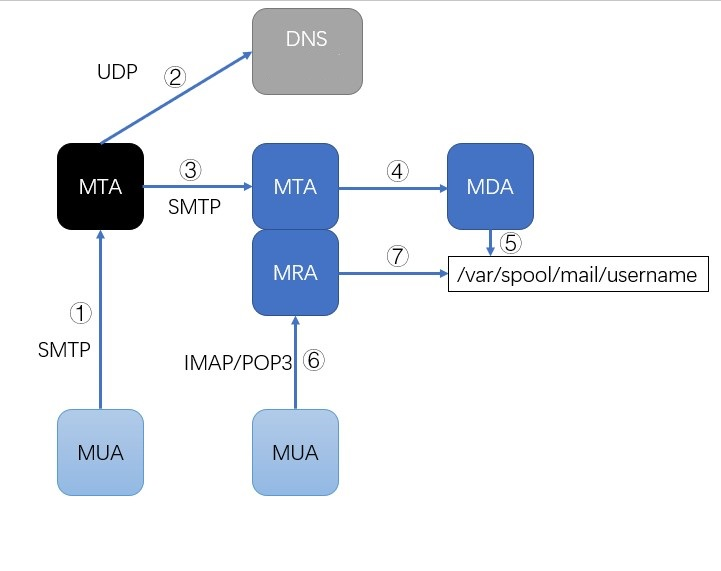
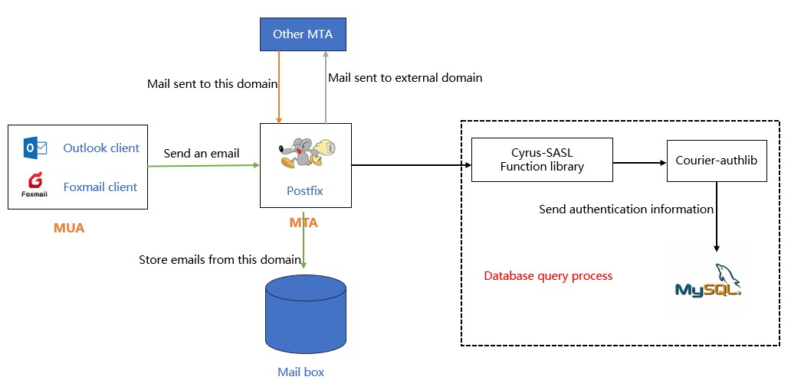
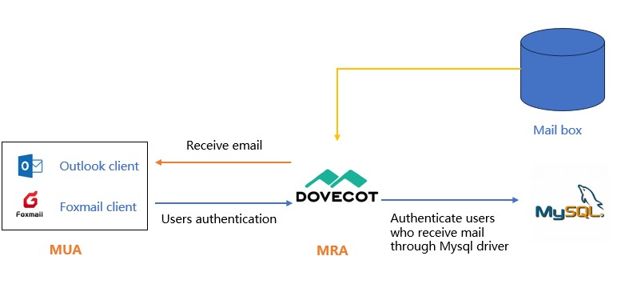

# Overview of E-mail system

E-mail, as one of the three major services (FTP, Web, and E-mail) at the beginning of the internet, is still used by many people today. Email first appeared in the 1960s, and email based on network transmission first appeared in 1971.

Unlike the email systems of commercial companies, the open-source version of the email system consists of many parts and is not a single service, which also leads to more complex email systems in GNU/Linux environments.

## The basic concept of E-mail system

The E-mail system mainly consists of four parts: **MUA**, **MTA**, **MRA** and **MDA**.

* **MUA (Mail User Agent)**: That is, mail clients for users, such as Outlook, Foxmail, etc.
* **MTA (Mail Transfer Agent)**: Refers to an e-mail server program that is used to transmit mail. The MTA is the implementation of SMTP.
* **MDA (Mail Delivery Agent)**: When the MTA receives the mail, the MDA is responsible for saving the email to the designated location on the email server, while also performing email filtering and antivirus operations.
* **MRA (Mail Retrieval Agent)**: The MRA is an implementation of IMAP and POP3, used to interact with MUA and transmit emails to email clients through IMAP or POP3.

### Three protocols

* **SMTP (Simple Mail Transfer Protocol)**: The standard protocol for sending emails, with a default port of "TCP 25". When encryption function is required, use the "TCP 465" port.
* **IMAP (Internet Mail Access Protocol)**: Used to receive emails from the email server, the default port is 143. When encryption function is required, use the 993 port.
* **POP3 (Post Office Protocol - Version 3)**: Used to receive emails from the email server, the default port is 110. When encryption function is required, use the 995 port.

The difference between IMAP and POP3 is as follows:

| Operating position | Operation content | IMAP | POP3 |
| :---: | :---: | :---: | :---: | 
| Inbox             | Reading, tagging, moving, deleting emails, etc. | Client synchronizes with mailbox updates | Within the client only | 
| Outbox            | Save to Sent Mail | Client synchronizes with mailbox updates | Within the client only |
| create folder     | Create a new custom folder | Client synchronizes with mailbox updates | Within the client only |
| draft             | Save Draft Email | Client synchronizes with mailbox updates | Within the client only |
| Junk folder       | Received emails that were mistakenly moved to the junk folder | support | not supported |
| Advertising email | Receive messages that have been moved to the ad mail folder | support | not supported  |

### Concrete realization

As shown in the picture below, this is a simple illustration of the sending and receiving of an email system.

* **MTA**: In GNU/Linux, the mainstream and common MTA are **postfix**,**qmail**, **sendmail**.
* **MDA**: In GNU/Linux, the mainstream and common MDA are **procmail** and **maildrop**.
* **MRA**: In GNU/Linux, the mainstream and common MDA are **dovecot**.

!!! question "Question"
    
    "Why is DNS required to participate in the work of the email system?"
    In daily use, the standard format for an email user is "username@domain name". A domain name cannot represent a specific host, you need to point the domain name to a specific host name, so we need a DNS MX resolution record.

## Postfix The process of sending and receiving emails

**Sendmail** was born in 1983 and was installed by default in versions prior to CentOS6. Due to some historical reasons (such as complex configuration files), the development of sendmail has been hindered. Although sendmail is complex, if you have strong technical skills or extensive experience, a well-tuned sendmail is excellent in terms of efficiency and performance.

**Postfix** was created in 1990 by Wietse Venema, a Dutch researcher at IBM, to improve the sendmail mail server.

For more information about postfix, please refer to these two links:

* [GitHub repository](https://github.com/vdukhovni/postfix)
* [Official website](http://www.postfix.org/)

### The process of sending emails by the client

Postfix determines whether an email sent from a client belongs to the local or external domain. If it belongs to the local domain, the email will be stored in the local domain mailbox. If the email sent belongs to an external domain, it is forwarded to another MTA (the user's identity needs to be verified from the database before forwarding). 

### The process of receiving emails by the client

## Open-source email server

A complete email system consists of components that are decentralized and maintained by different individuals or organizations, and the barriers to use for some people are high. As a result, some open-source email servers emerge as the times require, these email servers combine these components to make an out-of-the-box product, for users, all aspects are relatively simple and easy.

* [iredmail](https://www.iredmail.com/index.html)
* [Zimbra Email Server](https://www.zimbra.com/)
* [Extmail](https://www.extmail.cn/)
* [modoboa](https://modoboa.org/en/)
* [Mail-in-a-Box](https://mailinabox.email/)
* [Kolab Groupware](https://docs.kolab.org/installation-guide/index.html)
* [squirrelmail](https://www.squirrelmail.org/index.php)
* [hmailserve](https://www.hmailserver.com/)
* ...
