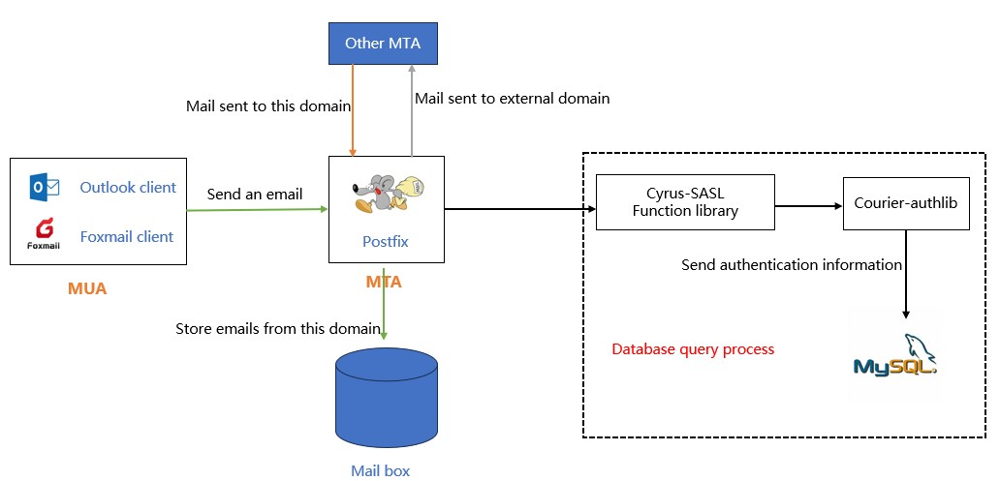

# Огляд системи електронної пошти

Електронна пошта, як одна з трьох основних служб (FTP, Web та електронна пошта) на початку Інтернету, все ще використовується багатьма людьми сьогодні. Електронна пошта вперше з’явилася в 1960-х роках, а електронна пошта на основі мережевої передачі — у 1971 році.

На відміну від систем електронної пошти комерційних компаній, версія системи електронної пошти з відкритим кодом складається з багатьох частин. Це не єдина служба, що призводить до більш складних систем електронної пошти в середовищах GNU/Linux.

## Основна концепція системи електронної пошти

Система електронної пошти в основному складається з чотирьох частин: **MUA**, **MTA**, **MRA** та **MDA**.

* **MUA (Mail User Agent)**: це поштові клієнти для користувачів, наприклад Outlook, Foxmail тощо.
* **MTA (агент передачі електронної пошти)**: відноситься до програми сервера електронної пошти, яка використовується для передачі пошти. MTA є реалізацією SMTP.
* **MDA (агент доставки пошти)**: коли MTA отримує пошту, MDA відповідає за збереження електронної пошти у вказаному місці на сервері електронної пошти, а також виконує фільтрацію електронної пошти та антивірусні операції.
* **MRA (агент отримання пошти)**: MRA – це реалізація IMAP і POP3, яка використовується для взаємодії з MUA та передачі електронних листів поштовим клієнтам через IMAP або POP3.

### Три протоколи

* **SMTP (Simple Mail Transfer Protocol)**: стандартний протокол для надсилання електронних листів із стандартним портом TCP 25. Використовуйте порт "TCP 465", якщо потрібна функція шифрування.
* **IMAP (Internet Mail Access Protocol)**: використовується для отримання електронних листів із сервера електронної пошти, порт за умовчанням – 143. Якщо потрібна функція шифрування, використовуйте порт 993.
* **POP3 (протокол поштового відділення – версія 3)**: використовується для отримання електронних листів із сервера електронної пошти, порт за умовчанням – 110. Якщо потрібна функція шифрування, використовуйте порт 995.

Різниця між IMAP і POP3 полягає в наступному:

|      Робоча позиція       |                            Зміст операції                            |                          IMAP                          |           POP3           |
|:-------------------------:|:--------------------------------------------------------------------:|:------------------------------------------------------:|:------------------------:|
|           Inbox           | Читання, позначення, переміщення, видалення електронних листів тощо. | Клієнт синхронізується з оновленнями поштової скриньки | Тільки всередині клієнта |
|          Outbox           |                       Збереження в Надісланих                        | Клієнт синхронізується з оновленнями поштової скриньки | Тільки всередині клієнта |
|      створити папку       |                  Створення нової спеціальної папки                   | Клієнт синхронізується з оновленнями поштової скриньки | Тільки всередині клієнта |
|         чернетка          |                Збереження чернетки електронного листа                | Клієнт синхронізується з оновленнями поштової скриньки | Тільки всередині клієнта |
|      Папка із спамом      | Отримуються електронні листи, які помилково надходять до папки спаму |                     підтримується                      |     не підтримується     |
| Рекламна електронна пошта |  Отримуються повідомлення, які переміщують в папку рекламної пошти   |                     підтримується                      |     не підтримується     |

### Конкретна реалізація

Як показано на малюнку нижче, це проста ілюстрація надсилання та отримання системи електронної пошти.

* **MTA**: у GNU/Linux основним і поширеним MTA є **postfix**,**qmail**, **sendmail**.
* **MDA**: у GNU/Linux основними та поширеними MDA є **procmail** і **maildrop**.
* **MRA**: у GNU/Linux основним і поширеним MDA є **dovecot**.

!!! question "Питання"

    «Чому DNS потрібен для участі в роботі поштової системи?»
    У щоденному використанні стандартним форматом для користувача електронної пошти є «ім’я користувача@ім’я домену». Ім’я домену не може представляти конкретний хост, і вам потрібно вказати доменне ім’я на певне ім’я хоста, тому нам потрібен запис роздільної здатності DNS MX.

## Postfix Процес надсилання та отримання електронних листів

**Sendmail** було створено в 1983 році та встановлено за замовчуванням у версіях до CentOS6. Через історичні причини (наприклад, складні конфігураційні файли) розробка sendmail перешкоджала. Хоча sendmail є складним, якщо у вас є сильні технічні навички або великий досвід, добре налаштований sendmail є чудовим щодо ефективності та продуктивності.

**Postfix** був створений у 1990 році Wietse Venema, голландським дослідником з IBM, для покращення поштового сервера sendmail.

Для отримання додаткової інформації про postfix перейдіть за цими двома посиланнями:

* [Репозиторій GitHub](https://github.com/vdukhovni/postfix)
* [Офіційний сайт](http://www.postfix.org/)

### Процес надсилання електронних листів клієнтом

Postfix визначає, чи належить електронний лист, надісланий клієнтом, локальному чи зовнішньому домену. Електронний лист буде збережено в поштовій скриньці локального домену, якщо він належить до локального домену. Якщо надісланий електронний лист належить до зовнішнього домену, він пересилається до іншого MTA (особистість користувача має бути підтверджена в базі даних перед пересиланням).

### Процес отримання електронних листів клієнтом

## Сервер електронної пошти з відкритим кодом

Повна система електронної пошти складається з децентралізованих компонентів, які обслуговуються різними особами чи організаціями, і для деяких людей існують високі перешкоди для використання. У результаті цього часу з’являються сервери електронної пошти з відкритим кодом. Ці сервери електронної пошти поєднують ці компоненти, створюючи готовий продукт, для користувачів усі аспекти відносно прості та легкі.

* [iredmail](https://www.iredmail.com/index.html)
* [Zimbra Email Server](https://www.zimbra.com/)
* [Extmail](https://www.extmail.cn/)
* [modoboa](https://modoboa.org/en/)
* [Mail-in-a-Box](https://mailinabox.email/)
* [Kolab Groupware](https://docs.kolab.org/installation-guide/index.html)
* [squirrelmail](https://www.squirrelmail.org/index.php)
* [hmailserve](https://www.hmailserver.com/)
* ...
