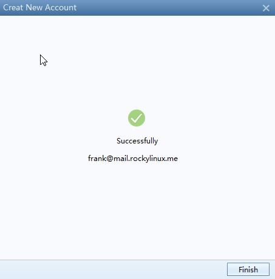

# Panoramica

Questo documento intende fornire al lettore una comprensione dettagliata dei vari componenti di un sistema di posta elettronica, compresa l'installazione, la configurazione di base e l'associazione. Si consiglia di utilizzare uno o più server di posta elettronica open source in un ambiente di produzione.

Tutti i comandi di questo documento vengono eseguiti utilizzando **root(uid=0)**.

## Elenco delle informazioni di base

|  Ruolo svolto   |   OS   |   Indirizzo IP   |                 versione                 |
|:---------------:|:------:|:----------------:|:----------------------------------------:|
| Mysql  Dadabase | RL 8.8 | 192.168.100.5/24 |                  8.0.33                  |
|  E-mail system  | RL 8.8 | 192.168.100.6/24 | postfix: 3.5.8<br/>dovecot: 2.3.16 |
|   `bind` DNS    | RL 8.8 | 192.168.100.7/24 |                 9.11.36                  |

!!! info "Informazione"

    Senza un database, la combinazione di postfix e dovecot creerà un sistema di posta elettronica funzionante.

### Installare e configurare `bind`

```bash
Shell(192.168.100.7) > dnf -y install bind bind-utils
```

```bash
# Modificare il file di configurazione principale
Shell(192.168.100.7) > vim /etc/named.conf
options {
    listen-on port 53 { 192.168.100.7; };
    ...
    allow-query     { any; };
    ...
};
...
include "/etc/named.rfc1912.zones";
include "/etc/named.root.key";

Shell(192.168.100.7) > named-checkconf /etc/named.conf
```

```bash
# Modificare il file di zona
## In pratica, si può sostituire rockylinux.me con il nome del proprio dominio, ad esempio rockylinux.org
Shell(192.168.100.7) > vim /etc/named.rfc1912.zones
zone "rockylinux.me" IN {
        type master;
        file "rockylinux.localhost";
        allow-update { none; };
};
```

!!! question "Domanda" 

    **Che cos'è la zona DNS?** Una zona DNS è la porzione specifica di uno spazio dei nomi DNS ospitata su un server DNS. Una zona DNS contiene record di risorse e il server DNS risponde alle query per i record in quello spazio dei nomi. Un server DNS può avere più zone DNS. In poche parole, una zona DNS è l'equivalente di un catalogo di libri.

```bash
# Modify data file
Shell(192.168.100.7) > cp -p /var/named/named.localhost /var/named/rockylinux.localhost
Shell(192.168.100.7) > vim /var/named/rockylinux.localhost
$TTL 1D
@       IN SOA   rockylinux.me. rname.invalid. (
                                        0       ; serial
                                        1D      ; refresh
                                        1H      ; retry
                                        1W      ; expire
                                        3H )    ; minimum
        NS      dns.rockylinux.me.
        MX 2    mail.rockylinux.me.
dns     A       192.168.100.7
mail    A       192.168.100.6

Shell(192.168.100.7) > named-checkzone  rockylinux.me  /var/named/rockylinux.localhost
zone rockylinux.me/IN: loaded serial 0
OK
```

Avviare il servizio bind - `systemctl start named.service`

Possiamo verificare se gli host sotto il nome di dominio vengono risolti correttamente.

```bash
Shell(192.168.100.7) > systemctl start named.service
Shell(192.168.100.7) > nmcli connection modify ens160 ipv4.dns "192.168.100.7,8.8.8.8"
Shell(192.168.100.7) > systemctl restart NetworkManager.service

Shell(192.168.100.7) > dig mail.rockylinux.me
...
;mail.rockylinux.me.            IN      A

;; ANSWER SECTION:
mail.rockylinux.me.     86400   IN      A       192.168.100.6

;; AUTHORITY SECTION:
rockylinux.me.          86400   IN      NS      dns.rockylinux.me.

;; ADDITIONAL SECTION:
dns.rockylinux.me.      86400   IN      A       192.168.100.7
...
```

!!! info "Informazione"

    un nome di dominio non può rappresentare un host specifico.

### Installare e configurare `Mysql`

```bash
Shell(192.168.100.5) > groupadd mysql && useradd -r -g mysql -s /sbin/nologin mysql
Shell(192.168.100.5) > id mysql
uid=995(mysql) gid=1000(mysql) groups=1000(mysql)
Shell(192.168.100.5) > dnf config-manager --enable powertools
Shell(192.168.100.5) > dnf -y install libaio ncurses-compat-libs ncurses-devel make cmake gcc bison git libtirpc-devel openssl  openssl-devel rpcgen wget tar gzip bzip2 zip unzip  gcc-toolset-12-gcc gcc-toolset-12-gcc-c++ gcc-toolset-12-binutils gcc-toolset-12-annobin-annocheck gcc-toolset-12-annobin-plugin-gcc
Shell(192.168.100.5) > wget https://dev.mysql.com/get/Downloads/MySQL-8.0/mysql-boost-8.0.33.tar.gz  && tar -zvxf mysql-boost-8.0.33.tar.gz  -C /usr/local/src/

Shell(192.168.100.5) > cd /usr/local/src/mysql-8.0.33 && mkdir build && cd build && cmake .. \
-DDEFAULT_CHARSET=utf8mb4 \
-DDEFAULT_COLLATION=utf8mb4_0900_ai_ci \
-DCMAKE_INSTALL_PREFIX=/usr/local/mysql \
-DCMAKE_BUILD_TYPE=RelWithDebInfo \
-DENABLED_LOCAL_INFILE=1 \
-DMYSQL_TCP_PORT=3306 \
-DWITH_BOOST=/usr/local/src/mysql-8.0.33/boost/ \
-DMYSQL_DATADIR=/usr/local/mysql/data \
&& make && make install 
```

```bash
Shell(192.168.100.5) > chown -R mysql:mysql /usr/local/mysql
Shell(192.168.100.5) > chmod -R 755 /usr/local/mysql
Shell(192.168.100.5) > /usr/local/mysql/bin/mysqld  --initialize  --user=mysql  --basedir=/usr/local/mysql  --datadir=/usr/local/mysql/data
2023-07-14T14:46:49.474684Z 0 [System] [MY-013169] [Server] /usr/local/mysql/bin/mysqld (mysqld 8.0.33) initializing of server in progress as process 42038
2023-07-14T14:46:49.496908Z 1 [System] [MY-013576] [InnoDB] InnoDB initialization has started.
2023-07-14T14:46:50.210118Z 1 [System] [MY-013577] [InnoDB] InnoDB initialization has ended.
2023-07-14T14:46:51.305307Z 6 [Note] [MY-010454] [Server] A temporary password is generated for root@localhost: pkqaXRuTn1/N
```

```bash
Shell(192.168.100.5) > vim /etc/my.cnf
[client]
port=3306
socket=/tmp/mysql.sock

[mysqld]
bind-address=192.168.100.5
port=3306
socket=/tmp/mysql.sock
basedir=/usr/local/mysql
datadir=/usr/local/mysql/data
user=mysql
log-error=/usr/local/mysql/data/mysql_log.error

Shell(192.168.100.5) > /usr/local/mysql/bin/mysqld_safe  --user=mysql &
Shell(192.168.100.5) > /usr/local/mysql/bin/mysql -u root --password="pkqaXRuTn1/N"
```

```sql
Mysql > ALTER USER 'root'@'localhost' IDENTIFIED BY 'rockylinux.me';

Mysql > create user 'mailrl'@'%' identified by 'mail.rockylinux.me'; 

Mysql > grant all privileges on *.* to 'mailrl'@'%' with grant option;
```

!!! info "Informazione" 

    Non è necessario utilizzare lo stesso metodo dell'autore. È anche possibile installare Mysql da un repository o da docker.

#### Creare tabelle e inserire i dati

```sql
Shell(192.168.100.5) >  /usr/local/mysql/bin/mysql -u mailrl --password="mail.rockylinux.me"

Mysql > create database mailserver;

Mysql > use mailserver;

Mysql > create table if not exists virtual_domains (
        id int(11) primary key  auto_increment,
        name varchar(50) not null
);

Mysql > create table if not exists virtual_users (
        id int(11) primary key auto_increment,
        email varchar(128) NOT NULL unique,
        password varchar(150) not null,
        domain_id int(11) not null,
        FOREIGN KEY (domain_id) REFERENCES virtual_domains(id) ON DELETE CASCADE
);

Mysql > create table if not exists virtual_aliases (
        id int(11) primary key auto_increment,
        domain_id int(11) NOT NULL,
        source varchar(100) NOT NULL,
        destination varchar(100) NOT NULL,
        FOREIGN KEY (domain_id) REFERENCES virtual_domains(id) ON DELETE CASCADE
);
```

```sql
Mysql > insert into virtual_domains(id,name) values(1,'mail.rockylinux.me'),(2,'rockylinux.me');

Mysql > insert into virtual_aliases(id,domain_id,source,destination) values(1,1,'all@mail.rockylinux.me','frank@mail.rockylinux.me');

Mysql > insert into virtual_aliases(id,domain_id,source,destination) values(2,1,'all@mail.rockylinux.me','leeo@mail.rockylinux.me');
```

In questo caso non ho inserito la password del testo cifrato per i relativi utenti di posta elettronica, che richiede l'uso del comando `doveadm pw -s SHA512-crypt -p twotestandtwo`. Vedere [qui](#ap1)

#### Nozioni di SHA512 (SHA-2)

SHA-2 (Secure Hash Algorithm 2): Un algoritmo crittografico per funzioni di hash standard. È il successore di SHA-1.

Standard principali:

* SHA-0
* SHA-1
* SHA-2: Contiene questi -- SHA-224, SHA-256, SHA-384, SHA-512, SHA-512/224, SHA-512/256
* SHA-3

Nello standard di crittografia SHA-2, il numero dell'algoritmo si riferisce alla lunghezza del digest in bit.

È noto che in RockyLinux 8 e in altre varianti di RHEL 8, l'algoritmo utilizzato per crittografare le password degli utenti è SHA-512.

```bash
Shell(192.168.100.5) > grep -i method /etc/login.defs
ENCRYPT_METHOD SHA512
```

Possiamo vedere la sua struttura nel file /etc/shadow:

```bash
Shell(192.168.100.5) > grep -i root /etc/shadow | cut -f 2 -d ":"
$6$8jpmvCw8RqNfHYW4$pOlsEZG066eJuTmNHoidtvfWHe/6HORrKkQPwv4eyFxqGXKEXhep6aIRxAtv7FDDIq/ojIY1SfWAQkk7XACeZ0
```

Usare il segno $ per separare le informazioni del testo in uscita.

* 6: Significa id. Per l'algoritmo di crittografia SHA-512, il valore è fissato a 6.
* 8jpmvCw8RqNfHYW4: Conosciuto anche come "salt". La sua funzione principale è quella di aumentare la sicurezza e migliorare la difficoltà di cracking. Il sistema può generarlo in modo casuale o può essere specificato manualmente.
* pOlsEZG066eJuTmNHoidtvfWHe/6HORrKkQPwv4eyFxqGXKEXhep6aIRxAtv7FDDIq/ojIY1SfWAQkk7XACeZ0: 86 numero fisso di caratteri. Si riferisce alle password di testo cifrato generate utilizzando algoritmi di crittografia.

### Installare e configurare `postfix`

```bash
Shell(192.168.100.6) > dnf -y install postfix postfix-mysql
```

Dopo aver installato Postfix, è necessario conoscere i seguenti file:

* **/etc/postfix/main.cf**. Il file di configurazione principale e più importante
* **/etc/postfix/master.cf**. Si usa per impostare i parametri di runtime per ciascun componente. In generale, non è necessario apportare modifiche, tranne nel caso in cui sia necessaria un'ottimizzazione delle prestazioni.
* **/etc/postfix/access**. File di controllo degli accessi per SMTP.
* **/etc/postfix/transport**. Mappa gli indirizzi e-mail agli host di relay.

È necessario conoscere questi file binari eseguibili:

* /**usr/sbin/postalias**. Istruzione di generazione del database alias. Dopo l'esecuzione di questo comando, viene generato /etc/aliases.db sulla base del file /etc/aliases
* **/usr/sbin/postcat**. Questo comando viene utilizzato per visualizzare il contenuto della posta nella coda di posta.
* **/usr/sbin/postconf**. Interrogazione delle informazioni di configurazione.
* **/usr/sbin/postfix**. I comandi del demone principale. Può essere utilizzato come segue:

  * `postfix check`
  * `postfix start`
  * `postfix stop`
  * `postfix reload`
  * `postfix status`

!!! tip "Suggerimento"

    È possibile specificare l'MTA predefinito utilizzando il comando `alternatives -config mta` se si dispone di più di un MTA sul server.

#### Descrizione del file /etc/postfix/main.cf

```bash
Shell(192.168.100.6) > egrep -v "^#|^$" /etc/postfix/main.cf
compatibility_level = 2
queue_directory = /var/spool/postfix
command_directory = /usr/sbin
daemon_directory = /usr/libexec/postfix
data_directory = /var/lib/postfix
mail_owner = postfix
inet_interfaces = localhost
inet_protocols = all
mydestination = $myhostname, localhost.$mydomain, localhost
unknown_local_recipient_reject_code = 550
alias_maps = hash:/etc/aliases
alias_database = hash:/etc/aliases
debug_peer_level = 2
debugger_command =
         PATH=/bin:/usr/bin:/usr/local/bin:/usr/X11R6/bin
         ddd $daemon_directory/$process_name $process_id & sleep 5
sendmail_path = /usr/sbin/sendmail.postfix
newaliases_path = /usr/bin/newaliases.postfix
mailq_path = /usr/bin/mailq.postfix
setgid_group = postdrop
html_directory = no
manpage_directory = /usr/share/man
sample_directory = /usr/share/doc/postfix/samples
readme_directory = /usr/share/doc/postfix/README_FILES
smtpd_tls_cert_file = /etc/pki/tls/certs/postfix.pem
smtpd_tls_key_file = /etc/pki/tls/private/postfix.key
smtpd_tls_security_level = may
smtp_tls_CApath = /etc/pki/tls/certs
smtp_tls_CAfile = /etc/pki/tls/certs/ca-bundle.crt
smtp_tls_security_level = may
meta_directory = /etc/postfix
shlib_directory = /usr/lib64/postfix
```

* **compatibility_level = 2**. Un nuovo meccanismo introdotto in Postfix 3 è stato progettato per essere compatibile con le versioni precedenti.
* **data_directory = /var/lib/postfix**. La directory in cui sono memorizzati i dati nella cache.
* **<font color="red">myhostname = host.domain.tld</font>**. Parametri importanti che sono stati commentati. È necessario cambiarlo con l'hostname del proprio nome di dominio.
* **<font color="red">mydomain = domain.tld</font>**. Parametri importanti che sono stati commentati. È necessario cambiarlo con il proprio nome di dominio.
* **<font color="red">myorigin = \$myhostname</font>** and **<font color="red">myorigin = $mydomain</font>**. Parametri importanti che sono stati commentati. La funzione principale è quella di integrare il suffisso di posta del mittente. **\$** rappresenta una variabile parametrica di riferimento.
* **<font color="red">inet_interfaces = localhost</font>**. Quando si riceve la posta, questo parametro indica l'indirizzo da ascoltare. Il valore viene solitamente modificato in "all".
* **inet_protocols = all**. Abilitare IPv4 e IPv6, se supportato
* **<font color="red">mydestination = \$myhostname, localhost.\$mydomain, localhost</font>**. Indica la ricezione di posta dalla destinazione indicata.
* **unknown_local_recipient_reject_code = 550**. Il codice di errore restituito quando si invia a un account che non esiste nel dominio locale o si rifiuta un'e-mail.
* **mynetworks =**. Impostare le e-mail degli host che possono essere inoltrate.
* **relay_domains = $mydestination**. Impostare le e-mail dei domini che possono essere inoltrate.
* **alias_maps = hash:/etc/aliases**. Viene utilizzato per definire gli alias degli utenti e richiede il supporto del database.
* **alias_database = hash:/etc/aliases**. Il database da utilizzare per gli alias.
* **<font color="red">home_mailbox = Maildir/</font>**. Parametri importanti che sono stati commentati. Indica dove è memorizzata la casella di posta locale.
* **debug_peer_level = 2**. Livello dei record di registro.
* **setgid_group = postdrop**. L'identificativo del gruppo utilizzato per inviare e-mail o gestire le code.

A parte le voci di parametro menzionate o visualizzate sopra, alcuni parametri sono nascosti e possono essere visualizzati tramite il comando `postconf`. I parametri più importanti sono:

* **message_size_limit = 10240000**. Impostare le dimensioni di una singola e-mail (compresi il corpo e gli allegati). L'unità di misura del valore è B (Byte).
* **mailbox_size_limit = 1073741824**. Impostare il limite di capienza per un singolo utente della mailbox.
* **smtpd_sasl_type = cyrus**. Il tipo di autenticazione SASL (Simple Authentication and Security Layer). È possibile utilizzare `postconf -a` per visualizzare.
* **smtpd_sasl_auth_enable = no**. Abilitare o meno l'autenticazione SASL.
* **smtpd_sasl_security_options = noanonymous**. Opzioni di sicurezza per SASL. L'autenticazione anonima è disattivata per impostazione predefinita.
* **smtpd_sasl_local_domain =**. Il nome del dominio locale.
* **smtpd_recipient_restrictions =**. Filtro dei destinatari. Il valore di default è vuoto.

#### Modificare /etc/postfix/main.cf

```bash
Shell(192.168.100.6) > vim /etc/postfix/main.cf
...
myhostname = mail.rockylinux.me
mydomain = rockylinux.me
myorigin = $myhostname
inet_interfaces = 192.168.100.6
inet_protocols = ipv4
mydestination = 
biff = no
append_dot_mydomain = no
smtpd_sasl_type = dovecot
smtpd_sasl_path = private/auth
smtpd_sasl_auth_enable = yes
smtpd_sasl_local_domain = $myhostname
virtual_transport = lmtp:unix:private/dovecot-lmtp
virtual_mailbox_domains = mysql:/etc/postfix/mysql-virtual-mailbox-domains.cf
virtual_mailbox_maps = mysql:/etc/postfix/mysql-virtual-mailbox-maps.cf
virtual_alias_maps = mysql:/etc/postfix/mysql-virtual-alias-maps.cf,mysql:/etc/postfix/mysql-virtual-email2email.cf
...
```

Il contenuto finale del file appare così:

```text
compatibility_level = 2
queue_directory = /var/spool/postfix
command_directory = /usr/sbin
daemon_directory = /usr/libexec/postfix
data_directory = /var/lib/postfix
mail_owner = postfix
myhostname = mail.rockylinux.me
mydomain = rockylinux.me
myorigin = $myhostname
inet_interfaces = 192.168.100.6
inet_protocols = ipv4
mydestination = 
biff = no
append_dot_mydomain = no
smtpd_sasl_type = dovecot
smtpd_sasl_path = private/auth
smtpd_sasl_auth_enable = yes
smtpd_sasl_local_domain = $myhostname
virtual_transport = lmtp:unix:private/dovecot-lmtp
virtual_mailbox_domains = mysql:/etc/postfix/mysql-virtual-mailbox-domains.cf
virtual_mailbox_maps = mysql:/etc/postfix/mysql-virtual-mailbox-maps.cf
virtual_alias_maps = mysql:/etc/postfix/mysql-virtual-alias-maps.cf,mysql:/etc/postfix/mysql-virtual-email2email.cf
unknown_local_recipient_reject_code = 550
alias_maps = hash:/etc/aliases
alias_database = hash:/etc/aliases
debug_peer_level = 2
debugger_command =
         PATH=/bin:/usr/bin:/usr/local/bin:/usr/X11R6/bin
         ddd $daemon_directory/$process_name $process_id & sleep 5
sendmail_path = /usr/sbin/sendmail.postfix
newaliases_path = /usr/bin/newaliases.postfix
mailq_path = /usr/bin/mailq.postfix
setgid_group = postdrop
html_directory = no
manpage_directory = /usr/share/man
sample_directory = /usr/share/doc/postfix/samples
readme_directory = /usr/share/doc/postfix/README_FILES
smtpd_tls_cert_file = /etc/pki/tls/certs/postfix.pem
smtpd_tls_key_file = /etc/pki/tls/private/postfix.key
smtpd_tls_security_level = may
smtp_tls_CApath = /etc/pki/tls/certs
smtp_tls_CAfile = /etc/pki/tls/certs/ca-bundle.crt
smtp_tls_security_level = may
meta_directory = /etc/postfix
shlib_directory = /usr/lib64/postfix
```

Creare un file e scrivere il contenuto corrispondente:

```bash
Shell(192.168.100.6) > vim /etc/postfix/mysql-virtual-mailbox-domains.cf
user = mailrl
password = mail.rockylinux.me
hosts = 192.168.100.5
dbname = mailserver
query = SELECT 1 FROM virtual_domains WHERE name='%s'

Shell(192.168.100.6) > vim /etc/postfix/mysql-virtual-mailbox-maps.cf
user = mailrl
password = mail.rockylinux.me
hosts = 192.168.100.5
dbname = mailserver
query = SELECT 1 FROM virtual_users WHERE email='%s'

Shell(192.168.100.6) > vim /etc/postfix/mysql-virtual-alias-maps.cf
user = mailrl
password = mail.rockylinux.me
hosts = 192.168.100.5
dbname = mailserver
query = SELECT destination FROM virtual_aliases WHERE source='%s'

Shell(192.168.100.6) > vim /etc/postfix/mysql-virtual-email2email.cf
user = mailrl
password = mail.rockylinux.me
hosts = 192.168.100.5
dbname = mailserver
query = SELECT email FROM virtual_users WHERE email='%s'
```

!!! warning "Attenzione" 

    Se si riscontra questo tipo di errore dopo aver eseguito `systemctl start postfix.service` -- "fatal: open lock file /var/lib/postfix/master.lock: unable to set exclusive lock: Resource temporarily unavailable." Si prega di cancellare il file esistente **/var/lib/postfix/master.lock**

Verifica della configurazione di Postfix:

```bash
Shell(192.168.100.6) > systemctl start postfix.service
Shell(192.168.100.6) > postfix check
Shell(192.168.100.6) > postfix status

# If the command return 1, it is successful.
Shell(192.168.100.6) > postmap -q mail.rockylinux.me mysql:/etc/postfix/mysql-virtual-mailbox-domains.cf
Shell(192.168.100.6) > echo $?
1

Shell(192.168.100.6) > postmap -q frank@mail.rockylinux.me mysql:/etc/postfix/mysql-virtual-mailbox-maps.cf
Shell(192.168.100.6) > echo $?
1

Shell(192.168.100.6) > postmap -q all@mail.rockylinux.me mysql:/etc/postfix/mysql-virtual-alias-maps.cf
frank@mail.rockylinux.me,leeo@mail.rockylinux.me
```

#### Modificare /etc/postfix/master.cf

Il file modificato ha il seguente aspetto:

```bash
Shell(192.168.100.6) > egrep -v "^#|^$" /etc/postfix/master.cf
smtp      inet  n       -       n       -       -       smtpd
submission inet n       -       n       -       -       smtpd
  -o syslog_name=postfix/submission
  -o smtpd_tls_security_level=encrypt
  -o smtpd_sasl_auth_enable=yes
  -o smtpd_tls_auth_only=yes
  -o smtpd_reject_unlisted_recipient=no
  -o smtpd_client_restrictions=$mua_client_restrictions
  -o smtpd_helo_restrictions=$mua_helo_restrictions
  -o smtpd_sender_restrictions=$mua_sender_restrictions
  -o smtpd_recipient_restrictions=
  -o smtpd_relay_restrictions=permit_sasl_authenticated,reject
  -o milter_macro_daemon_name=ORIGINATING
smtps     inet  n       -       n       -       -       smtpd
  -o syslog_name=postfix/smtps
  -o smtpd_tls_wrappermode=yes
  -o smtpd_sasl_auth_enable=yes
  -o smtpd_reject_unlisted_recipient=no
  -o smtpd_client_restrictions=$mua_client_restrictions
  -o smtpd_helo_restrictions=$mua_helo_restrictions
  -o smtpd_sender_restrictions=$mua_sender_restrictions
  -o smtpd_recipient_restrictions=
  -o smtpd_relay_restrictions=permit_sasl_authenticated,reject
  -o milter_macro_daemon_name=ORIGINATING
...
```

Infine, eseguite il comando `systemctl restart postfix.service`. A questo punto, la configurazione di postfix è terminata.

### Installare e configurare `dovecot`

```bash
Shell(192.168.100.6) > dnf config-manager --enable devel && dnf -y install dovecot dovecot-devel dovecot-mysql
```

Senza modificare alcun file, la struttura della directory originale è la seguente:

```bash
Shell(192.168.100.6) > tree /etc/dovecot/
/etc/dovecot/
├── conf.d
│   ├── 10-auth.conf
│   ├── 10-director.conf
│   ├── 10-logging.conf
│   ├── 10-mail.conf
│   ├── 10-master.conf
│   ├── 10-metrics.conf
│   ├── 10-ssl.conf
│   ├── 15-lda.conf
│   ├── 15-mailboxes.conf
│   ├── 20-imap.conf
│   ├── 20-lmtp.conf
│   ├── 20-pop3.conf
│   ├── 20-submission.conf
│   ├── 90-acl.conf
│   ├── 90-plugin.conf
│   ├── 90-quota.conf
│   ├── auth-checkpassword.conf.ext
│   ├── auth-deny.conf.ext
│   ├── auth-dict.conf.ext
│   ├── auth-ldap.conf.ext
│   ├── auth-master.conf.ext
│   ├── auth-passwdfile.conf.ext
│   ├── auth-sql.conf.ext
│   ├── auth-static.conf.ext
│   └── auth-system.conf.ext
└── dovecot.conf
```

Sì, sia Postfix che Dovecot hanno configurazioni molto complesse, quindi si raccomanda alla maggior parte degli amministratori di sistemi GNU/Linux di utilizzare server di posta elettronica open source.

Come per postfix, inserire il comando `doveconf` per visualizzare la configurazione completa.

La descrizione del file è la seguente:

* **dovecot.conf**: Il file di configurazione principale di dovecot.

  * Caricare i file di configurazione secondari con il metodo `!include conf.d/*.conf`. Dovecot non si preoccupa di quali impostazioni siano presenti in tali file.
  * Il prefisso numerico del file di configurazione secondaria serve a facilitare la comprensione dell'ordine di parsing.
  * Per ragioni storiche, esistono ancora alcuni file di configurazione esterni al file principale `dovecot.conf`, che sono tipicamente denominati `*.conf.ext`.
  * Nel file di configurazione si possono usare variabili, che si dividono in **variabili globali** e **variabili utente**, che iniziano con `%`. Vedere [qui](https://doc.dovecot.org/configuration_manual/config_file/config_variables/#config-variables).

* **10-auth.conf**. Configurazione relativa all'autenticazione dell'identità.
* **10-logging.conf**. Configurazione relativa al registro. Può essere molto utile nell'analisi delle prestazioni, nel debug del software, ecc.
* **10-mail.conf**. Configurazione delle posizioni delle caselle postali e degli spazi dei nomi. Per impostazione predefinita, il valore della posizione della casella di posta dell'utente è vuoto, il che significa che Dovecot cerca automaticamente la posizione della casella di posta. Quando l'utente non ha alcuna posta, è necessario indicare esplicitamente a Dovecot la posizione di tutte le caselle di posta.
* **10-metrics.conf**. Configurazione relativa alle informazioni statistiche.
* **15-mailboxes.conf**. Configurazione della definizione della mailbox.
* **auth-sql.conf.ext**. Autenticazione per gli utenti SQL.

#### Alcuni importanti parametri del file di configurazione

* `protocols = imap pop3 lmtp submission`. Protocolli supportati da Dovecot.
* `listen = *, ::`. Un elenco separato da virgole di IP o host da cui ascoltare per le connessioni. "*" ascolta tutte le interfacce IPv4, "::" ascolta tutte le interfacce IPv6.
* `disable_plaintext_auth = yes`. Disattivare o meno la password in chiaro per l'autenticazione.
* `auth_mechanisms =`. Il tipo di meccanismo di autenticazione, i cui valori possono essere multipli e separati da spazi. Valori: plain, login, digest-md5, cram-md5, ntlm, rpa, apop, anonymous, gssapi, otp, skey, gss-spnego.
* `login_trusted_networks=`. Quali client (MUA) sono autorizzati a usare Dovecot. Può essere un indirizzo IP separato, può essere un segmento di rete o può essere misto e separato da spazi. Come questo-- `login_trusted_networks = 10.1.1.0/24 192.168.100.2`
* `mail_location =`. Se il valore è vuoto, Dovecot tenta di trovare automaticamente le caselle di posta elettronica (cercando in ~/Maildir, /var/mail/username, ~/mail e ~/Mail, in quest'ordine). Tuttavia, il rilevamento automatico di solito fallisce per gli utenti la cui directory di posta non è ancora stata creata, quindi si dovrebbe indicare esplicitamente la posizione completa qui, se possibile.
* `mail_privileged_group =`. Questo gruppo è abilitato temporaneamente per le operazioni privilegiate. Attualmente viene utilizzato solo con INBOX quando la sua creazione iniziale o il blocco dei punti falliscono. In genere si imposta "mail" per accedere a /var/mail.

#### Modifica di più file

```bash
Shell(192.168.100.6) > vim /etc/dovecot/dovecot.conf
...
protocols = imap pop3 lmtp
listen = 192.168.100.6
...
```

```bash
Shell(192.168.100.6) > vim /etc/dovecot/conf.d/10-mail.conf
...
# %u - username
# %n - user part in user@domain, same as %u if there's no domain
# %d - domain part in user@domain, empty if there's no domain
# %h - home directory
mail_location = maildir:/var/mail/vhosts/%d/%n
...
mail_privileged_group = mail
...
```

Creazione delle directory correlate -- `mkdir -p /var/mail/vhosts/rockylinux.me`. `rockylinx.me` si riferisce al nome di dominio per il quale si è fatta richiesta (chiamato dominio o dominio locale nella posta elettronica).

Aggiungere utenti correlati e specificare la directory home -- `groupadd -g 2000 vmail && useradd -g vmail -u 2000 -d /var/mail/ vmail`

Modifica del proprietario e del gruppo -- `chown -R vmail:vmail /var/mail/`

Cancellare i commenti relativi al file:

```bash
Shell(192.168.100.6) > vim /etc/dovecot/conf.d/auth-sql.conf.ext
passdb {
    driver = sql
    args = /etc/dovecot/dovecot-sql.conf.ext
}
userdb {
    driver = static
    args = uid=vmail gid=vmail home=/var/mail/vhosts/%d/%n
}
...
```

!!! warning "Attenzione"

    Non scrivete la sintassi di cui sopra su una sola riga, come in questo caso--"userdb {driver = sql args = uid=vmail gid=vmail home=/var/mail/vhosts/%d/%n}". Altrimenti, non funzionerà.

Creare il file /etc/dovecot/dovecot-sql.conf.ext e scrivere il relativo contenuto:

```bash
Shell(192.168.100.6) > vim /etc/dovecot/dovecot-sql.conf.ext
driver = mysql
connect = host=192.168.100.5 dbname=mailserver user=mailrl password=mail.rockylinux.me
default_pass_scheme = SHA512-CRYPT
password_query = SELECT password FROM virtual_users WHERE email='%u'
```

Modifica del proprietario e del gruppo -- `chown -R vmail:dovecot /etc/dovecot`

Modificare i permessi delle cartelle -- `chmod -R 770 /etc/dovecot`

```bash
Shell(192.168.100.6) > vim /etc/dovecot/conf.d/10-auth.conf
disable_plaintext_auth = yes
...
auth_mechanisms = plain login
...
#!include auth-system.conf.ext
!include auth-sql.conf.ext
```

```bash
Shell(192.168.100.6) > vim /etc/dovecot/conf.d/10-master.conf
...
service lmtp {
  unix_listener /var/spool/postfix/private/dovecot-lmtp {
    mode = 0600
    user = postfix
    group = postfix
  }
}
...
service auth {
  unix_listener auth-userdb {
    mode = 0600
    user = vmail
    group = vmail
  }
  unix_listener /var/spool/postfix/private/auth {
    mode = 0660
    user = postfix
    group = postfix
  }
  user = dovecot
}

service auth-worker {
  user = vmail
}
...
```

OK, utilizzare il comando per avviare il servizio-- `systemctl start dovecot.service`

!!! info "Informazione" 

    Durante l'inizializzazione di dovecot, il file **/usr/libexec/dovecot/mkcert.sh** viene eseguito per generare un certificato autofirmato.

È possibile verificare l'occupazione della porta con il seguente comando:

```bash
Shell(192.168.100.6) > ss -tulnp
Netid    State     Recv-Q    Send-Q                           Local Address:Port       Peer Address:Port   Process
udp      UNCONN    0         0                                    127.0.0.1:323             0.0.0.0:*       users:(("chronyd",pid=715,fd=5))
udp      UNCONN    0         0                                        [::1]:323                [::]:*       users:(("chronyd",pid=715,fd=6))
udp      UNCONN    0         0            [fe80::20c:29ff:fe6f:8666]%ens160:546                [::]:*       users:(("NetworkManager",pid=710,fd=24))
tcp      LISTEN    0         128                                    0.0.0.0:22              0.0.0.0:*       users:(("sshd",pid=732,fd=3))
tcp      LISTEN    0         100                              192.168.100.6:25              0.0.0.0:*       users:(("master",pid=4066,fd=13))
tcp      LISTEN    0         100                              192.168.100.6:993             0.0.0.0:*       users:(("dovecot",pid=3808,fd=39))
tcp      LISTEN    0         100                              192.168.100.6:995             0.0.0.0:*       users:(("dovecot",pid=3808,fd=22))
tcp      LISTEN    0         100                              192.168.100.6:587             0.0.0.0:*       users:(("master",pid=4066,fd=17))
tcp      LISTEN    0         100                              192.168.100.6:110             0.0.0.0:*       users:(("dovecot",pid=3808,fd=21))
tcp      LISTEN    0         100                              192.168.100.6:143             0.0.0.0:*       users:(("dovecot",pid=3808,fd=38))
tcp      LISTEN    0         100                              192.168.100.6:465             0.0.0.0:*       users:(("master",pid=4066,fd=20))
tcp      LISTEN    0         128                                       [::]:22                 [::]:*       users:(("sshd",pid=732,fd=4))
```

Porte occupate da postfix -- 25, 587, 465 Porte occupate da dovecot -- 993, 995, 110, 143

È possibile utilizzare il comando `doveadm` per generare la password cifrata pertinente e inserirla nella tabella virtual_users.

<a id="ap1"></a>

```bash
Shell(192.168.100.6) > doveadm pw -s SHA512-crypt -p onetestandone
{SHA512-CRYPT}$6$dEqUVsCirHzV8kHw$hgC0x0ufah.N0PzUVvhLEMnoww5lo.JBmeLSsRNDkgWVylC55Gk6zA1KWsn.SiIAAIDEqHxtugGZWHl1qMex..

Shell(192.168.100.6) > doveadm pw -s SHA512-crypt -p twotestandtwo
{SHA512-CRYPT}$6$TF7w672arYUk.fGC$enDafylYnih4q140B2Bu4QfEvLCQAiQBHXpqDpHQPHruil4j4QbLXMvctWHdZ/MpuwvhmBGHTlNufVwc9hG34/
```

Inserire i dati pertinenti sull'host 192.168.100.5.

```sql
Mysql > use mailserver;

Mysql > insert into virtual_users(id,email,password,domain_id) values(1,'frank@mail.rockylinux.me','$6$dEqUVsCirHzV8kHw$hgC0x0ufah.N0PzUVvhLEMnoww5lo.JBmeLSsRNDkgWVylC55Gk6zA1KWsn.SiIAAIDEqHxtugGZWHl1qMex..',1);

Mysql > insert into virtual_users(id,email,password,domain_id) values(2,'leeo@mail.rockylinux.me','$6$TF7w672arYUk.fGC$enDafylYnih4q140B2Bu4QfEvLCQAiQBHXpqDpHQPHruil4j4QbLXMvctWHdZ/MpuwvhmBGHTlNufVwc9hG34/',1);
```

### Test

#### Autenticazione dell'utente

Utilizzare un altro computer Windows10 e cambiare il suo DNS preferito in 192.168.100.7. L'autore utilizza foxmail come client di posta elettronica.

Nella schermata principale, selezionare "Altra casella di posta" --> "Manuale" --> Inserire il contenuto pertinente per completare. --> "Creare"




#### Inviare un'e-mail

Utilizzare questo utente per tentare di inviare un'e-mail a un utente leeo.


#### Ricevere la posta


### Descrizione aggiuntiva

* Dovete disporre di un nome di dominio legittimato (dominio)
* Dovete richiedere un certificato SSL/TLS per il vostro sistema di posta elettronica
