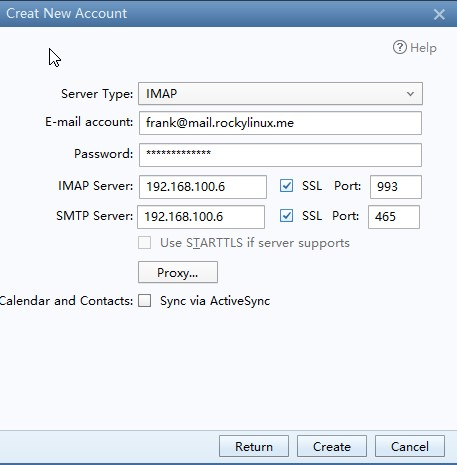

# Panoramica

Questo documento si propone di fornire al lettore una comprensione dettagliata dei vari componenti di un sistema di posta elettronica, compresa la sua installazione e configurazione di base.

Tutti i comandi di questo documento vengono eseguiti utilizzando **root(uid=0)**.

## Elenco delle informazioni di base

|  Ruolo svolto   |   OS   |   Indirizzo IP   |                 versione                 |
|:---------------:|:------:|:----------------:|:----------------------------------------:|
| Mysql  Dadabase | RL 8.8 | 192.168.100.5/24 |                  8.0.33                  |
|  E-mail system  | RL 8.8 | 192.168.100.6/24 | postfix: 3.5.8<br/>dovecot: 2.3.16 |
|   `bind` DNS    | RL 8.8 | 192.168.100.7/24 |                 9.11.36                  |

!!! info "Informazione"

    Postfix e Dovecot possono ancora funzionare per una piccola installazione senza database.

### Installare e configurare `bind`

Innanzitutto, installare BIND:

```bash
Shell(192.168.100.7) > dnf -y install bind bind-utils
```

Quindi, modificare `/etc/named.conf`:

```bash
options {
    listen-on port 53 { 192.168.100.7; };
    ...
    allow-query     { any; };
    ...
};
...
include "/etc/named.rfc1912.zones";
include "/etc/named.root.key";
```

Verificare che la configurazione di BIND sia corretta.

```bash
Shell(192.168.100.7) > named-checkconf /etc/named.conf
```

Ora, modificare `/etc/named.rfc1912.zones`:

```bash
zone "rockylinux.me" IN {
        type master;
        file "rockylinux.localhost";
        allow-update { none; };
};
```

!!! question

    **Che cos'è una zona DNS?** Una zona DNS è una porzione dello spazio dei nomi DNS ospitata su un server DNS. Una zona DNS contiene record di risorse e un server DNS risponde alle query per i record in quello spazio dei nomi. Un server DNS può avere più zone DNS. In parole povere, una zona DNS è analoga a un catalogo di libri.

Per prima cosa, inizializzare BIND:

```bash
Shell(192.168.100.7) > cp -p /var/named/named.localhost /var/named/rockylinux.localhost
Shell(192.168.100.7) > vim /var/named/rockylinux.localhost
$TTL 1D
@       IN SOA   rockylinux.me. rname.invalid. (
                                        0       ; serial
                                        1D      ; refresh
                                        1H      ; retry
                                        1W      ; expire
                                        3H )    ; minimum
        NS      dns.rockylinux.me.
        MX 2    mail.rockylinux.me. dns     A       192.168.100.7
mail    A       192.168.100.6

Shell(192.168.100.7) > named-checkzone  rockylinux.me  /var/named/rockylinux.localhost
zone rockylinux.me/IN: loaded serial 0
OK
```

Avviare ora BIND:

```bash
Shell(192.168.100.7) > systemctl start named.service
```

Possiamo verificare se la risoluzione DNS del nostro server funziona:

```bash
Shell(192.168.100.7) > systemctl start named.service
Shell(192.168.100.7) > nmcli connection modify ens160 ipv4.dns "192.168.100.7,8.8.8.8"
Shell(192.168.100.7) > systemctl restart NetworkManager.service

Shell(192.168.100.7) > dig mail.rockylinux.me
...
;mail.rockylinux.me.            IN      A

;; ANSWER SECTION:
mail.rockylinux.me.     86400   IN      A       192.168.100.6

;; AUTHORITY SECTION:
rockylinux.me.          86400   IN      NS      dns.rockylinux.me.

;; ADDITIONAL SECTION:
dns.rockylinux.me.      86400   IN      A       192.168.100.7
...
```

!!! info "Informazione"

    Il nome del nostro dominio non può essere il nome host del nostro server.

### Installare e configurare MySQL

Per prima cosa, installate MySQL dal sorgente:

```bash
Shell(192.168.100.5) > groupadd mysql && useradd -r -g mysql -s /sbin/nologin mysql
Shell(192.168.100.5) > id mysql
uid=995(mysql) gid=1000(mysql) groups=1000(mysql)
Shell(192.168.100.5) > dnf config-manager --enable powertools
Shell(192.168.100.5) > dnf -y install libaio ncurses-compat-libs ncurses-devel make cmake gcc bison git libtirpc-devel openssl  openssl-devel rpcgen wget tar gzip bzip2 zip unzip  gcc-toolset-12-gcc gcc-toolset-12-gcc-c++ gcc-toolset-12-binutils gcc-toolset-12-annobin-annocheck gcc-toolset-12-annobin-plugin-gcc
Shell(192.168.100.5) > wget https://dev.mysql.com/get/Downloads/MySQL-8.0/mysql-boost-8.0.33.tar.gz  && tar -zvxf mysql-boost-8.0.33.tar.gz  -C /usr/local/src/

Shell(192.168.100.5) > cd /usr/local/src/mysql-8.0.33 && mkdir build && cd build && cmake .. \
-DDEFAULT_CHARSET=utf8mb4 \
-DDEFAULT_COLLATION=utf8mb4_0900_ai_ci \
-DCMAKE_INSTALL_PREFIX=/usr/local/mysql \
-DCMAKE_BUILD_TYPE=RelWithDebInfo \
-DENABLED_LOCAL_INFILE=1 \
-DMYSQL_TCP_PORT=3306 \
-DWITH_BOOST=/usr/local/src/mysql-8.0.33/boost/ \
-DMYSQL_DATADIR=/usr/local/mysql/data \
&& make && make install
```

Quindi, inizializziamo MySQL:

```bash
Shell(192.168.100.5) > chown -R mysql:mysql /usr/local/mysql
Shell(192.168.100.5) > chmod -R 755 /usr/local/mysql
Shell(192.168.100.5) > /usr/local/mysql/bin/mysqld  --initialize  --user=mysql  --basedir=/usr/local/mysql  --datadir=/usr/local/mysql/data
2023-07-14T14:46:49.474684Z 0 [System] [MY-013169] [Server] /usr/local/mysql/bin/mysqld (mysqld 8.0.33) initializing of server in progress as process 42038
2023-07-14T14:46:49.496908Z 1 [System] [MY-013576] [InnoDB] InnoDB initialization has started.
2023-07-14T14:46:50.210118Z 1 [System] [MY-013577] [InnoDB] InnoDB initialization has ended.
2023-07-14T14:46:51.305307Z 6 [Note] [MY-010454] [Server] A temporary password is generated for root@localhost: pkqaXRuTn1/N
```

Quindi, modificare la configurazione di `/etc/my.cnf` come segue:

```bash
[client]
port=3306
socket=/tmp/mysql.sock

[mysqld]
bind-address=192.168.100.5
port=3306
socket=/tmp/mysql.sock
basedir=/usr/local/mysql
datadir=/usr/local/mysql/data
user=mysql
log-error=/usr/local/mysql/data/mysql_log.error
```

Ora, abilitate e accedete a MySQL:

```bash
Shell(192.168.100.5) > /usr/local/mysql/bin/mysqld_safe  --user=mysql &
Shell(192.168.100.5) > /usr/local/mysql/bin/mysql -u root --password="pkqaXRuTn1/N"
```

Quindi, aggiungiamo le voci del nostro dominio in MySQL:

```sql
Mysql > ALTER USER 'root'@'localhost' IDENTIFIED BY 'rockylinux.me';

Mysql > create user 'mailrl'@'%' identified by 'mail.rockylinux.me';

Mysql > grant all privileges on *.* to 'mailrl'@'%' with grant option;
```

!!! info "Informazione"

    È anche possibile installare MySQL da un repository `dnf` o da un contenitore.

#### Creare tabelle e inserire i dati

Creiamo ora le tabelle MySQL necessarie per Dovecot:

```sql
Shell(192.168.100.5) >  /usr/local/mysql/bin/mysql -u mailrl --password="mail.rockylinux.me"

Mysql > create database mailserver;

Mysql > use mailserver;

Mysql > create table if not exists virtual_domains (
        id int(11) primary key  auto_increment,
        name varchar(50) not null
);

Mysql > create table if not exists virtual_users (
        id int(11) primary key auto_increment,
        email varchar(128) NOT NULL unique,
        password varchar(150) not null,
        domain_id int(11) not null,
        FOREIGN KEY (domain_id) REFERENCES virtual_domains(id) ON DELETE CASCADE
);

Mysql > create table if not exists virtual_aliases (
        id int(11) primary key auto_increment,
        domain_id int(11) NOT NULL,
        source varchar(100) NOT NULL,
        destination varchar(100) NOT NULL,
        FOREIGN KEY (domain_id) REFERENCES virtual_domains(id) ON DELETE CASCADE
);

Mysql > insert into virtual_domains(id,name) values(1,'mail.rockylinux.me'),(2,'rockylinux.me');

Mysql > insert into virtual_aliases(id,domain_id,source,destination) values(1,1,'all@mail.rockylinux.me','frank@mail.rockylinux.me');

Mysql > insert into virtual_aliases(id,domain_id,source,destination) values(2,1,'all@mail.rockylinux.me','leeo@mail.rockylinux.me');
```

Le voci delle password per gli utenti di posta elettronica interessati non sono mostrate qui, in quanto richiedono l'uso del comando `doveadm pw -s SHA512-crypt -p twotestandtwo`.

#### Nozioni di SHA512 (SHA-2)

Gli algoritmi di hashing della password principali sono:

- SHA-0
- SHA-1
- SHA-2: includes SHA-224, SHA-256, SHA-384, SHA-512, SHA-512/224, and SHA-512/256
- SHA-3

Nello standard di hashing SHA-2, il numero dell'algoritmo si riferisce alla lunghezza del digest in bit.

È noto che in Rocky Linux 8 e in altre varianti di RHEL 8, l'algoritmo predefinito utilizzato per crittografare le password degli utenti è SHA-512. Per recuperare l'algoritmo dell'insieme:

```bash
Shell(192.168.100.5) > grep -i method /etc/login.defs
ENCRYPT_METHOD SHA512
```

Possiamo vedere la sua struttura nel file /etc/shadow:

```bash
Shell(192.168.100.5) > grep -i root /etc/shadow | cut -f 2 -d ":"
$6$8jpmvCw8RqNfHYW4$pOlsEZG066eJuTmNHoidtvfWHe/6HORrKkQPwv4eyFxqGXKEXhep6aIRxAtv7FDDIq/ojIY1SfWAQkk7XACeZ0
```

Le informazioni riportate nell'hash (separate da $) sono le seguenti:

- 6: Significa id. L'algoritmo di crittografia SHA-512 è fissato a 6.
- 8jpmvCw8RqNfHYW4: Conosciuto anche come "salt". La sua funzione principale è quella di aumentare la sicurezza e migliorare la difficoltà di cracking. Il sistema può generarlo in modo casuale, oppure può essere specificato manualmente.
- pOlsEZG066eJuTmNHoidtvfWHe/6HORrKkQPwv4eyFxqGXKEXhep6aIRxAtv7FDDIq/ojIY1SfWAQkk7XACeZ0: 86 numero fisso di caratteri. Si riferisce alle password di testo cifrato generate utilizzando algoritmi di crittografia.

### Installare e configurare `postfix`

Ora installeremo Postfix:

```bash
Shell(192.168.100.6) > dnf -y install postfix postfix-mysql
```

Dopo l'installazione di Postfix, è necessario modificare i seguenti file:

- `/etc/postfix/main.cf`. Il file di configurazione principale e più importante
- `/etc/postfix/master.cf`. Si usa per impostare i parametri di runtime per ciascun componente. Questo file viene utilizzato se si vuole abilitare il filtro antispam o altre porte SMTP.
- `/etc/postfix/access`. File di controllo dell'accesso per SMTP.
- `/etc/postfix/transport`. Mappa gli indirizzi e-mail agli host di relay.

È necessario conoscere questi file binari eseguibili:

- `/usr/sbin/postalias`: questo programma genera il database degli alias in `/etc/aliases.db` sulla base del file /etc/aliases.
- `/usr/sbin/postcat` visualizza il contenuto della posta nella coda di posta.
- `/usr/sbin/postconf` interroga la configurazione di Postfix.
- `/usr/sbin/postfix` è il demone principale. Può essere utilizzato come segue:
    - `postfix check`
    - `postfix start`
    - `postfix stop`
    - `postfix reload`
    - `postfix status`

!!! tip

    Se il server ha più di un MTA, è possibile specificare l'MTA predefinito usando il comando `alternatives -config mta`.

#### Descrizione del file /etc/postfix/main.cf

È possibile visualizzare il file di configurazione di Postfix:

```bash
Shell(192.168.100.6) > egrep -v "^#|^$" /etc/postfix/main.cf
compatibility_level = 2
queue_directory = /var/spool/postfix
command_directory = /usr/sbin
daemon_directory = /usr/libexec/postfix
data_directory = /var/lib/postfix
mail_owner = postfix
inet_interfaces = localhost
inet_protocols = all
mydestination = $myhostname, localhost.$mydomain, localhost
unknown_local_recipient_reject_code = 550
alias_maps = hash:/etc/aliases
alias_database = hash:/etc/aliases
debug_peer_level = 2
debugger_command =
         PATH=/bin:/usr/bin:/usr/local/bin:/usr/X11R6/bin
         ddd $daemon_directory/$process_name $process_id & sleep 5
sendmail_path = /usr/sbin/sendmail.postfix
newaliases_path = /usr/bin/newaliases.postfix
mailq_path = /usr/bin/mailq.postfix
setgid_group = postdrop
html_directory = no
manpage_directory = /usr/share/man
sample_directory = /usr/share/doc/postfix/samples
readme_directory = /usr/share/doc/postfix/README_FILES
smtpd_tls_cert_file = /etc/pki/tls/certs/postfix.pem
smtpd_tls_key_file = /etc/pki/tls/private/postfix.key
smtpd_tls_security_level = may
smtp_tls_CApath = /etc/pki/tls/certs
smtp_tls_CAfile = /etc/pki/tls/certs/ca-bundle.crt
smtp_tls_security_level = may
meta_directory = /etc/postfix
shlib_directory = /usr/lib64/postfix
```

La spiegazione di questi parametri è la seguente:

- `compatibility_level = 2`: Abilita la compatibilità con le configurazioni di Postfix 2.x.
- `data_directory = /var/lib/postfix`. La directory della cache di Postfix.
- `myhostname = host.domain.tld`: **Importante:** è necessario cambiarlo con il nome dell'host sotto il proprio nome di dominio.
- `mydomain = domain.tld`: **Importante:** è necessario cambiarlo con il nome del proprio dominio.
- `myorigin = $myhostname` e `myorigin = $mydomain`: **Importante:** parametri che sono stati commentati. La funzione principale è quella di integrare il suffisso di posta del mittente. `$` rappresenta una variabile parametro di riferimento.
- `inet_interfaces = localhost`: Le interfacce da ascoltare. Questo valore viene solitamente modificato in "all".
- `inet_protocols = all`: Abilita IPv4 e IPv6 se viene trovato un indirizzo.
- `mydestination = \$myhostname, localhost.\$mydomain, localhost`: indica gli host di destinazione del server di posta.
- `unknown_local_recipient_reject_code = 550`: Il codice di errore restituito quando si riceve un'e-mail a una destinazione sconosciuta o si rifiuta un'e-mail.
- `mynetworks =`: Imposta le reti da cui accettare le e-mail.
- `relay_domains = $mydestination`: Imposta i domini da cui inviare i messaggi di posta elettronica.
- `alias_maps = hash:/etc/aliases`: Elenco degli alias del nostro server di posta elettronica.
- `alias_database = hash:/etc/aliases`: Il database deve essere utilizzato da alias.
- `home_mailbox = Maildir/`: <strong x-id=“1”>Importante</strong>: Posizione della casella di posta locale.
- `debug_peer_level = 2`: Livello dei record di log.
- `setgid_group = postdrop`: Il gruppo Unix per la gestione delle code di Postfix.

A parte le voci di parametro menzionate o visualizzate sopra, alcuni parametri sono nascosti e possono essere visualizzati tramite il comando `postconf`. I parametri più importanti sono:

- `message_size_limit = 10240000`. Dimensione massima di un singolo messaggio in byte.
- `mailbox_size_limit = 1073741824`: Dimensione massima della casella di posta elettronica di un utente.
- `smtpd_sasl_type = cyrus`: Il software del server IMAP utilizzato per l'autenticazione SASL. È possibile utilizzare `postconf -a` per visualizzarlo.
- `smtpd_sasl_auth_enable = no`: Se abilitare l'autenticazione SASL.
- **smtpd_sasl_security_options = noanonymous**. Opzioni di sicurezza per SASL. L'autenticazione anonima è disattivata per impostazione predefinita.
- **smtpd_sasl_local_domain =**. Il nome del dominio locale.
- **smtpd_recipient_restrictions =**. Filtro dei destinatari. Il valore di default è vuoto.

#### Modificare /etc/postfix/main.cf

Con i pacchetti installati, devi configurare Postfix. Effettua le seguenti modifiche in `/etc/postfix/main.cf`:

```bash
Shell(192.168.100.6) > vim /etc/postfix/mysql-virtual-mailbox-domains.cf
user = mailrl
password = mail.rockylinux.me
hosts = 192.168.100.5
dbname = mailserver
query = SELECT 1 FROM virtual_domains WHERE name='%s'

Shell(192.168.100.6) > vim /etc/postfix/mysql-virtual-mailbox-maps.cf
user = mailrl
password = mail.rockylinux.me
hosts = 192.168.100.5
dbname = mailserver
query = SELECT 1 FROM virtual_users WHERE email='%s'

Shell(192.168.100.6) > vim /etc/postfix/mysql-virtual-alias-maps.cf
user = mailrl
password = mail.rockylinux.me
hosts = 192.168.100.5
dbname = mailserver
query = SELECT destination FROM virtual_aliases WHERE source='%s'

Shell(192.168.100.6) > vim /etc/postfix/mysql-virtual-email2email.cf
user = mailrl
password = mail.rockylinux.me
hosts = 192.168.100.5
dbname = mailserver
query = SELECT email FROM virtual_users WHERE email='%s'
```

La configurazione finale dovrebbe somigliare a questa:

```text
compatibility_level = 2
queue_directory = /var/spool/postfix
command_directory = /usr/sbin
daemon_directory = /usr/libexec/postfix
data_directory = /var/lib/postfix
mail_owner = postfix
myhostname = mail.rockylinux.me
mydomain = rockylinux.me
myorigin = $myhostname
inet_interfaces = 192.168.100.6
inet_protocols = ipv4
mydestination = 
biff = no
append_dot_mydomain = no
smtpd_sasl_type = dovecot
smtpd_sasl_path = private/auth
smtpd_sasl_auth_enable = yes
smtpd_sasl_local_domain = $myhostname
virtual_transport = lmtp:unix:private/dovecot-lmtp
virtual_mailbox_domains = mysql:/etc/postfix/mysql-virtual-mailbox-domains.cf
virtual_mailbox_maps = mysql:/etc/postfix/mysql-virtual-mailbox-maps.cf
virtual_alias_maps = mysql:/etc/postfix/mysql-virtual-alias-maps.cf,mysql:/etc/postfix/mysql-virtual-email2email.cf
unknown_local_recipient_reject_code = 550
alias_maps = hash:/etc/aliases
alias_database = hash:/etc/aliases
debug_peer_level = 2
debugger_command =
         PATH=/bin:/usr/bin:/usr/local/bin:/usr/X11R6/bin
         ddd $daemon_directory/$process_name $process_id & sleep 5
sendmail_path = /usr/sbin/sendmail.postfix
newaliases_path = /usr/bin/newaliases.postfix
mailq_path = /usr/bin/mailq.postfix
setgid_group = postdrop
html_directory = no
manpage_directory = /usr/share/man
sample_directory = /usr/share/doc/postfix/samples
readme_directory = /usr/share/doc/postfix/README_FILES
smtpd_tls_cert_file = /etc/pki/tls/certs/postfix.pem
smtpd_tls_key_file = /etc/pki/tls/private/postfix.key
smtpd_tls_security_level = may
smtp_tls_CApath = /etc/pki/tls/certs
smtp_tls_CAfile = /etc/pki/tls/certs/ca-bundle.crt
smtp_tls_security_level = may
meta_directory = /etc/postfix
shlib_directory = /usr/lib64/postfix
```

Crea e modifica i seguenti file:

In `/etc/postfix/mysql-virtual-mailbox-domains.cf`:

```bash
user = mailrl
password = mail.rockylinux.me
hosts = 192.168.100.5
dbname = mailserver
query = SELECT 1 FROM virtual_domains WHERE name='%s'
```

In `/etc/postfix/mysql-virtual-mailbox-maps.cf`:

```bash
user = mailrl
password = mail.rockylinux.me
hosts = 192.168.100.5
dbname = mailserver
query = SELECT 1 FROM virtual_users WHERE email='%s'
```

In `/etc/postfix/mysql-virtual-alias-maps.cf`:

```bash
user = mailrl
password = mail.rockylinux.me
hosts = 192.168.100.5
dbname = mailserver
query = SELECT destination FROM virtual_aliases WHERE source='%s'
```

In `/etc/postfix/mysql-virtual-email2email.cf`:

```bash
user = mailrl
password = mail.rockylinux.me
hosts = 192.168.100.5
dbname = mailserver
query = SELECT email FROM virtual_users WHERE email='%s'
```

!!! warning "Attenzione"

    Se riscontri questo tipo di errore dopo aver eseguito `systemctl start postfix.service`: `fatal: open lock file /var/lib/postfix/master.lock: impossibile impostare il blocco esclusivo: Risorsa temporaneamente non disponibile.`, sei pregato di eliminare il file `/var/lib/postfix/master.lock` esistente

Test della nostra configurazione di Postfix:

```bash
Shell(192.168.100.6) > systemctl start postfix.service
Shell(192.168.100.6) > postfix check
Shell(192.168.100.6) > postfix status

# Se il comando restituisce 1, è riuscito.
Shell(192.168.100.6) > postmap -q mail.rockylinux.me mysql:/etc/postfix/mysql-virtual-mailbox-domains.cf
Shell(192.168.100.6) > echo $?
1

Shell(192.168.100.6) > postmap -q frank@mail.rockylinux.me mysql:/etc/postfix/mysql-virtual-mailbox-maps.cf
Shell(192.168.100.6) > echo $?
1

Shell(192.168.100.6) > postmap -q all@mail.rockylinux.me mysql:/etc/postfix/mysql-virtual-alias-maps.cf
frank@mail.rockylinux.me,leeo@mail.rockylinux.me
```

#### Modificare /etc/postfix/master.cf

Il file `/etc/postfix/master.cf` modificato somiglia a questo:

```bash
smtp      inet  n       -       n       -       -       smtpd
submission inet n       -       n       -       -       smtpd
  -o syslog_name=postfix/submission
  -o smtpd_tls_security_level=encrypt
  -o smtpd_sasl_auth_enable=yes
  -o smtpd_tls_auth_only=yes
  -o smtpd_reject_unlisted_recipient=no
  -o smtpd_client_restrictions=$mua_client_restrictions
  -o smtpd_helo_restrictions=$mua_helo_restrictions
  -o smtpd_sender_restrictions=$mua_sender_restrictions
  -o smtpd_recipient_restrictions=
  -o smtpd_relay_restrictions=permit_sasl_authenticated,reject
  -o milter_macro_daemon_name=ORIGINATING
smtps     inet  n       -       n       -       -       smtpd
  -o syslog_name=postfix/smtps
  -o smtpd_tls_wrappermode=yes
  -o smtpd_sasl_auth_enable=yes
  -o smtpd_reject_unlisted_recipient=no
  -o smtpd_client_restrictions=$mua_client_restrictions
  -o smtpd_helo_restrictions=$mua_helo_restrictions
  -o smtpd_sender_restrictions=$mua_sender_restrictions
  -o smtpd_recipient_restrictions=
  -o smtpd_relay_restrictions=permit_sasl_authenticated,reject
  -o milter_macro_daemon_name=ORIGINATING
```

Infine, esegui `systemctl restart postfix.service`. A questo punto, abbiamo configurato Postfix.

### Installare e configurare `dovecot`

```bash
Shell(192.168.100.6) > dnf config-manager --enable devel && dnf -y install dovecot dovecot-devel dovecot-mysql
```

Senza modificare alcun file, la struttura predefinita della directory di Dovecot è la seguente:

```bash
Shell(192.168.100.6) > tree /etc/dovecot/
/etc/dovecot/
├── conf.d
│   ├── 10-auth.conf
│   ├── 10-director.conf
│   ├── 10-logging.conf
│   ├── 10-mail.conf
│   ├── 10-master.conf
│   ├── 10-metrics.conf
│   ├── 10-ssl.conf
│   ├── 15-lda.conf
│   ├── 15-mailboxes.conf
│   ├── 20-imap.conf
│   ├── 20-lmtp.conf
│   ├── 20-pop3.conf
│   ├── 20-submission.conf
│   ├── 90-acl.conf
│   ├── 90-plugin.conf
│   ├── 90-quota.conf
│   ├── auth-checkpassword.conf.ext
│   ├── auth-deny.conf.ext
│   ├── auth-dict.conf.ext
│   ├── auth-ldap.conf.ext
│   ├── auth-master.conf.ext
│   ├── auth-passwdfile.conf.ext
│   ├── auth-sql.conf.ext
│   ├── auth-static.conf.ext
│   └── auth-system.conf.ext
└── dovecot.conf
```

Come con Postfix, inserisci il comando `doveconf` per visualizzare la configurazione completa.

La descrizione del file è la seguente:

- `dovecot.conf` è il file di configurazione principale di Dovecot.
    - Carica altri file di configurazione tramite `!include conf.d/*.conf`.
    - Il prefisso numerico del file di configurazione secondaria serve a facilitare la comprensione dell'ordine di parsing.
    - Per ragioni storiche, alcuni file di configurazione sono ancora separati, tipicamente denominati `*.conf.ext`.
    - Nel file di configurazione si possono utilizzare variabili suddivise in **variabili globali** e **variabili utente**, che iniziano con `%`. Si veda il [sito Dovecot a riguardo a questo proposito](https://doc.dovecot.org/2.3/configuration_manual/config_file/config_variables/).

- `10-auth.conf`: Configurazione dell'autenticazione.
- `10-logging.conf`. Configurazione del registro.
- `10-mail.conf`. Configurazione delle posizioni delle caselle e degli spazi dei nomi. Per impostazione predefinita, il valore della posizione della casella di posta dell'utente è vuoto, il che significa che Dovecot cerca automaticamente la posizione della casella di posta. Quando l'utente non ha alcuna email, è necessario indicare esplicitamente a Dovecot la posizione di tutte le caselle di posta.
- `10-metrics.conf`. Configurazione delle statistiche.
- `15-mailboxes.conf`. Configurazione delle caselle postali.
- `auth-sql.conf.ext`. Configurazione utente SQL.

#### Alcuni importanti parametri del file di configurazione

- `protocolli = imap pop3 lmtp invio`: Elenco dei protocolli da utilizzare.
- `listen = *, ::`: Un elenco separato da virgole di IP o host in cui ascoltare le connessioni. `*` ascolta tutte le interfacce IPv4, `::` ascolta tutte le interfacce IPv6.
- `disable_plaintext_auth = yes`: se disattivare l'autenticazione in chiaro.
- `auth_mechanisms =`: Il tipo di meccanismo di autenticazione da utilizzare. È possibile specificare più valori, separati da spazi. Valori: plain, login, digest-md5, cram-md5, ntlm, rpa, apop, anonymous, gssapi, otp, skey, gss-spnego.
- `login_trusted_networks =`: Quali reti IP sono autorizzate a usare Dovecot. Può essere un singolo indirizzo IP, un segmento di rete o entrambi. Per esempio: `login_trusted_networks = 10.1.1.0/24 192.168.100.2`
- `mail_location =`: Con un valore vuoto, Dovecot tenta di trovare automaticamente le caselle di posta (cercando in `~/Maildir`, `/var/mail/username`, `~/mail`, e `~/Mail`, in questo ordine). Tuttavia, il rilevamento automatico fallisce per gli utenti la cui cartella dell'email non è ancora stata creata, quindi dovresti dichiarare qui, esplicitamente, se possibile, la posizione completa.
- `mail_privileged_group =`: Questo gruppo è abilitato temporaneamente per le operazioni privilegiate. Viene utilizzato solo con l'INBOX quando la sua creazione iniziale o il dotlocking falliscono. In genere, per accedere a `/var/mail` si imposta `mail`.

#### Modifica di più file

Per prima cosa, modificare la configurazione di Dovecot in `/etc/dovecot/dovecot.conf`:

```bash
protocols = imap pop3 lmtp
listen = 192.168.100.6
```

Successivamente, modificare la configurazione dell'archiviazione della posta in `/etc/dovecot/conf.d/10-mail.conf`:

```bash
# %u - username
# %n - user part in user@domain, same as %u if there's no domain
# %d - domain part in user@domain, empty if there's no domain
# %h - home directory
mail_location = maildir:/var/mail/vhosts/%d/%n
mail_privileged_group = mail
```

Creare la directory della posta:

```bash
Shell(192.168.100.7) > mkdir -p /var/mail/vhosts/rockylinux.me
```

`rockylinux.me` si riferisce al nome di dominio che state ospitando.

Aggiungere l'utente Dovecot e la directory home:

```bash
Shell(192.168.100.7) > groupadd -g 2000 vmail
Shell(192.168.100.7) > useradd -g vmail -u 2000 -d /var/mail/ vmail
```

Cambiare il proprietario e il gruppo:

```bash
Shell(192.168.100.7) > chown -R vmail:vmail /var/mail/
```

Abilitare i database dei nomi utente e delle password in `/etc/dovecot/conf.d/auth-sql.conf.ext`:

```bash
passdb {
    driver = sql
    args = /etc/dovecot/dovecot-sql.conf.ext
}
userdb {
    driver = static
    args = uid=vmail gid=vmail home=/var/mail/vhosts/%d/%n
}
```

!!! warning "Attenzione"

    Non scrivere la precedente sintassi su una singola riga, come in questo caso: `userdb {driver = sql args = uid=vmail gid=vmail home=/var/mail/vhosts/%d/%n}`. Altrimenti, non funzionerà.

Modifica il file `/etc/dovecot/dovecot-sql.conf.ext` con i seguenti contenuti:

```bash
driver = mysql
connect = host=192.168.100.5 dbname=mailserver user=mailrl password=mail.rockylinux.me
default_pass_scheme = SHA512-CRYPT
password_query = SELECT password FROM virtual_users WHERE email='%u'
```

Ora, modifica il proprietario e il gruppo:

```bash
Shell(192.168.100.7) > chown -R vmail:dovecot /etc/dovecot
```

Quindi, modifica le autorizzazioni della cartella:

```bash
Shell(192.168.100.7) > chmod -R 770 /etc/dovecot
```

Ora, nella configurazione di `/etc/dovecot/conf.d/10-auth.conf`, aggiungi quanto segue:

```bash
disable_plaintext_auth = yes
auth_mechanisms = plain login
!include auth-sql.conf.ext
```

In `/etc/dovecot/conf.d/10-master.conf`, aggiungi:

```bash
service lmtp {
  unix_listener /var/spool/postfix/private/dovecot-lmtp {
    mode = 0600
    user = postfix
    group = postfix
  }
}
service auth {
  unix_listener auth-userdb {
    mode = 0600
    user = vmail
    group = vmail
  }
  unix_listener /var/spool/postfix/private/auth {
    mode = 0660
    user = postfix
    group = postfix
  }
  user = dovecot
}

service auth-worker {
  user = vmail
}
```

Ora, abilita Dovecot:

```bash
Shell(192.168.100.7) > systemctl enable --now dovecot
```

!!! info "Info"

    Durante l'inizializzazione di Dovecot, il file **/usr/libexec/dovecot/mkcert.sh** viene eseguito per generare un certificato autofirmato.

Puoi controllare le porte d'ascolto utilizzando il seguente comando:

```bash
Shell(192.168.100.6) > ss -tulnp
Netid    State     Recv-Q    Send-Q                           Local Address:Port       Peer Address:Port   Process
udp      UNCONN    0         0                                    127.0.0.1:323             0.0.0.0:*       users:(("chronyd",pid=715,fd=5))
udp      UNCONN    0         0                                        [::1]:323                [::]:*       users:(("chronyd",pid=715,fd=6))
udp      UNCONN    0         0            [fe80::20c:29ff:fe6f:8666]%ens160:546                [::]:*       users:(("NetworkManager",pid=710,fd=24))
tcp      LISTEN    0         128                                    0.0.0.0:22              0.0.0.0:*       users:(("sshd",pid=732,fd=3))
tcp      LISTEN    0         100                              192.168.100.6:25              0.0.0.0:*       users:(("master",pid=4066,fd=13))
tcp      LISTEN    0         100                              192.168.100.6:993             0.0.0.0:*       users:(("dovecot",pid=3808,fd=39))
tcp      LISTEN    0         100                              192.168.100.6:995             0.0.0.0:*       users:(("dovecot",pid=3808,fd=22))
tcp      LISTEN    0         100                              192.168.100.6:587             0.0.0.0:*       users:(("master",pid=4066,fd=17))
tcp      LISTEN    0         100                              192.168.100.6:110             0.0.0.0:*       users:(("dovecot",pid=3808,fd=21))
tcp      LISTEN    0         100                              192.168.100.6:143             0.0.0.0:*       users:(("dovecot",pid=3808,fd=38))
tcp      LISTEN    0         100                              192.168.100.6:465             0.0.0.0:*       users:(("master",pid=4066,fd=20))
tcp      LISTEN    0         128                                       [::]:22                 [::]:*       users:(("sshd",pid=732,fd=4))
```

Nel risultato precedente, le porte utilizzate sono:

- Da Postfix: 25, 587, 465
- Da Dovecot: 993, 995, 110, 143

Puoi utilizzare il comando `doveadm` per geerare la password in testo cifrato rilevante e inserirla nella tabella virtual\_users.

```bash
Shell(192.168.100.6) > doveadm pw -s SHA512-crypt -p onetestandone
{SHA512-CRYPT}$6$dEqUVsCirHzV8kHw$hgC0x0ufah.N0PzUVvhLEMnoww5lo.JBmeLSsRNDkgWVylC55Gk6zA1KWsn.SiIAAIDEqHxtugGZWHl1qMex..

Shell(192.168.100.6) > doveadm pw -s SHA512-crypt -p twotestandtwo
{SHA512-CRYPT}$6$TF7w672arYUk.fGC$enDafylYnih4q140B2Bu4QfEvLCQAiQBHXpqDpHQPHruil4j4QbLXMvctWHdZ/MpuwvhmBGHTlNufVwc9hG34/
```

Inserisci i dati rilevanti sul host 192.168.100.5:

```sql
Shell(192.168.100.5) > /usr/local/mysql/bin/mysql -u root --password="pkqaXRuTn1/N"
Mysql > use mailserver;

Mysql > insert into virtual_users(id,email,password,domain_id) values(1,'frank@mail.rockylinux.me','$6$dEqUVsCirHzV8kHw$hgC0x0ufah.N0PzUVvhLEMnoww5lo.JBmeLSsRNDkgWVylC55Gk6zA1KWsn.SiIAAIDEqHxtugGZWHl1qMex..',1);

Mysql > insert into virtual_users(id,email,password,domain_id) values(2,'leeo@mail.rockylinux.me','$6$TF7w672arYUk.fGC$enDafylYnih4q140B2Bu4QfEvLCQAiQBHXpqDpHQPHruil4j4QbLXMvctWHdZ/MpuwvhmBGHTlNufVwc9hG34/',1);
```

### Test

#### Autenticazione dell'utente

Utilizzare un computer client e cambiare il suo DNS preferito in 192.168.100.7. L'autore utilizza Foxmail su Windows 10 come client di posta.

Nella schermata principale, selezionare **Altre caselle di posta** --&gt; **Manuale** --&gt; Immettere i campi pertinenti e selezionare **Crea**:




#### Inviare un'e-mail

Utilizzare l'utente **frank** per tentare di inviare un'e-mail all'utente **leeo**.


#### Ricevere la posta


### Descrizione aggiuntiva

- È necessario disporre di un nome di dominio o di una voce DNS interna con record MX che puntino al server.
- Dovreste ottenere un certificato SSL tramite [Let's Encrypt](https://docs.rockylinux.org/guides/security/generating_ssl_keys_lets_encrypt/) o un'altra fonte.
