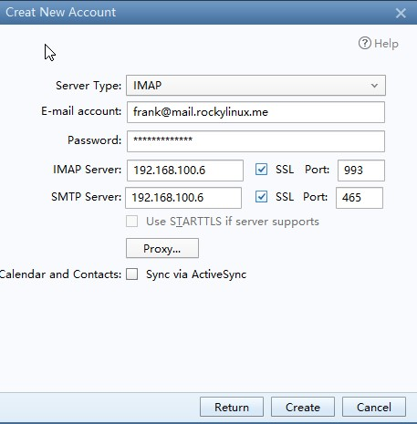
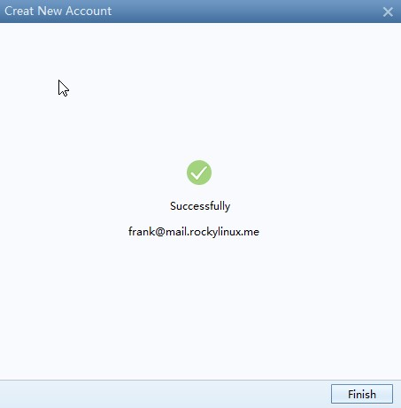
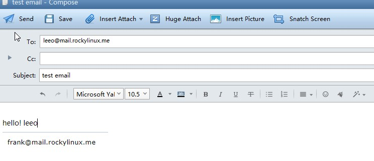
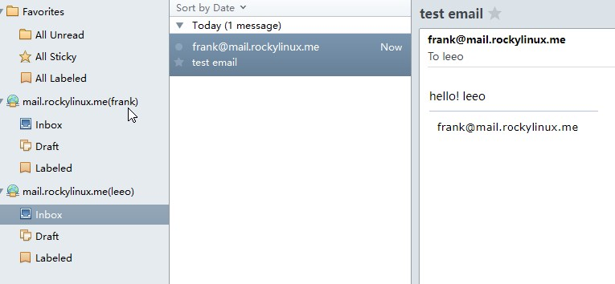

# Overview

This document aims to provide the reader with a detailed understanding of the various components of an email system, including the installation and basic configuration of one.

All commands in this document are executed using **root(uid=0)**.

## List of basic information

| Role played   | OS     |  IP address      | version |
| :---:         |  :---: | :---:            | :---:   |
| Mysql  Dadabase  | RL 8.8 | 192.168.100.5/24 | 8.0.33        |
| E-mail system | RL 8.8 | 192.168.100.6/24 |  postfix: 3.5.8<br/>dovecot: 2.3.16       |
| `bind` DNS      | RL 8.8 | 192.168.100.7/24 | 9.11.36     |

!!! info

    Without a database, Postfix and Dovecot can still work for a small installation.

### Install and configure `bind`

First, install BIND:

```bash
Shell(192.168.100.7) > dnf -y install bind bind-utils
```

Next, edit `/etc/named.conf`:

```bash
options {
    listen-on port 53 { 192.168.100.7; };
    ...
    allow-query     { any; };
    ...
};
...
include "/etc/named.rfc1912.zones";
include "/etc/named.root.key";
```

Check if the BIND configuration is correct.

```bash
Shell(192.168.100.7) > named-checkconf /etc/named.conf
```

Now, edit `/etc/named.rfc1912.zones`:

```bash
## In practice, you can replace rockylinux.me with your domain name, such as rockylinux.org
zone "rockylinux.me" IN {
        type master;
        file "rockylinux.localhost";
        allow-update { none; };
};
```

!!! question 

    **What is a DNS zone?** A DNS zone is aportion of the DNS namespace that's hosted on a DNS server. A DNS zone contains resource records, and a DNS server responds to queries for records in that namespace. A DNS server can have multiple DNS zones. Simply put, a DNS zone is analogous to a book catalog.

First, initalize BIND:

```bash
Shell(192.168.100.7) > cp -p /var/named/named.localhost /var/named/rockylinux.localhost
Shell(192.168.100.7) > vim /var/named/rockylinux.localhost
$TTL 1D
@       IN SOA   rockylinux.me. rname.invalid. (
                                        0       ; serial
                                        1D      ; refresh
                                        1H      ; retry
                                        1W      ; expire
                                        3H )    ; minimum
        NS      dns.rockylinux.me.
        MX 2    mail.rockylinux.me.
dns     A       192.168.100.7
mail    A       192.168.100.6

Shell(192.168.100.7) > named-checkzone  rockylinux.me  /var/named/rockylinux.localhost
zone rockylinux.me/IN: loaded serial 0
OK
```

Now, start BIND:

```bash
Shell(192.168.100.7) > systemctl start named.service
```

We can test if our server's DNS resolution is working:

```bash
Shell(192.168.100.7) > systemctl start named.service
Shell(192.168.100.7) > nmcli connection modify ens160 ipv4.dns "192.168.100.7,8.8.8.8"
Shell(192.168.100.7) # systemctl restart NetworkManager.service

Shell(192.168.100.7) > dig mail.rockylinux.me
...
;mail.rockylinux.me.            IN      A

;; ANSWER SECTION:
mail.rockylinux.me.     86400   IN      A       192.168.100.6

;; AUTHORITY SECTION:
rockylinux.me.          86400   IN      NS      dns.rockylinux.me.

;; ADDITIONAL SECTION:
dns.rockylinux.me.      86400   IN      A       192.168.100.7
...
```

!!! info

    Our domain name cannot be our server's hostname.

### Install and configure MySQL

First, lets now install MySQL:

```bash
Shell(192.168.100.5) > groupadd mysql && useradd -r -g mysql -s /sbin/nologin mysql
Shell(192.168.100.5) > id mysql
uid=995(mysql) gid=1000(mysql) groups=1000(mysql)
Shell(192.168.100.5) > dnf config-manager --enable powertools
Shell(192.168.100.5) > dnf -y install libaio ncurses-compat-libs ncurses-devel make cmake gcc bison git libtirpc-devel openssl  openssl-devel rpcgen wget tar gzip bzip2 zip unzip  gcc-toolset-12-gcc gcc-toolset-12-gcc-c++ gcc-toolset-12-binutils gcc-toolset-12-annobin-annocheck gcc-toolset-12-annobin-plugin-gcc
Shell(192.168.100.5) > wget https://dev.mysql.com/get/Downloads/MySQL-8.0/mysql-boost-8.0.33.tar.gz  && tar -zvxf mysql-boost-8.0.33.tar.gz  -C /usr/local/src/

Shell(192.168.100.5) > cd /usr/local/src/mysql-8.0.33 && mkdir build && cd build && cmake .. \
-DDEFAULT_CHARSET=utf8mb4 \
-DDEFAULT_COLLATION=utf8mb4_0900_ai_ci \
-DCMAKE_INSTALL_PREFIX=/usr/local/mysql \
-DCMAKE_BUILD_TYPE=RelWithDebInfo \
-DENABLED_LOCAL_INFILE=1 \
-DMYSQL_TCP_PORT=3306 \
-DWITH_BOOST=/usr/local/src/mysql-8.0.33/boost/ \
-DMYSQL_DATADIR=/usr/local/mysql/data \
&& make && make install
```

Next, lets initialize MySQL:

```bash
Shell(192.168.100.5) > chown -R mysql:mysql /usr/local/mysql
Shell(192.168.100.5) > chmod -R 755 /usr/local/mysql
Shell(192.168.100.5) > /usr/local/mysql/bin/mysqld  --initialize  --user=mysql  --basedir=/usr/local/mysql  --datadir=/usr/local/mysql/data
2023-07-14T14:46:49.474684Z 0 [System] [MY-013169] [Server] /usr/local/mysql/bin/mysqld (mysqld 8.0.33) initializing of server in progress as process 42038
2023-07-14T14:46:49.496908Z 1 [System] [MY-013576] [InnoDB] InnoDB initialization has started.
2023-07-14T14:46:50.210118Z 1 [System] [MY-013577] [InnoDB] InnoDB initialization has ended.
2023-07-14T14:46:51.305307Z 6 [Note] [MY-010454] [Server] A temporary password is generated for root@localhost: pkqaXRuTn1/N
```

Then, edit the `/etc/my.cnf` configuration as follows: 

```bash
[client]
port=3306
socket=/tmp/mysql.sock

[mysqld]
bind-address=192.168.100.5
port=3306
socket=/tmp/mysql.sock
basedir=/usr/local/mysql
datadir=/usr/local/mysql/data
user=mysql
log-error=/usr/local/mysql/data/mysql_log.error
```

Now, enable and log into MySQL:

```bash
Shell(192.168.100.7) > systemctl enable --now mariadb
Shell(192.168.100.7) > mysql -u root -p
```

```sql
Mysql > ALTER USER 'root'@'localhost' IDENTIFIED BY 'rockylinux.me';

Mysql > create user 'mailrl'@'%' identified by 'mail.rockylinux.me'; 

Mysql > grant all privileges on *.* to 'mailrl'@'%' with grant option;
```

!!! info 

    You can also install MySQL from a `dnf` repository or container.

#### Create tables and insert data

Lets now create the tables required for Dovecot:

```sql
Shell(192.168.100.5) > mysql -u mailrl --password="mail.rockylinux.me"

Mysql > create database mailserver;

Mysql > use mailserver;

Mysql > create table if not exists virtual_domains (
        id int(11) primary key  auto_increment,
        name varchar(50) not null
);

Mysql > create table if not exists virtual_users (
        id int(11) primary key auto_increment,
        email varchar(128) NOT NULL unique,
        password varchar(150) not null,
        domain_id int(11) not null,
        FOREIGN KEY (domain_id) REFERENCES virtual_domains(id) ON DELETE CASCADE
);

Mysql > create table if not exists virtual_aliases (
        id int(11) primary key auto_increment,
        domain_id int(11) NOT NULL,
        source varchar(100) NOT NULL,
        destination varchar(100) NOT NULL,
        FOREIGN KEY (domain_id) REFERENCES virtual_domains(id) ON DELETE CASCADE
);
```

```sql
Mysql > insert into virtual_domains(id,name) values(1,'mail.rockylinux.me'),(2,'rockylinux.me');

Mysql > insert into virtual_aliases(id,domain_id,source,destination) values(1,1,'all@mail.rockylinux.me','frank@mail.rockylinux.me');

Mysql > insert into virtual_aliases(id,domain_id,source,destination) values(2,1,'all@mail.rockylinux.me','leeo@mail.rockylinux.me');
```

The password entries for the relevant email users are not shown here, as it requires the use of `doveadm pw -s SHA512-crypt -p twotestandtwo` command. See [here](#ap1)

#### Knowledge of SHA512 (SHA-2)

The main password hashing algorithms are:

* SHA-0
* SHA-1
* SHA-2: Contains these -- SHA-224, SHA-256, SHA-384, SHA-512, SHA-512/224, SHA-512/256
* SHA-3

In the SHA-2 hashing standard, the number in the algorithm refers to the digest length in bits.

It is well known that in Rocky Linux 8 and other RHEL 8 variants, the algorithm used to encrypt user passwords is SHA-512.

```bash
Shell(192.168.100.7) > grep -i method /etc/login.defs
ENCRYPT_METHOD SHA512
```

We can see its structure in the /etc/shadow file:

```bash
Shell(192.168.100.7) > grep -i root /etc/shadow | cut -f 2 -d ":"
$6$8jpmvCw8RqNfHYW4$pOlsEZG066eJuTmNHoidtvfWHe/6HORrKkQPwv4eyFxqGXKEXhep6aIRxAtv7FDDIq/ojIY1SfWAQkk7XACeZ0
```

Use the $ sign to separate the output text information.

* 6: It means id. For the SHA-512 encryption algorithm, it is fixed at 6.
* 8jpmvCw8RqNfHYW4: Also known as "salt". Its main function is to increase the security and improve the difficulty of cracking. The system can randomly generate it or it can be specified manually.
* pOlsEZG066eJuTmNHoidtvfWHe/6HORrKkQPwv4eyFxqGXKEXhep6aIRxAtv7FDDIq/ojIY1SfWAQkk7XACeZ0: 86 fixed number of characters. Refers to ciphertext passwords generated by using encryption algorithms.

### Install and configure `postfix`

```bash
dnf -y install postfix postfix-mysql
```

After installing Postfix, the following files need to be know:

* `/etc/postfix/main.cf`: The main and most important configuration file
* `/etc/postfix/master.cf`: Used to set runtime parameters for each component. In general, no changes are required, except when performance optimization is required.
* `/etc/postfix/access`: Access control file for SMTP.
* `/etc/postfix/transport`: Maps email addresses to relay hosts.

These are the Postfix binaries:

* `/usr/sbin/postalias`: this program generates the alias database in `/etc/aliases.db` based on the /etc/aliases file.
* `/usr/sbin/postcat` views the mail content in the mail queue.
* `/usr/sbin/postconf` queries the Postfix configuration.
* `/usr/sbin/postfix` is the main daemon. It can be used as follows:

  * `postfix check`
  * `postfix start`
  * `postfix stop`
  * `postfix reload`
  * `postfix status`

!!! tip

    You can specify the default MTA using the `alternatives -config mta` command if you have more than one MTA on your server.

#### Explanation of the /etc/postfix/main.cf file

```bash
Shell(192.168.100.7) > egrep -v "^#|^$" /etc/postfix/main.cf
compatibility_level = 2
queue_directory = /var/spool/postfix
command_directory = /usr/sbin
daemon_directory = /usr/libexec/postfix
data_directory = /var/lib/postfix
mail_owner = postfix
inet_interfaces = localhost
inet_protocols = all
mydestination = $myhostname, localhost.$mydomain, localhost
unknown_local_recipient_reject_code = 550
alias_maps = hash:/etc/aliases
alias_database = hash:/etc/aliases
debug_peer_level = 2
debugger_command =
         PATH=/bin:/usr/bin:/usr/local/bin:/usr/X11R6/bin
         ddd $daemon_directory/$process_name $process_id & sleep 5
sendmail_path = /usr/sbin/sendmail.postfix
newaliases_path = /usr/bin/newaliases.postfix
mailq_path = /usr/bin/mailq.postfix
setgid_group = postdrop
html_directory = no
manpage_directory = /usr/share/man
sample_directory = /usr/share/doc/postfix/samples
readme_directory = /usr/share/doc/postfix/README_FILES
smtpd_tls_cert_file = /etc/pki/tls/certs/postfix.pem
smtpd_tls_key_file = /etc/pki/tls/private/postfix.key
smtpd_tls_security_level = may
smtp_tls_CApath = /etc/pki/tls/certs
smtp_tls_CAfile = /etc/pki/tls/certs/ca-bundle.crt
smtp_tls_security_level = may
meta_directory = /etc/postfix
shlib_directory = /usr/lib64/postfix
```

The explanation of these parameters are:

* `compatibility_level = 2`: Enable compatibility with Postfix 2.x configurations.
* `data_directory = /var/lib/postfix`. The Postfix cache directory.
* `myhostname = host.domain.tld`: **Important:** You need to change it to the hostname under your domain name.
* `mydomain = domain.tld`: **Important:** You need to change it to your domain name.
* `myorigin = $myhostname` and `myorigin = $mydomain`: **Important:** parameters that have been commented out. The main function is to complement the sender's mail suffix. `$` represents a reference parameter variable.
* `inet_interfaces = localhost`: The interfaces to listen to. This value is usually changed to "all".
* `inet_protocols = all`: Enable IPv4, and IPv6 if an address is found.
* `mydestination = \$myhostname, localhost.\$mydomain, localhost`: Indicates the mail server's destination hosts.
* `unknown_local_recipient_reject_code = 550`: The error code returned when receiving an email to an unknown destination or rejecting an email.
* `mynetworks =`: Set which networks we should accept emails from.
* `relay_domains = $mydestination`: Set which domains we should relay emails from.
* `alias_maps = hash:/etc/aliases`: List of our email server's aliases.
* `alias_database = hash:/etc/aliases`: The database to be used by aliases.
* `home_mailbox = Maildir/`: **Important**: Out local mailbox location.
* `debug_peer_level = 2`: Level of log records.
* `setgid_group = postdrop`: The Unix group for managing Postfix queues.

Except for the parameter items mentioned or displayed above, some parameters are hidden and can be viewed through the `postconf` command. The most notable parameters are:

* `message_size_limit = 10240000`. Maximum size for a single message in bytes.
* `mailbox_size_limit = 1073741824`: Maximum size of a user's mailbox.
* `smtpd_sasl_type = cyrus`: The IMAP server software used for SASL authentication. You can use `postconf -a` to view.
* `smtpd_sasl_auth_enable = no`: Whether to enable SASL authentication. 
* `smtpd_sasl_security_options = noanonymous`. Security options for SASL. Anonymous authentication is off by default.
* `smtpd_sasl_local_domain =`. The local domain name.
* `smtpd_recipient_restrictions`. Recipient filtering options. The default value is empty.

#### Modify /etc/postfix/main.cf

With the packages installed, you need to configure Postfix. Make the following changes in `/etc/postfix/main.cf`:

```bash
myhostname = mail.rockylinux.me
mydomain = rockylinux.me
myorigin = $myhostname
inet_interfaces = 192.168.100.6
inet_protocols = ipv4
mydestination = 
biff = no
append_dot_mydomain = no
smtpd_sasl_type = dovecot
smtpd_sasl_path = private/auth
smtpd_sasl_auth_enable = yes
smtpd_sasl_local_domain = $myhostname
virtual_transport = lmtp:unix:private/dovecot-lmtp
virtual_mailbox_domains = mysql:/etc/postfix/mysql-virtual-mailbox-domains.cf
virtual_mailbox_maps = mysql:/etc/postfix/mysql-virtual-mailbox-maps.cf
virtual_alias_maps = mysql:/etc/postfix/mysql-virtual-alias-maps.cf,mysql:/etc/postfix/mysql-virtual-email2email.cf
```

The final configuration should look like this:

```text
compatibility_level = 2
queue_directory = /var/spool/postfix
command_directory = /usr/sbin
daemon_directory = /usr/libexec/postfix
data_directory = /var/lib/postfix
mail_owner = postfix
myhostname = mail.rockylinux.me
mydomain = rockylinux.me
myorigin = $myhostname
inet_interfaces = 192.168.100.6
inet_protocols = ipv4
mydestination = 
biff = no
append_dot_mydomain = no
smtpd_sasl_type = dovecot
smtpd_sasl_path = private/auth
smtpd_sasl_auth_enable = yes
smtpd_sasl_local_domain = $myhostname
virtual_transport = lmtp:unix:private/dovecot-lmtp
virtual_mailbox_domains = mysql:/etc/postfix/mysql-virtual-mailbox-domains.cf
virtual_mailbox_maps = mysql:/etc/postfix/mysql-virtual-mailbox-maps.cf
virtual_alias_maps = mysql:/etc/postfix/mysql-virtual-alias-maps.cf,mysql:/etc/postfix/mysql-virtual-email2email.cf
unknown_local_recipient_reject_code = 550
alias_maps = hash:/etc/aliases
alias_database = hash:/etc/aliases
debug_peer_level = 2
debugger_command =
         PATH=/bin:/usr/bin:/usr/local/bin:/usr/X11R6/bin
         ddd $daemon_directory/$process_name $process_id & sleep 5
sendmail_path = /usr/sbin/sendmail.postfix
newaliases_path = /usr/bin/newaliases.postfix
mailq_path = /usr/bin/mailq.postfix
setgid_group = postdrop
html_directory = no
manpage_directory = /usr/share/man
sample_directory = /usr/share/doc/postfix/samples
readme_directory = /usr/share/doc/postfix/README_FILES
smtpd_tls_cert_file = /etc/pki/tls/certs/postfix.pem
smtpd_tls_key_file = /etc/pki/tls/private/postfix.key
smtpd_tls_security_level = may
smtp_tls_CApath = /etc/pki/tls/certs
smtp_tls_CAfile = /etc/pki/tls/certs/ca-bundle.crt
smtp_tls_security_level = may
meta_directory = /etc/postfix
shlib_directory = /usr/lib64/postfix
```

Create and edit the following files:

In `/etc/postfix/mysql-virtual-mailbox-domains.cf`:

```bash
user = mailrl
password = mail.rockylinux.me
hosts = 192.168.100.5
dbname = mailserver
query = SELECT 1 FROM virtual_domains WHERE name='%s'
```

In `/etc/postfix/mysql-virtual-mailbox-maps.cf`:

```bash
user = mailrl
password = mail.rockylinux.me
hosts = 192.168.100.5
dbname = mailserver
query = SELECT 1 FROM virtual_users WHERE email='%s'
```

In `/etc/postfix/mysql-virtual-alias-maps.cf`:

```bash
user = mailrl
password = mail.rockylinux.me
hosts = 192.168.100.5
dbname = mailserver
query = SELECT destination FROM virtual_aliases WHERE source='%s'
```

In `/etc/postfix/mysql-virtual-email2email.cf`:

```bash
user = mailrl
password = mail.rockylinux.me
hosts = 192.168.100.5
dbname = mailserver
query = SELECT email FROM virtual_users WHERE email='%s'
```

!!! warning 

    If you encounter this kind of error after running `systemctl start postfix.service`: `fatal: open lock file /var/lib/postfix/master.lock: unable to set exclusive lock: Resource temporarily unavailable.` Please delete the existing `/var/lib/postfix/master.lock` file

Testing Postfix configure:

```bash
Shell(192.168.100.7) > systemctl start postfix.service
Shell(192.168.100.7) > postfix check
Shell(192.168.100.7) > postfix status

Shell(192.168.100.7) > postmap -q mail.rockylinux.me mysql:/etc/postfix/mysql-virtual-mailbox-domains.cf
Shell(192.168.100.7) > echo $?
1
Shell(192.168.100.7) > postmap -q frank@mail.rockylinux.me mysql:/etc/postfix/mysql-virtual-mailbox-maps.cf
Shell(192.168.100.7) > echo $?
1
Shell(192.168.100.7) > postmap -q all@mail.rockylinux.me mysql:/etc/postfix/mysql-virtual-alias-maps.cf
frank@mail.rockylinux.me,leeo@mail.rockylinux.me
```

#### Modify /etc/postfix/master.cf

The modified `/etc/postfix/master.cf` file looks like this:

```bash
smtp      inet  n       -       n       -       -       smtpd
submission inet n       -       n       -       -       smtpd
  -o syslog_name=postfix/submission
  -o smtpd_tls_security_level=encrypt
  -o smtpd_sasl_auth_enable=yes
  -o smtpd_tls_auth_only=yes
  -o smtpd_reject_unlisted_recipient=no
  -o smtpd_client_restrictions=$mua_client_restrictions
  -o smtpd_helo_restrictions=$mua_helo_restrictions
  -o smtpd_sender_restrictions=$mua_sender_restrictions
  -o smtpd_recipient_restrictions=
  -o smtpd_relay_restrictions=permit_sasl_authenticated,reject
  -o milter_macro_daemon_name=ORIGINATING
smtps     inet  n       -       n       -       -       smtpd
  -o syslog_name=postfix/smtps
  -o smtpd_tls_wrappermode=yes
  -o smtpd_sasl_auth_enable=yes
  -o smtpd_reject_unlisted_recipient=no
  -o smtpd_client_restrictions=$mua_client_restrictions
  -o smtpd_helo_restrictions=$mua_helo_restrictions
  -o smtpd_sender_restrictions=$mua_sender_restrictions
  -o smtpd_recipient_restrictions=
  -o smtpd_relay_restrictions=permit_sasl_authenticated,reject
  -o milter_macro_daemon_name=ORIGINATING
```

Finally execute the `systemctl restart postfix.service` command. At this point, the configuration of Postfix is over.

### Install and configure `dovecot`

```bash
dnf config-manager --enable devel
dnf -y install dovecot dovecot-devel dovecot-mysql
```

Without changing any files, the default Dovecot directory structure is as follows:

```bash
Shell(192.168.100.7) > tree /etc/dovecot/
/etc/dovecot/
├── conf.d
│   ├── 10-auth.conf
│   ├── 10-director.conf
│   ├── 10-logging.conf
│   ├── 10-mail.conf
│   ├── 10-master.conf
│   ├── 10-metrics.conf
│   ├── 10-ssl.conf
│   ├── 15-lda.conf
│   ├── 15-mailboxes.conf
│   ├── 20-imap.conf
│   ├── 20-lmtp.conf
│   ├── 20-pop3.conf
│   ├── 20-submission.conf
│   ├── 90-acl.conf
│   ├── 90-plugin.conf
│   ├── 90-quota.conf
│   ├── auth-checkpassword.conf.ext
│   ├── auth-deny.conf.ext
│   ├── auth-dict.conf.ext
│   ├── auth-ldap.conf.ext
│   ├── auth-master.conf.ext
│   ├── auth-passwdfile.conf.ext
│   ├── auth-sql.conf.ext
│   ├── auth-static.conf.ext
│   └── auth-system.conf.ext
└── dovecot.conf
```

As with Postfix, enter the `doveconf` command to view the complete configuration. 

The file description is as follows:

* `dovecot.conf` is the main Dovecot configuration file
  
  * Load other configuration files via `!include conf.d/*.conf`.
  * The numeral prefix of the sub configuration file is to facilitate human understanding of its parsing order.
  * Due to historical reasons there are still some config files that are external to the main `dovecot.conf`, which are typically named `*.conf.ext`.
  * In the configuration file, you can use variables, which are divided into **Global variables** and **User variables**, starting with `%`. See [here](https://doc.dovecot.org/configuration_manual/config_file/config_variables/#config-variables).

* `10-auth.conf`: Authentication configuration.
* `10-logging.conf`. Logging configuration.
* `10-mail.conf`. Configuration of mailbox locations and namespaces. By default, the value of the user's mailbox location is empty, which means that Dovecot automatically looks for the mailbox location. When the user does not have any mail, you must explicitly tell Dovecot the location of all mailboxes.
* `10-metrics.conf`. Statistics configuration.
* `15-mailboxes.conf`. Configuration of mailboxes.
* `auth-sql.conf.ext`. SQL user configuration.

#### Some important configuration file parameters

* `protocols = imap pop3 lmtp submission`: List of protocols to be used.
* `listen = *, ::`: A comma separated list of IPs or hosts where to listen in for connections. `*` listens in all IPv4 interfaces, `::` listens in all IPv6 interfaces.
* `disable_plaintext_auth = yes`: Whether to turn off plaintext authentication. 
* `auth_mechanisms = `: The type of authentication mechanism to be used. Multiple values can be specified and separated by spaces. Values: plain, login, digest-md5, cram-md5, ntlm, rpa, apop, anonymous, gssapi, otp, skey, gss-spnego.
* `login_trusted_networks= `: Which IP networks are allowed to use Dovecot. It can be a single IP address, a network segment, or both. As an example: `login_trusted_networks = 10.1.1.0/24 192.168.100.2`
* `mail_location = `: For an empty value, Dovecot attempts to find the mailboxes automatically (looking at `~/Maildir`, `/var/mail/username`, `~/mail`, and `~/Mail`, in that order). However, auto-detection commonly fails for users whose mail directory hasn’t yet been created, so you should explicitly state the full location here, if possible.
* `mail_privileged_group = `: This group is enabled temporarily for privileged operations. Currently, this is used only with the INBOX when either its initial creation or dotlocking fails. Typically, this is set to `mail` to access `/var/mail`.

#### Modify multiple files

First, edit the Dovecot configuration:

```bash
Shell(192.168.100.7) > vim /etc/dovecot/dovecot.conf
```

Include the following:

```bash
protocols = imap pop3 lmtp
listen = 192.168.100.6
```

Next, edit the mail storage configuration:

```bash
Shell(192.168.100.7) > vim /etc/dovecot/conf.d/10-mail.conf
```

Include the following:

```bash
# %u - username
# %n - user part in user@domain, same as %u if there's no domain
# %d - domain part in user@domain, empty if there's no domain
# %h - home directory
mail_location = maildir:/var/mail/vhosts/%d/%n
mail_privileged_group = mail
```

Create the mail directory:

```bash
Shell(192.168.100.7) > mkdir -p /var/mail/vhosts/rockylinux.me
```

`rockylinx.me` refers to the domain name you are hosting. 

Add the Dovecot user and home directory:

```bash
Shell(192.168.100.7) > groupadd -g 2000 vmail
Shell(192.168.100.7) > useradd -g vmail -u 2000 -d /var/mail/ vmail
```

Change owner and group:

```bash
Shell(192.168.100.7) > chown -R vmail:vmail /var/mail/
```

Cancel the relevant comments on the file:

```bash
Shell(192.168.100.6) > vim /etc/dovecot/conf.d/auth-sql.conf.ext
passdb {
    driver = sql
    args = /etc/dovecot/dovecot-sql.conf.ext
}
userdb {
    driver = static
    args = uid=vmail gid=vmail home=/var/mail/vhosts/%d/%n
}
...
```

!!! warning

    Don't write the above grammar on one line, such as this: `userdb {driver = sql args = uid=vmail gid=vmail home=/var/mail/vhosts/%d/%n}`. Otherwise, it won't work.

Edit the `/etc/dovecot/dovecot-sql.conf.ext` file:

```bash
Shell(192.168.100.7) > vim /etc/dovecot/dovecot-sql.conf.ext
```

Add the following contents:

```bash
driver = mysql
connect = host=192.168.100.5 dbname=mailserver user=mailrl password=mail.rockylinux.me
default_pass_scheme = SHA512-CRYPT
password_query = SELECT password FROM virtual_users WHERE email='%u'
```

Now change the owner and group:
```bash
Shell(192.168.100.7) > chown -R vmail:dovecot /etc/dovecot
```

Then change folder permissions:

```bash
Shell(192.168.100.7) > chmod -R 770 /etc/dovecot
```

Now, edit the authorization configuration file:

```bash
Shell(192.168.100.7) > vim /etc/dovecot/conf.d/10-auth.conf
```

In the configuration file, add the following:

```bash
disable_plaintext_auth = yes
auth_mechanisms = plain login
!include auth-sql.conf.ext
```

```bash
Shell(192.168.100.7) > vim /etc/dovecot/conf.d/10-master.conf
```

In the configuration file, add the following:

```bash
service lmtp {
  unix_listener /var/spool/postfix/private/dovecot-lmtp {
    mode = 0600
    user = postfix
    group = postfix
  }
}
...
service auth {
  unix_listener auth-userdb {
    mode = 0600
    user = vmail
    group = vmail
  }
  unix_listener /var/spool/postfix/private/auth {
    mode = 0660
    user = postfix
    group = postfix
  }
  user = dovecot
}

service auth-worker {
  user = vmail
}
...
```

Next enable Dovecot:

```bash
Shell(192.168.100.7) > systemctl enable --now dovecot
```

!!! info 

    During the Dovecot initialization, the **/usr/libexec/dovecot/mkcert.sh** file is executed to generate a self-signed certificate.

You can check the listening ports using the following command:

```bash
Shell(192.168.100.7) > ss -tulnp
Netid    State     Recv-Q    Send-Q                           Local Address:Port       Peer Address:Port   Process
udp      UNCONN    0         0                                    127.0.0.1:323             0.0.0.0:*       users:(("chronyd",pid=715,fd=5))
udp      UNCONN    0         0                                        [::1]:323                [::]:*       users:(("chronyd",pid=715,fd=6))
udp      UNCONN    0         0            [fe80::20c:29ff:fe6f:8666]%ens160:546                [::]:*       users:(("NetworkManager",pid=710,fd=24))
tcp      LISTEN    0         128                                    0.0.0.0:22              0.0.0.0:*       users:(("sshd",pid=732,fd=3))
tcp      LISTEN    0         100                              192.168.100.6:25              0.0.0.0:*       users:(("master",pid=4066,fd=13))
tcp      LISTEN    0         100                              192.168.100.6:993             0.0.0.0:*       users:(("dovecot",pid=3808,fd=39))
tcp      LISTEN    0         100                              192.168.100.6:995             0.0.0.0:*       users:(("dovecot",pid=3808,fd=22))
tcp      LISTEN    0         100                              192.168.100.6:587             0.0.0.0:*       users:(("master",pid=4066,fd=17))
tcp      LISTEN    0         100                              192.168.100.6:110             0.0.0.0:*       users:(("dovecot",pid=3808,fd=21))
tcp      LISTEN    0         100                              192.168.100.6:143             0.0.0.0:*       users:(("dovecot",pid=3808,fd=38))
tcp      LISTEN    0         100                              192.168.100.6:465             0.0.0.0:*       users:(("master",pid=4066,fd=20))
tcp      LISTEN    0         128                                       [::]:22                 [::]:*       users:(("sshd",pid=732,fd=4))
```

In the above output, the ports being used are:

 * By Postfix: 25, 587, 465
 * By Dovecot: 993, 995, 110, 143

You can use the `doveadm` command to generate the relevant ciphertext password and insert it into the virtual\_users table.

<a id="ap1"></a> 

```bash
Shell(192.168.100.6) > doveadm pw -s SHA512-crypt -p onetestandone
{SHA512-CRYPT}$6$dEqUVsCirHzV8kHw$hgC0x0ufah.N0PzUVvhLEMnoww5lo.JBmeLSsRNDkgWVylC55Gk6zA1KWsn.SiIAAIDEqHxtugGZWHl1qMex..

Shell(192.168.100.6) > doveadm pw -s SHA512-crypt -p twotestandtwo
{SHA512-CRYPT}$6$TF7w672arYUk.fGC$enDafylYnih4q140B2Bu4QfEvLCQAiQBHXpqDpHQPHruil4j4QbLXMvctWHdZ/MpuwvhmBGHTlNufVwc9hG34/
```

Insert the relevant data on the 192.168.100.5 host:

```sql
Mysql > use mailserver;

Mysql > insert into virtual_users(id,email,password,domain_id) values(1,'frank@mail.rockylinux.me','$6$dEqUVsCirHzV8kHw$hgC0x0ufah.N0PzUVvhLEMnoww5lo.JBmeLSsRNDkgWVylC55Gk6zA1KWsn.SiIAAIDEqHxtugGZWHl1qMex..',1);

Mysql > insert into virtual_users(id,email,password,domain_id) values(2,'leeo@mail.rockylinux.me','$6$TF7w672arYUk.fGC$enDafylYnih4q140B2Bu4QfEvLCQAiQBHXpqDpHQPHruil4j4QbLXMvctWHdZ/MpuwvhmBGHTlNufVwc9hG34/',1);
```

### Test 

#### User's authentication

Use a client machine and change its preferred DNS to 192.168.100.7. The author uses Foxmail on Windows 10 as the mail client here.

On the main screen, select "Other Mailbox" --> "Manual" --> Enter the relevant content to complete. --> "Create"





#### Send an email

Use the **frank** user to attempt to send an email to a **leeo** user.



#### Receive mail



### Additional description

* You should have a legitimate domain name (domain)
* You should apply for an SSL/TLS certificate for your email system
