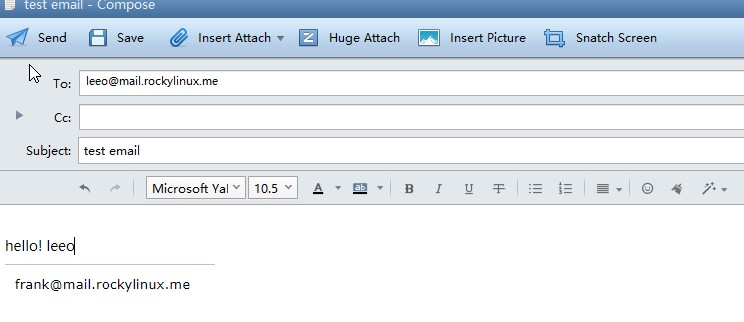

# Огляд

Цей документ має на меті надати читачеві детальне розуміння різних компонентів системи електронної пошти, включаючи її встановлення та базову конфігурацію.

Усі команди в цьому документі виконуються за допомогою **root(uid=0)**.

## Перелік основних відомостей

|           Роль            |   ОС   |    IP-адреса     |                  версія                  |
|:-------------------------:|:------:|:----------------:|:----------------------------------------:|
|     База даних Mysql      | RL 8.8 | 192.168.100.4/24 |                  8.0.33                  |
| Система електронної пошти | RL 8.8 | 192.168.100.6/24 | postfix: 3.5.8<br/>dovecot: 2.3.16 |
|        `bind` DNS         | RL 8.8 | 192.168.100.7/24 |                 9.11.36                  |

!!! info "Інформація"

    Postfix і Dovecot все ще можуть працювати для невеликої установки без бази даних.

### Встановіть і налаштуйте `bind`

Спочатку встановіть BIND:

```bash
Shell(192.168.100.7) > dnf -y install bind bind-utils
```

Далі відредагуйте `/etc/named.conf`:

```bash
options {
    listen-on port 53 { 192.168.100.7; };
    ...
    allow-query     { any; };
    ...
};
...
include "/etc/named.rfc1912.zones";
include "/etc/named.root.key";
```

Перевірте, чи правильна конфігурація BIND.

```bash
Shell(192.168.100.7) > named-checkconf /etc/named.conf
```

Тепер відредагуйте `/etc/named.rfc1912.zones`:

```bash
zone "rockylinux.me" IN {
        type master;
        file "rockylinux.localhost";
        allow-update { none; };
};
```

!!! question "Питання"

    **Що таке зона DNS?** Зона DNS — це частина простору імен DNS, розміщена на сервері DNS. Зона DNS містить записи ресурсів, а сервер DNS відповідає на запити щодо записів у цьому просторі імен. DNS-сервер може мати кілька зон DNS. Простіше кажучи, зона DNS аналогічна каталогу книг.

Спочатку ініціалізуйте BIND:

```bash
Shell(192.168.100.7) > cp -p /var/named/named.localhost /var/named/rockylinux.localhost
Shell(192.168.100.7) > vim /var/named/rockylinux.localhost
$TTL 1D
@       IN SOA   rockylinux.me. rname.invalid. (
                                        0       ; serial
                                        1D      ; refresh
                                        1H      ; retry
                                        1W      ; expire
                                        3H )    ; minimum
        NS      dns.rockylinux.me.
        MX 2    mail.rockylinux.me.
dns     A       192.168.100.7
mail    A       192.168.100.6

Shell(192.168.100.7) > named-checkzone  rockylinux.me  /var/named/rockylinux.localhost
zone rockylinux.me/IN: loaded serial 0
OK
```

Тепер запустіть BIND:

```bash
Shell(192.168.100.7) > systemctl start named.service
```

Ми можемо перевірити, чи працює роздільна здатність DNS нашого сервера:

```bash
Shell(192.168.100.7) > systemctl start named.service
Shell(192.168.100.7) > nmcli connection modify ens160 ipv4.dns "192.168.100.7,8.8.8.8"
Shell(192.168.100.7) > systemctl restart NetworkManager.service

Shell(192.168.100.7) > dig mail.rockylinux.me
...
;mail.rockylinux.me.            IN      A

;; ANSWER SECTION:
mail.rockylinux.me.     86400   IN      A       192.168.100.6

;; AUTHORITY SECTION:
rockylinux.me.          86400   IN      NS      dns.rockylinux.me.

;; ADDITIONAL SECTION:
dns.rockylinux.me.      86400   IN      A       192.168.100.7
...
```

!!! info "Інформація"

    Наше доменне ім’я не може бути ім’ям хоста нашого сервера.

### Встановлення та налаштування MySQL

По-перше, давайте тепер встановимо MySQL з джерела:

```bash
Shell(192.168.100.5) > groupadd mysql && useradd -r -g mysql -s /sbin/nologin mysql
Shell(192.168.100.5) > id mysql
uid=995(mysql) gid=1000(mysql) groups=1000(mysql)
Shell(192.168.100.5) > dnf config-manager --enable powertools
Shell(192.168.100.5) > dnf -y install libaio ncurses-compat-libs ncurses-devel make cmake gcc bison git libtirpc-devel openssl  openssl-devel rpcgen wget tar gzip bzip2 zip unzip  gcc-toolset-12-gcc gcc-toolset-12-gcc-c++ gcc-toolset-12-binutils gcc-toolset-12-annobin-annocheck gcc-toolset-12-annobin-plugin-gcc
Shell(192.168.100.5) > wget https://dev.mysql.com/get/Downloads/MySQL-8.0/mysql-boost-8.0.33.tar.gz  && tar -zvxf mysql-boost-8.0.33.tar.gz  -C /usr/local/src/

Shell(192.168.100.5) > cd /usr/local/src/mysql-8.0.33 && mkdir build && cd build && cmake .. \
-DDEFAULT_CHARSET=utf8mb4 \
-DDEFAULT_COLLATION=utf8mb4_0900_ai_ci \
-DCMAKE_INSTALL_PREFIX=/usr/local/mysql \
-DCMAKE_BUILD_TYPE=RelWithDebInfo \
-DENABLED_LOCAL_INFILE=1 \
-DMYSQL_TCP_PORT=3306 \
-DWITH_BOOST=/usr/local/src/mysql-8.0.33/boost/ \
-DMYSQL_DATADIR=/usr/local/mysql/data \
&& make && make install
```

Далі ініціалізуємо MySQL:

```bash
Shell(192.168.100.5) > chown -R mysql:mysql /usr/local/mysql
Shell(192.168.100.5) > chmod -R 755 /usr/local/mysql
Shell(192.168.100.5) > /usr/local/mysql/bin/mysqld  --initialize  --user=mysql  --basedir=/usr/local/mysql  --datadir=/usr/local/mysql/data
2023-07-14T14:46:49.474684Z 0 [System] [MY-013169] [Server] /usr/local/mysql/bin/mysqld (mysqld 8.0.33) initializing of server in progress as process 42038
2023-07-14T14:46:49.496908Z 1 [System] [MY-013576] [InnoDB] InnoDB initialization has started.
2023-07-14T14:46:50.210118Z 1 [System] [MY-013577] [InnoDB] InnoDB initialization has ended.
2023-07-14T14:46:51.305307Z 6 [Note] [MY-010454] [Server] A temporary password is generated for root@localhost: pkqaXRuTn1/N
```

Потім відредагуйте конфігурацію `/etc/my.cnf` наступним чином:

```bash
[client]
port=3306
socket=/tmp/mysql.sock

[mysqld]
bind-address=192.168.100.5
port=3306
socket=/tmp/mysql.sock
basedir=/usr/local/mysql
datadir=/usr/local/mysql/data
user=mysql
log-error=/usr/local/mysql/data/mysql_log.error
```

Тепер увімкніть і увійдіть у MySQL:

```bash
Shell(192.168.100.5) > /usr/local/mysql/bin/mysqld_safe  --user=mysql &
Shell(192.168.100.5) > /usr/local/mysql/bin/mysql -u root --password="pkqaXRuTn1/N"
```

Тоді давайте додамо ваші доменні записи в MySQL:

```sql
Mysql > ALTER USER 'root'@'localhost' IDENTIFIED BY 'rockylinux.me';

Mysql > create user 'mailrl'@'%' identified by 'mail.rockylinux.me';

Mysql > grant all privileges on *.* to 'mailrl'@'%' with grant option;
```

!!! info "Інформація"

    Ви також можете встановити MySQL зі сховища або контейнера `dnf`.

#### Створіть таблиці та вставте дані

Давайте тепер створимо таблиці MySQL, необхідні для Dovecot:

```sql
Shell(192.168.100.5) >  /usr/local/mysql/bin/mysql -u mailrl --password="mail.rockylinux.me"

Mysql > create database mailserver;

Mysql > use mailserver;

Mysql > create table if not exists virtual_domains (
        id int(11) primary key  auto_increment,
        name varchar(50) not null
);

Mysql > create table if not exists virtual_users (
        id int(11) primary key auto_increment,
        email varchar(128) NOT NULL unique,
        password varchar(150) not null,
        domain_id int(11) not null,
        FOREIGN KEY (domain_id) REFERENCES virtual_domains(id) ON DELETE CASCADE
);

Mysql > create table if not exists virtual_aliases (
        id int(11) primary key auto_increment,
        domain_id int(11) NOT NULL,
        source varchar(100) NOT NULL,
        destination varchar(100) NOT NULL,
        FOREIGN KEY (domain_id) REFERENCES virtual_domains(id) ON DELETE CASCADE
);

Mysql > insert into virtual_domains(id,name) values(1,'mail.rockylinux.me'),(2,'rockylinux.me');

Mysql > insert into virtual_aliases(id,domain_id,source,destination) values(1,1,'all@mail.rockylinux.me','frank@mail.rockylinux.me');

Mysql > insert into virtual_aliases(id,domain_id,source,destination) values(2,1,'all@mail.rockylinux.me','leeo@mail.rockylinux.me');
```

Записи паролів для відповідних користувачів електронної пошти тут не показані, оскільки для цього потрібно використовувати команду `doveadm pw -s SHA512-crypt -p twotestandtwo`.

#### Знання SHA512 (SHA-2)

Основні алгоритми хешування паролів:

- SHA-0
- SHA-1
- SHA-2: включає SHA-224, SHA-256, SHA-384, SHA-512, SHA-512/224, та SHA-512/256
- SHA-3

У стандарті хешування SHA-2 число в алгоритмі відноситься до довжини дайджесту в бітах.

Добре відомо, що в Rocky Linux 8 та інших варіантах RHEL 8 стандартним алгоритмом шифрування паролів користувачів є SHA-512. Щоб отримати заданий алгоритм:

```bash
Shell(192.168.100.5) > grep -i method /etc/login.defs
ENCRYPT_METHOD SHA512
```

Його структуру можна побачити у файлі /etc/shadow:

```bash
Shell(192.168.100.5) > grep -i root /etc/shadow | cut -f 2 -d ":"
$6$8jpmvCw8RqNfHYW4$pOlsEZG066eJuTmNHoidtvfWHe/6HORrKkQPwv4eyFxqGXKEXhep6aIRxAtv7FDDIq/ojIY1SfWAQkk7XACeZ0
```

Інформація, яка відображається в хеші (розділена $), наступна:

- 6: Це означає ідентифікатор. Для алгоритму шифрування SHA-512 він встановлений на 6.
- 8jpmvCw8RqNfHYW4: також відомий як "salt". Його основна функція полягає в підвищенні безпеки та покращенні складності злому. Система може генерувати його випадковим чином або вказати вручну.
- pOlsEZG066eJuTmNHoidtvfWHe/6HORrKkQPwv4eyFxqGXKEXhep6aIRxAtv7FDDIq/ojIY1SfWAQkk7XACeZ0: 86 фіксована кількість символів. Відноситься до зашифрованих паролів, згенерованих за допомогою алгоритмів шифрування.

### Встановіть і налаштуйте `postfix`

Тепер ми встановимо Postfix:

```bash
Shell(192.168.100.6) > dnf -y install postfix postfix-mysql
```

Після встановлення Postfix необхідно змінити наступні файли:

- `/etc/postfix/main.cf`. Основний і найважливіший конфігураційний файл
- `/etc/postfix/master.cf`. Використовується для встановлення параметрів виконання для кожного компонента. Цей файл використовується, якщо ми хочемо ввімкнути фільтрацію спаму або інші порти SMTP.
- `/etc/postfix/access`. Файл контролю доступу для SMTP.
- `/etc/postfix/transport`. Відображає адреси електронної пошти для хостів ретрансляції.

Вам потрібно знати ці двійкові виконувані файли:

- `/usr/sbin/postalias`: ця програма створює базу даних псевдонімів у `/etc/aliases.db` на основі файлу /etc/aliases.
- `/usr/sbin/postcat` переглядає вміст пошти в черзі пошти.
- `/usr/sbin/postconf` запитує конфігурацію Postfix.
- `/usr/sbin/postfix` є головним демоном. Його можна використовувати наступним чином:
    - `postfix check`
    - `postfix start`
    - `postfix stop`
    - `postfix reload`
    - `postfix status`

!!! tip "Підказка"

    Якщо ваш сервер має більше ніж один MTA, ви можете вказати MTA за замовчуванням за допомогою команди `alternatives -config mta`.

#### Пояснення до файлу /etc/postfix/main.cf

Конфігураційний файл Postfix можна переглянути наступним чином:

```bash
Shell(192.168.100.6) > egrep -v "^#|^$" /etc/postfix/main.cf
compatibility_level = 2
queue_directory = /var/spool/postfix
command_directory = /usr/sbin
daemon_directory = /usr/libexec/postfix
data_directory = /var/lib/postfix
mail_owner = postfix
inet_interfaces = localhost
inet_protocols = all
mydestination = $myhostname, localhost.$mydomain, localhost
unknown_local_recipient_reject_code = 550
alias_maps = hash:/etc/aliases
alias_database = hash:/etc/aliases
debug_peer_level = 2
debugger_command =
         PATH=/bin:/usr/bin:/usr/local/bin:/usr/X11R6/bin
         ddd $daemon_directory/$process_name $process_id & sleep 5
sendmail_path = /usr/sbin/sendmail.postfix
newaliases_path = /usr/bin/newaliases.postfix
mailq_path = /usr/bin/mailq.postfix
setgid_group = postdrop
html_directory = no
manpage_directory = /usr/share/man
sample_directory = /usr/share/doc/postfix/samples
readme_directory = /usr/share/doc/postfix/README_FILES
smtpd_tls_cert_file = /etc/pki/tls/certs/postfix.pem
smtpd_tls_key_file = /etc/pki/tls/private/postfix.key
smtpd_tls_security_level = may
smtp_tls_CApath = /etc/pki/tls/certs
smtp_tls_CAfile = /etc/pki/tls/certs/ca-bundle.crt
smtp_tls_security_level = may
meta_directory = /etc/postfix
shlib_directory = /usr/lib64/postfix
```

Пояснення цих параметрів:

- `compatibility_level = 2`: Забезпечує сумісність із конфігураціями Postfix 2.x.
- `data_directory = /var/lib/postfix`. Каталог кешу Postfix.
- `myhostname = host.domain.tld`: **Важливо:** Вам потрібно змінити його на ім’я хосту вашого доменного імені.
- `mydomain = domain.tld`: **Важливо:** Вам потрібно змінити його на ваше доменне ім’я.
- `myorigin = $myhostname` and `myorigin = $mydomain`: **Важливо:** параметри, які були закоментовані. Основна функція — доповнити поштовий суфікс відправника. `$` представляє змінну еталонного параметра.
- `inet_interfaces = localhost`: Інтерфейси для прослуховування. Зазвичай це значення змінюється на «all».
- `inet_protocols = all`: Вмикає IPv4 та IPv6, якщо адресу знайдено.
- `mydestination = \$myhostname, localhost.\$mydomain, localhost`: Вказує хости призначення поштового сервера.
- `unknown_local_recipient_reject_code = 550`: Код помилки повертається під час отримання електронного листа невідомому адресату або відхилення електронного листа.
- `mynetworks =`: Встановлює, з яких мереж приймати електронні листи.
- `relay_domains = $mydestination`: Встановлює, з яких доменів ми повинні ретранслювати електронні листи.
- `alias_maps = hash:/etc/aliases`: Список псевдонімів нашого сервера електронної пошти.
- `alias_database = hash:/etc/aliases`: База даних має використовуватися за псевдонімами.
- `home_mailbox = Maildir/`: **Important**: Розташування локальної поштової скриньки.
- `debug_peer_level = 2`: Рівень журнальних записів.
- `setgid_group = postdrop`: Група Unix для керування чергами Postfix.

За винятком елементів параметрів, згаданих або показаних вище, деякі параметри приховані, і їх можна переглянути за допомогою команди `postconf`. Найпомітніші параметри:

- `message_size_limit = 10240000`. Максимальний розмір одного повідомлення в байтах.
- `mailbox_size_limit = 1073741824`: Максимальний розмір поштової скриньки користувача.
- `smtpd_sasl_type = cyrus`: Програмне забезпечення сервера IMAP використовується для автентифікації SASL. Ви можете використовувати `postconf -a` для перегляду.
- `smtpd_sasl_auth_enable = no`: Чи вмикати автентифікацію SASL.
- `smtpd_sasl_security_options = noanonymous`. Параметри безпеки для SASL. Анонімну автентифікацію вимкнено за умовчанням.
- `smtpd_sasl_local_domain =`. Ім'я локального домену.
- `smtpd_recipient_restrictions`. Фільтрація одержувачів. Значення за замовчуванням порожнє.

#### Модифікація /etc/postfix/main.cf

Після встановлення пакетів вам потрібно налаштувати Postfix. Зробіть такі зміни в `/etc/postfix/main.cf`:

```bash
myhostname = mail.rockylinux.me
mydomain = rockylinux.me
myorigin = $myhostname
inet_interfaces = 192.168.100.6
inet_protocols = ipv4
mydestination =
biff = no
append_dot_mydomain = no
smtpd_sasl_type = dovecot
smtpd_sasl_path = private/auth
smtpd_sasl_auth_enable = yes
smtpd_sasl_local_domain = $myhostname
virtual_transport = lmtp:unix:private/dovecot-lmtp
virtual_mailbox_domains = mysql:/etc/postfix/mysql-virtual-mailbox-domains.cf
virtual_mailbox_maps = mysql:/etc/postfix/mysql-virtual-mailbox-maps.cf
virtual_alias_maps = mysql:/etc/postfix/mysql-virtual-alias-maps.cf,mysql:/etc/postfix/mysql-virtual-email2email.cf
```

Остаточна конфігурація має виглядати так:

```text
compatibility_level = 2
queue_directory = /var/spool/postfix
command_directory = /usr/sbin
daemon_directory = /usr/libexec/postfix
data_directory = /var/lib/postfix
mail_owner = postfix
myhostname = mail.rockylinux.me
mydomain = rockylinux.me
myorigin = $myhostname
inet_interfaces = 192.168.100.6
inet_protocols = ipv4
mydestination =
biff = no
append_dot_mydomain = no
smtpd_sasl_type = dovecot
smtpd_sasl_path = private/auth
smtpd_sasl_auth_enable = yes
smtpd_sasl_local_domain = $myhostname
virtual_transport = lmtp:unix:private/dovecot-lmtp
virtual_mailbox_domains = mysql:/etc/postfix/mysql-virtual-mailbox-domains.cf
virtual_mailbox_maps = mysql:/etc/postfix/mysql-virtual-mailbox-maps.cf
virtual_alias_maps = mysql:/etc/postfix/mysql-virtual-alias-maps.cf,mysql:/etc/postfix/mysql-virtual-email2email.cf
unknown_local_recipient_reject_code = 550
alias_maps = hash:/etc/aliases
alias_database = hash:/etc/aliases
debug_peer_level = 2
debugger_command =
         PATH=/bin:/usr/bin:/usr/local/bin:/usr/X11R6/bin
         ddd $daemon_directory/$process_name $process_id & sleep 5
sendmail_path = /usr/sbin/sendmail.postfix
newaliases_path = /usr/bin/newaliases.postfix
mailq_path = /usr/bin/mailq.postfix
setgid_group = postdrop
html_directory = no
manpage_directory = /usr/share/man
sample_directory = /usr/share/doc/postfix/samples
readme_directory = /usr/share/doc/postfix/README_FILES
smtpd_tls_cert_file = /etc/pki/tls/certs/postfix.pem
smtpd_tls_key_file = /etc/pki/tls/private/postfix.key
smtpd_tls_security_level = may
smtp_tls_CApath = /etc/pki/tls/certs
smtp_tls_CAfile = /etc/pki/tls/certs/ca-bundle.crt
smtp_tls_security_level = may
meta_directory = /etc/postfix
shlib_directory = /usr/lib64/postfix
```

Створіть і відредагуйте такі файли:

В `/etc/postfix/mysql-virtual-mailbox-domains.cf`:

```bash
user = mailrl
password = mail.rockylinux.me
hosts = 192.168.100.5
dbname = mailserver
query = SELECT 1 FROM virtual_domains WHERE name='%s'
```

В `/etc/postfix/mysql-virtual-mailbox-maps.cf`:

```bash
user = mailrl
password = mail.rockylinux.me
hosts = 192.168.100.5
dbname = mailserver
query = SELECT 1 FROM virtual_users WHERE email='%s'
```

В `/etc/postfix/mysql-virtual-alias-maps.cf`:

```bash
user = mailrl
password = mail.rockylinux.me
hosts = 192.168.100.5
dbname = mailserver
query = SELECT destination FROM virtual_aliases WHERE source='%s'
```

В `/etc/postfix/mysql-virtual-email2email.cf`:

```bash
user = mailrl
password = mail.rockylinux.me
hosts = 192.168.100.5
dbname = mailserver
query = SELECT email FROM virtual_users WHERE email='%s'
```

!!! warning "Важливо"

    Якщо ви зіткнулися з такою помилкою після запуску `systemctl start postfix.service`: `fatal: відкрити файл блокування /var/lib/postfix/master.lock: неможливо встановити ексклюзивне блокування: ресурс тимчасово недоступний.` Видаліть наявний ` /var/lib/postfix/master.lock` файл

Тестування нашої конфігурації Postfix:

```bash
Shell(192.168.100.6) > systemctl start postfix.service
Shell(192.168.100.6) > postfix check
Shell(192.168.100.6) > postfix status

# If the command return 1, it is successful.
Shell(192.168.100.6) > postmap -q mail.rockylinux.me mysql:/etc/postfix/mysql-virtual-mailbox-domains.cf
Shell(192.168.100.6) > echo $?
1

Shell(192.168.100.6) > postmap -q frank@mail.rockylinux.me mysql:/etc/postfix/mysql-virtual-mailbox-maps.cf
Shell(192.168.100.6) > echo $?
1

Shell(192.168.100.6) > postmap -q all@mail.rockylinux.me mysql:/etc/postfix/mysql-virtual-alias-maps.cf
frank@mail.rockylinux.me,leeo@mail.rockylinux.me
```

#### Модифікація /etc/postfix/master.cf

Змінений файл `/etc/postfix/master.cf` виглядає так:

```bash
smtp      inet  n       -       n       -       -       smtpd
submission inet n       -       n       -       -       smtpd
  -o syslog_name=postfix/submission
  -o smtpd_tls_security_level=encrypt
  -o smtpd_sasl_auth_enable=yes
  -o smtpd_tls_auth_only=yes
  -o smtpd_reject_unlisted_recipient=no
  -o smtpd_client_restrictions=$mua_client_restrictions
  -o smtpd_helo_restrictions=$mua_helo_restrictions
  -o smtpd_sender_restrictions=$mua_sender_restrictions
  -o smtpd_recipient_restrictions=
  -o smtpd_relay_restrictions=permit_sasl_authenticated,reject
  -o milter_macro_daemon_name=ORIGINATING
smtps     inet  n       -       n       -       -       smtpd
  -o syslog_name=postfix/smtps
  -o smtpd_tls_wrappermode=yes
  -o smtpd_sasl_auth_enable=yes
  -o smtpd_reject_unlisted_recipient=no
  -o smtpd_client_restrictions=$mua_client_restrictions
  -o smtpd_helo_restrictions=$mua_helo_restrictions
  -o smtpd_sender_restrictions=$mua_sender_restrictions
  -o smtpd_recipient_restrictions=
  -o smtpd_relay_restrictions=permit_sasl_authenticated,reject
  -o milter_macro_daemon_name=ORIGINATING
```

Нарешті, запустіть `systemctl restart postfix.service`. На цьому етапі ми налаштували Postfix.

### Встановлення і налаштування `dovecot`

```bash
Shell(192.168.100.6) > dnf config-manager --enable devel && dnf -y install dovecot dovecot-devel dovecot-mysql
```

Без зміни файлів стандартна структура каталогів Dovecot така:

```bash
Shell(192.168.100.6) > tree /etc/dovecot/
/etc/dovecot/
├── conf.d
│   ├── 10-auth.conf
│   ├── 10-director.conf
│   ├── 10-logging.conf
│   ├── 10-mail.conf
│   ├── 10-master.conf
│   ├── 10-metrics.conf
│   ├── 10-ssl.conf
│   ├── 15-lda.conf
│   ├── 15-mailboxes.conf
│   ├── 20-imap.conf
│   ├── 20-lmtp.conf
│   ├── 20-pop3.conf
│   ├── 20-submission.conf
│   ├── 90-acl.conf
│   ├── 90-plugin.conf
│   ├── 90-quota.conf
│   ├── auth-checkpassword.conf.ext
│   ├── auth-deny.conf.ext
│   ├── auth-dict.conf.ext
│   ├── auth-ldap.conf.ext
│   ├── auth-master.conf.ext
│   ├── auth-passwdfile.conf.ext
│   ├── auth-sql.conf.ext
│   ├── auth-static.conf.ext
│   └── auth-system.conf.ext
└── dovecot.conf
```

Як і у випадку з Postfix, введіть команду `doveconf`, щоб переглянути повну конфігурацію.

Опис файлу такий:

- `dovecot.conf` є основним конфігураційним файлом Dovecot.
    - Завантажте інші конфігураційні файли через `!include conf.d/*.conf`.
    - Цифровий префікс файлу підконфігурації полегшує розуміння людиною порядку його аналізу.
    - Через історичні причини деякі конфігураційні файли досі є окремими, зазвичай мають назву `*.conf.ext`.
    - У файлі конфігурації ви можете використовувати змінні, розділені на **Глобальні змінні** та **Змінні користувача**, починаючи з `%`. Див. [тут](https://doc.dovecot.org/configuration_manual/config_file/config_variables/#config-variables).

- `10-auth.conf`: Конфігурація автентифікації.
- `10-logging.conf`. Конфігурація, пов'язана з журналом.
- `10-mail.conf`. Конфігурація розташування поштових скриньок і просторів імен. За замовчуванням значення розташування поштової скриньки користувача порожнє, що означає, що Dovecot автоматично шукає розташування поштової скриньки. Якщо у користувача немає пошти, ви повинні явно повідомити Dovecot розташування всіх поштових скриньок.
- `10-metrics.conf`. Конфігурація, пов'язана зі статистичною інформацією.
- `15-mailboxes.conf`. Конфігурація визначення поштової скриньки.
- `auth-sql.conf.ext`. Аутентифікація для користувачів SQL.

#### Деякі важливі параметри конфігураційного файлу

- `protocols = imap pop3 lmtp submission`: Список протоколів, які будуть використовуватися.
- `listen = *, ::`. Відокремлений комами список IP-адрес або хостів, на яких слід прослуховувати з’єднання. `*` listens in all IPv4 interfaces, `::` слухає в усіх інтерфейсах IPv6.
- `disable_plaintext_auth = yes`: Чи вимкнути автентифікацію відкритого тексту.
- `auth_mechanisms =`: Тип механізму автентифікації, який буде використовуватися. Можна вказати кілька значень і розділити їх пробілами. Значення: plain, login, digest-md5, cram-md5, ntlm, rpa, apop, anonymous, gssapi, otp, skey, gss-spnego.
- `login_trusted_networks=`: Яким IP-мережам дозволено використовувати Dovecot. Це може бути одна IP-адреса, сегмент мережі або обидва. Як приклад: `login_trusted_networks = 10.1.1.0/24 192.168.100.2`
- `mail_location =`: Якщо значення пусте, Dovecot намагається автоматично знайти поштові скриньки (переглядаючи `~/Maildir`, `/var/mail/username`, `~/mail` і `~/Mail` у такому порядку). Однак автоматичне виявлення зазвичай не вдається користувачам, чий поштовий каталог ще не створено, тому вам слід явно вказати тут повне місцезнаходження, якщо це можливо.
- `mail_privileged_group =`: Ця група тимчасово ввімкнена для привілейованих операцій. Це використовується лише з INBOX, коли його початкове створення або блокування не вдається. Зазвичай для доступу до `/var/mail` встановлюється значення `mail`.

#### Модифікація декількох файлів

Спочатку відредагуйте конфігурацію Dovecot у `/etc/dovecot/dovecot.conf`:

```bash
protocols = imap pop3 lmtp
listen = 192.168.100.6
```

Згодом відредагуйте конфігурацію сховища електронної пошти в `/etc/dovecot/conf.d/10-mail.conf`:

```bash
# %u - username
# %n - user part in user@domain, same as %u if there's no domain
# %d - domain part in user@domain, empty if there's no domain
# %h - home directory
mail_location = maildir:/var/mail/vhosts/%d/%n
mail_privileged_group = mail
```

Створіть поштовий каталог:

```bash
Shell(192.168.100.7) > mkdir -p /var/mail/vhosts/rockylinux.me
```

`rockylinux.me` відноситься до доменного імені, яке ви розміщуєте.

Додайте користувача Dovecot і домашній каталог:

```bash
Shell(192.168.100.7) > groupadd -g 2000 vmail
Shell(192.168.100.7) > useradd -g vmail -u 2000 -d /var/mail/ vmail
```

Змінити власника та групу:

```bash
Shell(192.168.100.7) > chown -R vmail:vmail /var/mail/
```

Увімкніть бази даних імен користувачів і паролів у `/etc/dovecot/conf.d/auth-sql.conf.ext`:

```bash
passdb {
    driver = sql
    args = /etc/dovecot/dovecot-sql.conf.ext
}
userdb {
    driver = static
    args = uid=vmail gid=vmail home=/var/mail/vhosts/%d/%n
}
```

!!! warning "Важливо"

    Не пишіть наведену вище граматику в один рядок, наприклад `userdb {driver = sql args = uid=vmail gid=vmail home=/var/mail/vhosts/%d/%n}`. Інакше не вийде.

Відредагуйте файл `/etc/dovecot/dovecot-sql.conf.ext` із таким вмістом:

```bash
driver = mysql
connect = host=192.168.100.5 dbname=mailserver user=mailrl password=mail.rockylinux.me
default_pass_scheme = SHA512-CRYPT
password_query = SELECT password FROM virtual_users WHERE email='%u'
```

Тепер змініть власника та групу:

```bash
Shell(192.168.100.7) > chown -R vmail:dovecot /etc/dovecot
```

Потім змініть дозволи папки:

```bash
Shell(192.168.100.7) > chmod -R 770 /etc/dovecot
```

Тепер до конфігурації `/etc/dovecot/conf.d/10-auth.conf` додайте наступне:

```bash
disable_plaintext_auth = yes
auth_mechanisms = plain login
!include auth-sql.conf.ext
```

До `/etc/dovecot/conf.d/10-master.conf` додайте наступне:

```bash
service lmtp {
  unix_listener /var/spool/postfix/private/dovecot-lmtp {
    mode = 0600
    user = postfix
    group = postfix
  }
}
service auth {
  unix_listener auth-userdb {
    mode = 0600
    user = vmail
    group = vmail
  }
  unix_listener /var/spool/postfix/private/auth {
    mode = 0660
    user = postfix
    group = postfix
  }
  user = dovecot
}

service auth-worker {
  user = vmail
}
```

Тепер увімкніть Dovecot:

```bash
Shell(192.168.100.7) > systemctl enable --now dovecot
```

!!! info "Інформація"

    Під час ініціалізації Dovecot файл **/usr/libexec/dovecot/mkcert.sh** виконується для створення самопідписаного сертифіката.

Ви можете перевірити порти прослуховування за допомогою такої команди:

```bash
Shell(192.168.100.6) > ss -tulnp
Netid    State     Recv-Q    Send-Q                           Local Address:Port       Peer Address:Port   Process
udp      UNCONN    0         0                                    127.0.0.1:323             0.0.0.0:*       users:(("chronyd",pid=715,fd=5))
udp      UNCONN    0         0                                        [::1]:323                [::]:*       users:(("chronyd",pid=715,fd=6))
udp      UNCONN    0         0            [fe80::20c:29ff:fe6f:8666]%ens160:546                [::]:*       users:(("NetworkManager",pid=710,fd=24))
tcp      LISTEN    0         128                                    0.0.0.0:22              0.0.0.0:*       users:(("sshd",pid=732,fd=3))
tcp      LISTEN    0         100                              192.168.100.6:25              0.0.0.0:*       users:(("master",pid=4066,fd=13))
tcp      LISTEN    0         100                              192.168.100.6:993             0.0.0.0:*       users:(("dovecot",pid=3808,fd=39))
tcp      LISTEN    0         100                              192.168.100.6:995             0.0.0.0:*       users:(("dovecot",pid=3808,fd=22))
tcp      LISTEN    0         100                              192.168.100.6:587             0.0.0.0:*       users:(("master",pid=4066,fd=17))
tcp      LISTEN    0         100                              192.168.100.6:110             0.0.0.0:*       users:(("dovecot",pid=3808,fd=21))
tcp      LISTEN    0         100                              192.168.100.6:143             0.0.0.0:*       users:(("dovecot",pid=3808,fd=38))
tcp      LISTEN    0         100                              192.168.100.6:465             0.0.0.0:*       users:(("master",pid=4066,fd=20))
tcp      LISTEN    0         128                                       [::]:22                 [::]:*       users:(("sshd",pid=732,fd=4))
```

У наведеному вище виводі використовуються такі порти:

- Postfix: 25, 587, 465
- Dovecot: 993, 995, 110, 143

Ви можете використати команду `doveadm`, щоб створити відповідний зашифрований пароль і вставити його в таблицю virtual\_users.

```bash
Shell(192.168.100.6) > doveadm pw -s SHA512-crypt -p onetestandone
{SHA512-CRYPT}$6$dEqUVsCirHzV8kHw$hgC0x0ufah.N0PzUVvhLEMnoww5lo.JBmeLSsRNDkgWVylC55Gk6zA1KWsn.SiIAAIDEqHxtugGZWHl1qMex..

Shell(192.168.100.6) > doveadm pw -s SHA512-crypt -p twotestandtwo
{SHA512-CRYPT}$6$TF7w672arYUk.fGC$enDafylYnih4q140B2Bu4QfEvLCQAiQBHXpqDpHQPHruil4j4QbLXMvctWHdZ/MpuwvhmBGHTlNufVwc9hG34/
```

Вставте відповідні дані на хост 192.168.100.5:

```sql
Shell(192.168.100.5) > /usr/local/mysql/bin/mysql -u root --password="pkqaXRuTn1/N"
Mysql > use mailserver;

Mysql > insert into virtual_users(id,email,password,domain_id) values(1,'frank@mail.rockylinux.me','$6$dEqUVsCirHzV8kHw$hgC0x0ufah.N0PzUVvhLEMnoww5lo.JBmeLSsRNDkgWVylC55Gk6zA1KWsn.SiIAAIDEqHxtugGZWHl1qMex..',1);

Mysql > insert into virtual_users(id,email,password,domain_id) values(2,'leeo@mail.rockylinux.me','$6$TF7w672arYUk.fGC$enDafylYnih4q140B2Bu4QfEvLCQAiQBHXpqDpHQPHruil4j4QbLXMvctWHdZ/MpuwvhmBGHTlNufVwc9hG34/',1);
```

### Тестування

#### Аутентифікація користувача

Використовуйте клієнтську машину та змініть бажаний DNS на 192.168.100.7. Тут автор використовує Foxmail у Windows 10 як поштовий клієнт.

На головному екрані виберіть **Інша поштова скринька** --> **Посібник** --> Введіть відповідні поля та виберіть **Створити**:


#### Надіслати електронний лист

Використовуйте користувача **frank**, щоб спробувати надіслати електронний лист користувачеві **leeo**.



#### Отримати пошту


### Додатковий опис

- Ви повинні мати доменне ім’я або внутрішній запис DNS із записами MX, які вказують на ваш сервер.
- Ви повинні отримати сертифікат SSL через [Let's Encrypt](https://docs.rockylinux.org/guides/security/generating_ssl_keys_lets_encrypt/) або інше джерело.
