## Introduction

[Jellyfin](https://jellyfin.org/) is an open source media server designed to stream videos, music, TV shows and live television from a storage device or network TV tuner. Jellyfin has apps for desktops, iOS, Android, Xbox and smart TVs.

## Installation

First install EPEL:

```bash
dnf install -y epel-release
```

Then install RPM Fusion:

```bash
dnf install -y --nogpgcheck https://mirrors.rpmfusion.org/free/el/rpmfusion-free-release-$(rpm -E %rhel).noarch.rpm https://mirrors.rpmfusion.org/nonfree/el/rpmfusion-nonfree-release-$(rpm -E %rhel).noarch.rpm
```

Next install CRB:

```bash
crb enable
```

Finally install Jellyfin:

```bash
dnf install -y jellyfin
```

## First setup

Jellyfin runs on TCP Port 8096 by default. Open up the port:

```bash
firewall-cmd --zone=public --add-port=8096/tcp
firewall-cmd --runtime-to-permanent
```

You can now enable Jellyfin:

```bash
systemctl enable --now jellyfin
```

## Configuration

Open a browser to `http://[IP]:8096`, where `[IP]` is the IP address of your Jellyfin server.

Then enter the server name and select your language. Then select **Next**:

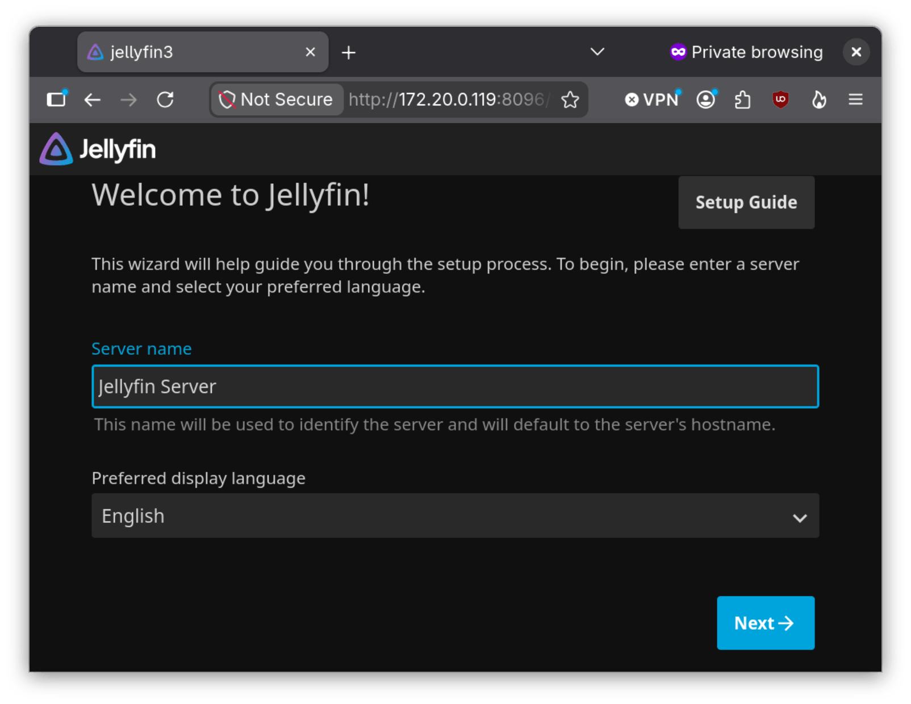

Now enter the administrator username and password, then select **Next**:

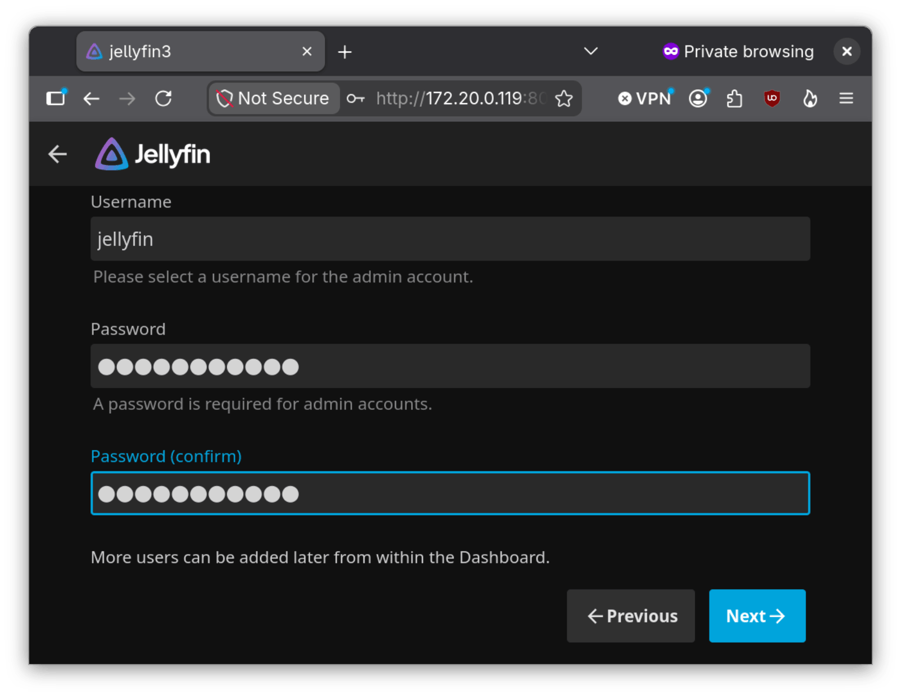

Click on **Add Media Library**:

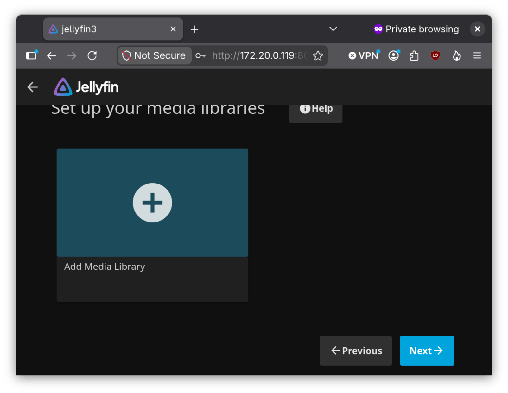

Select the library type and type in the display name. For the sake of simplicity, we will select **Movies**:

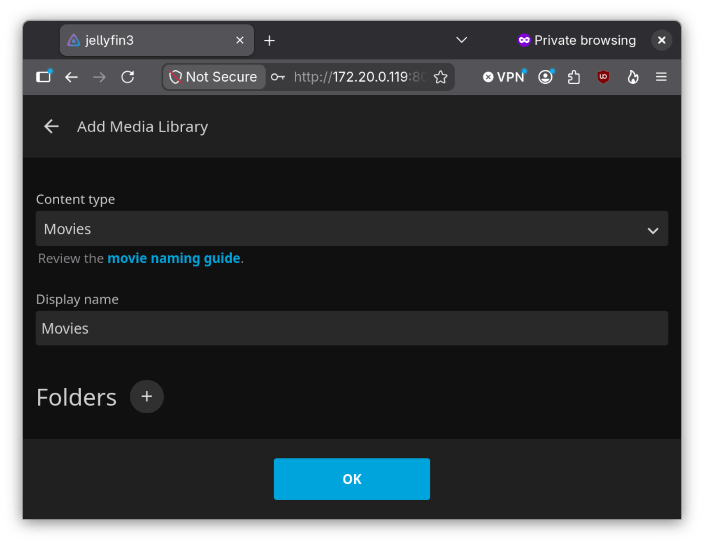

Go to the **Folders** section and click on the **+** (add) sign:

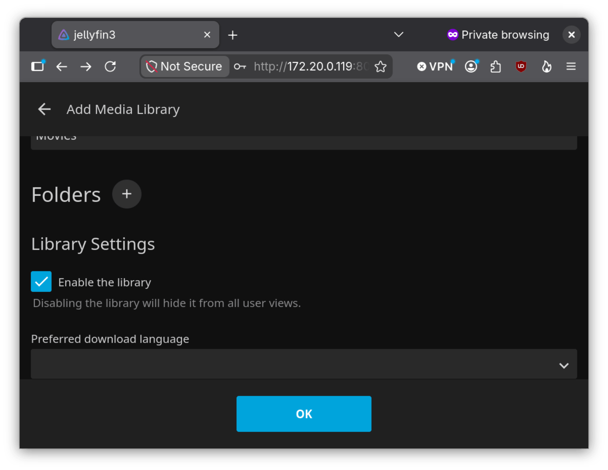

Enter in the folder location and select **OK**:

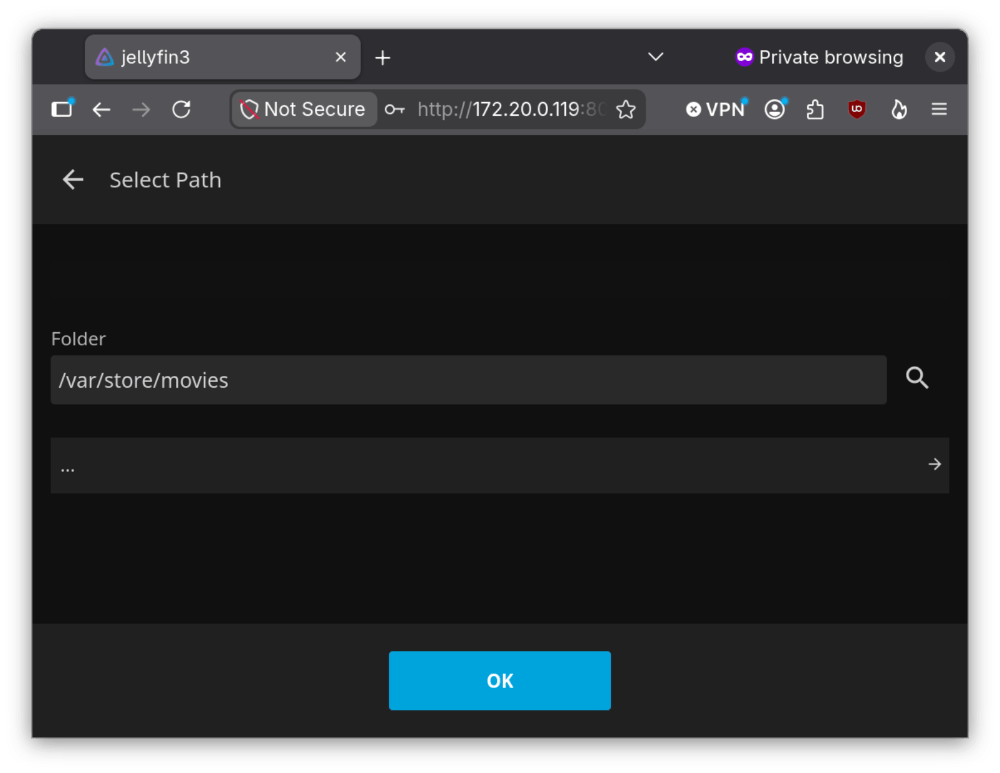

The rest of the sections are optional and should be self explanatory. You can look at them, or if you are in a hurry click **OK**.

You can add more media libraries, or if you are done select **Next**:

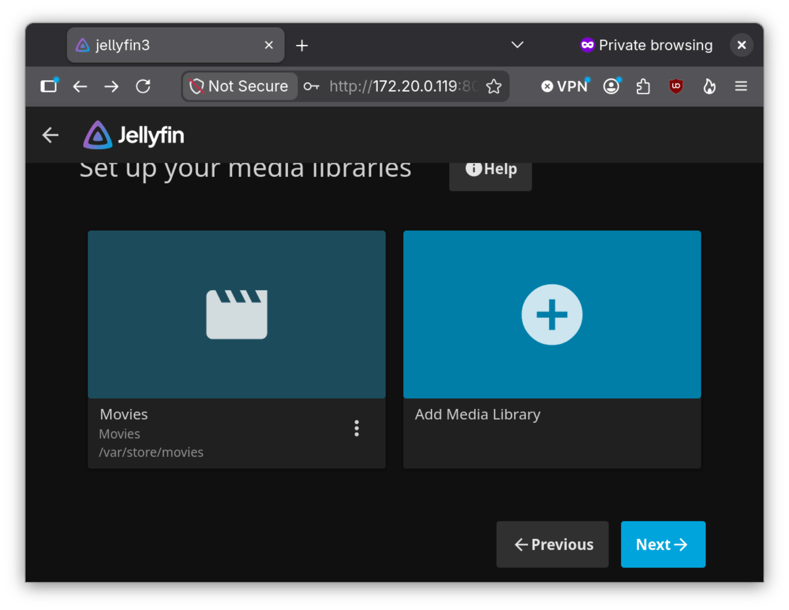

Select your preferred metadata language and country, then select **Next**:

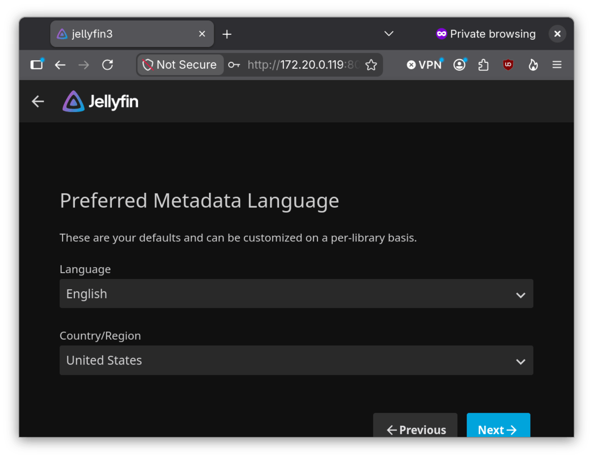

Check if we want to allow remote connections and select **Next**:

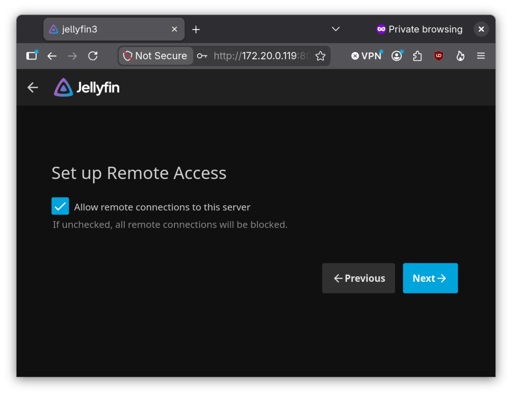

Finally select **Finish**:

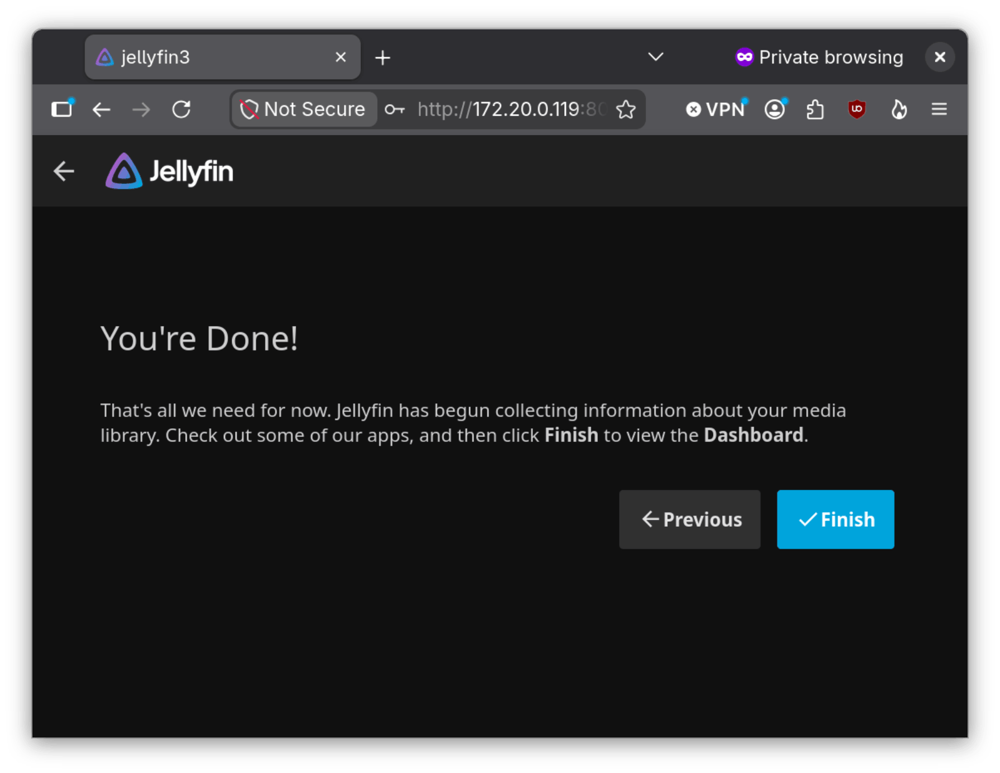

You should be able to log into Jellyfin from your browser. You can also add the server to smartphones, smart TVs or a load balancer.

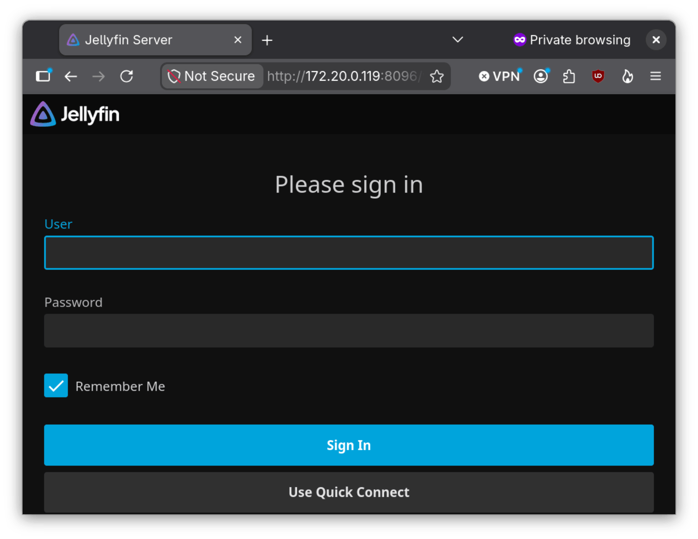

## Conclusion

For people who prefer owning entertainment over juggling subscription services such as Netflix, Disney+ or Max, Jellyfin is an excellent way to consolidate media on a home server or NAS. That way, you can watch owned movies or TV shows on any internet accessible device.
