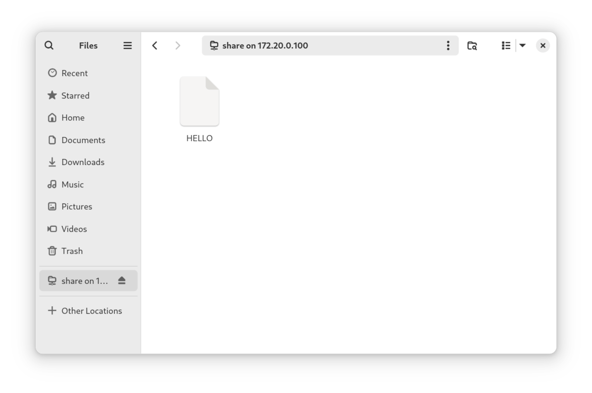

## Introduction

Si vous avez déjà utilisé des systèmes Windows, il est probable que vous connaissiez SMB (Server Message Block) pour le partage de fichiers. Si vous êtes un administrateur Linux chevronné, il y a de fortes chances que vous ayez entendu parler de Samba, mais si ce n'est pas le cas, [Samba](https://www.samba.org/) est l'implémentation open-source de facto de SMB pour permettre le partage de fichiers et l'accès Active Directory des machines Linux vers les réseaux Windows.

## Installation

Il vous faut installer Samba en utilisant `dnf` :

```bash
dnf install -y samba
```

## Mise en Place d'un Partage de Fichiers

Tout d’abord créez le répertoire que vous souhaitez partager avec les clients Windows :

```bash
mkdir /var/store
```

Définissez ensuite les étiquettes SELinux pour le répertoire `/var/store` :

```bash
semanage fcontext -a -t samba_share_t  "/var/store(/.*)?"
restorecon -Rv /var/store
```

Remplacez `/var/store` par le répertoire à partager.

Configuration de Samba :

```bash
vi /etc/samba/smb.conf
```

Ajoutez ce qui suit à la fin du fichier `smb.conf` :

```bash
[Share]
        path = /var/store
        browseable = yes
        writable = no
        read only = yes
        guest ok = yes
```

Si vous ne connaissez pas les options ci-dessus, ce sont les suivantes :

- `path` est le répertoire que nous partageons. Définissez ceci dans votre propre répertoire (`/var/store` dans notre cas).
- `navigable` permet aux clients d'accéder à la navigation. Si vous souhaitez désactiver la navigation, définissez cette valeur sur `no`.
- `writable` permet aux clients d'accéder en écriture. Si vous souhaitez autoriser l'accès en écriture, réglez-le sur `yes`.
- `read only` consiste à marquer le partage en lecture seule. Si vous souhaitez autoriser l'accès en écriture ou en exécution, réglez-le sur `no`.
- `guest ok` permet aux utilisateurs non authentifiés d'accéder à notre partage. Si vous souhaitez refuser l'accès, réglez cette option sur `no`.

Pour tester la configuration, vous pouvez exécuter :

```bash
testparm
```

## Activation de Samba

Une fois la configuration testée OK, ouvrez le port Samba dans `firewall-cmd` :

```bash
firewall-cmd --permanent --add-service=samba
firewall-cmd --reload
```

Vous pouvez ensuite activer Samba :

```bash
systemctl enable --now smb nmb
```

## Accès au partage de Samba

Vous pouvez accéder au partage Samba en utilisant l'URI suivant (Remarque : remplacez `SERVER_IP` par l'adresse IP ou le FQDN de votre machine exécutant Samba) :

- Windows: `\\SERVER_IP`
- Linux ou bien Mac : `smb://SERVER_IP`

`SERVER_IP` sur le réseau domestique de l'auteur est `172.20.0.100` donc bien que les instructions varient en fonction du système d'exploitation, l'auteur accédera au nouveau partage depuis son ordinateur portable Fedora 40 :



Tous les fichiers accessibles sur le serveur le sont également sur les machines clientes.

## Conclusion

Bien que SMB ait la réputation d'être centré sur Microsoft, SMB est de facto un standard de l'industrie et votre partage Samba est accessible depuis Linux, Mac, BSD et même des appareils mobiles. Félicitations, vous partagez désormais les fichiers de votre serveur !
