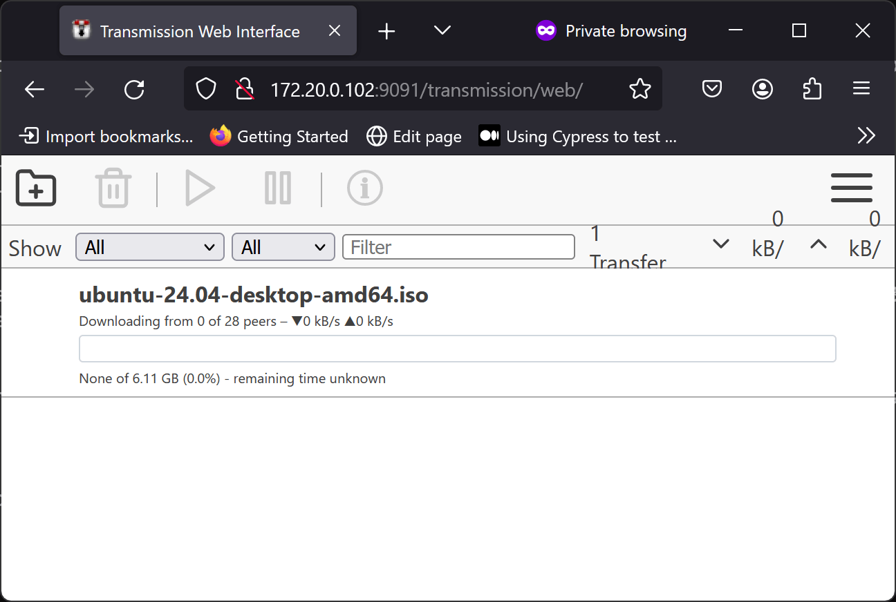

!!! warning Avviso “Temporaneamente in Sospenso”

```
`transmission-daemon` è attualmente assente dall'EPEL. Probabilmente verrà compilato. Il team Docs continuerà a testarne la disponibilità nell'EPEL non appena possibile. Per ora, l'unica opzione è compilare il pacchetto transmission dal sorgente, ma le istruzioni per farlo non sono attualmente disponibili qui. 
```

## Introduzione

BitTorrent non ha bisogno di presentazioni, ma se non lo si sa, BitTorrent è un protocollo di condivisione di file peer-to-peer. BitTorrent si basa sul seeding (caricamento) del file richiesto da parte di più peer, ma anche sul seeding per i futuri downloader.

Transmission è un popolare client BitTorrent open source con diversi frontend e backend. Qui si installerà il backend headless “daemon”.

Nell'attuale mondo mobile-centrico, ha più senso eseguire Transmission come server headless piuttosto che direttamente su un laptop o un desktop. In questo modo, è possibile seminare i file 24 ore su 24, 7 giorni su 7, senza consumare la batteria del dispositivo mobile durante il download.

## Installazione

Per installare Transmission, è necessario prima installare EPEL:

```bash
dnf install -y epel-release
```

Poi installare Transmission:

```bash
dnf install -y transmission-daemon
```

## Primo setup

A differenza della maggior parte dei deamon Linux, Transmission imposta la configurazione al primo avvio, quindi avviare e arrestare Transmission con:

```bash
systemctl start transmission-daemon
systemctl stop transmission-daemon
```

Dopo questi passaggi, si avrà un file di configurazione. Sarebbe meglio interrompere Transmission, poiché non è possibile modificare il file di configurazione mentre è in esecuzione.

## Configurazione

Configurare Transmission:

```bash
cd /var/lib/transmission/.config/transmission-daemon
vi settings.json
```

Navigare fino alla voce JSON `“peer-port”` e, se si desidera, sostituire la porta standard con la porta desiderata:

```bash
    "peer-port": 51413,
```

Qui l'autore lo cambia in `12345`:

```bash
    "peer-port": 12345,
```

Successivamente, passare alla voce JSON `“rpc-password”` e modificare la password:

```bash
    "rpc-password": "{9cfaaade11d56c8e82bfc23b696fa373fb20c10e4U2NXY3.",
```

Inserire qui la password in chiaro. Se la sicurezza è un problema, si noti che Transmission cripterà la password al successivo riavvio.

Se si desidera consentire l'accesso da altri indirizzi IP, navigare nella voce `“rpc-whitelist”`:

```bash
    "rpc-whitelist": "127.0.0.1,::1",
```

Ad esempio, se si vuole consentire l'accesso al desktop all'indirizzo IP `192.168.1.100`, lo si può aggiungere al valore separato da virgole:

```bash
    "rpc-whitelist": "127.0.0.1,::1,192.168.1.100",
```

Se non si desidera una whitelist IP, è possibile disabilitarla impostando `“rpc-whitelist-enable”` su `false`:

```bash
    "rpc-whitelist-enabled": false,
```

Al termine della configurazione, avviare e attivare Transmission:

```bash
systemctl enable --now transmission-daemon
```

## Configurazione del firewall e di rete

Successivamente, è necessario consentire le rispettive porte `12345` (per BitTorrent) e `9091` (per il pannello di controllo di Transmission) nel firewall:

```bash
firewall-cmd --permanent --zone=public --add-port=12345/tcp
firewall-cmd --permanent --zone=public --add-port=9091/tcp
firewall-cmd --runtime-to-permanent
```

Se non ci si trova dietro un router abilitato NAT-PMP o UPnP, o se si è connessi senza NAT, è necessario inoltrare la porta BitTorrent (`12345` in questo esempio). Ogni router è diverso, ma a titolo di esempio sul router MikroTik dell'autore:

```bash
/ip firewall nat add action=dst-nat chain=dstnat dst-port=12345 in-interface=ether1 protocol=tcp to-addresses=SERVER_IP to-ports=12345
```

Sostituire `SERVER_IP` con l'indirizzo IP del server che esegue Transmission.

## Testare Transmission

Andare all'indirizzo IP dove è in esecuzione del server Transmission. Ad esempio, è possibile scaricare il torrent di una distribuzione Linux come Ubuntu:



## Conclusione

BitTorrent è stato progettato nei primi anni 2000, quando la maggior parte delle persone si connetteva a Internet tramite un PC desktop. Mentre l'esecuzione di BitTorrent su un laptop o un telefono è poco pratica, l'esecuzione su un server headless tramite Transmission è perfetta. In questo modo, si può caricare i file 24 ore su 24, 7 giorni su 7, ma i download saranno sempre disponibili.
