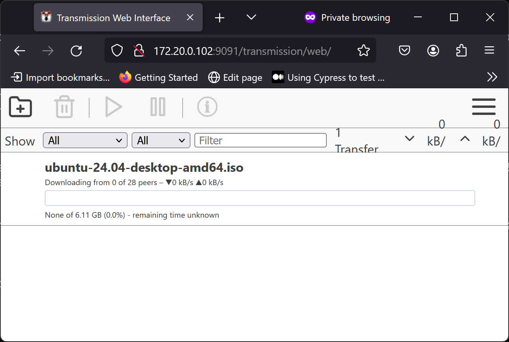

## Introduction

BitTorrent needs no introduction, but if you are unaware, BitTorrent is a peer-to-peer file-sharing protocol. BitTorrent relies on multiple peers seeding (uploading) the requested file to you, but you also seed back to future downloaders.

Transmission is a popular open-source BitTorrent client with multiple frontends and backends. Here, you will install the headless "daemon" backend.

In today's mobile-centric world, it makes more sense to run Transmission as a headless server than directly on a laptop or a desktop. This way, you can seed files 24/7 while a mobile device's battery life is not consumed when downloading.

## Installation

To install Transmission, you first need to install EPEL:

```bash
dnf install -y epel-release
```

Then install Transmission:

```bash
dnf install -y transmission
```

## First setup

Unlike most Linux daemons, Transmission sets up the configuration upon first startup, so start and stop Transmission with:

```bash
systemctl start transmission-daemon
systemctl stop transmission-daemon
```

After these steps, you will have a configuration file. It would be best to stop Transmission, as you cannot edit the configuration file while running.

## Configuration

Configure Transmission:

```bash
cd /var/lib/transmission/.config/transmission-daemon
vi settings.json
```

Navigate down to the `"peer-port"` JSON entry, and if desired, replace the stock port with the desired port:

```bash
    "peer-port": 51413,
```

Here, the author is changing it to `12345`:

```bash
    "peer-port": 12345,
```

Subsequently, navigate to the `"rpc-password"` JSON entry and change the password:

```bash
    "rpc-password": "{9cfaaade11d56c8e82bfc23b696fa373fb20c10e4U2NXY3.",
```

Enter your plain text password here. If security is a worry, note that Transmission will encrypt the password upon the next restart.

If you want to allow access from other IP addresses, navigate to the `"rpc-whitelist"` entry:

```bash
    "rpc-whitelist": "127.0.0.1,::1",
```

For instance, if you want to allow access to your desktop on IP address `192.168.1.100`, you can add it to the comma-separated value:

```bash
    "rpc-whitelist": "127.0.0.1,::1,192.168.1.100",
```

If you do not want an IP whitelist, you can disable it by setting `"rpc-whitelist-enable"` to `false`:

```bash
    "rpc-whitelist-enabled": false,
```

When finished configuring, start and enable Transmission:

```bash
systemctl enable --now transmission-daemon
```

## Firewall and network configuration

Subsequently, you will need to allow the respective ports `12345` (for BitTorrent) and `9091` (for Transmission's control panel) in our firewall:

```bash
firewall-cmd --permanent --zone=public --add-port=12345/tcp
firewall-cmd --permanent --zone=public --add-port=9091/tcp
firewall-cmd --runtime-to-permanent
```

If you are not behind a NAT-PMP, uPNP-enabled router, or connected without NAT, you must forward the BitTorrent port (`12345` in our example). Each router is different, but as an example on the author's MikroTik router:

```bash
/ip firewall nat add action=dst-nat chain=dstnat dst-port=12345 in-interface=ether1 protocol=tcp to-addresses=SERVER_IP to-ports=12345
```

Replace `SERVER_IP` with the IP address of the server running Transmission.

## Testing Transmission

Navigate to the IP address running our Transmission server. As an example, you can download the torrent of a Linux distribution such as Ubuntu:



## Conclusion

BitTorrent was designed in the early 2000s when most people connected to the internet via a desktop PC. While running BitTorrent on a laptop or phone is impractical, running it on a headless server via Transmission is perfect. In this way, you can seed files 24/7, yet our downloads will always be available.
