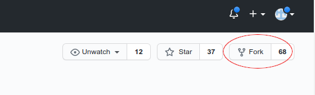
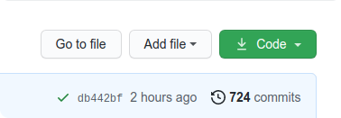
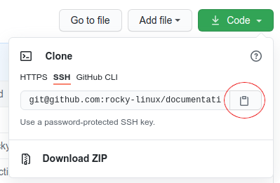
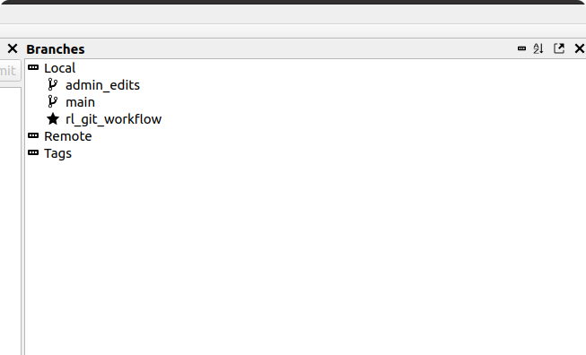
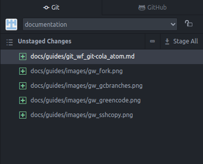
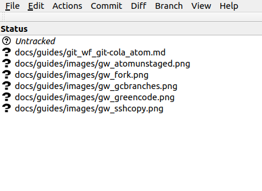

# git Workflow for Documentation: git, Git Cola, and Atom

So, you want to submit some documentation to this repository. Well, _git_ experts can always just get cracking and work how they usually do, then push their suggested changes to us. But if you're more of a beginner, and are looking for an example workflow, this guide can help.

It should be noted at the outset that this is by no means a definitive. There are many git workflow options; you may not find this one to your liking, and that is fine. You might find parts of this workflow that you like and other parts that just don't work for you. That's fine too.

This is one method, and the author is hopeful that others will share their git workflows as well, providing a wealth of options for anyone who wants to contribute to the documentation for Rocky Linux.

## Prerequisites and Assumptions

* A Rocky Linux desktop (This guide will work on other RHEL-based distros, and likely on Fedora, too.)
* Familiarity with the command line
* A GitHub account with SSH key access

## The Components

This particular workflow uses the following components:

* A personal fork of the documentation repository found [here](https://github.com/rocky-linux/documentation)
* A local cloned copy of the repository on a Linux workstation
* Git Cola: a visual client for git branching and staging (optional)
* The Atom editor (optional)

---

!!! Note

    While both Atom and Git Cola are described as optional, you'll need at least one of them for this particular workflow. This author likes to use both: one for the GitHub portion (Git Cola), and one for the editing portion (Atom).

---

## Installing Repositories

Only a couple of repositories are really required. The EPEL (Extra Packages for Enterprise Linux) and the Atom editor repository.

To install the EPEL, run:

`sudo dnf install epel-release`

Next, we need the GPG key for Atom and the repository:

`sudo rpm --import https://packagecloud.io/AtomEditor/atom/gpgkey`

And then:

`sudo sh -c 'echo -e "[Atom]\nname=Atom Editor\nbaseurl=https://packagecloud.io/AtomEditor/atom/el/7/\$basearch\nenabled=1\ngpgcheck=0\nrepo_gpgcheck=1\ngpgkey=https://packagecloud.io/AtomEditor/atom/gpgkey" > /etc/yum.repos.d/atom.repo'`

Then update the system:

`sudo dnf update`

## Installing Packages

Run the following command to install the packages we need with `dnf`:

`sudo dnf install git git-cola`

There will be a number of other packages installed as dependencies so simply answer 'Y' to allow the installation.

Next, install the Atom editor:

`sudo dnf install atom`

## Forking the Rocky Linux Documentation Repository

You will need your own fork of the repository. This will become one of your git remotes for this workflow.

We are already assuming that you've created your GitHub account, have SSH key access, and are logged in to [Documentation](https://github.com/rocky-linux/documentation).

On the right-hand side of the page, click on "Fork" shown here:



When this completes, you should have a fork with a URL that has your username in it. If your git username was "alphaomega" then the URL would be:

```
https://github.com/alphaomega/documentation
```

## Cloning a Local copy of the Repository

Next we need a local copy of the repository, which is easy enough to do. Again, from the Rocky Linux [Documentation](https://github.com/rocky-linux/documentation), look for the green "Code" button and click on it:



Once open, click on SSH and then copy the URL:



On your Linux workstation in a terminal window, enter the following at the command line:

`git clone `

And then paste the URL into the command line so you should have this when done:

`git clone git@github.com:rocky-linux/documentation.git`

When this command is completed, you should now have a local copy of the documentation repository. This creates a directory called "documentation" in your home directory:

```
home:~/documentation
```

## Setting Up Git Cola

Next, if you want to set up Git Cola, we need to open the "documentation" repository we just created locally, and we need to set up the remotes. This is an optional step, but I like to do it.

You can set your remotes with git via the command line as well, but I find this method easier, because for me, I want the Rocky Linux remote to be called something different from "origin" which is what it will be named by default.

For me, I think of my fork as the "origin" and the Rocky Linux documentation as the "upstream" repository. You may disagree.

When you first open Git Cola, it asks you to select your repository. You could have several on your machine, but the one you are looking for is the one called "documentation." So click on this one and open it.

Once you have your repository open, setup the remotes by clicking on `File` and `Edit Remotes`.

By default, it will already show you your Rocky Linux remote as "origin". To change this, simply click in the field, backspace over the top of "origin," replace it with "upstream" and click "Save."

Next, we actually want to create a new remote that is your fork. Click the green plus sign (+) in the left-hand corner of the bottom of the screen and a new remote dialog will open. Type "origin" for the name, and then, assuming our GitHub username is "alphaomega" again, your URL will look like this:

```
git@github.com:alphaomega/documentation.git
```
Save this and you are done.

### Testing that your Workflow will actually workflow

Do this all from the command line. Change into your documentation directory:

`cd documentation`

Then type:

`git pull upstream main`

This will test that you have everything setup and working to pull from Rocky Linux upstream.

If there are no problems, next type the following:

`git push origin main`

This will test access to your fork of the Rocky Linux documentation. If there are no errors, then this command can be strung together in the future with:

`git pull upstream main && git push origin main`

This command should be run before any branches are created or any work is done, to keep your branches in sync.

## A Note about Atom and Git Cola and why the author uses both

The Atom editor has integration with git and GitHub. In fact, you can use Atom without the need for Git Cola at all. That said, the visualizations that Git Cola provides are clearer from the author's view. The editor features in Atom far outweigh those that are specifically designed as markdown editors (again, the author's opinion). If you so choose, you can eliminate the need for Git Cola and simply use Atom if you like. You can always eliminate Atom and use a different markdown editor.

I use Git Cola for setting up the remotes (as we have already seen), branching, and committing changes. Atom is used as a text editor and markdown preview only. Pushes and pulls are done from the command line.

## Branching with Git Cola

You always want to create a branch by using the "main" as the template. Make sure that "main" is selected in the "Branches" listing on the right-hand side of Git Cola, then click "Branch" top menu item and "Create." Type a name for your new branch.

!!! Note

    When naming branches, consider using descriptive names. These will help add clarity when you push them upstream. For instance, the author uses an "rl_" prefix when creating a new document, and then appends the a descriptive short name for what the document is. For edits, the author uses "edit_" as the prefix followed by a short name about what the edit is for.

As an example, below you can see the "Branches" listing, which shows "rl_git_workflow":



As you create and save your changes in Atom, you will see the "Unstaged Changes" listing in the git view change:



These changes also show up in Git Cola under the "Status" in the left-hand window:



## Staging the Files with Git Cola

Once our document is done and we are ready to create the pull request, the first thing we need to do is to write a commit statement. In most cases typing it all up before committing the files is easier, because as soon as you stage your files, the changes will disappear from view.

You want your commit statement to be as clear as possible. The Commit summary should say what you are committing. For example: "Document to Present a git Workflow." The extended description should give bullet points of the highlights of the document, for instance:

* git workflow using Git Cola and Atom
* Includes corresponding images

Once you've written the commit but before you hit the "Commit" button, you need to stage all of your unstaged files. To do this, select all of the files, then right-click and click on "Stage Selected." Now click the "Commit" button.

Before you get out of Git Cola, in the "Branches" section on the right, right-click "main" and click "Checkout." We want to be checked out to main before we push our files.

## Pushing To Your Fork

Now that all of the document creation work is done, you need to push your branch to your fork. If you followed along as we created the remotes before, then you have created your fork as the "origin."

We need to get into the documentation directory in the terminal window. In other words, into the clone of the Rocky Documentation repository. From a terminal window type:

`cd documentation`

You should see your home directory and your cursor inside documentation:

`home:~/documentation$`

Now we need to push our changes:

`git push origin rl_git_workflow`

This says we are pushing to our fork, the branch that we just created and put a document into.

When we enter this command, we get back a message from git that says you can create a Pull Request. It will look something like this:

```
Enumerating objects: 16, done.
Counting objects: 100% (16/16), done.
Delta compression using up to 6 threads
Compressing objects: 100% (12/12), done.
Writing objects: 100% (12/12), 122.01 KiB | 2.22 MiB/s, done.
Total 12 (delta 4), reused 0 (delta 0)
remote: Resolving deltas: 100% (4/4), completed with 4 local objects.
remote:
remote: Create a pull request for 'rl_git_workflow' on GitHub by visiting:
remote:      https://github.com/alphaomega/documentation/pull/new/rl_git_workflow
remote:
To github.com:alphaomega/documentation.git
 * [new branch]      rl_git_workflow -> rl_git_workflow
```

## Adding to the Document

If you suddenly realize that you have more to add to your document, and don't want to do the PR as yet, that's no problem.

Go back to Git Cola, right-click on your branch (in this case "rl_git_workflow") and click "Checkout" then go back to Atom, open your document again and make whatever additions you need to add. Any changes you make to the file or files, will again have to be staged, and a new commit will need to be written.

You will need to right-click the "main" branch when done and click "Checkout" again, and you will need to push your changes to your fork again. The difference is that since the URL for doing the pull request (PR) has already been sent, you will not get this again. You need to use the original link that was sent before.

## Waiting For Your PR to be Merged

An editor has to give your document a once over. They need to be certain that everything you have done and written matches the guidelines, and maybe make some edits.

## Conclusion

Everyone who uses git has a slightly different workflow. This is the author's. If you have a favorite workflow, please post it!
