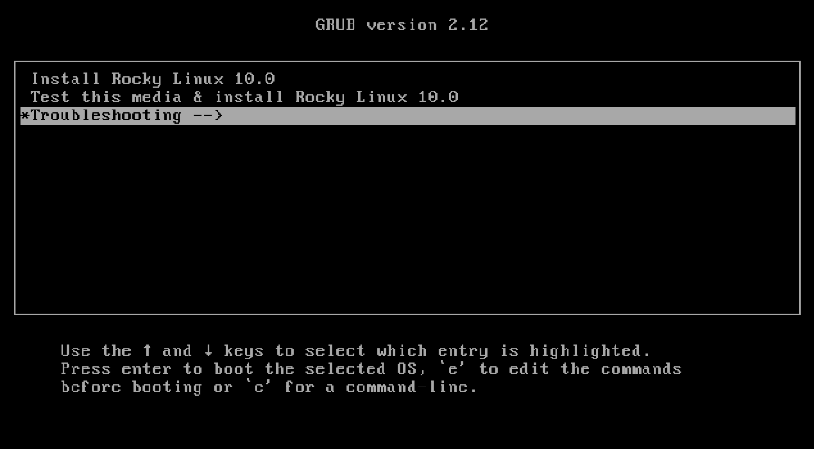
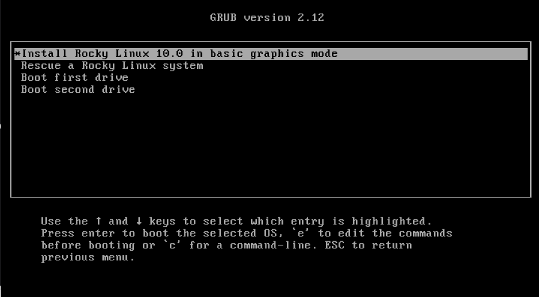

## Introduction

The AOOSTAR WTR PRO is a low-power x86 NAS with four drive bays. It is a faster and cheaper alternative to the HPE ProLiant MicroServer. For instance the author bought one as their personal NAS.

While the WTR PRO is designed to run standard Linux distributions, the Rocky Linux installer will not boot out-of-the-box on it. However, Rocky Linux can still be installed.

## Prerequisites and assumptions

The following are the minimum requirements for using this procedure:

* A Rocky Linux installer USB

* An AOOSTAR WTR PRO system

## Booting the Rocky Linux installer

First, we will boot from the USB.

If an existing operating system is installed on the SSD, press `Delete` when turning on the WTR PRO. Navigate to **Save &amp; Exit** and choose the USB.

When the USB is booted into the GRUB menu, select **Troubleshooting**:

Subsequently, select **Install Rocky Linux *VERSION* in basic graphics mode**:

Now, Rocky Linux should boot and install as normal.

Keep in mind that when Rocky Linux is installed, no special kernel options are required.
