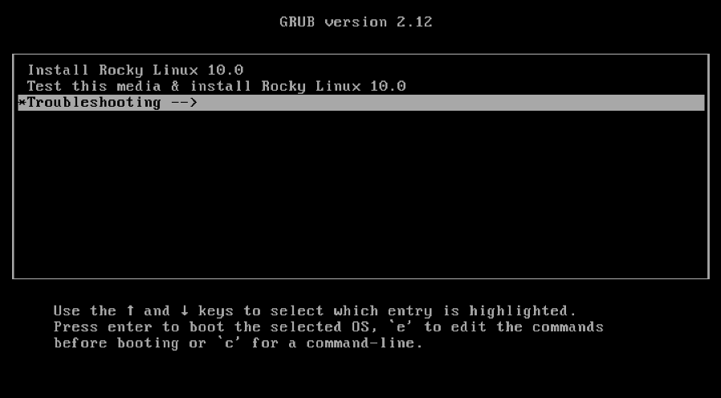
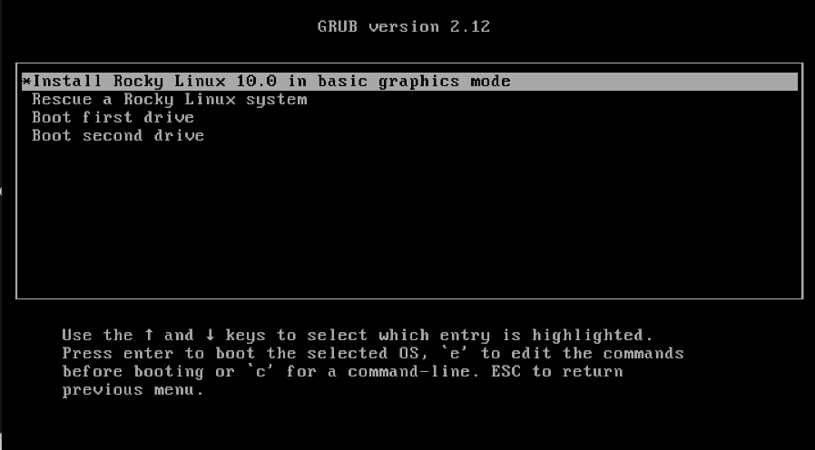

## Вступ

AOOSTAR WTR PRO — це малопотужний NAS x86 з чотирма відсіками для дисків. Це швидша та дешевша альтернатива мікросерверу HPE ProLiant. Наприклад, автор придбав один як особистий NAS.

Хоча WTR PRO розроблений для роботи зі стандартними дистрибутивами Linux, інсталятор Rocky Linux не завантажується з нього одразу після встановлення. Однак, ви все ще можете встановити Rocky Linux.

## Передумови та припущення

Нижче наведено мінімальні вимоги для використання цієї процедури:

- USB-програма встановлення Rocky Linux

- Система AOOSTAR WTR PRO

## Завантаження інсталятора Rocky Linux

Спочатку ми завантажимося з USB-накопичувача.

Якщо на SSD-диску встановлено операційну систему, натисніть клавішу «Delete» під час увімкнення WTR PRO. Перейдіть до **Зберегти та вийти** та виберіть USB-носій.

Під час завантаження з USB-накопичувача в меню GRUB виберіть **Виправлення неполадок**:

Після цього виберіть **Встановити Rocky Linux _ВЕРСІЯ_ у базовому графічному режимі**:

Тепер Rocky Linux має завантажитися та встановитися як завжди.

Зверніть увагу, що під час встановлення Rocky Linux немає вимоги до спеціального параметра ядра.
