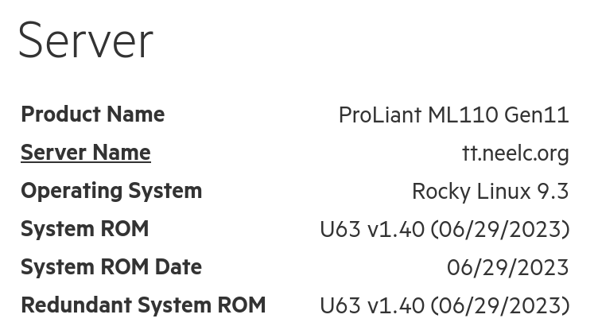

# HPE ProLiant Agentless Management Service

## Introduction

HPE ProLiant servers have a companion software called Agentless Management Service which [according to HPE](https://techlibrary.hpe.com/docs/iss/EL8000t/setup_install/GUID-1CF69B20-790A-4EDC-A162-9D64572ED9E8.html) "uses out-of-band communication for increased security and stability." In addition, "with Agentless Management, health monitoring and alerting is built into the system and begins working the moment auxiliary power is connected to the [your server]".

As an example, this is used to reduce fan speeds on an HPE ProLiant ML110 Gen11 in the author's home lab.

## Prerequisites and assumptions

The following are minimum requirements for using this procedure:

* A HP/HPE ProLiant Gen8 or newer server with iLO enabled and visible on the network

## Installing `amsd`

To install `amsd`, you need to first install the EPEL (Extra Packages for Enterprise Linux) and run updates:

```bash
dnf -y install epel-release && dnf -y update
```

Then add the following to `/etc/yum.repos.d/spp.repo`:

```bash

[spp]
name=Service Pack for ProLiant
baseurl=https://downloads.linux.hpe.com/repo/spp-gen11/redhat/9/x86_64/current
enabled=1
gpgcheck=1
gpgkey=https://downloads.linux.hpe.com/repo/spp/GPG-KEY-spp 
```

Replace the `9` with the Rocky Linux major version, and `gen11` with the generation of your server. While the author is using a ML110 Gen11, if they were using a DL360 Gen10 instead, `gen10` would be used instead.

Subsequently, install and enable `amsd`:

```bash
dnf -y update && dnf -y install amsd
systemctl enable --now amsd
```

If you want to check if `amsd` is working, log into iLO via your web browser. If installed correctly, iLO should report our server is running Rocky Linux:



## Conclusion

A common criticism of HPE servers are high fan speeds when using third-party components such as SSDs or other add-in PCI Express cards which aren't officially sanctioned by HPE (e.g., video capture cards). Even if you only use HPE-branded components, using `amsd` allows HPE ProLiant servers to run cooler and quieter than just using Rocky Linux alone on one.
