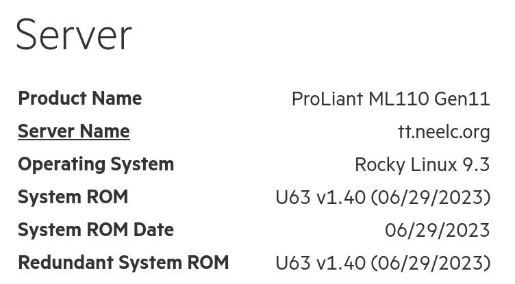

# Служба безагентного керування HPE ProLiant

## Вступ

Сервери HPE ProLiant мають супутнє програмне забезпечення під назвою Agentless Management Service, яке [згідно з HPE](https://techlibrary.hpe.com/docs/iss/EL8000t/setup_install/GUID-1CF69B20-790A-4EDC-A162-9D64572ED9E8.html) "використовує позасмуговий зв'язок для підвищення безпеки та стабільності". Крім того, «за допомогою безагентного керування моніторинг працездатності та сповіщення вбудовані в систему та починають працювати в момент підключення допоміжного джерела живлення до [вашого сервера]».

Це використовується, наприклад, для зменшення швидкості вентилятора на HPE ProLiant ML110 Gen11 у домашній лабораторії автора.

## Передумови та припущення

Нижче наведено мінімальні вимоги для використання цієї процедури:

- Сервер HP/HPE ProLiant Gen8 або новішої версії з увімкненим iLO та видимим у мережі

## Встановлення `amsd`

Щоб інсталювати `amsd`, спочатку потрібно інсталювати EPEL (додаткові пакети для Enterprise Linux) і запустити оновлення:

```bash
dnf -y install epel-release && dnf -y update
```

Потім додайте наступне до `/etc/yum.repos.d/spp.repo`:

```bash

[spp]
name=Service Pack for ProLiant
baseurl=https://downloads.linux.hpe.com/repo/spp-gen11/redhat/9/x86_64/current
enabled=1
gpgcheck=1
gpgkey=https://downloads.linux.hpe.com/repo/spp/GPG-KEY-spp 
```

Замініть «9» на основну версію Rocky Linux, а «gen11» — на генерацію вашого сервера. Хоча автор використовує ML110 Gen11, якби він використовував замість DL360 Gen10, використовувався б `gen10`.

Згодом встановіть і ввімкніть `amsd`:

```bash
dnf -y update && dnf -y install amsd
systemctl enable --now amsd
```

Якщо ви хочете перевірити, чи працює `amsd`, увійдіть до iLO через веб-браузер. Якщо встановлено правильно, iLO має повідомити, що на нашому сервері працює Rocky Linux:



## Висновок

Поширеною критикою серверів HPE є висока швидкість обертання вентиляторів під час використання компонентів сторонніх виробників, таких як SSD або інші додаткові карти PCI Express, офіційно не дозволені HPE (наприклад, карти відеозахоплення). Навіть якщо ви використовуєте лише компоненти HPE, використання `amsd` дозволяє серверам HPE ProLiant працювати холодніше та тихіше, ніж просто використання Rocky Linux на одному сервері.
