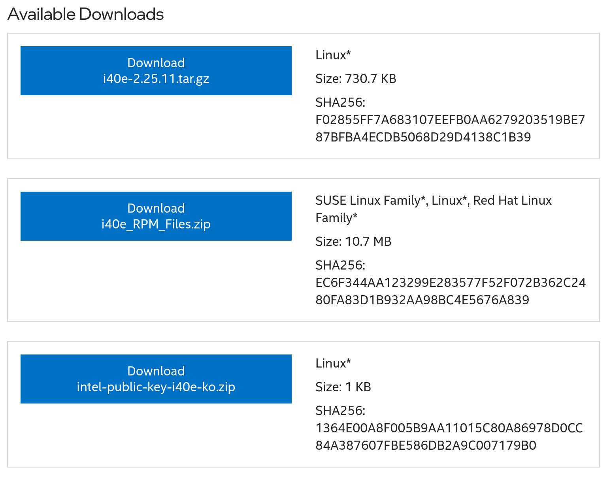

## Introduction

Certains serveurs ont des cartes d'interface réseau (NIC) Intel série X710, comme la Minisforum MS-01 de l'auteur, qui est utilisée pour un pare-feu virtualisé. Malheureusement, le pilote Linux Rocky d'origine présente un [bug](https://community.intel.com/t5/Ethernet-Products/X710-strips-incoming-vlan-tag-with-SRIOV/m-p/551464) où les VLAN ne sont pas transmis via les interfaces de pont comme prévu. Cela est arrivé à la machine virtuelle MikroTik CHR de l'auteur. Heureusement, c'est réparable.

## Prérequis

Voici les exigences minimales pour utiliser la procédure  décrite ici :

- Un serveur Rocky Linux 8 ou 9 avec une carte réseau Intel série X710

## Installation des pilotes NIC fournis par Intel

Alors que le pilote Rocky Linux standard ne passe pas par les VLAN, le pilote fourni par Intel le fait. Tout d’abord, accédez à la [page de téléchargement des pilotes d’Intel](https://www.intel.com/content/www/us/en/download/18026/intel-network-adapter-driver-for-pcie-40-gigabit-ethernet-network-connections-under-linux.html).



Lorsque vous êtes sur la page ci-dessus, téléchargez le fichier `i40e_RPM_Files.zip` puis décompressez-le :

```
unzip i40e_RPM_Files.zip
```

Vous obtiendrez un tas de fichiers RPM :

```
kmod-i40e-2.25.11-1.rhel8u10.src.rpm
kmod-i40e-2.25.11-1.rhel8u10.x86_64.rpm
kmod-i40e-2.25.11-1.rhel8u7.src.rpm
kmod-i40e-2.25.11-1.rhel8u7.x86_64.rpm
kmod-i40e-2.25.11-1.rhel8u8.src.rpm
kmod-i40e-2.25.11-1.rhel8u8.x86_64.rpm
kmod-i40e-2.25.11-1.rhel8u9.src.rpm
kmod-i40e-2.25.11-1.rhel8u9.x86_64.rpm
kmod-i40e-2.25.11-1.rhel9u1.src.rpm
kmod-i40e-2.25.11-1.rhel9u1.x86_64.rpm
kmod-i40e-2.25.11-1.rhel9u2.src.rpm
kmod-i40e-2.25.11-1.rhel9u2.x86_64.rpm
kmod-i40e-2.25.11-1.rhel9u3.src.rpm
kmod-i40e-2.25.11-1.rhel9u3.x86_64.rpm
kmod-i40e-2.25.11-1.rhel9u4.src.rpm
kmod-i40e-2.25.11-1.rhel9u4.x86_64.rpm
```

Le fichier à installer est au format `kmod-i40e-2.25.11-1.rhelXuY.x86_64.rpm`, où `X` et `Y` sont respectivement les versions majeure et mineure de Rocky Linux. Par exemple, sur le serveur Rocky Linux 9.4 de l'auteur, `X` est 9, `Y` est 4, donc le paquet d'installation de l'auteur était :

```
sudo dnf install kmod-i40e-2.25.11-1.rhel9u4.x86_64.rpm
```

Après avoir installé le pilote, vous devrez redémarrer le serveur :

```
sudo reboot
```

Après le redémarrage, les cartes réseau X710 doivent passer par les VLAN via des interfaces de pont.
