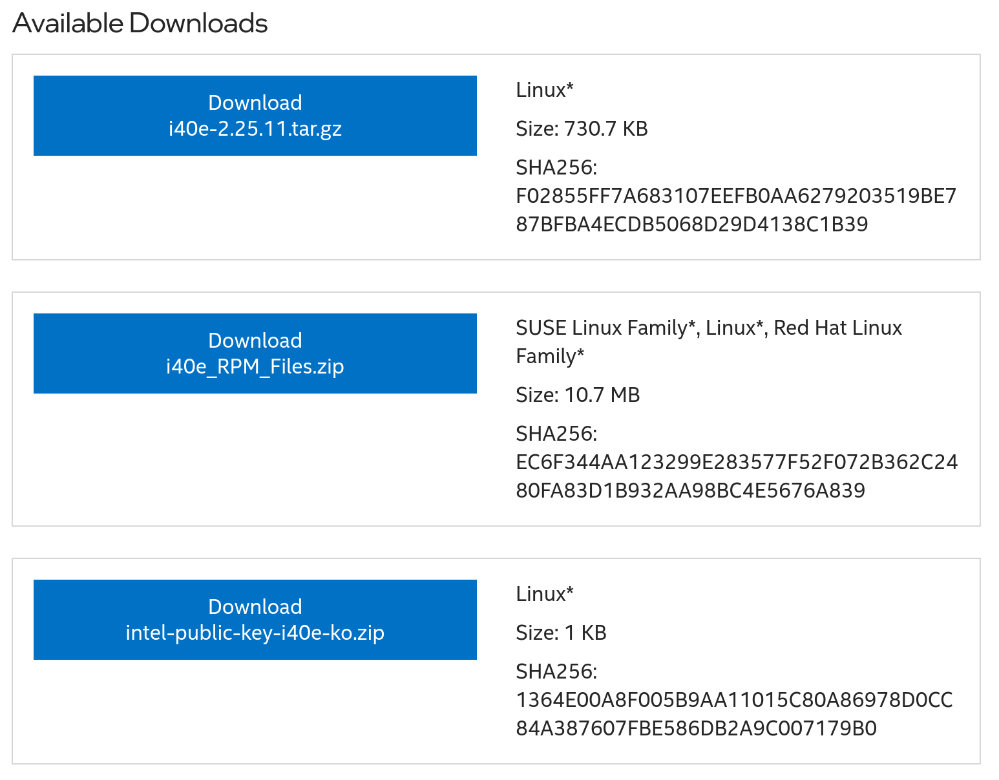

## Introduzione

Alcuni server sono dotati di schede di interfaccia di rete (NIC) Intel serie X710, come il Minisforum MS-01 dell'autore, utilizzato per un firewall virtualizzato. Sfortunatamente, il driver stock di Rocky Linux presenta un [bug](https://community.intel.com/t5/Ethernet-Products/X710-strips-incoming-vlan-tag-with-SRIOV/m-p/551464) per cui le VLAN non vengono passate attraverso le interfacce bridge come previsto. Questo è accaduto alla macchina virtuale MikroTik CHR dell'autore Fortunatamente è risolvibile.

## Prerequisiti  e presupposti

A seguire i requisiti minimi per poter eseguire questa procedura:

- Un server Rocky Linux 8 o 9 con una NIC Intel serie X710

## Installazione dei driver NIC forniti da Intel

Mentre il driver Rocky Linux di serie non passa attraverso le VLAN, il driver fornito da Intel lo fa. Per prima cosa, andare alla pagina [Intel's driver download page] (https://www.intel.com/content/www/us/en/download/18026/intel-network-adapter-driver-for-pcie-40-gigabit-ethernet-network-connections-under-linux.html).



Una volta arrivati alla pagina precedente, scaricare il file `i40e_RPM_Files.zip` e successivamente `scompattarlo`:

```
unzip i40e_RPM_Files.zip
```

Verrà visualizzato un gruppo di file RPM:

```
kmod-i40e-2.25.11-1.rhel8u10.src.rpm
kmod-i40e-2.25.11-1.rhel8u10.x86_64.rpm
kmod-i40e-2.25.11-1.rhel8u7.src.rpm
kmod-i40e-2.25.11-1.rhel8u7.x86_64.rpm
kmod-i40e-2.25.11-1.rhel8u8.src.rpm
kmod-i40e-2.25.11-1.rhel8u8.x86_64.rpm
kmod-i40e-2.25.11-1.rhel8u9.src.rpm
kmod-i40e-2.25.11-1.rhel8u9.x86_64.rpm
kmod-i40e-2.25.11-1.rhel9u1.src.rpm
kmod-i40e-2.25.11-1.rhel9u1.x86_64.rpm
kmod-i40e-2.25.11-1.rhel9u2.src.rpm
kmod-i40e-2.25.11-1.rhel9u2.x86_64.rpm
kmod-i40e-2.25.11-1.rhel9u3.src.rpm
kmod-i40e-2.25.11-1.rhel9u3.x86_64.rpm
kmod-i40e-2.25.11-1.rhel9u4.src.rpm
kmod-i40e-2.25.11-1.rhel9u4.x86_64.rpm
```

Il file da installare è nel formato `kmod-i40e-2.25.11-1.rhelXuY.x86_64.rpm`, dove `X` e `Y` sono rispettivamente la versione maggiore e minore di Rocky Linux. Per esempio, sul server Rocky Linux 9.4 dell'autore, `X` è 9, `Y` è 4, quindi il pacchetto di installazione dell'autore era:

```
sudo dnf install kmod-i40e-2.25.11-1.rhel9u4.x86_64.rpm
```

Dopo aver installato il driver, è necessario riavviare il server:

```
sudo reboot
```

Dopo il riavvio, le NIC X710 dovrebbero passare attraverso le VLAN tramite le interfacce bridge.
