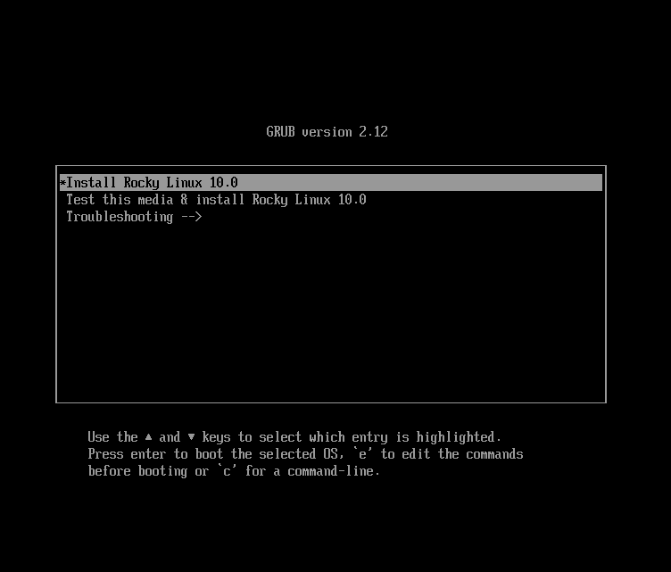
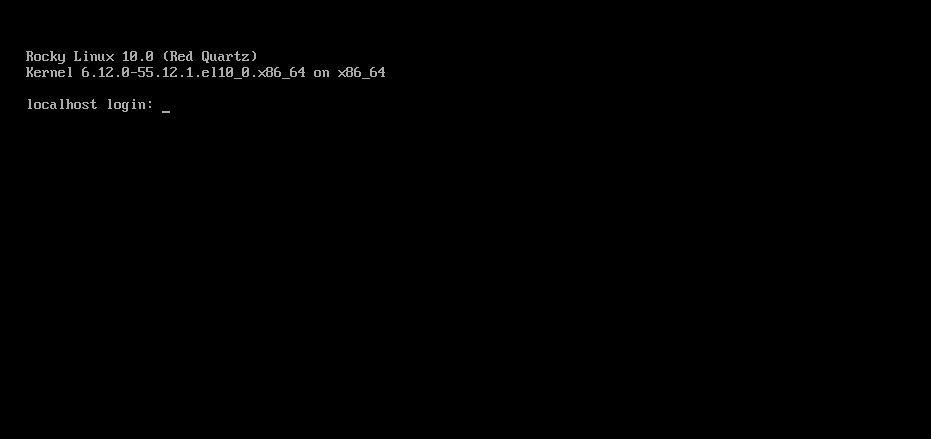
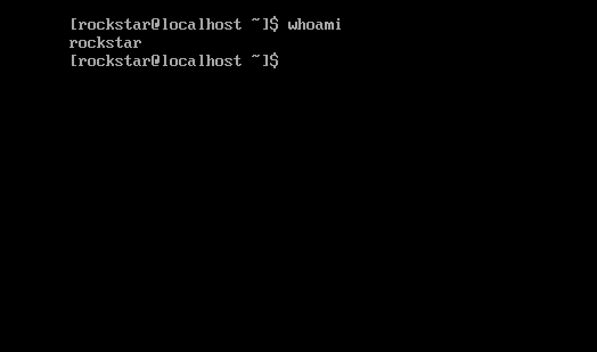

# Installation von Rocky Linux 10

Dies ist eine ausführliche Anleitung zur Installation einer 64-Bit-Version der Rocky Linux-Distribution auf einem eigenständigen System. Sie werden eine Installation vom Typ Server durchführen. Wir werden die Installations- und Konfigurations-Schritte in den folgenden Abschnitten durchlaufen.

## Voraussetzungen für die OS-Installation

Downloaden Sie das ISO für diese Installation von Rocky Linux.  
Sie können das neueste ISO-Image für die Version von Rocky Linux für diese Installation hier herunterladen:

<https://www.rockylinux.org/download/>

Um die ISO direkt von der Befehlszeile auf einem vorhandenen Linux-basierten System herunterzuladen, verwenden Sie den Befehl `wget` wie folgt:

```bash
wget https://download.rockylinux.org/pub/rocky/10/isos/x86_64/Rocky-10.1-x86_64-minimal.iso
```

Die ISOs von Rocky Linux folgen dieser Namenskonvention:

```text
Rocky-<MAJOR#>.<MINOR#>-<ARCH>-<VARIANT>.iso
```

Zum Beispiel, `Rocky-10.1-x86_64-minimal.iso`

!!! note "Anmerkung"

    Auf der Website des Rocky-Projekts sind mehrere Spiegelserver aus der ganzen Welt aufgeführt. Wählen Sie das Mirror aus, das Ihnen geografisch am nächsten ist. Die Liste der offiziellen Mirrors finden Sie [hier](https://mirrors.rockylinux.org/mirrormanager/mirrors).

## ISO-Datei des Installationsprogramms überprüfen

Wenn Sie die Rocky Linux ISO(s) auf einer vorhandenen Linux-Distribution heruntergeladen haben, können Sie das Dienstprogramm `sha256sum` verwenden, um zu überprüfen, ob die heruntergeladenen Dateien nicht beschädigt sind. Wir werden die Überprüfung der Datei `Rocky-10.1-x86_64-minimal.iso` durch Validierung ihrer Prüfsumme demonstrieren.

1. Laden Sie die Datei herunter, die die offiziellen Prüfsummen für die verfügbaren ISOs enthält.

1. Laden Sie, während Sie sich noch im Ordner mit der heruntergeladenen Rocky Linux ISO befinden, die Prüfsummen-Datei für die ISO herunter und geben Sie Folgendes ein:

    ```bash
    wget -O CHECKSUM https://download.rockylinux.org/pub/rocky/10/isos/x86_64/CHECKSUM
    ```

1. Verwenden Sie das Dienstprogramm `sha256sum`, um die Integrität der ISO-Datei auf Beschädigung oder Manipulation zu überprüfen.

    ```bash
    sha256sum -c CHECKSUM --ignore-missing
    ```

    Dadurch wird die Integrität der zuvor heruntergeladenen ISO-Datei überprüft, sofern diese sich im selben Verzeichnis befindet. Das Ergebnis sollte wie folgt lauten:

    ```text
    Rocky-10.1-x86_64-minimal.iso: OK
    ```

## Die Installation

!!! tip "Hinweis"

    Stellen Sie vor Beginn der Installation sicher, dass das Unified Extensible Firmware Interface (UEFI) oder Basic Input/Output System (BIOS) des Systems richtig konfiguriert ist, um vom richtigen Medium zu booten.
    Stellen Sie außerdem sicher, dass Sie die empfohlenen [Mindesthardwareanforderungen](minimum_hardware_requirements.md) Hinweise zum Ausführen von Rocky Linux 10 gelesen haben.

Sobald das System für den Start vom Medium mit der ISO-Datei eingerichtet ist, können wir mit der Installation beginnen.

1. Legen Sie das Installationsmedium (z. B. optisches Laufwerk, USB-Stick) ein und booten Sie davon.

2. Sobald der Computer hochgefahren ist, sehen Sie den Begrüßungsbildschirm des Installationsprogramms von Rocky Linux 10.

    

3. Auf dem Begrüßungsbildschirm können Sie mit den Pfeiltasten ++up++ oder ++down++ eine der Optionen auswählen und anschließend die ++enter++ drücken, um die ausgewählte Option auszuführen. Wenn Sie keine Taste drücken, startet das Installationsprogramm einen Countdown, nach dessen Ablauf der Installationsvorgang automatisch die standardmäßig hervorgehobene Option ausführt:

    `` `Test this media & install Rocky Linux 10.1` ``

4. Es wird eine schnelle Medienüberprüfung durchgeführt.  
   Diese Medienüberprüfung erspart Ihnen die Mühe, die Installation zu starten und dann mittendrin festzustellen, dass das Installationsprogramm aufgrund eines fehlerhaften Installationsmediums abgebrochen werden muss.

1. Nachdem die Medienprüfung abgeschlossen ist und die Verwendbarkeit des Mediums erfolgreich bestätigt wurde, fährt das Installationsprogramm automatisch mit dem nächsten Bildschirm fort.

2. Wählen Sie die Sprache aus, die Sie zum Installieren dieses Bildschirms verwenden möchten. Für diese Anleitung wählen Sie *English (United States)*. Klicken Sie dann bitte auf ++"continue"++.

## Installationsübersicht

Der Bildschirm `Installation Summary` ist ein umfassender Bereich, in dem Sie wichtige Entscheidungen zur Systeminstallation treffen.

Der Bildschirm ist grob in die folgenden Abschnitte unterteilt:

- *LOCALIZATION*
- *SOFTWARE*
- *SYSTEM*
- *BENUTZER-EINSTELLUNGEN*

Wir werden uns als Nächstes mit jedem dieser Abschnitte befassen und alle erforderlichen Änderungen vornehmen.

### Lokalisierungs-Abschnitt

In diesem Abschnitt werden Elemente angepasst, die sich auf den geografischen Standort des Systems beziehen. Dies schließt — Tastatur, Sprachunterstützung, Zeit und Datum — ein.

#### Tastatur

Im Demosystem dieses Handbuchs akzeptieren wir den Standardwert (*English US*) und nehmen keine Änderungen vor.

Wenn Sie hier jedoch Änderungen vornehmen müssen, klicken Sie im Bildschirm *Installation Summary* auf die Option ++"keyboard"++, um das Tastaturlayout des Systems festzulegen. Über den ++plus++ Button können Sie bei Bedarf weitere Tastaturlayouts hinzufügen und bestellen.

Wenn Sie mit diesem Bildschirm fertig sind, klicken Sie auf ++"done"++.

#### Sprachunterstützung

Die Option `Language Support` auf dem Bildschirm *Installation Summary* ermöglicht die Angabe der Unterstützung für zusätzliche Sprachen.

Wir akzeptieren den Standardwert – **English (United States)** und nehmen keine Änderung vor. Klicken Sie auf ++"done"++.

#### Zeit und Datum

Klicken Sie auf dem Hauptbildschirm *Installation Summary* auf die Option ++"Time & Date"++, um einen weiteren Bildschirm aufzurufen, auf dem Sie die Zeitzone auswählen können, in der sich die Maschine befindet. Wählen Sie mithilfe der Dropdown-Pfeile die Region und Stadt aus, die Ihnen am nächsten liegt.

Akzeptieren Sie die Standardeinstellung und aktivieren Sie die Option ++"Automatisches Datum und Uhrzeit"++, die es dem System ermöglicht, mithilfe des Network Time Protocol (NTP) automatisch die richtige Uhrzeit und das richtige Datum einzustellen.

Klicken Sie nach Abschluss auf ++"done"++.

### Software-Abschnitt

Im Abschnitt *Software* des Bildschirms *Installation Summary* können Sie die Installationsquelle auswählen oder ändern sowie zusätzliche Softwarepakete für die ausgewählte Umgebung hinzufügen.

#### Installationsquelle

Da wir für die Installation ein Rocky Linux 10 ISO-Image verwenden, ist bei uns standardmäßig die Option „Automatisch erkannte Quelle“ ausgewählt. Akzeptieren Sie die voreingestellte Standardinstallationsquelle.

!!! tip "Hinweis"

    Im Bereich `Installation Source` können Sie eine netzwerkbasierte Installation durchführen (z. B. wenn Sie das Rocky Linux-Boot-ISO verwenden – `Rocky-10.0-x86_64-boot.iso`). Bei einer netzwerkbasierten Installation müssen Sie zunächst sicherstellen, dass ein Netzwerkadapter auf dem Zielsystem richtig konfiguriert ist und die Installationsquelle(n) über das Netzwerk (LAN oder Internet) erreichen kann. Um eine netzwerkbasierte Installation durchzuführen, klicken Sie auf `Installation Source` und wählen Sie dann das Optionsfeld `On the network ` aus. Wählen Sie dann das richtige Protokoll aus und geben Sie die richtige URI ein. Klicken Sie auf `Done`.

#### Software-Auswahl

Wenn Sie auf dem Hauptbildschirm *Installation Summary* auf die Option ++"Software Selection"++ klicken, wird ein Softwareauswahlbereich mit zwei Abschnitten angezeigt:

- **Base Environment**: Minimal Installation
- **Zusätzliche Software für ausgewählte Umgebung**: Wenn Sie auf der linken Seite eine Basisumgebung auswählen, wird auf der rechten Seite eine Auswahl zusätzlicher Software angezeigt, die für die jeweilige Umgebung installiert werden kann.

Wählen Sie die Option *Minimal Install* (Grundfunktionalität).

Klicken Sie oben auf dem Bildschirm auf ++"done"++.

### System-Abschnitt

Verwenden Sie den Abschnitt `System` des Bildschirms *Installation Summary*, um Änderungen an der zugrunde liegenden Hardware des Zielsystems vorzunehmen. Hier erstellen Sie Ihre Festplatten-Partitionen oder -Volumen, geben das Dateisystem und die Netzwerkkonfiguration an, Sie aktivieren oder deaktivieren KDUMP.

#### Ziel der Installation

Klicken Sie im Bildschirm *Installation Summary* auf die Option ++"Installation Destination"++. Damit gelangen Sie zum entsprechenden Task-Bereich.

Auf dem Bildschirm werden alle auf dem Zielsystem verfügbaren Laufwerke angezeigt. Wenn Sie wie in unserem Beispielsystem nur über ein Festplattenlaufwerk im System verfügen, wird das Laufwerk unter *Local Standard Disks* mit einem Häkchen daneben aufgeführt. Durch Klicken auf das Datenträgersymbol wird das Häkchen für die Datenträgerauswahl ein- oder ausgeschaltet. Lassen Sie es aktiviert, um die Festplatte auszuwählen.

Unter dem Abschnitt *Storage Configuration*:

1. Wählen Sie die ++"Automatic"++ Optionsschaltfläche.

2. Klicken Sie oben auf dem Bildschirm auf ++"done"++.

3. Sobald das Installationsprogramm feststellt, dass Sie über eine verwendbare Festplatte verfügen, kehrt es zum Bildschirm *Installation Summary* zurück.

### Netzwerk & Hostname

Der nächste wichtige Task im Installationsvorgang im Bereich `System` betrifft die Netzwerkkonfiguration, wo Sie netzwerkbezogene Einstellungen für das System konfigurieren oder anpassen können.

!!! note "Anmerkung"

    Nachdem Sie auf die Option ++"Network & Host Name"++ geklickt haben, wird die gesamte korrekt erkannte Netzwerkschnittstellenhardware (wie Ethernet, drahtlose Netzwerkkarten usw.) im linken Bereich des Netzwerkkonfigurationsbildschirms aufgelistet. Abhängig von Ihrer spezifischen Hardwarekonfiguration haben Ethernet-Geräte in Linux Namen ähnlich wie `eth0`, `eth1`, `ens3`, `ens4`, `em1`, `em2`, `p1p1`, `enp0s3`, usw. 
    Sie können jede Schnittstelle per DHCP konfigurieren oder die IP-Adresse manuell festlegen. 
    Wenn Sie sich für die manuelle Konfiguration entscheiden, stellen Sie sicher, dass Sie alle erforderlichen Informationen bereit haben, z. B. die IP-Adresse, die Netzmaske und andere relevante Details.

Wenn Sie im Hauptbildschirm *Installation Summary* auf die Schaltfläche ++"Network & Host Name"++ klicken, wird der entsprechende Konfigurationsbildschirm geöffnet. Hier können Sie auch den Hostnamen des Systems konfigurieren.

!!! note "Anmerkung"

    Sie können den Systemhostnamen später nach der Installation des Betriebssystems problemlos ändern.

Die folgende Konfigurationsaufgabe betrifft die Netzwerkschnittstellen des Systems.

1. Überprüfen Sie, ob im linken Bereich ein Netzwerkadapter oder eine Netzwerkkarte aufgeführt ist
2. Klicken Sie im linken Bereich auf eines der erkannten Netzwerkgeräte, um es auszuwählen.  
   Die konfigurierbaren Eigenschaften des ausgewählten Netzwerkadapters werden im rechten Bildschirmbereich angezeigt.

!!! note "Anmerkung"

    Auf unserem Beispielsystem haben wir zwei Ethernet-Geräte (`ens3` und `ens4`), die sich beide im verbundenen Zustand befinden. Typ, Name, Anzahl und Zustand der Netzwerkgeräte Ihres Systems können von denen des Demosystems abweichen.

Stellen Sie sicher, dass sich der Schalter des Geräts, das Sie konfigurieren möchten, im rechten Bereich in der Position `ON` (blau) befindet. Wir akzeptieren alle Standardeinstellungen in diesem Abschnitt.

Klicken Sie auf ++"done"++, um zum Hauptbildschirm *Installation Summary* zurückzukehren.

!!! warning "Warnhinweis"

    Achten Sie in diesem Abschnitt des Installationsprogramms auf die IP-Adresse des Servers. Wenn Sie keinen physischen oder einfachen Konsole-Zugriff auf das System haben, sind diese Informationen später nützlich, wenn Sie nach Abschluss der Betriebssysteminstallation eine Verbindung zum Server herstellen müssen.

### Benutzer-Einstellungen

Verwenden Sie diesen Abschnitt, um ein Kennwort für das Benutzerkonto `root` zu erstellen und neue Administrator- oder Nicht-Administratorkonten zu erstellen.

#### Root-Passwort

1. Klicken Sie unter *User Settings* auf das Feld *Root Password*, um den Aufgabenbildschirm *Root Account* zu starten.

    !!! warning "Warnhinweis"
   
        Der Root-Superuser ist das Konto mit den meisten Privilegien im System. Wenn Sie es verwenden oder aktivieren möchten, müssen Sie dieses Konto mit einem sicheren Kennwort schützen.

2. Sie sehen zwei Optionen: "Disable root account" oder "Enable root account". Bestätigen Sie die Vorgabe.

3. Klicken Sie auf ++"done"++.

#### Benutzer-Erstellung

Benutzer anlegen:

1. Klicken Sie unter *User Settings* auf das Feld *User Creation*, um den Task-Bildschirm *Create User* zu starten. In diesem Task-Bereich können Sie ein privilegiertes (administratives) oder nicht-privilegiertes (nicht-administratives) Benutzerkonto anlegen.

    !!! Vorsicht
   
        Auf einem Rocky Linux 10-System ist das Root-Konto standardmäßig deaktiviert. Daher ist es wichtig sicherzustellen, dass ein während der Betriebssysteminstallation erstellte Benutzerkonto über Administratorrechte verfügt. Dieser Benutzer kann für alltägliche Aufgaben auf dem System ohne Berechtigungen verwendet werden und hat außerdem die Möglichkeit, seine Rolle zu erweitern, um bei Bedarf administrative (`Root`-)Funktionen auszuführen.

    Wir erstellen einen regulären Benutzer, der bei Bedarf Superuser-Berechtigungen (Administratorrechte) anfordern kann.

2. Füllen Sie die Felder im Bildschirm *Create User* mit den folgenden Informationen aus:

    - **Full name**: `rockstar`
    - **Username**: `rockstar`
        - **Add administrative privileges to this user account (wheel group membership)**: Checked
        - **Require a password to use this account**: Checked
        - **Password**: `04302021`
        - **Confirm password**: `04302021`

3. Klicken Sie auf ++"done"++.

## Installer-Phase

Wenn Sie mit Ihren Auswahlen für die verschiedenen Installationsaufgaben zufrieden sind, beginnt die nächste Phase des Installationsprozesses mit der eigentlichen Installation.

### Starten Sie die Installation

Wenn Sie mit Ihren Auswahlen für die verschiedenen Installationsaufgaben zufrieden sind, klicken Sie auf dem Hauptbildschirm *Installation Summary* auf die Schaltfläche ++"Begin Installation"++.

Die Installation beginnt und das Installationsprogramm zeigt den Installationsfortschritt an. Nach dem Start der Installation werden im Hintergrund verschiedene Aufgaben ausgeführt, z. B. das Partitionieren der Festplatte, das Formatieren der Partitionen oder LVM-Volumes, das Überprüfen und Auflösen von Softwareabhängigkeiten, das Schreiben des Betriebssystems auf die Festplatte und ähnliche Aufgaben. <small> <br/><br/> 🌐 Translations: <a href="https://crowdin.com/project/rockydocs/de">crowdin.com/project/rockydocs</a> <br/> 🌍 Translators: <a href="https://crowdin.com/project/rockydocs/activity-stream">rockydocs/activity-stream</a> , <a href="https://crowdin.com/project/rockylinuxorg/activity-stream">rockylinux.org</a> <br/> 🖋 Contributors: <a href="https://github.com/rocky-linux/documentation?tab=readme-ov-file#mattermost">github.com/rocky-linux/documentation</a> </small>

!!! note "Anmerkung"

    Wenn Sie nach dem Klicken auf die Schaltfläche ++"Begin Installation"++ nicht fortfahren möchten, können Sie die Installation trotzdem sicher beenden, ohne dass Daten verloren gehen. Um das Installationsprogramm zu beenden, setzen Sie Ihr System einfach zurück, indem Sie auf die Schaltfläche ++"Quit"++ klicken, Strg-Alt-Entf auf der Tastatur drücken oder den Reset- oder Netzschalter betätigen.

### Fertigstellung der Installation

Nachdem das Installationsprogramm seine Arbeit abgeschlossen hat, wird ein abschließender Fortschrittsbildschirm mit einer `Complete`-Meldung angezeigt.

Schließen Sie den gesamten Vorgang abschließend mit einem Klick auf die Schaltfläche ++"Reboot System"++ ab. Das System startet neu.

### Anmelden

Das System ist nun eingerichtet und einsatzbereit. Sie sehen die Rocky Linux-Konsole.



So melden Sie sich beim System an:

1. Geben Sie in der Anmeldeaufforderung `rockstar` ein und drücken Sie ++enter++.

2. Geben Sie bei der Passwort-Eingabeaufforderung `04302021` (Rockstars Passwort) ein und drücken Sie ++enter++ (das Passwort wird ***nicht*** auf dem Bildschirm angezeigt, das ist normal).

3. Führen Sie nach der Anmeldung den Befehl `whoami` aus.  
   Dieser Befehl zeigt den Namen des aktuell angemeldeten Benutzers an.


