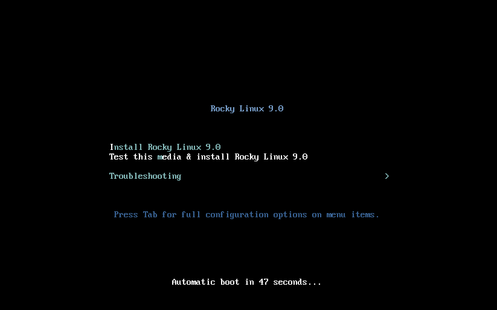
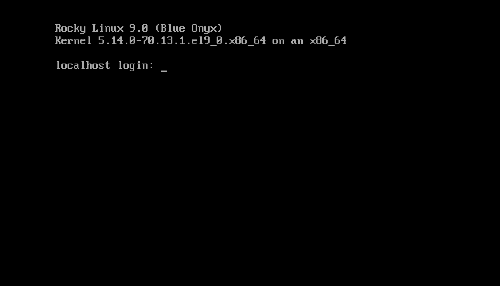

# Installazione Di Rocky Linux 9

Questa guida mostra nel dettaglio i passaggi per installare una versione a 64 bit della distribuzione Rocky Linux su un sistema stand-alone.  Eseguiremo un'installazione di classe server. Passeremo attraverso i passaggi di installazione e personalizzazione nelle sezioni seguenti.


## Prerequisiti per Installazione SO

Innanzitutto, è necessario scaricare la ISO da utilizzare per questa installazione di Rocky Linux.

L'ultima immagine ISO per la versione di Rocky Linux che utilizzeremo per questa installazione può essere scaricata da qui:

```
https://www.rockylinux.org/download/
```

Per scaricare la ISO direttamente dalla riga di comando su un sistema Linux esistente, utilizzare il comando `wget`:

```
wget https://download.rockylinux.org/pub/rocky/9.0/isos/x86_64/Rocky-9.0-x86_64-minimal.iso
```

Le ISO di Rocky Linux sono denominate seguendo questa convenzione:

```
Rocky-<MAJOR#>.<MINOR#>-<ARCH>-<VARIANT>.iso
```

Ad esempio, `Rocky-9.0-x86_64-minimal.iso`

!!! Note "Nota"

    La pagina web del progetto Rocky ha un elenco di diversi mirrors situati in tutto il mondo. Quando possibile, dovresti scegliere il mirror geograficamente più vicino a te. La lista dei mirror ufficiali può essere trovata [quì](https://mirrors.rockylinux.org/mirrormanager/mirrors).

## Verifica del file ISO dell'installazione

Se hai scaricato le ISO di Rocky Linux su una distribuzione Linux esistente, è possibile utilizzare l'utilità `sha256sum` per verificare che i file scaricati non siano corrotti. Mostreremo un esempio di come verificare il file `Rocky-9.0-x86_64-minimal.iso` controllandone il checksum.

In primo luogo scaricare il file che contiene i checksum ufficiali per le ISO disponibili. Mentre siete ancora nella cartella che contiene la ISO scaricata di Rocky Linux scaricate il file di checksum per la ISO, digitando:

```
wget https://download.rockylinux.org/pub/rocky/9.0/isos/x86_64/CHECKSUM
```

Utilizzare l'utilità `sha256sum` per verificare l'integrità del file ISO contro la corruzione e/o la manomissione.

```
sha256sum -c CHECKSUM --ignore-missing
```

Questo controllerà l'integrità del file ISO scaricato in precedenza, a condizione che sia nella stessa directory. L'output dovrebbe mostrare:

```
Rocky-9.0-x86_64-minimal.iso: OK
```

## L'Installazione

!!! Tip "Suggerimento"

    Prima di avviare correttamente l'installazione, l’Interfaccia Unified Extensible Firmware Interface (UEFI) del sistema o il sistema Basic Input/Output (BIOS) devono essere preconfigurati per avviare dal supporto corretto.

Se il computer è configurato per avviarsi dal supporto che ha il file ISO possiamo iniziare il processo di installazione.

Inserire e avviare dal supporto di installazione (disco ottico, unità flash USB, e così via).

Una volta che il computer si è avviato, vi verrà presentata la schermata di benvenuto di Rocky Linux 9.



Se non si preme alcun tasto il programma di installazione inizierà un conto alla rovescia, dopo il quale il processo di installazione eseguirà automaticamente l'opzione predefinita, evidenziata:

`Testare questo supporto & installare Rocky Linux 9`

Puoi anche premere <kbd>Invio</kbd> in qualsiasi momento per avviare il processo immediatamente.

Si procederà ad una rapida verifica dei media. Questo passo di verifica del supporto può salvare dal problema di avviare l'installazione solo per scoprire a metà strada che l'installatore deve interrompere a causa di supporti di installazione difettosi.

Dopo che il controllo del supporto viene completato e il supporto viene verificato come corretto per essere utilizzato, il programma di installazione continuerà automaticamente alla schermata successiva.

Seleziona la lingua che vuoi usare per eseguire l'installazione in questa schermata. Per questa guida, selezioniamo *English (United States)*. Quindi clicca sul pulsante <kbd>Continua</kbd>.

## Riepilogo Installazione

La schermata _Riepilogo Installazione_ è un'area all-in-one dove si prendono le decisioni importanti sul sistema da installare.

Lo schermo è approssimativamente diviso nelle seguenti sezioni:

- _LOCALIZZAZIONE_: (Tastiera, Supporto Linguistico, e Ora & Data)
- _SOFTWARE_: (Installazione Sorgente e Selezione Software)
- _SISTEMA_: (Destinazione Installazione, KDUMP, Rete & Hostname e Profilo di Sicurezza)
- _IMPOSTAZIONI UTENTE_: (Password di Root e creazione utente)

Ci soffermeremo su ciascuna di queste sezioni e apporteremo modifiche ove necessario.

### Sezione Localizzazione

Questa sezione è utilizzata per personalizzare gli elementi relativi alla località geografica del sistema. Questo include – tastiera, supporto linguistico, tempo e data.

#### Tastiera

Sul nostro sistema demo in questa guida, accettiamo il valore predefinito (*English US*) e non apportiamo modifiche.

Tuttavia, se è necessario apportare modifiche qui, dalla schermata *Riepilogo Installazione*, clicca sull'opzione <kbd>Tastiera</kbd> per specificare il layout della tastiera del sistema. Con il pulsante <kbd>+</kbd> è possibile aggiungere altri layout di tastiera, se necessario, nella schermata successiva, specificando anche l'ordine preferito.

Clicca <kbd>Fatto</kbd> quando hai finito con questa schermata.

#### Supporto Lingue

L'opzione <kbd>Language Support</kbd> nella schermata *Installation Summary* consente di specificare il supporto per altre lingue che potrebbero essere necessarie.

Accetteremo il valore predefinito - __English (United States)__ e non apporteremo alcuna modifica, fare clic su <kbd>Fatto</kbd>.

#### Data & Ora

Fai clic sull'opzione <kbd>Ora e data</kbd> nella schermata principale *Riepilogo Installazione* per far apparire un'altra schermata che ti permetterà di selezionare il fuso orario in cui si trova la macchina. Scorri l'elenco delle regioni e delle città e seleziona l'area più vicina a te.

A seconda della fonte di installazione, l'opzione *Ora da rete* potrebbe essere impostata su *ON* o *OFF* per impostazione predefinita. Accetta l'impostazione predefinita *ON*; questo permette al sistema di impostare automaticamente il tempo corretto utilizzando il Network Time Protocol (NTP).

Fare clic su <kbd>Fatto</kbd> dopo aver apportato eventuali modifiche.

### Sezione Software

Nella sezione *Software* della schermata *Riepilogo Installazione*, è possibile selezionare la sorgente di installazione e i pacchetti aggiuntivi (applicazioni) che verranno installati.

#### Sorgente Installazione

Poiché stiamo eseguendo l'installazione utilizzando un'immagine ISO di Rocky Linux 9, noterete che _Media locale_ è specificato automaticamente nella sezione Origine dell'installazione della schermata principale _Riepilogo dell'installazione_. Accetteremo i valori preimpostati.

!!! Tip "Suggerimento"

    Nell'area Sorgente dell'Installazione è possibile scegliere di eseguire un'installazione basata sulla rete (ad esempio se si utilizza la ISO di avvio di Rocky Linux - Rocky-9.0-x86_64-boot.iso). Per un'installazione basata sulla rete, è necessario innanzitutto assicurarsi che una scheda di rete sul sistema di destinazione sia configurata correttamente e sia in grado di raggiungere Internet.  Per eseguire un'installazione in rete, fare clic su "Origine dell'Installazione" e selezionare con il pulsante di l'opzione "In rete". Una volta selezionato, scegliete `https' come protocollo e digitate il seguente URL nel campo di testo `download.rockylinux.org/pub/rocky/9/BaseOS/x86_64/os`.   Clicca su `Fatto`.

#### Selezione Software

Facendo clic sull'opzione <kbd>Selezione software</kbd> nella schermata principale *Riepilogo installazione* si presenta con la sezione dell'installazione dove è possibile scegliere i pacchetti software esatti che vengono installati sul sistema. L'area di selezione del software è suddivisa in:

- __Ambiente di base__ : Installazione minima e sistema operativo personalizzato
- __Software aggiuntivo per l'Ambiente Selezionato__: la selezione di un ambiente di base sul lato sinistro presenta una serie di software aggiuntivi che possono essere installati per l'ambiente in questione sul lato destro. Si noti che questo è applicabile solo se si sta installando da un DVD completo di Rocky Linux 9 o se sono stati configurati repository aggiuntivi.

Selezionare l'opzione _Minimal Install_ (Funzionalità di base).

Clicca su <kbd>Fatto</kbd> nella parte superiore dello schermo.

### Sezione Sistema

La sezione Sistema della schermata _Riepilogo dell'installazione_ è usata per personalizzare e apportare modifiche all'hardware sottostante del sistema di destinazione. Qui si creano le partizioni o i volumi del disco rigido, si specifica il file system da utilizzare, si specifica la configurazione di rete, si attiva/disattiva KDUMP o si seleziona un profilo di sicurezza.

#### Destinazione Installazione

Dalla schermata *Riepilogo Installazione*, clicca sull'opzione <kbd>Destinazione Installazione</kbd>. Questo ti porta alla corrispondente area di attività.

Verrà visualizzata una schermata che mostra tutte le unità disco candidate disponibili sul sistema di destinazione. Se avete un solo disco sul sistema, come sul nostro sistema di esempio, vedrai l'unità elencata sotto *Dischi locali standard* con un segno di spunta accanto ad essa. Facendo clic sull'icona del disco si attiverà o disattiverà il segno di spunta per la selezione del disco. Vogliamo che sia selezionato/spuntato qui.

Sotto la sezione Opzioni *Configurazione di archiviazione*, selezionare il pulsante radio <kbd>Automatic</kbd>.

Quindi clicca su <kbd>Fatto</kbd> nella parte superiore dello schermo.

Una volta che il programma di installazione determina che si dispone di un disco utilizzabile, verrete reindirizzati alla schermata *Riepilogo Installazione*.

### Rete & Nome Host

L'attività finale della procedura d'installazione riguarda la configurazione della rete, dove è possibile configurare o modificare le impostazioni relative alla rete per il sistema.

!!! Note "Nota"

    Dopo aver fatto clic sull'opzione <kbd>Network & Nome Host</kbd>, tutto l'hardware dell'interfaccia di rete correttamente rilevato (come Ethernet, le schede di rete wireless, e così via) saranno elencate nel riquadro sinistro della schermata di configurazione di rete. A seconda della configurazione hardware specifica, i dispositivi Ethernet in Linux hanno nomi simili a `eth0`, `eth1`, `ens3`, `ens4`, `em1`, `em2`, `p1p1`, `enp0s3` e così via.

Per ogni interfaccia, è possibile configurarla utilizzando il DHCP o impostando manualmente l'indirizzo IP. Se si sceglie di configurare manualmente, assicurarsi di avere tutte le informazioni pertinenti pronte, come l'indirizzo IP, maschera di rete, e così via.

Facendo clic sul pulsante <kbd>Network & Nome Host</kbd> nella schermata principale *Riepilogo Installazione* si apre la corrispondente schermata di configurazione. Tra le altre cose, è possibile configurare il nome host del sistema (il nome predefinito è `localhost.localdomain`).

!!! Note "Nota"

    È possibile modificare facilmente questo nome in seguito dopo che il sistema operativo è stato installato.

Il prossimo importante compito di configurazione è relativo alle interfacce di rete del sistema. In primo luogo, verificare che una scheda Ethernet (o qualsiasi scheda di rete) sia elencata nel riquadro a sinistra. Fare clic su uno dei dispositivi di rete rilevati nel riquadro a sinistra per selezionarlo. Le proprietà configurabili della scheda di rete selezionata appariranno nel riquadro destro dello schermo.

!!! Note "Nota"

    Sul nostro sistema di esempio abbiamo due dispositivi Ethernet (`ens3` e `ens4`), tutti in uno stato connesso. Il tipo, il nome, la quantità e lo stato dei dispositivi di rete sul vostro sistema possono variare da quelli sul nostro sistema demo.

Assicurarsi che l'interruttore del dispositivo da configurare sia in posizione `ON` (blu) nel riquadro di destra. Accetteremo tutti i valori predefiniti in questa sezione.

Clicca <kbd>Fatto</kbd> per tornare alla schermata principale *Riepilogo Installazione*.

!!! Warning "Attenzione"

    Prestare attenzione all'indirizzo IP del server in questa sezione del programma d'installazione. Se non si dispone di un accesso fisico o facile alla console del sistema, queste informazioni saranno utili in seguito, quando sarà necessario collegarsi al server per continuare a lavorarci dopo il completamento dell'installazione del sistema operativo.

### Sezione Impostazioni Utente

Questa sezione può essere utilizzata per creare una password per l'account utente `root` e anche per creare nuovi account amministrativi o non amministrativi.

#### Password di Root

Fare clic sul campo *Root Password* sotto *Impostazioni utente* per avviare la schermata *Password Root*.

!!! Warning "Attenzione"

    Il superutente root è l'account con più privilegi nel sistema. Pertanto, se si sceglie di usarlo o abilitarlo, è fondamentale proteggere questo account con una password forte.

 Nella casella di testo *Password di root*, imposta una password forte per l'utente root.

Inserire nuovamente la stessa password nella casella di testo *Conferma*.

Clicca su <kbd>Fatto</kbd>.


#### Creazione Utente

Poi clicca sul campo *Creazione utente* sotto *Impostazioni Utente* per avviare la schermata *Crea utente*. Questa area di attività consente di creare un account utente privilegiato o non privilegiato (non amministrativo) sul sistema.

!!! Info

    Creare e utilizzare un account non privilegiato per i compiti quotidiani di un sistema è una buona pratica di amministrazione del sistema.

Creeremo un utente normale che può invocare i poteri di superutente (amministratore) quando necessario.

Completare i campi nella schermata *Crea utente* con le seguenti informazioni e quindi fare clic su <kbd>Fatto</kbd>:

*Nome completo*: `rockstar`

*Nome utente*: `rockstar`

*Imposta questo utente come amministratore*: Spuntato

*Richiedi una password per utilizzare questo account*: Spuntato

*Password*: `04302021`

*Conferma password*: `04302021`


Clicca su <kbd>Fatto</kbd>.

## Fase di Installazione

Una volta che siete soddisfatti delle vostre scelte per le varie attività dell'installazione, la fase successiva del processo d'installazione inizierà l'installazione vera e propria.


### Avviare l'installazione

Una volta soddisfatti delle scelte effettuate per le varie attività di installazione, fare clic sul pulsante <kbd>Inizia l'installazione</kbd> nella schermata principale *Riepilogo dell'installazione*.

L'installazione inizierà, e l'installatore mostrerà i progressi dell'installazione. Quando inizia l'installazione, varie attività inizieranno ad essere eseguite in background, come il partizionamento del disco, la formattazione delle partizioni o i volumi di LVM, controllare e risolvere le dipendenze del software, scrivere il sistema operativo sul disco e così via.

!!! Note "Nota"

    Se non si desidera continuare dopo aver fatto clic sul pulsante Avvia Installazione, si può ancora tranquillamente tornare fuori dall'installazione senza alcuna perdita di dati. Per uscire dall'installatore, è sufficiente ripristinare il sistema facendo clic sul pulsante Esci, premendo ctrl-alt-del sulla tastiera, o spingendo l'interruttore di reset o di alimentazione.

### Completare l'installazione

Dopo che il programma di installazione ha fatto il suo corso, vi verrà presentata una schermata finale di avanzamento dell'installazione con un messaggio completo.

Infine, completare la procedura facendo clic sul pulsante <kbd>Reboot System</kbd>. Il sistema verrà riavviato.

### Accesso

Il sistema è ora configurato e pronto per l'uso. Vedrete la console Rocky Linux.



Per accedere al sistema, digita `rockstar` al prompt di accesso e premi <kbd>Invio</kbd>.

Al prompt della Password, digita `04302021` (la password di rockstar) e premi <kbd>Invio</kbd> (la password ***non*** sarà visualizzata sullo schermo, questo è normale).

Eseguiremo il comando `whoami` dopo l'accesso, questo comando mostra il nome dell'utente attualmente connesso.


