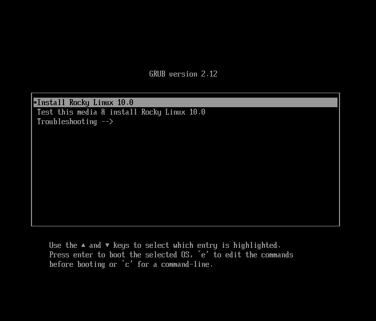
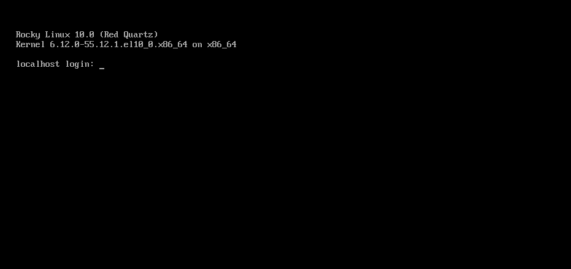

# Installazione di Rocky Linux 10

Questa è una guida dettagliata per l'installazione di una versione a 64 bit della distribuzione Rocky Linux su un sistema standalone. Verrà eseguita un'installazione di classe server. Nelle sezioni seguenti verranno illustrate le fasi di installazione e personalizzazione.

## Prerequisiti per l'installazione del Sistema Operativo

Scaricare la ISO da utilizzare per questa installazione di Rocky Linux.  
È possibile scaricare l'ultima immagine ISO della versione di Rocky Linux per questa installazione qui:

<https://www.rockylinux.org/download/>

Per scaricare l'ISO direttamente dalla riga di comando su un sistema Linux esistente, utilizzare il comando `wget`:

```bash
wget https://download.rockylinux.org/pub/rocky/10/isos/x86_64/Rocky-10.0-x86_64-minimal.iso
```

Le ISO di Rocky Linux seguono questa convenzione di denominazione:

```text
Rocky-<MAJOR#>.<MINOR#>-<ARCH>-<VARIANT>.iso
```

For example, `Rocky-10.0-x86_64-minimal.iso`

!!! Note

    Il sito web del Progetto Rocky elenca diversi mirror situati in tutto il mondo. Scegliete il mirror geograficamente più vicino a voi. La lista dei mirror ufficiali può essere trovata [quì](https://mirrors.rockylinux.org/mirrormanager/mirrors).

## Verifica del file ISO del Programma di Installazione

Se avete scaricato le ISO di Rocky Linux su una distribuzione Linux esistente, potete usare l'utility `sha256sum` per verificare che i file scaricati non siano corrotti. Mostreremo un esempio di come verificare il file `Rocky-10.0-x86_64-minimal.iso` controllando il suo checksum.

1. Scaricate il file che contiene le checksum ufficiali delle ISO disponibili.

1. Mentre vi trovate ancora nella cartella che contiene l'ISO di Rocky Linux scaricata, scaricare il file di checksum dell'ISO, digitando:

    ```bash
    wget -O CHECKSUM https://download.rockylinux.org/pub/rocky/10/isos/x86_64/CHECKSUM
    ```

1. Utilizzare l'utilità `sha256sum` per verificare l'integrità del file ISO contro la corruzione o la manomissione.

    ```bash
    sha256sum -c CHECKSUM --ignore-missing
    ```

    Controlla l'integrità del file ISO scaricato in precedenza, a condizione che si trovi nella stessa directory. L'output dovrebbe mostrare:

    ```text
    Rocky-10.0-x86_64-minimal.iso: OK
    ```

## L'installazione

!!! Tip

    Prima di iniziare l'installazione, accertarsi che l'interfaccia UEFI (Unified Extensible Firmware Interface) o il BIOS (Basic Input/Output System) del sistema siano configurati correttamente per l'avvio dal supporto corretto.
    Inoltre, assicuratevi di leggere le note sui [requisiti hardware minimi] (minimum_hardware_requirements.md) raccomandati per l'esecuzione di Rocky Linux 10.

Una volta impostato il sistema per l'avvio dal supporto con il file ISO, si può iniziare l'installazione.

1. Inserire e avviare il supporto di installazione (ad esempio, disco ottico, unità flash USB).

2. Una volta avviato il computer, viene visualizzata la schermata di benvenuto di Rocky Linux 10.

    

3. Nella schermata di benvenuto, è possibile utilizzare i tasti freccia ++“su ”++ o ++“giù ”++ per selezionare una delle opzioni, quindi premere ++enter++ per eseguire l'opzione selezionata. Se non si preme alcun tasto, il programma di installazione avvia un conto alla rovescia, al termine del quale il processo di installazione esegue automaticamente l'opzione predefinita, evidenziata:

    `Test this media & install Rocky Linux 10.0`

4. Viene eseguita una rapida fase di verifica dei supporti.  
     
   Questa fase di verifica del supporto può evitare di avviare l'installazione per poi scoprire a metà strada che il programma di installazione deve essere interrotto a causa di un supporto di installazione difettoso.

1. Una volta completato il controllo del supporto e verificata la sua utilizzabilità, il programma di installazione passa automaticamente alla schermata successiva.

2. Selezionare la lingua che si desidera utilizzare per l'installazione di questa schermata. Per questa guida, selezioniamo l'*inglese (Stati Uniti)*. Quindi fare clic sul pulsante ++"continue "++.

## Riepilogo dell'installazione

La schermata `Riepilogo installazione` è un'area completa in cui si prendono le decisioni chiave sull'installazione del sistema.

La schermata è suddivisa grossomodo nelle seguenti sezioni:

- *LOCALIZATION*
- *SOFTWARE*
- *SYSTEM*
- *USER SETTINGS*

In seguito approfondiremo ciascuna di queste sezioni e apporteremo le modifiche necessarie.

### Sezione Localizzazione

Questa sezione consente di personalizzare le voci relative alla posizione geografica del sistema. Tra questi: tastiera, supporto della lingua, ora e data.

#### Tastiera

Nel sistema demo di questa guida, accettiamo il valore predefinito*(English US*) e non apportiamo alcuna modifica.

Tuttavia, se è necessario apportare modifiche, dalla schermata *Riepilogo dell'installazione*, fare clic sull'opzione ++“tastiera”++ per specificare il layout della tastiera del sistema. Con il pulsante ++plus++ è possibile aggiungere e ordinare altri layout di tastiera, se necessario.

Al termine di questa schermata, fare clic su ++"done"++.

#### Supporto linguistico

L'opzione `Language Support` nella schermata *Installation Summary* consente di specificare il supporto per altre lingue.

Accetteremo il valore predefinito - **English (United States)** e non apporteremo alcuna modifica, facendo clic su ++“done”++.

#### Data & Ora;

Fare clic sull'opzione ++“Ora & data”++ nella schermata principale *Installation Summary* per visualizzare un'altra schermata che consentirà di selezionare il fuso orario in cui si trova la macchina. Utilizzate le frecce a discesa per selezionare la regione e la città più vicina a voi.

Accettare l'impostazione predefinita e attivare l'opzione ++“Data & ora automatiche”++, che consente al sistema di impostare automaticamente la data e l'ora corrette utilizzando il Network Time Protocol (NTP).

Al termine, fare clic su ++“done”++.

### Sezione software

Nella sezione *Software* della schermata *Riepilogo installazione*, è possibile selezionare o modificare l'origine dell'installazione e aggiungere ulteriori pacchetti software per l'ambiente selezionato.

#### Fonte dell'installazione

Poiché stiamo usando un'immagine ISO di Rocky Linux 10 per l'installazione, l'opzione Auto-detected source è selezionata per impostazione predefinita. Accettare la sorgente di installazione predefinita.

!!! Tip

    L'area Sorgente di installazione consente di eseguire un'installazione basata sulla rete (ad esempio, se si utilizza la ISO di avvio di Rocky Linux - Rocky-10.0-x86_64-boot.iso). Per un'installazione basata sulla rete, è necessario innanzitutto assicurarsi che una scheda di rete sul sistema di destinazione sia configurata correttamente e sia in grado di raggiungere Internet. Per eseguire un'installazione dalla rete, fare clic su `Installation Source` e selezionare il pulsante di opzione `On the network`. Una volta selezionato, scegliete `https' come protocollo e digitate il seguente URL nel campo di testo `download.rockylinux.org/pub/rocky/9/BaseOS/x86_64/os`. Fare clic su `Done`.

#### Selezione del software

Facendo clic sull'opzione ++“Software Selection”++ nella schermata principale *Installation Summary*, viene visualizzata un'area di selezione del software composta da due sezioni:

- **Base Environment**: Installazione minima
- **Additional software for Selected Environment**: Selezionando Base Environment sul lato sinistro presenta una selezione di software aggiuntivi da installare per l'ambiente in questione sul lato destro.

Selezionare l'opzione *Minimal Install* (funzionalità di base).

Fare clic su ++"done"++ nella parte superiore dello schermo.

### Sezione Sistema

Utilizzare la sezione Sistema della schermata *Riepilogo installazione* per personalizzare e apportare modifiche all'hardware del sistema di destinazione. Qui si creano le partizioni o i volumi del disco rigido, si specifica il file system, si specifica la configurazione di rete e si attiva o disattiva KDUMP.

#### Destinazione dell'installazione

Nella schermata *Installation Summary*, fare clic sull'opzione ++“Installation Destination"++ . Si accede così all'area operativa corrispondente.

Verrà visualizzata una schermata con tutte le unità disco candidate disponibili sul sistema di destinazione. Se nel sistema è presente una sola unità disco, come nel nostro sistema campione, l'unità viene elencata sotto *Dischi standard locali* con un segno di spunta accanto. Facendo clic sull'icona del disco si attiva o disattiva il segno di spunta della selezione del disco. Mantenere il segno di spunta per selezionare il disco.

Nella sezione *Storage Configuration*:

1. Selezionare il pulsante di opzione ++"Automatic"++.

2. Fare clic su ++"done"++ nella parte superiore dello schermo.

3. Una volta accertato che il disco è utilizzabile, il programma di installazione torna alla schermata di *Installation Summary*.

### Network & Nome host

Il seguente compito importante nella procedura di installazione nell'area Sistema riguarda la configurazione di rete, dove è possibile configurare o regolare le impostazioni relative alla rete per il sistema.

!!! Note

    Dopo aver fatto clic sull'opzione ++“Network & Host Name"++ , nel riquadro sinistro della schermata di configurazione della rete viene elencato tutto l'hardware dell'interfaccia di rete correttamente rilevato (ad esempio schede di rete Ethernet, wireless e così via). A seconda della configurazione hardware specifica, i dispositivi Ethernet in Linux hanno nomi simili a `eth0`, `eth1`, `ens3`, `ens4`, `em1`, `em2`, `p1p1`, `enp0s3` e così via. 
    È possibile configurare ogni interfaccia tramite DHCP o impostare manualmente l'indirizzo IP. 
    Se si sceglie di configurare manualmente, assicurarsi di avere pronte tutte le informazioni necessarie, come l'indirizzo IP, la netmask e altri dettagli rilevanti.

Facendo clic sul pulsante ++“Network & Host Name”++ nella schermata principale *Installation Summary* si apre la schermata di configurazione corrispondente. Qui è possibile configurare anche l'hostname del sistema.

!!! Note

    È possibile modificare facilmente l'hostname del sistema in un secondo momento, dopo l'installazione del sistema operativo.

La seguente attività di configurazione riguarda le interfacce di rete del sistema.

1. Verificare che nel riquadro di sinistra sia elencato un adattatore/scheda di rete
2. Fare clic su uno qualsiasi dei dispositivi di rete rilevati nel riquadro di sinistra per selezionarlo.  
   Le proprietà configurabili dell'adattatore di rete selezionato appaiono nel riquadro destro della schermata.

!!! Note

    Nel nostro sistema campione, abbiamo due dispositivi Ethernet (`ens3` e `ens4`), entrambi in stato di connessione. Il tipo, il nome, la quantità e lo stato dei dispositivi di rete presenti sul vostro sistema possono differire da quelli presenti sul nostro sistema demo.

Verify that the switch of the device you want to configure is in the `ON` (blue) position in the right pane. Accetteremo tutte le impostazioni predefinite in questa sezione.

Fare clic su ++“done”++ per tornare alla schermata principale *Installation Summary*.

!!! Warning "Attenzione"

    Prestare attenzione all'indirizzo IP del server in questa sezione del programma di installazione. Se non si dispone di un accesso fisico o facile alla console del sistema, queste informazioni saranno utili in seguito, quando sarà necessario connettersi al server al termine dell'installazione del sistema operativo.

### Sezione Impostazioni utente

Questa sezione può essere utilizzata per creare una password per l'account utente `root` e anche per creare nuovi account amministrativi o non amministrativi.

#### Password Root

1. Fare clic sul campo *Root Password* in *Impostazioni utente* per avviare la schermata dell'attività *Account di root*.

    !!! Warning "Attenzione"
   
        Il superutente root è l'account più privilegiato del sistema. Se si sceglie di utilizzarlo o di abilitarlo, è necessario proteggere questo account con una password forte.

2. Verranno visualizzate due opzioni: “Disable root account" oppure "Enable root account". Accettare l'opzioni di default

3. Fare clic su ++"done"++.

#### Creazione dell'utente

Per creare un utente:

1. Fare clic sul campo *User Creation* sotto *User Settings* per avviare la schermata dell'attività *Create User*. Utilizzare quest'area operativa per creare un account utente privilegiato (amministrativo) o non privilegiato (non amministrativo).

    !!! Caution
   
        Su un sistema Rocky Linux 10, l'account Root è disabilitato per impostazione predefinita; pertanto, è essenziale assicurarsi che l'account utente creato durante l'installazione del sistema operativo abbia privilegi amministrativi. Questo utente può essere utilizzato in modo non privilegiato per le attività quotidiane del sistema e avrà anche la possibilità di elevare il proprio ruolo per eseguire funzioni amministrative (root), se necessario.

    Creeremo un utente normale che può invocare i poteri di superutente (amministratore) quando necessario.

2. Completate i campi della schermata *Create User* con le seguenti informazioni:

    - **Nome completo**: `rockstar`
    - **Username**: `rockstar`
        - **Aggiungere privilegi amministrativi a questo account utente (appartenenza al gruppo root)**: Spuntato
        - **Richiedere una password per utilizzare questo account**: Spuntato
        - **Password**: `04302021`
        - **Conferma password**: `04302021`

3. Fare clic su ++"done"++.

## Fase di Installazione

Una volta soddisfatti delle scelte effettuate per le varie attività di installazione, la fase successiva del processo di installazione darà inizio all'installazione vera e propria.

### Avviare l'installazione

Una volta soddisfatti delle scelte effettuate per le varie operazioni di installazione, fare clic sul pulsante ++“Begin Installation”++ nella schermata principale *Installation Summary*.

L'installazione avrà inizio e il programma di installazione mostrerà l'avanzamento dell'installazione. Dopo l'avvio dell'installazione, inizieranno ad essere eseguite varie attività in background, come il partizionamento del disco, la formattazione delle partizioni o dei volumi LVM, la verifica e la risoluzione delle dipendenze software, la scrittura del sistema operativo sul disco e altre attività simili.

!!! Note

    Se non si desidera continuare dopo aver fatto clic sul pulsante ++"Inizia l'installazione"++, è possibile uscire dall'installazione senza perdere i dati. Per uscire dal programma di installazione, è sufficiente resettare il sistema facendo clic sul pulsante Quit, premendo ctrl-alt-del sulla tastiera o premendo l'interruttore di reset o di alimentazione.

### Completare l'installazione

Dopo che il programma di installazione ha completato il suo lavoro, verrà visualizzata una schermata finale di avanzamento dell'installazione con un messaggio di completamento.

Infine, completare l'intera procedura facendo clic sul pulsante ++“Reboot System”++. Il sistema si riavvia.

### Accedi

Il sistema è ora impostato e pronto per l'uso. Verrà visualizzata la console Rocky Linux.



Per accedere al sistema:

1. Digitare `rockstar` al prompt di login e premere ++enter++.

2. Al prompt della password, digitate `04302021` (la password di Rockstar) e premete ++enter++ (la password ***non*** verrà riprodotta sullo schermo, è normale).

3. Eseguire il comando `whoami` dopo il login.  
     
   Questo comando mostra il nome dell'utente attualmente connesso.


