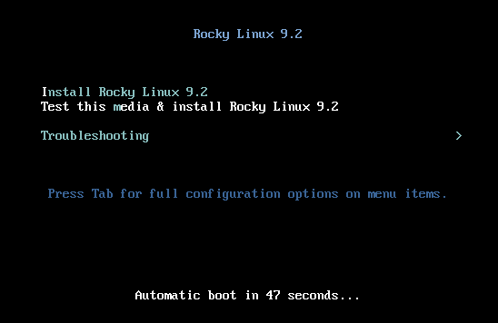

# Rocky Linux 9 설치

이 문서는 독립 실행형 시스템에 64비트 버전의 Rocky Linux 배포판을 설치하기 위한 자세한 안내서입니다. 서버 클래스 설치를 수행합니다. 다음 섹션에서 설치 및 사용자 정의 단계를 따라 진행합니다.

## OS 설치 사전 준비

Rocky Linux 설치를 위해 ISO 파일을 다운로드하세요. 이 설치를 위한 Rocky Linux 버전의 최신 ISO 이미지를 다운로드할 수 있습니다. 다음 링크에서 다운로드할 수 있습니다:

```
https://www.rockylinux.org/download/
```

기존 Linux 기반 시스템에서 명령줄을 통해 직접 ISO를 다운로드하려면 `wget` 명령을 사용하세요:

```
wget https://download.rockylinux.org/pub/rocky/9.1/isos/x86_64/Rocky-9.1-x86_64-minimal.iso
```

Rocky Linux ISO는 다음과 같은 명명 규칙을 따릅니다:

```
Rocky-<MAJOR#>.<MINOR#>-<ARCH>-<VARIANT>.iso
```

예를 들어, `Rocky-9.1-x86_64-minimal.iso`입니다.

!!! 참고 사항

    Rocky 프로젝트 웹 사이트에는 전 세계에 위치한 여러 미러 목록이 있습니다. 가능하면 지리적으로 가장 가까운 미러를 선택하는 것이 좋습니다. 공식 미러 목록은 [여기](https://mirrors.rockylinux.org/mirrormanager/mirrors)에서 확인할 수 있습니다.

## 설치 프로그램 ISO 파일 검증

이미 기존 Linux 배포판에서 Rocky Linux ISO를 다운로드했다면 `sha256sum` 유틸리티를 사용하여 다운로드한 파일이 손상되지 않았는지 확인할 수 있습니다. `Rocky-9.1-x86_64-minimal.iso` 파일의 체크섬을 확인하는 예제를 보여드리겠습니다

1. 사용 가능한 ISO의 공식 체크섬이 포함된 파일을 다운로드하세요.

1. 다운로드한 Rocky Linux ISO가 있는 폴더에서 다음 명령을 입력하여 ISO에 대한 체크섬 파일을 다운로드합니다.

    ```
    wget https://download.rockylinux.org/pub/rocky/9.1/isos/x86_64/CHECKSUM
    ```

1. `sha256sum` 유틸리티를 사용하여 ISO 파일의 무결성을 확인합니다.

    ```
    sha256sum -c CHECKSUM --ignore-missing
    ```

    이 명령은 이전에 다운로드한 ISO 파일의 무결성을 확인하며, 파일이 동일한 디렉토리에 있어야 합니다. 출력은 다음과 같아야 합니다:

    ```
    Rocky-9.1-x86_64-minimal.iso: OK
    ```

## 설치

!!! !!!

    설치를 시작하기 전에 시스템의 통합 가능한 확장 펌웨어 인터페이스(Unified Extensible Firmware Interface, UEFI) 또는 베이직 인풋/아웃풋 시스템(Basic Input/Output System, BIOS)을 올바른 미디어로 부팅하도록 사전 설정해야 합니다.

컴퓨터가 ISO 파일을 가진 미디어로 부팅하도록 설정되어 있다면 설치 프로세스를 시작할 수 있습니다.

1. 설치 매체(광학 디스크, USB 플래시 드라이브 등)를 삽입하고 부팅하세요.

1. 컴퓨터가 부팅되면 Rocky Linux 9의 환영 화면이 표시됩니다.

    

1. 아무 키도 누르지 않으면 설치 프로그램은 카운트다운을 시작하고, 그 후에는 기본으로 강조 표시된 옵션인 다음과 같은 설치 과정을 자동으로 실행합니다:

    `미디어 테스트 & Rocky Linux 9 설치`

    즉시 프로세스를 시작하려면 언제든지 <kbd>Enter</kbd>를 누르면 됩니다.

1. 빠른 미디어 확인 단계가 진행됩니다. 이 미디어 확인 단계는 설치 미디어가 손상되어 설치 프로그램이 중간에 중지되어야 하는 상황을 발견하는 불편을 미리 방지할 수 있습니다.

1. 미디어 확인이 완료되고 미디어가 정상적으로 사용 가능하다고 확인된 후, 설치 프로그램은 자동으로 다음 화면으로 이동합니다.

1. 이 화면에서 설치를 수행할 언어를 선택하세요. 이 가이드에서는 *English (United States)*를 선택합니다. 그런 다음 <kbd>Continue</kbd> 버튼을 클릭하세요.

## 설치 요약

*Installation Summary* 화면은 시스템 설치에 대한 중요한 결정을 내릴 수 있는 종합적인 영역입니다.

이 화면은 대략적으로 다음 섹션으로 나누어집니다:

- *LOCALIZATION*
- *SOFTWARE*
- *SYSTEM*
- *USER SETTINGS*

다음 각 섹션에 대해 자세히 알아보고 필요한 경우 변경합니다.

### 로컬화 섹션

이 섹션은 시스템의 지리적 위치에 관련된 항목을 사용자 정의하는 데 사용됩니다. 이는 키보드, 언어 지원, 시간 및 날짜와 관련된 사항을 포함합니다.

#### 키보드

이 가이드의 데모 시스템에서는 기본값인 *English US*을 사용하고 변경하지 않습니다.

그러나 여기에서 변경 사항을 가할 경우, *설치 요약* 화면에서 <kbd>Keyboard</kbd> 옵션을 클릭하여 시스템의 키보드 레이아웃을 지정할 수 있습니다. <kbd>+</kbd> 버튼을 사용하여 추가적인 키보드 레이아웃을 필요한 경우 지정할 수도 있으며, 원하는 순서를 지정할 수도 있습니다.

이 화면을 완료하면 <kbd>Done</kbd> 버튼을 클릭합니다.

#### 언어 지원

*Installation Summary* 화면의 <kbd>Language Support</kbd> 옵션을 사용하면 필요한 추가 언어 지원을 지정할 수 있습니다.

기본값인 **English (United States)**를 사용하고 변경하지 않겠습니다. <kbd>Done</kbd>을 클릭합니다.

#### 시간 및 날짜

*설치 요약* 화면에서 <kbd>Time & Date</kbd> 옵션을 클릭하여 기계가 위치한 시간대를 선택할 수 있는 다른 화면을 표시합니다. 지역 및 도시 목록을 스크롤하여 가장 가까운 지역을 선택합니다.

설치 소스에 따라 *네트워크 시간* 옵션이 기본적으로 *ON* 또는 *OFF*로 설정될 수 있습니다. 기본값인 *ON* 설정을 그대로 사용합니다. 이렇게 하면 시스템이 네트워크 시간 프로토콜(NTP)을 사용하여 올바른 시간을 자동으로 설정합니다.

변경 사항을 저장한 후 <kbd>Done</kbd>를 클릭합니다.

### 소프트웨어 섹션

*설치 요약* 화면의 *소프트웨어* 섹션에서 설치할 추가 패키지(애플리케이션)와 설치 소스를 선택할 수 있습니다.

#### 설치 소스

Rocky Linux 9 ISO 이미지를 사용하여 설치를 진행하기 때문에, *설치 요약* 화면의 설치 소스 섹션에서는 자동으로 *로컬 미디어*가 지정되어 있음을 알 수 있습니다. 미리 설정된 기본값을 사용할 수 있습니다.

!!! !!!

    설치 소스 영역은 네트워크 기반 설치를 수행할 수도 있도록 선택할 수 있는 곳입니다 (예: Rocky Linux 부트 ISO인 Rocky-9.0-x86_64-boot.iso를 사용하는 경우). 네트워크 기반 설치를 수행하려면 대상 시스템의 네트워크 어댑터가 올바르게 구성되어 인터넷에 연결되어 있는지 확인해야 합니다.  네트워크 기반 설치를 수행하려면 `Installation Source`를 클릭한 후 `On the network` 라디오 버튼을 선택합니다. 선택한 후, 프로토콜로 `https`를 선택하고 텍스트 필드에 다음 URL을 입력합니다: `download.rockylinux.org/pub/rocky/9/BaseOS/x86_64/os`.   그런 다음 `Done`을 클릭합니다.

#### 소프트웨어 선택

*설치 요약* 화면에서 <kbd>소프트웨어 선택</kbd> 옵션을 클릭하면 시스템에 설치되는 정확한 소프트웨어 패키지를 선택할 수 있는 설치 섹션으로 이동합니다. 소프트웨어 선택 영역은 다음과 같이 나누어집니다:

- **기본 환경** : 최소 설치 및 사용자 정의 운영 체제
- **선택한 환경용 추가 소프트웨어** : 왼쪽에 기본 환경을 선택하면 오른쪽에 해당 환경에 설치할 수 있는 관련 추가 소프트웨어가 표시됩니다. 이는 Rocky Linux 9 DVD에서 설치하는 경우 또는 추가 리포지토리가 구성된 경우에만 해당됩니다.

*Minimal Install*  (기본 기능) 옵션을 선택합니다.

화면 상단의 <kbd>Done</kbd>를 클릭합니다.

### 시스템 섹션

*설치 요약* 화면의 시스템 섹션은 대상 시스템의 하드웨어와 관련된 사항을 사용자 정의하고 변경하는 데 사용됩니다. 여기에서 하드 디스크 드라이브 파티션 또는 볼륨을 생성하거나 파일 시스템을 지정하고, 네트워크 구성을 지정하고, KDUMP를 활성화/비활성화하거나 보안 프로필을 선택할 수 있습니다.

#### 설치 대상

*설치 요약* 화면에서 <kbd>Installation Destination</kbd> 옵션을 클릭합니다. 이렇게 하면 해당 작업 영역으로 이동합니다.

대상 시스템에서 사용 가능한 모든 후보 디스크 드라이브가 표시되는 화면이 표시됩니다. 샘플 시스템과 마찬가지로 시스템에 디스크 드라이브가 하나만 있는 경우 *Local Standard Disks* 아래에 확인 표시가 있는 드라이브가 표시됩니다. 디스크 아이콘을 클릭하면 디스크 선택 체크 표시를 켜거나 끌 수 있습니다. 디스크를 선택하려면 이 옵션을 선택합니다.

*Storage Configuration* 옵션 섹션에서 다음을 수행합니다:

1. <kbd>Automatic</kbd> 라디오 버튼을 선택합니다.

2. 화면 상단의 <kbd>완료</kbd>를 클릭합니다.

3. 설치 프로그램에서 사용 가능한 디스크가 있는 것으로 확인되면 *설치 요약* 화면으로 돌아갑니다.

### 네트워크 & 호스트 이름

설치 절차의 마지막 작업은 시스템의 네트워크 구성을 다루며, 시스템에 대한 네트워크 관련 설정을 구성하거나 조정할 수 있습니다.

!!! 참고 사항

    <kbd>Network & Hostname</kbd> 옵션을 클릭한 후, 모든 올바르게 감지된 네트워크 인터페이스 하드웨어 (예: 이더넷, 무선 네트워크 카드 등)가 네트워크 구성 화면의 왼쪽 창에 나열됩니다. 특정 하드웨어 설정에 따라 Linux의 이더넷 장치는 `eth0`, `eth1`, `ens3`, `ens4`, `em1`, `em2`, `p1p1`, `enp0s3` 등과 유사한 이름을 갖습니다. 
    각 인터페이스에 대해 DHCP를 사용하여 구성하거나 IP 주소를 수동으로 설정할 수 있습니다. 
    수동 구성을 선택하는 경우 IP 주소, 넷마스크 등과 같은 모든 필수 정보를 준비해야 합니다.

각 인터페이스에 대해 DHCP를 사용하여 구성하거나 IP 주소를 수동으로 설정할 수 있습니다. 수동으로 구성하려는 경우, IP 주소, 넷마스크 등과 같은 관련 정보를 모두 준비해야 합니다.

!!! 다른 사항들 중에서 시스템의 호스트 이름을 구성하는 옵션도 있습니다 (이름은 기본적으로 `localhost.localdomain`으로 설정됩니다).

    이 이름은 OS 설치 후에 쉽게 변경할 수 있습니다.

다음 중요한 구성 작업은 시스템의 네트워크 인터페이스와 관련됩니다.

1. 왼쪽 창에 이더넷 카드(또는 모든 네트워크 카드)가 나열되는지 확인합니다.
2. 왼쪽 창에서 감지된 네트워크 장치를 클릭하여 선택합니다. 선택한 네트워크 어댑터의 구성 가능한 속성이 화면 오른쪽 창에 나타납니다.

!!! 참고 사항

    저희 샘플 시스템에서는 두 개의 이더넷 장치 (`ens3` 및 `ens4`)가 모두 연결된 상태입니다. 시스템에 있는 네트워크 장치의 유형, 이름, 수량 및 상태는 데모 시스템에 있는 것과 다를 수 있습니다.

Verify the switch of the device you want to configure is flipped to the `ON` (blue) position in the right pane. 참고 사항

메인 *설치 요약* 화면으로 돌아가려면 <kbd>Done</kbd>를 클릭합니다.

!!! 주의

    이 설치 프로그램의 이 섹션에서 서버의 IP 주소에 주의하십시오. 시스템에 대한 물리적 또는 쉬운 콘솔 액세스 권한이 없는 경우 나중에 OS 설치가 완료된 후 작업을 계속하기 위해 서버에 연결해야 할 때 이 정보가 유용합니다.

### 사용자 설정 섹션

이 섹션에서는 `root` 사용자 계정의 비밀번호를 생성하거나 관리자 또는 비관리자 계정을 만들 수 있습니다.

#### 루트 암호

1. *User Settings*에서 *Root Password* 필드를 클릭하여 *Root Password* 작업 화면을 시작합니다.

    !!! 주의
   
        루트 슈퍼 사용자는 시스템에서 가장 권한이 있는 계정입니다. 따라서 사용하거나 활성화하는 경우 강력한 비밀번호로 이 계정을 보호하는 것이 중요합니다.

1. *Root Password* 텍스트 상자에 루트 사용자의 강력한 비밀번호를 설정합니다.

1. *Confirm* 텍스트 상자에 동일한 비밀번호를 다시 입력합니다.

1. <kbd>Done</kbd>을 클릭합니다.


#### 사용자 생성

이 섹션에서는 `root` 사용자 계정의 비밀번호를 생성하거나 관리자 또는 비관리자 계정을 만들 수 있습니다.

1. *User Settings* 아래의 *User Creation* 필드를 클릭하여 *Create User* 작업 화면입니다.  
   이 작업 영역을 사용하면 시스템에서 권한이 있거나 권한이 없는(비관리) 사용자 계정을 만들 수 있습니다.

    !!! 정보
   
        시스템에서 일상적인 작업을 위해 특권이 없는 계정을 만들고 사용하는 것은 좋은 시스템 관리 관행입니다.

    필요할 때 슈퍼유저(관리자) 권한을 호출할 수 있는 일반 사용자를 만들 것입니다.

1. 다음 정보로 *Create User* 화면의 필드에 다음 정보를 입력합니다:

    - **전체 이름**: `rockstar`
    - **사용자 이름**: `rockstar`
    - **이 사용자를 관리자로 만듭니다**: 체크
    - **이 계정 사용 시 암호 필요**: 체크
    - **암호**: `04302021`
    - **암호 확인**: `04302021`

1. <kbd>Done</kbd>을 클릭합니다.

## 설치 프로그램 단계

사용자를 생성하는 방법:


### 설치 시작

다양한 설치 작업에 대한 선택 사항에 만족하면, 설치 프로세스의 다음 단계로 설치가 진행됩니다.

설치가 시작되고 설치 프로그램에 설치 진행률이 표시됩니다. 설치가 시작되면 디스크 분할, 파티션 또는 LVM 볼륨 포맷, 소프트웨어 종속성 확인 및 해결, 디스크에 운영 체제 쓰기 등과 같은 다양한 작업이 백그라운드에서 실행되기 시작합니다.

!!! 설치가 시작되면 디스크 파티션 작업, 파티션 또는 LVM 볼륨 포맷팅, 소프트웨어 종속성 확인 및 해결, 운영 체제를 디스크에 기록하는 등의 다양한 작업이 백그라운드에서 실행됩니다.

    설치 시작 버튼을 클릭한 후 계속 진행하지 않으려면 데이터 손실 없이 안전하게 설치를 취소할 수 있습니다. 설치 프로그램을 종료하려면, 단순히 시스템을 재설정하면 됩니다. 종료 버튼을 클릭하거나 키보드에서 ctrl-alt-del을 누르거나 리셋 또는 전원 스위치를 누르면 됩니다.

### 설치 완료

설치 프로그램이 실행되면 완료 메시지와 함께 최종 설치 진행 화면이 표시됩니다.

마지막으로, <kbd>Reboot System</kbd> 버튼을 클릭하여 전체 절차를 완료합니다. 시스템이 다시 시작됩니다.

### 로그인

마지막으로, <kbd>Reboot System</kbd> 버튼을 클릭하여 전체 절차를 완료합니다. 시스템이 다시 시작됩니다


시스템에 로그온하려면:

1. 로그인 프롬프트에서 `rockstar`를 입력하고 <kbd>Enter</kbd>를 누릅니다.

1. 암호 프롬프트에서 `04302021` (rockstar의 암호)를 입력하고 <kbd>Enter</kbd>를 누릅니다 (암호는 화면에 **표시되지 않습니다**. 이는 정상적인 동작입니다).

1. 로그인 후 `whoami` 명령을 실행할 것입니다.   
   이 명령은 현재 로그인된 사용자의 이름을 보여줍니다.


